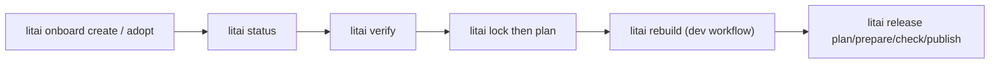
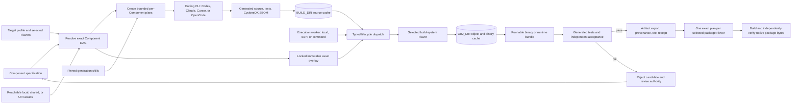

# Literate AI

[](LICENSE)

Literate AI is a release-engineering and SDLC harness for specification-led
software. `litai onboard create` guides a new repository;
`litai onboard adopt` wraps an existing tree in the same `dev` workflow,
receipts, and release protocol. The lower-level `litai init` and
`litai init --convert` mutators remain available.
Specifications, selected Flavors, and pinned skills remain authority; generated
source is disposable. Writing production code from a spec is still arriving in
waves as models improve — the harness that proves when a tree is valid is the
durable talent.

## Watch the onboarding video

**[It Builds. Can We Ship It? — watch the 13:38 onboarding film](https://github.com/jordanhubbard/literate-ai/raw/cf95311b863326ffd68064219b1d1ae34e89e2ff/media/courses/sam-meets-literate-ai/video/sam-meets-literate-ai.mp4)**

[](https://github.com/jordanhubbard/literate-ai/raw/cf95311b863326ffd68064219b1d1ae34e89e2ff/media/courses/sam-meets-literate-ai/video/sam-meets-literate-ai.mp4)

Follow Sam, a skeptical software engineer, and LitAI, his evidence-minded guide,
through setup, a first greenfield project, and adoption of TinyXML2. Real coding
sessions appear as edited terminal replays, alongside walkthroughs of using machines
you already own, updating projects, and connecting repositories. Two voices, captions,
and a little engineering comedy make this one continuous introduction.

[Chapters](https://github.com/jordanhubbard/literate-ai/blob/cf95311b863326ffd68064219b1d1ae34e89e2ff/docs/courses/play/CHAPTERS.md)
· [Subtitles (SRT)](https://raw.githubusercontent.com/jordanhubbard/literate-ai/cf95311b863326ffd68064219b1d1ae34e89e2ff/media/courses/sam-meets-literate-ai/video/sam-meets-literate-ai.srt)
· [Leave timestamped feedback](https://github.com/jordanhubbard/literate-ai/pull/10)

This is the public-feedback edition; use the [getting-started guide](docs/user/getting-started.md)
for current commands. If your browser downloads the MP4, open it in your video player.

## Why Literate AI?

The idea follows Don Knuth's literate-programming principle: explain the system clearly
for people, then keep its executable form traceable to that explanation. Components can
depend on other spec-driven Components or pinned repository sources, and can be nested
without flattening every implementation detail into one model context.

**New here?** Start with the [user guide](docs/user/README.md), or jump straight to
[getting started](docs/user/getting-started.md). Install the release wheel, run
`litai doctor`, then inspect `litai onboard create PATH` or
`litai onboard adopt PATH` before explicitly applying its plan. `make bootstrap`
is the maintainer setup for this checkout.

A stakeholder-facing overview is also maintained separately. The 1.2.0 edition was
published in place and export-back verified against its checked-in presentation and
narrative at these stable links:
[slides](https://docs.google.com/presentation/d/1zGugAIHdxXNSDKJia9jak55_0J0LnpSq2dFt2F5OZpE/edit?usp=drivesdk)
and
[narrative](https://docs.google.com/document/d/1C6jtFrm9oAj6dg4CuLimylzu5HdaP6CovP2KY8U1HRA/edit?usp=drivesdk).
The authoring package is
[`docs/presentations/literate-ai-manager-overview/`](docs/presentations/literate-ai-manager-overview/).

## Adopt, then rebuild



## From specification to binary

When a coding CLI is in the loop, the same harness drives generation:



Changing a specification, Flavor, skill, model route, or exact dependency changes the
generation identity. Unchanged accepted source can be reused from `BUILD_DIR`; unchanged
source and toolchain inputs can reuse build results from `OBJ_DIR`. Removing either cache
changes cost, not meaning or reconstructability.

## What is first class

- **Components** define behavior, contracts, composition, and acceptance criteria.
- **Assets** declare required data, images, metadata, or external binary resources by
  Component-relative path, shared `project:///` URI, or HTTP(S) URI. Locks bind their
  exact bytes; coding agents receive metadata while assembly preserves bytes unchanged.
- **Flavors** select replaceable choices such as language, operating system, build
  system, runtime, and packaging. The built-in multi-value package catalog covers pip
  wheels, Conan, apt, Homebrew, WinGet, and Chocolatey with exact OS constraints;
  compatible formats can be selected together. Explicit Component or Flavor choices
  override defaults. OS-pinned samples remain readable in the catalog but are scheduled
  only on compatible workers before generation begins.
- **Skills** bound how agents plan, generate, build, test, document, or derive specs from
  source. Skill changes are release-gated with NVIDIA SkillEvaluator.
- **Provenance** binds every accepted source tree and build to its exact inputs.
- **CycloneDX SBOMs** describe Literate-AI-managed Components plus direct and transitive
  build, package, toolchain, runtime, and binary dependencies.
- **Tests** are regenerated to describe the current implementation. Independent
  acceptance remains outside the model-produced test suite, and compact passing receipts
  preserve test history through Git.

## Basic setup

### 1. Install `litai`

Use GNU Make and Python 3.11 or newer from `PATH`. From a Literate AI checkout, verify
the tuple-specific native prerequisite SBOM and install the isolated runtime and stable
launcher:

```bash
make install

# Add this once in your shell profile if it is not already present.
export PATH="$HOME/.local/bin:$PATH"

litai help
```

On Linux and macOS, the default runtime lives at
`$HOME/.local/share/literate-ai/venv` and the launcher at `$HOME/.local/bin/litai`;
Windows uses the Local AppData application root. `make install PREFIX=/usr/local`
selects another prefix. If an APT, Homebrew, or WinGet prerequisite is missing, the
target asks before installing it; automation uses
`LITAI_INSTALL_DEPENDENCIES=yes make install`.
The generated application also needs its selected host compiler or interpreter and an
authenticated coding CLI: `codex`, `claude`, `cursor-agent`, or `opencode`. Set
`CODING_CLI` to pick one explicitly; otherwise LitAI uses the first available command
from `PATH`.

### 2. Create your first project

```bash
litai onboard create my-litai-app
litai onboard create my-litai-app --apply --acknowledge
cd my-litai-app
litai project validate
```

Initialization creates the complete project taxonomy and an inheritable
`samples/hello-component` application. Its defaults are Python, GNU Make, the host OS,
and pip-wheel packaging.
Use `litai onboard create PATH --from URL[#REVISION]` to inspect inherited authority from that
repository's complete ancestor DAG without executing parent repository code.
Apply the reviewed plan with `--apply --acknowledge`. `litai init` remains the
lower-level initialization command.

### 3. Build, test, and run hello on this host

```bash
litai build samples/hello-component --target host
litai test samples/hello-component --target host
litai run samples/hello-component --target host -- '{"name":"LitAI"}'
```

These commands generate source and current tests from the specification,
build with the selected host toolchain, run independent acceptance, and then
execute the retained artifact. Repeating an unchanged lifecycle reuses the provenance-
bound source and object caches.

### 4. Optionally run on other hosts

Init includes synthetic examples for private worker configuration. Copy them to the
platform-resolved user configuration paths reported by `litai init`, then replace the
placeholder SSH endpoints and workspaces. For this repository on Linux/macOS:

```bash
mkdir -p "${XDG_CONFIG_HOME:-$HOME/.config}/literate-ai/projects/literate-ai"
cp literate.workers.example.json \
  "${XDG_CONFIG_HOME:-$HOME/.config}/literate-ai/workers.json"
cp literate.test.example.json \
  "${XDG_CONFIG_HOME:-$HOME/.config}/literate-ai/projects/literate-ai/test.json"

# Discover OS, architecture, core count, memory, and NVIDIA GPU facts in parallel.
litai worker probe --all

# Run the same lifecycle on one named worker.
litai build samples/hello-component --target host --worker linux-example
litai test samples/hello-component --target host --worker linux-example
litai run samples/hello-component --target host --worker linux-example -- \
  '{"name":"LitAI"}'
```

In user `workers.json`, each worker's `requirements` can constrain the operating
system and hardware needed for its work. For example:

```json
{
  "schema": "urn:literate-ai:schema:v1:execution-requirements",
  "os_family": "linux",
  "os_version": null,
  "cpu_architecture": "x86_64",
  "minimum_cpu_cores": 8,
  "minimum_memory_mib": 16384,
  "gpu": {
    "schema": "urn:literate-ai:schema:v1:gpu-requirement",
    "vendor": "nvidia",
    "model": null,
    "minimum_count": 1,
    "minimum_memory_mib": 12288,
    "capabilities": ["cuda"]
  }
}
```

Leave fields `null` when they are not requirements. A worker may be a direct SSH host
or a small external dispatcher command; LitAI probes and validates observed OS, CPU,
memory, and GPU capabilities but does not become a fleet scheduler. Keep `workers.json`,
project-scoped `test.json`, credentials, and routes private. Linux/macOS use
`${XDG_CONFIG_HOME:-$HOME/.config}/literate-ai`; Windows uses the user's Roaming AppData
Known Folder. `LITAI_CONFIG_DIR` is an absolute cross-platform override.

Named `--worker` commands execute on one worker. To fan the hello application across
every selected compatible worker concurrently from this framework checkout, run:

```bash
make samples-platform-regression SAMPLE='hello-component'
```

The test matrix chooses the matching Linux, macOS, or Windows Flavor for each worker,
skips incompatible OS-pinned samples before generation, and checkpoints successful work
for fail-fast resumption. Derived projects can connect the same private files to their
CI or external dispatcher; the installed CLI does not yet claim a generic multi-worker
fan-out verb. See [Private test matrix](docs/user/test-matrix.md) for CPU/GPU constraints,
external dispatchers, and custom configuration paths.

## Explore the framework

Repository contributors can install the complete development tool closure, then inspect
the effective authority graph and wider sample suite:

```bash
make tools-install

# Discover commands, then narrow help by following any command path with `help`.
litai help
litai project validate help
litai package help
litai release help

# Explain effective local and inherited authority; export the same solved DAG.
litai graph --format text
litai graph --format mermaid --output docs/authority.mmd
litai graph rebalance --format text  # advisory; never moves authority
litai graph --kind component --ownership inherited --inheritance inheritable

# Show each framework-owned child command and its bounded output on stderr.
litai --verbose build samples/hello-component --target host

# See the planned inputs without generating source.
litai plan samples/hello-component \
  --target macos-host \
  --model pipeline-default-model \
  --flavor=+flavor://literate-ai/os-macos \
  --flavor=+flavor://literate-ai/lang-python

# Generate, compile, run, and independently verify the sample applications.
make samples

# Fan the canonical regression sample across configured macOS/Linux/Windows workers.
# Configure the private user paths reported by `litai init`, then:
make samples-platform-regression
```

`--model` is an enclosing default for the complete command pipeline. A Component,
selected Flavor role, or invoked generation skill may choose a narrower provider model;
that choice applies only inside its immutable lexical scope and the next sibling returns
to the enclosing selection. `litai plan` reports every resolved binding and trace before
model egress. `run` deliberately has no model option because it launches an already-built
artifact.

`litai` is the only installed CLI. A complete project lifecycle can be driven with:

```bash
litai build samples/hello-component --target host
litai test samples/hello-component --target host
litai run samples/hello-component --target host
litai package plan samples/hello-component --target host

# Construction reruns the accepted lifecycle and requires explicit host-execution consent.
litai package build samples/hello-component --target host --allow-host-execution
litai package verify samples/hello-component --target host

# Package formats are a composable axis: select every compatible community target.
litai package plan samples/hello-component --target host \
  --flavor=+package-pip --flavor=+package-conan
litai package build samples/hello-component --target host \
  --flavor=+package-pip --flavor=+package-conan --allow-host-execution
litai package verify samples/hello-component --target host \
  --flavor=+package-pip --flavor=+package-conan

# Dispatch the same lifecycle through a private, parameterized command worker.
litai build samples/hello-component --target host --worker build-fleet \
  --worker-config "$HOME/.config/literate-ai/workers.json" \
  --worker-param queue=interactive

# Reconcile the complete project after an upstream update.
litai rebuild . --project . --runtime-root /tmp/litai-runtime \
  --candidate-receipt /tmp/litai-receipt.json --allow-host-execution
```

`--target` selects the generation and Flavor profile; `--worker` selects where lifecycle
work executes. Omitting `--worker` is exact local execution. SSH and command workers use
the same typed lifecycle request, capability checks, and immutable artifact protocol as
local execution.

`litai graph` is the read-only reasoning surface for repository and authority DAGs. It
shows each repository-parent edge and each effective Component, Flavor, and skill with
its local/inherited provenance and inheritance policy. The same canonical solver rejects
cycles and exports compact JSON, text, Mermaid, Graphviz DOT, or dependency-free SVG.
This makes inheritance review and upward-migration discussions inspectable without
turning a suggested rebalancing into an automatic source move.

The global `-v`/`--verbose` option may appear before or after a command verb. It prints
safely quoted child argv, working directories, exit status, and bounded stdout/stderr to
stderr; normal results—including `--json` envelopes—remain isolated on stdout. Verbosity
is inherited by nested `litai` and command-worker processes. Known credential arguments
and environment-derived secret values are redacted.

`rebuild` resolves exact inputs, reuses or generates source, indexes it, authorizes host
work, builds, resolves dependencies, validates CycloneDX evidence, runs generated tests,
executes the application, performs independent acceptance, and emits a provisional
receipt. Publication and committing remain explicit operations.

Cache maintenance is deliberate:

```bash
make clean          # remove OBJ_DIR (default: ./_build) objects and executables
make really-clean   # also remove BUILD_DIR (default: ./generated) generated source
```

The root `_build/` tree is disposable: Git ignores it, and `clean` may
remove it in full. Do not put authored source, specifications, or durable evidence there.

Project releases use the same CLI and remain project-owned:

```bash
mkdir -p _build/release
litai --json release plan --bump patch > _build/release/plan.json
litai release prepare _build/release/plan.json
# Review and commit the declared version/changelog changes.
litai release check _build/release/plan.json
litai release publish _build/release/prepared.json --authorize-external-write
```

The versioned `literate.release.json` policy declares its `semver` or `pep440` version
scheme, exact version fields, gate, notes, tag, remote, and optional provider. The
commands deliberately separate read-only
planning, local preparation, evidence, and external writes; see the
[`release-project`](skills/agent/release-project/SKILL.md) skill. `litai release check`
accepts an explicit `--target local|github|gitlab` to choose where the declared gate
runs — GitLab is recognized but not yet supported — falling back to a project's declared
`ci_targets` preference, then to the invoking machine. `--target local` fans the declared
gate command out in parallel to every non-Windows SSH worker configured in user
`workers.json`; every dispatched worker must pass, and Windows workers are
reported as excluded rather than silently skipped, since the declared gate has no
Windows-native equivalent yet.

The repository's [Release Policy](docs/architecture/project-releases.md#release-policy)
keeps `main` writable for ordinary new work in both Free and Pre-release states. A
Pre-release state names one `major.minor` target and locks its cut
`release/<major>.<minor>.x` line: only the Release Engineers listed below may merge
release-line pull requests or create and publish that major/minor release. Green release
candidate tags may be created only from exact `main`. Patch authority is configured per
project as `strict` or `loose`; loose mode permits only listed repository writers to use
the reason-bearing break-glass path, and only for a fix already landed on the trunk.
LitAI release commands enforce these rules. Forge branch protection should mirror them,
but this repository does not claim protection is live unless the forge is configured and
verified separately.

Every `litai` invocation records how long it took, and every worker in a `--target
local` fan-out records its own timing, as JSON-Lines spans under the disposable build
root (`OBJ_DIR/.litai/perf/`) — schema, stage, target, coding CLI, model, duration, and
outcome. Inspect that history with:

```bash
litai perf show                              # aggregate table, grouped by stage
litai perf show --group-by target_id          # per-Component/per-worker breakdown
litai perf show --group-by coding_cli
litai perf chart --output _build/perf.svg      # dependency-free SVG bar chart
```

This telemetry is diagnostic, not authority: a read-only or missing build root never
fails the run it observes, and the log carries no claim about correctness.

## Repository map

- [`SKILL.md`](SKILL.md) — provider-neutral onboarding for coding agents.
- [`literate.project.json`](literate.project.json) — canonical project catalogs and
  lifecycle policy.
- [`components/`](components/) — reusable specification-driven building blocks.
- [`samples/`](samples/) — private, fully working demo compositions; only the hello
  sample inherits into derived projects as their runnable starter.
- [`flavors/`](flavors/) — language, platform, build-system, and other selectable policy.
- [`skills/`](skills/) — exact agent guidance for lifecycle transformations.
- [`docs/user/getting-started.md`](docs/user/getting-started.md) — guided first project.
- [`docs/user/framework-flow.md`](docs/user/framework-flow.md) — the lifecycle in detail.
- [`docs/architecture/domain-model.md`](docs/architecture/domain-model.md) — neutral
  contracts and authority boundaries.
- [`docs/architecture/repository-layout.md`](docs/architecture/repository-layout.md) —
  why each retained root exists and where generated state is forbidden.
- [`docs/architecture/project-releases.md`](docs/architecture/project-releases.md) —
  evidence-bound version preparation, gates, publication, and recovery.
- [`docs/architecture/repository-inheritance.md`](docs/architecture/repository-inheritance.md)
  — complete parent-DAG initialization, precedence, update, and reparenting.
- [`docs/README.md`](docs/README.md) — complete documentation map.

## Current scope

The Python 3.11+ reference implementation live-tests Python, C++17, Rust 2021,
JavaScript, Swift, and composite Rust/JavaScript applications across macOS, Linux, and
Windows. Make, Bazel, and CMake are selectable build-system Flavors; initialized projects
use Make, while the Bazel and CMake skills remain an explicit, removable preference rather
than a
framework invariant. The repository includes guarded
host execution and strict provenance checks, but it is not yet a hardened operating-system
sandbox for arbitrary hostile generated source.

For contributor validation:

```bash
make validate
```

New or modified skills additionally require the change-triggered `make skills-check`
gate. Unchanged skills do not invoke SkillEvaluator.

## Release Engineers

- `jordanhubbard`

## License

Literate AI is released under the [Apache License 2.0](LICENSE).
