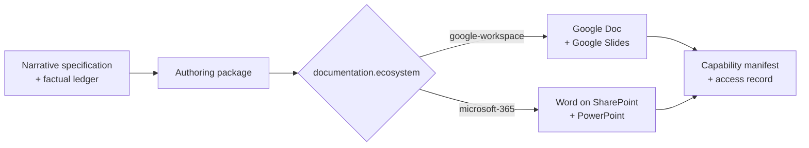

# Ecosystem Document Pair

This Component is the reusable authority for maintained documentation artifacts. It
defines what a document pair is, who may reach it, and how it must be formed — without
deciding what any particular document says.

The public surface is defined by `interfaces/document-pair.md`; consumers SHALL use that
capability rather than reimplement artifact construction, access handling, or layout
verification. The independent acceptance oracle is defined by
`acceptance/document-pair.md`.

Generation authority is `skills/specification-to-source/document-pair/SKILL.md`. The
agent-facing authoring method is `skills/agent/author-presentations-and-documents/SKILL.md`;
it is cited here rather than pinned, because it governs how an agent works rather than
what the generator emits.

## Capability contract

| Concern | Decision |
| --- | --- |
| Capability | `literate-ai.document-pair` |
| Entrypoint | `author` |
| Pair members | `narrative`, `presentation` |
| Ecosystem axis | `documentation.ecosystem`, exactly one |
| Manifest variable | `LITAI_CAPABILITY_DOCUMENT_PAIR` |
| Publication | requires explicit authorization per realization |

### Requirement: Exactly one ecosystem realizes the pair

The Component SHALL resolve its `documentation-ecosystem` slot to exactly one target and
SHALL realize every declared member in that target. It SHALL NOT realize one member in
one ecosystem and the other member in a different ecosystem.

#### Scenario: A deck-only consumer selects Microsoft 365

- **WHEN** a consuming Component declares only a `presentation` member and the
  `documentation.ecosystem` axis resolves to `microsoft-365`
- **THEN** exactly one PowerPoint artifact is realized, no narrative member is claimed,
  and the manifest names `microsoft-365` as its ecosystem

#### Scenario: A consumer declares both members

- **WHEN** a consuming Component declares both members and the axis resolves to
  `google-workspace`
- **THEN** a Google Doc and a Google Slides artifact are realized as one pair sharing a
  single authoring package

### Requirement: Access is declared, never widened

The Component SHALL carry an explicit access record for every realized member and SHALL
NOT grant an audience broader than the consuming Component declared. Publication to an
external destination SHALL require explicit authorization from the requesting principal.

#### Scenario: Publication is not authorized

- **WHEN** no publication authorization is supplied for a realization
- **THEN** the editable local artifact is produced, `published_location` is null, and no
  external destination is contacted

### Requirement: General formatting is verifiable

The Component SHALL produce artifacts whose formatting contract can be checked without
human judgment: exact surface geometry with no escaping element, no overlapping
text-bearing frames, complete per-page notes on a presentation member, a heading
hierarchy with no skipped levels on a narrative member, preserved editable native
objects, and no unresolved placeholders. Geometry-escape is not an overflow pass.

#### Scenario: An element escapes the presentation surface

- **WHEN** an exported page contains an element whose bounding box extends beyond the
  declared surface geometry
- **THEN** acceptance fails and the artifact is not promoted

#### Scenario: Text-bearing frames overlap

- **WHEN** an exported page contains two text-bearing frames whose bounding boxes
  overlap
- **THEN** acceptance fails and the artifact is not promoted

### Requirement: The authoring package reproduces the artifact

The Component SHALL retain a durable authoring package holding the narrative
specification, factual ledger, generation prompts, build source, owned assets,
regeneration entry point, current deliverable links, and QA record.

#### Scenario: A claim cannot be traced

- **WHEN** a consequential claim in a realized member has no corresponding entry in the
  authoring package's factual ledger
- **THEN** acceptance fails

### Requirement: Terminal consumers are not inheritable

A consuming Component that provides no capability of its own is terminal. Its content is
project-specific and SHALL NOT be offered as a reusable template, forked into another
project's graph, or composed as a provider. It remains citable by its Component URI.

#### Scenario: A terminal document Component is composed

- **WHEN** another Component declares a generation or runtime dependency on a terminal
  document Component
- **THEN** resolution fails closed, because the terminal Component exports no capability
