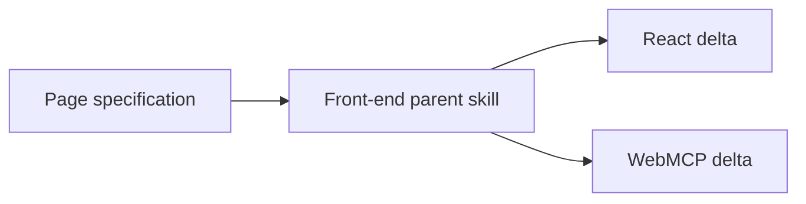

# Front-end application

Reusable JavaScript page UI parent. Nested React and WebMCP skills are deltas of
this Component's pinned front-end skill. Selecting this Component without
JavaScript fails closed.

## Application contract

| Concern | Decision |
| --- | --- |
| Kind | `web-application` |
| Language | JavaScript only (`application.web-frontend`) |
| UI framework | Optional `ui-react` |
| Packages | Optional lockfile-pinned npm via `package-npm` |

### Requirement: JavaScript language Flavor

The Component SHALL select `lang-javascript` on the language slot. A lock that
selects only a conflicting language Flavor SHALL fail closed.

#### Scenario: Python-only selection is rejected

- **WHEN** the language slot is filled with Python and no JavaScript Flavor is selected
- **THEN** the Component cannot lock because Python does not provide
  `application.web-frontend`
