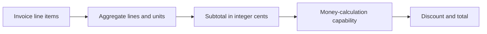

# Invoice Service

This independently generatable service aggregates invoice lines and delegates all
discount arithmetic to the exact-money capability. It can be reused behind carts,
quotes, subscriptions, procurement, or other billing entrypoints without exposing its
private source layout.

## Application contract

| Concern | Decision |
| --- | --- |
| Application ID | `invoice-service` |
| Kind | `invoice` |
| Entrypoint | `run` |
| Currency storage | Integer cents (`integer-cents`) |
| Discount unit | Basis points (`basis-points`) |
| Rounding | Half up (`half-up`), delegated to `literate-ai.money-calculation` |

The public process surface is defined by `interfaces/invoice-service.md`; consumers
SHALL depend on that interface rather than any generated file organization.

### Requirement: Aggregate invoice line items

The Component SHALL accept an `items` array whose entries contain `sku`, non-negative
integer `quantity`, and non-negative integer `unit_price_cents`; compute each line value
as `quantity * unit_price_cents`; and return integer `line_count`, `unit_count`, and
`subtotal_cents` fields.

#### Scenario: Two invoice lines are aggregated

- **WHEN** two widget units at 1299 cents and three cable units at 499 cents are supplied
- **THEN** the service reports two lines, five units, and a 4095-cent subtotal

### Requirement: Delegate money arithmetic

The Component SHALL require `literate-ai.money-calculation` and use that dependency to apply
the supplied `discount_basis_points`; it SHALL return the dependency's integer
`discount_cents` and `total_cents` without duplicating or changing its rounding rule.

#### Scenario: Transitive money Component is used

- **WHEN** the invoice has a 4095-cent subtotal and a 1000-basis-point discount
- **THEN** the service returns a 410-cent discount and a 3685-cent total
