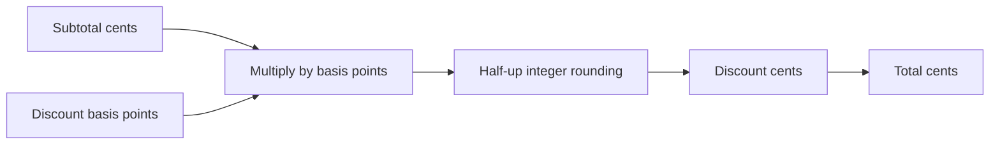

# Money Calculation

This independently generatable exact-money kernel applies basis-point discounts using
integer arithmetic. It is small enough to audit and reusable anywhere a service must
avoid floating-point currency drift.

## Application contract

| Concern | Decision |
| --- | --- |
| Application ID | `money-calculation` |
| Kind | `invoice` |
| Entrypoint | `run` |
| Currency storage | Integer cents (`integer-cents`) |
| Discount unit | Basis points (`basis-points`) |
| Rounding | Half up |

The reusable public surface is defined by `interfaces/money-calculation.md`; consumers
SHALL use that capability rather than duplicate its arithmetic.

### Requirement: Exact integer discount calculation

The Component's portable `run` entrypoint SHALL accept one UTF-8 JSON argument array
whose two ordered values are a non-negative integer subtotal in cents and a discount in
basis points from 0 through 10000, compute the discount as
`floor((subtotal_cents * discount_basis_points + 5000) / 10000)`, and return integer
`subtotal_cents`, `discount_cents`, and `total_cents` fields.

#### Scenario: Half-up discount rounding

- **WHEN** a 999-cent subtotal receives a 1250-basis-point discount
- **THEN** the discount is 125 cents and the total is 874 cents

### Requirement: Reusable money capability

The generated source SHALL expose the calculation as a reusable logical module or build
target that higher-level Components can call without duplicating its arithmetic.

#### Scenario: Invoice service consumes the capability

- **WHEN** `component://literate-ai/invoice-service` is composed with this Component
- **THEN** the service calls the `literate-ai.money-calculation` capability
