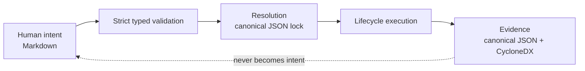

# Authoring and record formats

Literate AI uses Markdown where a person or coding agent expresses intent and JSON where
a program records an exact result. The boundary is semantic, not aesthetic: prose should
be pleasant to review; locks and receipts should be cheap to compare and impossible to
interpret two ways.

| Artifact | Authority | Canonical format | Why |
| --- | --- | --- | --- |
| Component | Human/agent intent | `component.md` | Strict frontmatter plus the behavioral story and acceptance contract |
| Layered specification | Human/agent intent | `.md` | Local prose, derived hierarchy, explicit references |
| Generation or inverse skill | Human/agent technique | `SKILL.md` | Typed frontmatter; body is the sole prompt/instruction authority |
| Flavor | Human/agent target intent | `flavor.md` | Readable target policy; paths resolve to exact references in a lock |
| Prose-rich workflow policy | Human/agent process intent | `workflow.md` | Typed stage DAG in frontmatter; model instructions only in body sections |
| Project bootstrap configuration | Machine-consumed configuration | JSON | Small, strict and intentionally not prose-rich |
| Component lock and plan | Derived resolution | Canonical JSON | Stable identity, exact selections and bytewise diffs |
| Cache/publication record | Derived evidence | Canonical JSON | Versioned protocol between stores and lifecycle services |
| Test history and receipts | Derived evidence | Compact canonical JSON | Git-friendly, LLM-readable current evidence rather than an expanding log |
| Source-intelligence metadata | Derived index | Versioned tool format | Disposable, identity-bound source intelligence |
| SBOM | Derived dependency evidence | CycloneDX JSON | Standards-based direct and transitive dependency graph |



## Skill format

Every repository-native conversion skill now has exactly one `SKILL.md`. Frontmatter
contains its schema, stable ID, semantic version, title, stages or capabilities,
dependency pins, limitations and trust metadata. The body contains the complete
agent-facing instruction or inverse prompt template. Putting the same instruction in
frontmatter is rejected, and a directory containing both `SKILL.md` and legacy
`skill.json` is ambiguous and rejected.

The same file is also directly valid as an Agent Skill: `name` must equal the typed
skill ID, `description` must be non-empty, canonical maintainer metadata must be
present, and the first body heading must match the typed title. These discovery fields
are validated and removed when the internal typed contract is projected; the heading is
not repeated in the model instructions. SkillEvaluator receives an isolated byte-exact
copy of this file, never a generated compatibility document.

The SHA-256 identity covers the complete UTF-8 Markdown bytes. Changing prose therefore
changes the skill identity. Exact forward-skill dependencies and every Component or
Flavor reference must be repinned. Normalized JSON remains available from typed
contracts and CLI reports, but it is derived rather than maintained beside the Markdown.

## Migration from `skill.json`

Before editing a legacy catalog, run the repository migration in a clean branch:

```console
python3 scripts/migrate_skill_authoring.py --repository .
```

The command moves `instructions` or `prompt_template` into the body, writes canonical
frontmatter, resolves forward dependencies bottom-up and prints a compact old/new path
and digest map. Review and update every external content reference with that map. Then
run:

```console
litai project validate .
make skills-check
make test
```

Legacy JSON remains readable only as a bounded migration input during the compatibility
window. New projects and packaged built-ins author Markdown. The compatibility reader
does not permit a second authority in the same skill directory.

## Flavor format

Every new Flavor has exactly one `flavor.md`. Its strict frontmatter states the logical
coordinate, version, axis and target value, applicability, capability contracts, local
specification roots, skill selectors, contribution selectors, and ordering/conflict
relationships. The Markdown body explains why and when the choice applies. Humans do
not maintain SHA-256 values there: resolution reads every selected path inside the
project boundary and emits exact `ContentReference` values in the normalized v2
`FlavorDefinition` and target lock.

The complete `flavor.md` identity is the `source_snapshot` of its `FlavorRevision`, so a
body change cannot masquerade as the old selected revision. The referenced generation
specification remains independently pinned. A directory containing both `flavor.md`
and legacy `flavor.json` is rejected as ambiguous.

Migrate an old Flavor explicitly:

```console
python3 scripts/migrate_flavor_authoring.py flavors/my-flavor/flavor.json
litai lock COMPONENT --target TARGET --check
litai project validate .
```

The migration removes resolver-owned digests from authored intent and preserves the
normalized semantic `FlavorDefinition`. Existing JSON remains a bounded compatibility
input during the pre-0.1 migration window; initializers, promotion, packaged templates,
samples, and repository-native catalogs emit only Markdown.

## Workflow format

A generation workflow is `workflow.md`. Its frontmatter owns the workflow ID, version,
stage DAG, stage kinds, response shapes, capabilities, and output bounds. Model-facing
instructions live only below `## Stage: <stage-id>` headings in the body. A model stage
without a section, an unknown or duplicate section, instructions repeated in
frontmatter, or instructions attached to a lifecycle stage fail before routing or model
egress. The resolver projects this into the unchanged
`literate-ai/generation-workflow@1` machine value used by execution planning.

Routing policy remains JSON because it is a small strict selection protocol without
human prose. Migrate a legacy prose-bearing workflow with:

```console
python3 scripts/migrate_workflow_authoring.py workflows/default.json
litai project validate .
```

The project catalog rejects `default.md` and `default.json` coexisting as two workflow
authorities. The JSON reader remains only for bounded migration compatibility.

### Named, nestable workflow catalogs

A `workflow_definition` selector is an ordinary catalog-relative path, so a project may
name and select among multiple independent workflows the same way it already names and
selects Flavors: give each one its own directory under a `workflow_roots` entry (for
example `workflows/production/workflow.md`,
`workflows/production/staging/workflow.md`,
`workflows/production/staging/dev/workflow.md`) and point each Component's
`workflow_definition` at the exact file it needs. Directories nest arbitrarily
deep — the shipped example is `workflows/production/staging/dev/workflow.md` — with
no change to the selector mechanism. This repository's own
`workflows/production`, `workflows/production/staging`, and
`workflows/production/staging/dev` are the worked example: production is the
outer generation workflow, staging and dev nest under it so the filesystem is
the scoping mechanism. Each pairs with `routing.json` in the matching directory
(`routing/production/routing.json`, `routing/production/staging/routing.json`,
`routing/production/staging/dev/routing.json`), the same sentinel pattern as
`workflow.md` and `SKILL.md`, and progressively tightens `fallback_allowed`,
`required_locality`, and the `generate` stage's `maximum_output_tokens`. A nested
workflow MAY declare optional frontmatter `extends:` with a catalog-relative path.
Parse-time merge overlays existing `stage_id`s, inserts new stages after their last
listed dependency, and keeps the child's `workflow_id` and `version`. `staging`
extends `dev` and inserts a non-tree `review` model stage between plan and generate;
`production` extends `staging` and tightens generate tokens further. Extra lifecycle
stages remain forbidden.

The `samples/model-routing` Component selects the
nested `dev` workflow and its matching routing policy. Its public lock and plan
bind those exact catalog bytes; editing the workflow invalidates the existing lock.
The live workflow-catalog regression carries that same selection through source
generation and checks the returned Component custody. The application's offline
endpoint policy remains part of its specification, separate from model selection
for generating its implementation.

## Round-trip rule

Canonical rendering followed by parsing must reproduce the same typed value and body;
parsing followed by canonical rendering must produce one stable byte sequence. Unknown
frontmatter keys fail in the typed contract. Derived JSON may always be deleted and
recreated from the Markdown, while deleting the Markdown destroys authority and cannot
be repaired from a receipt or lock.

## Compatibility exit checklist

The pre-0.1 JSON readers may be removed once a release proves all of the following:

- every repository and packaged catalog contains only canonical Markdown authority;
- migration round trips preserve the normalized typed value and exact referenced bytes;
- complete-document SHA-256 identities change for every semantic or prose change;
- unknown fields and dual Markdown/JSON authority fail before model egress; and
- project validation, SkillEvaluator, lock resolution, and the host E2E matrix all pass
  using no legacy authoring document.
