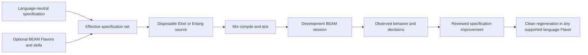
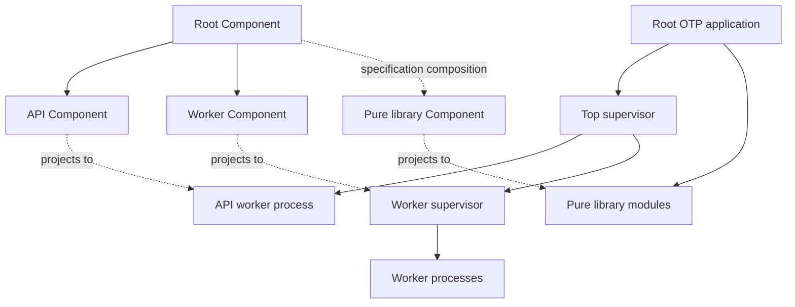
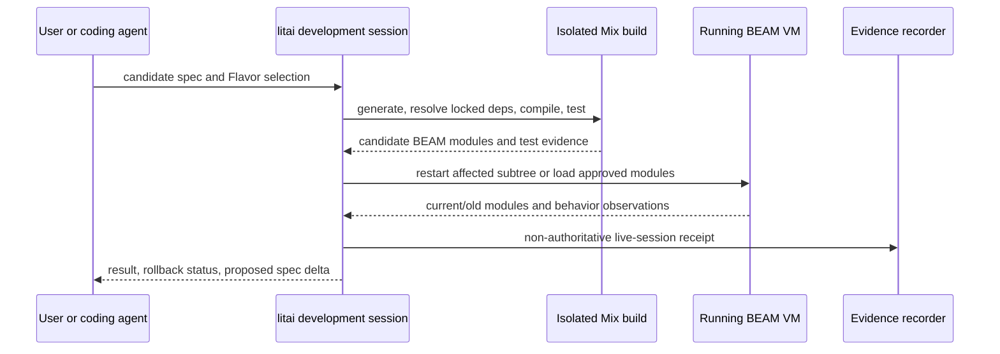
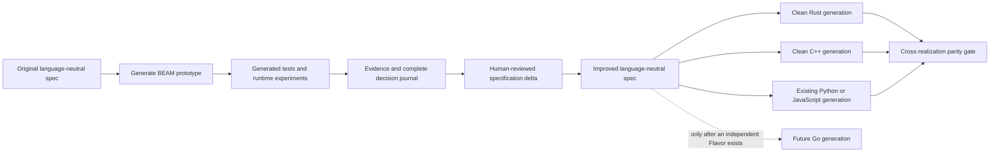

# Optional BEAM/ERTS live-coding layer: architecture investigation

**Status:** investigation; non-binding  
**Date:** 2026-08-06

## Executive decision

An Elixir/Erlang layer is a credible optional vertical slice for Literate AI. It is
especially attractive for fast behavioral prototypes, supervised services, and short
specification feedback loops. It must enter through the existing Component, Flavor,
skill, lifecycle, evidence, cache, and SBOM contracts. BEAM must not become a second
orchestration core.

The recommended first slice is:

- Elixir source on BEAM/ERTS;
- Mix as the native dependency, compile, test, application, and release authority;
- an ERTS-inclusive Mix release built separately for each target platform;
- development-only module reload with a safe restart-first policy; and
- black-box behavioral promotion from an improved language-neutral specification into
  the existing C++, Python, JavaScript, or Rust generators.

This proposal does **not** replace, deprecate, reinterpret, or reduce the test matrix for
the existing C++, Python, JavaScript, and Rust implementation Flavors. Those paths remain
peer realizations of the same language-neutral contracts. Go is mentioned only as a
possible future promotion target after a Go Flavor independently exists; this document
does not claim Go support.

## Why BEAM is interesting, and what it is not

BEAM offers a useful experimental medium because code can be compiled and loaded at the
module level while a VM is running. OTP also gives failures, process ownership, and
restart behavior explicit structure through applications and supervision trees. The
official code-loading model, however, permits only a current and an old version of a
module; loading a third version purges the old version and terminates processes still
executing it. Stateful upgrades require explicit coordination. Live code replacement is
therefore a runtime mechanism, not a proof of reproducibility or correctness. See
[Compilation and Code Loading](https://www.erlang.org/doc/system/code_loading.html) and
[Release Handling](https://www.erlang.org/doc/system/release_handling.html).

The desired loop is:

The source generated for the development session is fungible and disposable. A running
VM is not a source cache. A `.beam` file is not specification authority. Observations
from the prototype may justify a reviewed specification change, but they cannot silently
change the specification.

## Architectural invariants

The layer is acceptable only while all of these invariants hold:

1. Component identity, behavioral contracts, dependency edges, and acceptance criteria
   remain language-neutral.
2. Elixir, Erlang, BEAM, ERTS, Mix, release, and live-session choices are explicit
   Flavor or target-profile inputs and participate in effective-revision identity.
3. Generated `.ex`, `.exs`, `.erl`, `.hrl`, `.app`, `.beam`, Mix build artifacts, and
   release trees are absent from the framework repository. They live in disposable
   workspaces, content-addressed source caches, or build/release evidence.
4. A development reload cannot publish source, transfer release authority, populate a
   release cache, or satisfy a clean-regeneration gate.
5. Native package resolution, compilation, tests, and release construction remain Mix
   responsibilities. A Bazel integration may wrap that native operation, but may not
   pretend it reconstructed Mix semantics as fine-grained Bazel targets.
6. Every reusable cache entry binds the exact specification, Flavor lock, skills,
   toolchain, dependency lock, target, inputs, and observed outputs.
7. Existing language and platform support remains independently buildable and testable.

## Language-agnostic boundary

The core should learn no Elixir module names, Mix directory conventions, or OTP child
specification syntax. It needs typed ports whose BEAM adapters implement the same
lifecycle as other ecosystems.

| Core concern | Language-neutral authority | Optional BEAM adapter responsibility |
| --- | --- | --- |
| Intent | Component and SpecificationSet | Render `.ex`/`.erl` implementation from the effective set |
| Composition | ComponentComposition and capability contracts | Choose OTP applications, public modules, and runtime ownership |
| Variation | Flavor slots, target profile, FlavorSetLock | Resolve Elixir/Erlang, Mix, ERTS, target, and runtime-mode contributions |
| Generation | Exact skills, model call journal, generated-source identity | Supply BEAM-specific generation skills and validate output layout |
| Dependency intent | Managed Component graph and source SBOM | Emit Mix declarations without inventing resolved dependency facts |
| Resolution | Lifecycle dependency-resolution port | Use the locked Mix/Hex/git dependency graph and record exact closure |
| Build | Build adapter contract | Compile through Mix and return declared artifacts and evidence |
| Test | Generated-test and independent-acceptance contracts | Run ExUnit/doctests or Common Test and normalize observations |
| Package | Package/release adapter contract | Produce a target-specific Mix/OTP release |
| Development | Optional non-authoritative development-session port | Compile, load, restart, observe, and roll back a candidate module set |
| Evidence | Existing receipts, journals, SBOMs, and attestations | Add toolchain, application, module, runtime, and native-library facts |

The new development-session port should be capability-gated. A project that never
selects the live-development Flavor should not load or depend on its implementation.

## Proposed optional Flavors

The names below are proposed catalog concepts, not reserved CLI spellings. They should
be finalized only through the normal Flavor schema and resolution work.

| Axis or slot | Proposed value | Cardinality and relationship |
| --- | --- | --- |
| `implementation.language-ecosystem` | `elixir` | Exactly one implementation language for a single-role Component |
| `implementation.language-ecosystem` | `erlang` | Mutually exclusive with `elixir` in the same role; may be deferred |
| `build.system` | `mix-native` | Preferred BEAM build value; explicitly overrides the weak Bazel default |
| `toolchain` | `beam-erts` | Pins a compatible Elixir/OTP/ERTS toolchain identity |
| `deployment` or runtime-mode slot | `beam-dev-live` | Mutually exclusive with release execution; never publishable |
| `deployment` or runtime-mode slot | `beam-release` | Reproducible clean-build and release path |
| `packaging` | `mix-release` | Requires a concrete OS, architecture, ABI, and runtime policy |
| Interop capability | `beam-port` | Default isolation boundary for native helpers |
| Interop capability | `beam-nif` | Explicit high-risk opt-in; conflicts with a `native-code-denied` policy |

The existing Linux, macOS, Windows, and architecture Flavors should be reused. There
must not be separate `elixir-linux` and `elixir-windows` monoliths. Existing selector
semantics apply: `+mix-native` can select the native build policy, while `-bazel` removes
the Bazel preference and its build skill before effective-set and prompt construction.
Slot-qualified selectors remain necessary for a composed JavaScript frontend and Elixir
backend.

User specifications and selected Flavor authority always outrank a textual default.
“Prefer Mix” is a generation-skill opinion, not a hard-coded ban on another build
system. A contrary explicit contract must still produce honest build evidence.

## Proposed BEAM contracts

These are conceptual records. They should extend existing generic contracts rather than
create a parallel identity system.

### `BeamToolchainIdentity`

Record at least:

- Elixir version when Elixir is selected;
- OTP release, ERTS version, emulator flavor, and architecture;
- paths plus content identities for `elixir`, `erl`, `erlc`, and `mix` used;
- Hex and Rebar identities when present;
- target OS, architecture, ABI/libc policy, and runtime-library requirements; and
- the source and digest of the pinned toolchain declaration.

The official Elixir installer treats Elixir and OTP as a compatible pair and documents
installation paths for macOS, Windows, and Ubuntu; a bare `elixir_version` is therefore
not a sufficient toolchain identity. See [Installing Elixir](https://elixir-lang.org/install/).

### `BeamApplicationProjection`

Bind each generated OTP application to:

- its owning Component revision;
- public modules and provided capability contracts;
- application dependencies and their originating Component edges;
- application callback and top supervisor, if any;
- workers, supervisors, restart policies, and shutdown policies;
- behavior/callback contracts;
- state schema identities and supported state transitions; and
- generated paths and their source-tree digests.

This projection is evidence about one realization. It cannot redefine the Component
graph.

### `BeamBuildResult`

Bind the effective revision and exact generated tree to:

- Mix environment and compiler configuration;
- `mix.lock` identity and dependency-resolution receipt;
- compile command, environment allowlist, exit result, and warnings;
- application manifests and `.beam` artifact identities;
- the exact toolchain identity; and
- the source and resolved SBOM identities.

Mix's compile task is the canonical entry point for configured compilers and build
artifacts, not an implementation detail to bypass. See
[`mix compile`](https://hexdocs.pm/mix/Mix.Tasks.Compile.html).

### `BeamReleaseResult`

Bind the build result to:

- release name/version and exact file-tree digest;
- target OS, architecture, ABI, and system-library expectations;
- whether ERTS is included and its exact identity;
- boot scripts, OTP application closure, and runtime configuration inputs;
- all NIFs, port programs, and shared-library dependencies; and
- smoke-test observations on the actual target.

### `BeamLiveSessionReceipt`

This record is deliberately non-authoritative. It binds:

- the accepted base build and running-node identity;
- candidate specification, effective-set, generated-tree, module, and BEAM digests;
- tests run before load;
- modules restarted, loaded, retained as old, or purged;
- affected supervisors/processes and state action (`unchanged`, `restart`, or a named
  migration);
- before/after observations and rollback result; and
- an expiry and an explicit `publishable: false` invariant.

PIDs, registered process names, node names, and code-server positions are observations,
not stable Component identities.

## Component composition and OTP structure

OTP supplies a runtime ownership graph. Literate AI supplies a specification and
dependency graph. They are related, but they are not isomorphic.

| Literate AI concept | Default OTP projection | Important limit |
| --- | --- | --- |
| Independently startable/reusable Component | OTP application | Use only when it is a real start/stop and dependency unit |
| Nested library Component | Application or namespaced module group | Do not manufacture a process or application for every logical node |
| Provided capability contract | Public module/behavior callbacks | Internal modules remain private realization details |
| Component dependency | OTP application dependency plus public API call | Runtime ownership alone does not prove a dependency edge |
| Stateful concurrent runtime unit | Worker process under a supervisor | Pure functions remain modules, not processes |
| Failure domain | Supervisor subtree | Must be justified by restart and ownership semantics |
| Composition root | Release application and top supervisor | A release can contain several independently specified applications |
| Source implementation unit | Elixir/Erlang module | A module is normally too small to be a Component |

OTP applications are start/stop units whose callback starts a top supervisor, while
supervisors implement explicit restart strategies. See
[OTP Applications](https://www.erlang.org/doc/system/applications.html),
[OTP Design Principles](https://www.erlang.org/doc/system/design_principles.html), and
[Elixir `Supervisor`](https://hexdocs.pm/elixir/Supervisor.html).

The generator should follow these rules:

1. Start with Component contracts, not a preselected process topology.
2. Allocate a process only for concurrency, state, isolation, scheduling, or lifecycle
   ownership. Do not turn every function or nested Component into a `GenServer`.
3. Make the supervisor the owner of runtime children, not the owner of specification
   identity.
4. Generate explicit `one_for_one`, `one_for_all`, or `rest_for_one` strategy rationale,
   restart intensity, shutdown behavior, and fault tests.
5. Project a Component edge into an OTP application dependency only when the runtime
   actually needs that application. Preserve build/test-only edges in evidence without
   adding false runtime dependencies.
6. Treat a Mix umbrella as repository/build convenience, not proof of well-formed
   component boundaries. Shared configuration and dependency resolution can hide
   coupling; public contracts and independent application tests remain required.

## Mix and Bazel boundary

Mix ships with Elixir and owns application creation, compilation, testing, dependency
management, environments, and release construction. The official introduction describes
that scope directly: [Introduction to Mix](https://hexdocs.pm/elixir/introduction-to-mix.html).

For this ecosystem the framework's Bazel preference should yield to the documented
dynamic/opaque-build exception:

- `mix.exs`, application metadata, Mix compiler ordering, Hex/Rebar resolution, and
  `mix.lock` are canonical native inputs;
- `mix compile`, `mix test`, and `mix release` are canonical native lifecycle actions;
- Mix `_build` and dependency workspaces are disposable native work areas; and
- a Bazel rule may invoke an exact, network-isolated Mix operation as one coarse action,
  but v1 must not translate arbitrary Mix semantics into fine-grained native Bazel
  targets.

An optional Bazel wrapper is useful only if its action declares the complete generated
tree, dependency lock, Mix configuration, toolchain bundle, target, allowed environment,
and runtime inputs. Dependency fetching must finish before the isolated build action.
Bazel's own model requires declared inputs and tools for hermeticity and derives remote
cache entries from action inputs and environment; see
[Hermeticity](https://bazel.build/concepts/hermeticity) and
[Remote Caching](https://bazel.build/remote/caching).

There must be one owner for each cache layer:

- Literate AI caches spec-to-source results by effective generation identity.
- Mix may reuse local dependency/compiler artifacts inside an untrusted developer
  workspace, but those are not portable evidence.
- Bazel may cache the declared native-build action and its declared outputs when the
  wrapper profile proves hermetic.
- Literate AI publishes source and binary entries only after its own SBOM, build, and
  test gates pass.

The initial BEAM milestone should use `mix-native`. The optional Bazel wrapper belongs
after the native lifecycle works on every promised host.

## Portability and release reality

BEAM source is portable in aspiration; releases are target artifacts. Mix documents that
a release must be assembled for the same operating-system distribution/version as its
target, with matching architecture, vendor/OS, ABI, native libraries, and system runtime
libraries. Windows additionally requires the relevant Microsoft Visual C++ runtime.
Mix releases normally include ERTS; omitting it requires an exact target ERTS and loses
hot-upgrade support. See [`mix release`](https://hexdocs.pm/mix/Mix.Tasks.Release.html).

| Target | Required evidence and policy |
| --- | --- |
| Linux | Distribution family/version, CPU architecture, libc/ABI, OpenSSL and other dynamically linked libraries, OTP/ERTS build, and every NIF/port executable target |
| macOS | macOS deployment target, CPU architecture, OTP/ERTS build, signing/notarization policy if distributed, and native-library closure |
| Windows | Windows/CPU target, OTP/ERTS build, Visual C++ runtime requirement, service-script behavior, path/shell differences, and native DLL closure |

Consequences:

- Never publish one Mix release as Linux/macOS/Windows portable.
- Key release caches by effective revision, dependency lock, complete toolchain, target
  tuple, runtime-library closure, and packaging policy.
- Build and smoke-test one release on each actual promised target. Cross-compilation or
  emulation is a separately qualified capability, not a default.
- Do not claim `.beam` portability independently of the exact OTP/ERTS compatibility
  contract and native dependency closure.

The BEAM JIT translates loaded BEAM instructions to native instructions at runtime for
supported architectures, while the interpreter remains available. Release documentation
also warns that emulated cross-architecture builds can interact poorly with JIT. Record
`erlang:system_info(emu_flavor)` and the CPU architecture, never assume JIT, and test the
interpreter if a no-JIT deployment is claimed. See
[BeamAsm, the BEAM JIT compiler](https://www.erlang.org/doc/apps/erts/beamasm.html).

## Development reload versus reproducible build

The safest live workflow recompiles a candidate in an isolated Mix build path, executes
its generated tests, and then applies a narrow runtime transition:

Policy should distinguish three cases:

1. **Stateless module change:** load after tests, observe, and retain a rollback window.
2. **Stateful callback change:** restart the smallest justified supervisor subtree by
   default. A hot state migration requires a versioned state contract and tested
   `code_change/3` path.
3. **Application topology, dependency, ERTS, NIF, port, or configuration change:** start
   a clean node or release. Do not attempt a module-only reload.

Because only current and old module versions can coexist, the session manager must stop
before a third load unless it can prove that no process executes the old version. It
must never kill lingering processes merely to make the development UI appear successful.

After the user accepts a specification change, the ordinary lifecycle starts again in
an empty workspace: resolve the exact effective set, generate all source and current
tests, resolve dependencies, build, produce the resolved SBOM, run tests, package, and
smoke-test. Only this clean path can populate authoritative caches or a release ledger.

## From BEAM prototype to improved specification and native implementation

Promotion is behavioral, not translational. Literate AI should not transpile generated
Elixir into Rust or C++, decompile `.beam` files, or place prototype source in the next
coding model's context.

The prototype may reveal missing timing, concurrency, error, recovery, or observability
requirements. Each accepted learning becomes one of:

- a base behavioral or interface contract;
- an acceptance scenario;
- a target-neutral operational constraint;
- a BEAM-only Flavor requirement; or
- a rejected implementation detail retained only in the decision journal.

The promotion gate requires the improved specification to be sufficient without the
prototype source. A promoted Rust/C++ realization must match black-box inputs, outputs,
error behavior, ordering, persistence, recovery, protocol, and relevant concurrency
semantics. OTP-specific process shapes and restart mechanisms should not leak into the
base contract unless the externally observable behavior genuinely requires them.

## Testing strategy

### Generated application tests

The coding model should generate the current suite from the effective specification set:

- ExUnit unit and contract tests;
- doctests for executable public examples;
- application start/stop and configuration tests;
- supervisor strategy, restart-intensity, shutdown, and fault-injection tests;
- state migration or supervised-restart tests for reloadable stateful workers;
- dependency failure, timeout, back-pressure, and malformed-input tests; and
- port/NIF boundary tests when those capabilities are selected.

Mix's test task runs ExUnit and supports seeded, partitioned, stale, coverage, and
warnings-as-errors workflows; doctests turn documentation examples into tests. See
[`mix test`](https://hexdocs.pm/mix/Mix.Tasks.Test.html) and
[`ExUnit.DocTest`](https://hexdocs.pm/ex_unit/ExUnit.DocTest.html).

The clean default should compile with warnings treated as failures and then run the
entire generated test suite under `MIX_ENV=test`. The adapter must record every selected,
executed, skipped, retried, and failed test in the existing compact versioned test-history
format. Live-session tests are additional observations, not substitutes.

### Independent and platform tests

- Run verifier-owned acceptance probes against the packaged release, not `iex -S mix`.
- Smoke-test releases separately on Linux, macOS, and Windows when those targets are
  claimed.
- Use Common Test for multi-node/distributed behavior that ExUnit cannot faithfully
  cover; it is designed for automated and distributed testing. See
  [Common Test User's Guide](https://www.erlang.org/doc/apps/common_test/users_guide.html).
- Run cross-realization parity against the same external contract probes for BEAM,
  Rust, C++, Python, and JavaScript realizations selected by a milestone.
- Add a deterministic fault schedule for supervisor tests rather than relying on timing
  accidents.
- Test both clean VM startup and, when claimed, the live transition from the previous
  accepted candidate.

### Minimum conformance samples

1. A pure deterministic library/application proves generation, compilation, ExUnit,
   doctest, release, and cross-language parity.
2. A supervised stateful service proves Component-to-application mapping, fault
   containment, restart policy, state persistence, and safe development restart.
3. A composed application with at least two OTP applications proves public contracts,
   managed dependency edges, SBOM completeness, and non-flattened generation context.
4. One portable release sample runs on Linux, macOS, and Windows through the existing
   fan-out test harness.

## Dependencies and CycloneDX SBOM

Every BEAM realization must follow the existing two-SBOM policy and the project-pinned
CycloneDX version. CycloneDX models components, dependencies, compositions, and build
formulation/provenance; the framework should extend those standard structures rather
than invent a BEAM graph. See the
[CycloneDX specification overview](https://cyclonedx.org/specification/overview/).

The pre-build source SBOM includes:

- the complete Literate-AI-managed Component graph;
- repository-source dependencies;
- declared Hex, git, path, and Rebar dependencies with honest unresolved ranges when
  exact resolution has not happened;
- Elixir, Erlang/OTP, ERTS, Mix, Hex, Rebar, and native compiler toolchain components;
- intended OTP application relationships; and
- every selected Flavor and its effect on dependency scope.

Dependency resolution then produces a lock and exact observed closure. Mix/Hex locks
dependencies in `mix.lock` for repeatable fetches; see
[Using Hex with Mix](https://hex.pm/docs/usage). For a generated project, the lock is a
content-addressed source-cache artifact or an externally retained resolution artifact,
not a hand-maintained file checked into this repository. The coding model may declare
constraints but must not fabricate resolved versions or checksums. An authorized native
resolver creates the lock; replay uses a locked/check-only mode such as documented by
[`mix deps.get`](https://hexdocs.pm/mix/Mix.Tasks.Deps.Get.html).

The resolved post-build SBOM preserves the managed graph and adds:

- the exact Mix dependency tree, including direct and transitive Hex/git/path packages;
- OTP applications included in the release;
- ERTS and runtime-library closure;
- compiled application/BEAM artifacts at the level needed for release traceability;
- every NIF, port executable, shared object/DLL/dylib, and its transitive binary
  dependencies;
- build, test, development-only, optional, and runtime scopes; and
- complete target and toolchain identities.

[`mix deps.tree`](https://hexdocs.pm/mix/Mix.Tasks.Deps.Tree.html) is useful raw evidence,
but the adapter must reconcile it with `mix.lock`, application manifests, the release
tree, and non-executing native-binary inspection. A printed tree alone does not prove
complete runtime closure.

## Security and interoperability

### Default posture

- Treat all generated source as untrusted until static checks, dependency admission,
  clean compilation, SBOM reconciliation, generated tests, and independent acceptance
  pass.
- Keep live-development nodes local or on explicitly authorized isolated hosts. Do not
  enable distributed Erlang, remote shells, or production cookies by default.
- Pass secrets through the existing secret-provider boundary. Exclude node cookies,
  access tokens, and production configuration from prompts, generated source, caches,
  transcripts, and SBOM properties.
- Reject runtime `Code.eval_*`, arbitrary shell execution, dynamically discovered Mix
  tasks, undeclared network access, and environment-variable authority unless an
  explicit capability and policy permits them.
- Reject unbounded atom creation from external strings; atoms are not garbage-collected,
  so dynamic creation from untrusted input can exhaust the VM. See Elixir's
  [dynamic atom creation anti-pattern](https://hexdocs.pm/elixir/code-anti-patterns.html#dynamic-atom-creation).
- Bound messages, mailboxes, parser inputs, recursion, task concurrency, and restart
  intensity. OTP supervision is not automatic resource isolation.

### Ports before NIFs

An external port program is a separate operating-system process communicating by a
bounded byte protocol. It is therefore the default bridge to Rust, C++, or other native
helpers. See [Ports](https://www.erlang.org/doc/system/ports.html) and the
[C port tutorial](https://www.erlang.org/doc/system/c_port.html).

A NIF executes inside the VM. The official NIF documentation warns that an erroneous
NIF can crash the entire VM, and long work can block schedulers unless correctly moved
to dirty schedulers. See
[`erl_nif`](https://www.erlang.org/doc/apps/erts/erl_nif.html). Selecting `beam-nif`
must therefore require:

- an exact target-specific native toolchain and ABI;
- source review and generated binding validation;
- memory/thread/scheduler-safety analysis;
- sanitizers and crash/fuzz testing on each target;
- bounded execution or correct dirty-scheduler classification;
- NIF API and OTP/ERTS compatibility evidence;
- complete native dependency SBOM entries; and
- a demonstrated reason that process-isolated ports are insufficient.

Linked-in port drivers have similar in-VM failure consequences and should follow the NIF
policy, not the safer external-port policy.

## Delivery plan and decision gates

Each phase ends in an explicit stop/go decision. A failed gate does not weaken the
existing lifecycle or language support.

### Phase 0 — contract and threat-model spike

Deliverables:

- an ADR choosing Flavor names/slots and the `elixir` versus `erlang` split;
- typed schemas for the toolchain, application projection, build, release, and live
  receipts;
- a Mix adapter boundary against existing lifecycle ports;
- a threat model for live loading, distribution, generated code, ports, and NIFs; and
- fixtures proving unknown BEAM contributions are rejected by strict parsers.

**Gate:** the design introduces no BEAM branch into language-neutral Component identity,
does not alter current Flavor resolution, and can be disabled with no loaded adapter or
changed result for existing samples.

### Phase 1 — clean Elixir/Mix vertical slice

Deliverables:

- pinned compatible Elixir/OTP toolchain discovery and explicit not-logged-in/tool-missing
  diagnostics where a coding agent is required;
- one source-free specification that generates an Elixir application and current tests;
- native locked dependency resolution, compile, ExUnit/doctest, and ERTS-inclusive Mix
  release;
- source and resolved CycloneDX SBOMs; and
- release smoke tests on macOS, Ubuntu, and Windows worker targets.

**Gate:** two clean empty-workspace runs per target have identical semantic inputs and
artifact identities allowed by platform policy, complete SBOMs, passing tests, and no
generated source committed to the repository.

### Phase 2 — OTP composition slice

Deliverables:

- a composed sample with at least two Components projected to justified OTP applications;
- public behavior/API contracts and generation-context isolation per Component;
- supervisor fault, restart-intensity, shutdown, and dependency-failure tests; and
- Component-to-application-to-release traceability evidence.

**Gate:** no component flattening, no invented processes, all managed dependency edges
reconcile with the SBOM, and independent fault probes observe the specified recovery.

### Phase 3 — development live loop

Deliverables:

- isolated candidate generation/compile/test;
- stateless module load and supervisor-subtree restart modes;
- current/old module tracking, third-version refusal, rollback, and compact receipts;
- a versioned state contract plus one tested `code_change/3` experiment; and
- UI/CLI language that labels every result non-authoritative.

**Gate:** forced compile failure, test failure, lingering-old-code, state-migration
failure, and rollback failure all fail closed without corrupting the accepted source or
release caches. A clean rebuild remains mandatory afterward.

### Phase 4 — specification learning and promotion

Deliverables:

- a reviewed format for prototype observation to specification-delta proposals;
- a stable external probe suite independent of the prototype source;
- regeneration of the improved specification through existing Rust and C++ Flavors,
  plus Python/JavaScript where useful; and
- semantic parity, decision-journal, and traceability reports.

**Gate:** the downstream generators receive no prototype source or BEAM object code, the
improved specification alone is sufficient, and all required observable surfaces pass.
Go is out of scope until an independent Go Flavor passes its own support gate.

### Phase 5 — optional Bazel wrapper

Deliverables:

- a coarse hermetic Mix action with declared tools, inputs, environment, and outputs;
- offline locked dependency replay;
- local and remote cache-key inspection; and
- equivalence tests against the native Mix lifecycle.

**Gate:** cached and uncached results are equivalent, no undeclared input or network
access occurs, and the wrapper does not claim a fictitious fine-grained Mix graph. If
this cannot be demonstrated, retain `mix-native` and stop.

### Phase 6 — optional Erlang-first and native interop

Deliverables are independently gated:

- an Erlang-source generation skill and Common Test profile, if user demand justifies a
  separate `erlang` Flavor; and/or
- external port integration, followed only if necessary by a NIF profile satisfying the
  stricter security gate.

**Gate:** each feature adds a distinct contract or capability and pays for its test,
platform, SBOM, and security cost. Elixir-on-BEAM success does not automatically qualify
Erlang-first generation or NIFs.

## Decisions that must remain explicit

Before Phase 1 implementation, decide:

1. Whether `elixir` and `erlang` are separate language-ecosystem Flavors from day one or
   Erlang-first generation is deferred.
2. The minimum supported Elixir/OTP pairs and how the toolchain catalog is updated.
3. Whether `mix.lock` belongs inside an immutable generated-source cache entry or a
   separate resolution evidence bundle; it must not be model-authored.
4. The exact rule for mapping nested Components to OTP applications versus modules.
5. Whether stateful development updates restart by default with `code_change/3` opt-in.
6. Which Linux distribution/ABI, macOS architecture/deployment target, and Windows
   runtime combinations constitute supported release targets.
7. Whether any customer actually needs a Bazel wrapper after native Mix caching and the
   source cache are measured.
8. Whether distributed Erlang is required; if so, its identity, networking, TLS,
   authorization, discovery, and secret contracts need a separate design.

## Recommendation

Proceed only through Phases 0 and 1 initially. Use Elixir, Mix-native, an exact
Elixir/OTP pair, an ERTS-inclusive target-specific release, and no NIFs or distributed
Erlang. Treat safe supervisor restart as the default development operation and stateless
module loading as an optimization. Measure whether that loop actually improves the
specification before investing in stateful hot upgrades or Bazel wrapping.

This yields the useful part of the idea—a fast, supervised, inspectable prototype
realization—without making a running VM authoritative, flattening Components into one
agent prompt, or disturbing the existing language portfolio.

## Official source register

All ecosystem claims in this investigation are grounded in current first-party
documentation:

- Elixir: [installation](https://elixir-lang.org/install/),
  [Mix introduction](https://hexdocs.pm/elixir/introduction-to-mix.html),
  [`Supervisor`](https://hexdocs.pm/elixir/Supervisor.html), and
  [code anti-patterns](https://hexdocs.pm/elixir/code-anti-patterns.html).
- Mix and Hex: [`mix compile`](https://hexdocs.pm/mix/Mix.Tasks.Compile.html),
  [`mix test`](https://hexdocs.pm/mix/Mix.Tasks.Test.html),
  [`mix release`](https://hexdocs.pm/mix/Mix.Tasks.Release.html),
  [`mix deps.get`](https://hexdocs.pm/mix/Mix.Tasks.Deps.Get.html),
  [`mix deps.tree`](https://hexdocs.pm/mix/Mix.Tasks.Deps.Tree.html), and
  [Hex usage](https://hex.pm/docs/usage).
- Testing: [`ExUnit.DocTest`](https://hexdocs.pm/ex_unit/ExUnit.DocTest.html) and
  [Common Test](https://www.erlang.org/doc/apps/common_test/users_guide.html).
- Erlang/OTP and ERTS: [design principles](https://www.erlang.org/doc/system/design_principles.html),
  [applications](https://www.erlang.org/doc/system/applications.html),
  [code loading](https://www.erlang.org/doc/system/code_loading.html),
  [release handling](https://www.erlang.org/doc/system/release_handling.html),
  [BeamAsm](https://www.erlang.org/doc/apps/erts/beamasm.html),
  [ports](https://www.erlang.org/doc/system/ports.html), and
  [NIFs](https://www.erlang.org/doc/apps/erts/erl_nif.html).
- Build and supply chain: Bazel
  [hermeticity](https://bazel.build/concepts/hermeticity) and
  [remote caching](https://bazel.build/remote/caching), plus the
  [CycloneDX specification](https://cyclonedx.org/specification/overview/).
