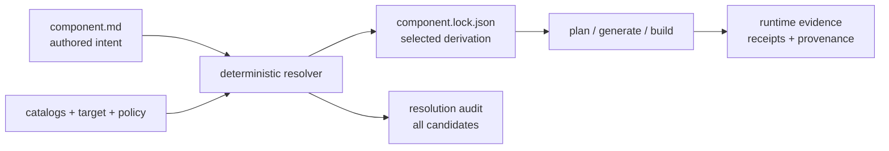

# Component authoring and lock boundary

Literate AI separates what an author means from what a resolver selected and from what
happened later. The three records may refer to one another by content identity, but they
never share fields merely because one command currently computes them together.

This document fixes field ownership for `LOCK-200`. A strict adapter now parses
constrained frontmatter and Markdown into `ComponentAuthoring`; unknown keys, unsafe
YAML features, ambiguous scalars, escaping paths, and mismatched path-derived names fail
closed. The existing
`urn:literate-ai:schema:v2:component-definition` remains frozen and retains its old
welded meaning only for compatibility.

## Single-file default

`component.md` is both the readable Component declaration and, by default, the root
behavioral specification. Omitted provider/root fields deterministically select
`literate-markdown` and `component.md`; this is a syntax default, not an ambient catalog
search. Its entire bounded UTF-8 content is identity-bound and supplied once to the
Component's generation context. Changing behavioral prose therefore changes the exact
specification, revision, plan, and downstream derivation identities.

Additional Markdown documents are justified only by a named domain/module/protocol
boundary inside the Component. A separate public-interface document is justified only
when another independently generated Component consumes it. Machine-normalized
Component JSON is an inspection projection, not peer authoring authority, and exact
selection stays in generated target-specific `component.lock.json`.

Acceptance language and measurable examples belong in `component.md`. A repository may
keep independent executable fixtures and expected-value oracles in a separate test
catalog, content-bound to the exact Component/specification under test. Those fixture
locations are not Component specification roots, and private oracle bytes are forbidden
from coding-agent context.

## Classification rule

| Class | Owner | Identity effect |
| --- | --- | --- |
| Authored intent | person or authoring agent | changes the authoring identity |
| Resolvable selector | person or authoring agent | changes authoring identity; resolution produces an exact lock value |
| Resolved identity | deterministic resolver | changes the selected lock and downstream derivation when selected |
| Runtime evidence | lifecycle or inverse-translation process | never changes authoring or lock identity |
| Catalog audit | resolver observation | changes audit identity only when unselected candidates change |

An explicit authored pin is still authored intent. It constrains resolution and outranks
defaults, but the exact selected reference is repeated in the lock so consumers need
only one exact authority record.

## Component fields

| Meaning | Class | Authoring representation | Lock representation |
| --- | --- | --- | --- |
| namespace and name | Authored intent | `coordinate` | repeated for review and lookup |
| semantic version | Authored intent | `version` | repeated in locked revision |
| display name, description, profiles, sample marker | Authored intent | authoring record / Markdown body | represented by `authoring_identity`, not copied as behavior |
| provided capability name and version | Authored intent | `provides` | public-interface reference and binding |
| public-interface location | Resolvable selector | `ComponentContentSelector` | exact `ContentReference` |
| required capability, version range, edge kind, optionality, constraints | Authored intent | narrowed portable `requires` contract | exact `ExecutableComponentEdge` plus identity-bound constraint satisfaction after composition |
| specification provider and ordered roots | Authored intent | provider and paths | exact specification references plus their set identity |
| skill or other authoring-input path | Resolvable selector | selector with optional pin | exact content reference |
| workflow and routing policy paths | Resolvable selector | selector with optional pin | exact content references |
| Flavor slot ID, axis, cardinality, bounds, capability contract | Authored intent | `flavor_slots` | declaration repeated in each exact slot result |
| capability required only by a selected Flavor | target-conditioned authored intent | `FlavorDefinition.requires` | exact `LockedFlavorRequirement` plus an ordinary executable edge when selected |
| lifecycle kind | Authored intent, optional | `kind` (`component`, `cli-application`, `library`, `persistent-service`, `packaged-module`, `ui`, `schema-only`); omitted infers from entrypoints | represented by `authoring_identity` when authored; omitted `kind` does not change existing identities |
| entrypoint name, kind, and path | Authored intent | `entrypoints` | represented by `authoring_identity` |
| acceptance-contract path | Resolvable selector | selector with optional pin | exact content reference |
| repository URL, requested branch/commit/default, kind, optionality | Resolvable selector | repository-source intent | exact repository source lock |
| required data/image/binary source URI, assembled path, role, media type, optional pin | Resolvable selector | `ComponentAssetSelector` | `ResolvedComponentAsset` with exact `BlobRef` |
| preferred alternative provider, required capabilities, fallback order, optional Flavor override | Authored intent and selector | project/Flavor provider-resolution request | complete `ProviderResolution`, including evaluated capability-set, catalog, policy, fallback, and override-provenance identities |
| source snapshot, parent revisions, parent runs | Runtime evidence | forbidden | forbidden |

Specification-root order remains authored because providers may assign meaning to the
first root. The lock preserves that order and derives
`specification_set_identity` from the provider plus every ordered exact specification
reference; the identity is not an independent resolver assertion. Set-like collections
use canonical semantic-key order; this makes accidental catalog traversal order
structurally invalid rather than merely normalized after the fact.

## Flavor, target, and policy fields

| Meaning | Class | Destination |
| --- | --- | --- |
| slot declaration and user `+flavor`/`-flavor` override | Authored intent or selector | authoring/project request |
| Flavor coordinate/value constraint | Resolvable selector | authoring/project request |
| selected exact Flavor revision per slot | Resolved identity | `NodeTargetFlavorSelection` in the node lock |
| target name | Authored selection | Component lock and every node selection |
| exact target-profile and selection-policy identities | Resolved identity | Component lock and every node selection; all must agree |
| resolver implementation/policy identity | Resolved identity | Component lock |
| rejected, conflicting, unavailable, or unrelated candidates and reasons | Catalog audit | `ComponentResolutionAudit` only |

`FlavorSetLock` remains a compatibility contract. It includes rejected candidates, so
its identity is not the selected derivation identity used by the new Component lock.
The new lock contains only exact selected slot results. Changing an unrelated Flavor
therefore leaves the selected lock and downstream derivation identity unchanged, while
changing the resolution audit and requiring the lock/audit admission pair to be
refreshed before the next lifecycle. That refresh is deterministic and model-free.

Alternative implementation-provider resolution is separate from Flavor-slot selection.
A project owns provider IDs, capability declarations, requirements, preference, and
fallback order; a Flavor may supply one exact override declaration. The framework's
canonical resolver validates sufficiency and binds the complete result into
`ComponentLock.provider_resolutions`. Generation keys repeat those resolution
identities. Capability-catalog drift therefore changes lock and plan identity, and a
newly sufficient preferred provider deterministically replaces an earlier fallback.
See [capability-based provider resolution](provider-resolution.md).

## Workflow, routing, skill, acceptance, and repository fields

| Family | Authored intent / selector | Exact lock data | Evidence only |
| --- | --- | --- | --- |
| Workflow | catalog-relative path and optional pin | content reference | execution trace and outcome |
| Model routing | policy path and optional pin; explicit user model preference | exact policy/model binding selected for generation | prompts, responses, timing, token use |
| Skill | role/kind and path with optional pin | exact skill content reference | agent loading transcript |
| Acceptance | behavioral oracle location and optional pin | exact acceptance content reference | case results and verifier receipts |
| Repository source | URL, revision selector, dependency kind, optionality, integration selector | commit, source snapshot/tree, resolver, exact integration contract | clone/build/index/admission evidence |
| Non-code asset | Component-relative path, `project:///` path, or HTTP(S) URI; target path, role, media type, optional pin | selector plus exact SHA-256, byte size, and media type | fetch timing/cache observation and assembly evidence |

Asset bytes are part of the Component input closure but never part of the model-writable
tree. Lock planning must prove reachability and integrity before generation. Generation
context contains only locked asset metadata; assembly overlays the verified bytes after
the model returns text. A changed or unreachable asset invalidates the lock and stops
test creation/build, while an unrelated shared asset does not affect Components that do
not select it.

Exact repository locks are selected inputs. The temporary clone,
build logs, quarantine state, and cache-admission history are runtime evidence even when
they prove that the selected lock was safe to consume.

## Lock graph invariants

A `LockedComponentRevision` identifies only local forward-generation authority:

- the complete authoring identity;
- exact specification, selected-Flavor revision, skill, workflow, routing, acceptance,
  public-interface, and repository-source selections; and
- exact requirements introduced by selected Flavors, each bound to the complete Flavor
  revision that declared it; and
- the Component coordinate and semantic version needed to review the graph.

It deliberately excludes generated source, source snapshots, parent runs, prompts,
tests, build artifacts, SBOMs, caches, publication records, qualification, promotion
journals, and other provenance.

A `ComponentLockNode` binds that revision to one per-node target/Flavor selection and
to every public interface supplied by the revision. A lock cannot be constructed or
decoded without a typed tuple containing every and only exact `ComponentAuthoring`
value named by its nodes. The decoder binds each matched value to
`LockedComponentRevision.definition`, so typed lifecycle consumers retain the same
definition after a v2 lock serialization round trip. This private validation context is
retained for `dataclasses.replace` and further checks, but is deliberately absent from
`to_dict`, equality, and lock identity. A missing or substituted definition fails at
the typed decode seam. Validation proves the repeated coordinate/version, ordered
specification set, selector kind/URI/pins, complete Flavor slots, public capability
interfaces, and repository locks against those authoring values.

An `ExecutableComponentEdge` references locked revision identities and must correspond
to one exact consumer requirement authored by either the Component or one of its exact
selected Flavors. One requirement selects at most one provider; every non-optional
requirement selects exactly one. IDs are unique across both authorities. Capability,
dependency kind, optionality, and provider capability/version must satisfy the authored
contract. A generation edge
must additionally consume the exact public-interface binding exported by its provider.
Every selected requirement also has one `RequirementConstraintSatisfaction` in its
consumer node. That record repeats every authored constraint exactly, binds the selected
provider, target name, target profile, selection policy, and exact per-node Flavor
selection, and names the resolver's satisfaction evidence. Even an unconstrained
selected requirement has an empty record, so omitting evaluation cannot be confused
with having evaluated an empty constraint set.
All endpoints must exist, every node must be reachable from the root, and the graph must
be acyclic. Reachability and cycle validation are iterative and bounded by the declared
4,096-node/16,384-edge contract limits rather than Python's recursion limit.

The Component lock identity is the selected derivation identity. Catalog audit is a
separate content-addressed record that points to the lock; the lock never points back to
the audit. This one-way relationship prevents rejected-candidate explanations from
entering the selected derivation or cache identity. Lifecycle admission nevertheless
requires the current exact pair: it reproduces the resolution plan from one captured
catalog, checks the audit's graph-bound catalog and resolver identities, reproduces the
exact lock, and rechecks that plan through model egress. A graph or catalog change thus
requires deterministic re-locking but regenerates source only when selected authority
actually changes.

## Evidence ownership and promotion

`adapters/component_lock_operations.py` owns shared lock preparation, exact input
revalidation, paired artifact checks and rollback-safe publication. The CLI delegates
to these operations. Read-only observability must reuse their currentness checks;
reading a retained lock or audit alone does not prove that current inputs still match.
The shared `adapters/project_lock_health.py::observe_project_locks` observation retains each check report,
project-relative Component path and structured refusal alongside the existing gate
result. Repository lock failure leaves Component observations empty, rather than
claiming their locks were checked. Its v2 `project-lock-health` serialization is a derived report, not an admitted
attestation. Verification and HTML retain the same gate decisions.

Matrix-scoped lock and resolution-audit stores do not create directories during
construction, checks, snapshots or required reads. An absent matrix artifact reports
missing state. Actual updates and operation locks create their storage through the
existing safe-directory/write-lock path. Reads revalidate the component and storage
ancestors, including after construction; allowing an absent suffix never permits
parent traversal, links, reparse points or existing non-directory ancestors.

This keeps the check path suitable for `verify` and read-only observability. It does
not turn a missing lock or audit into a current result or grant execution authority.

Source-to-specification prompts, source snapshots, promotion
journals, qualification proofs, and generation-input audits remain beneath provenance
authority. They may name the Component lock involved in a transition, but they do not
enter `ComponentAuthoring`, `LockedComponentRevision`, or `ComponentLock`.

This boundary also avoids an identity cycle. `ComponentInterfaceBinding` names a locked
revision, so bindings live in `ComponentLockNode` beside the revision rather than inside
the revision whose identity they contain. External authoring values point only into the
runtime validator; the lock serializes their identities, never their bytes, so they do
not create a reverse identity edge.

The Python decoder and public JSON Schema enforce the same wire bounds, selector kinds,
portable catalog-relative paths, and collection limits. Semantic invariants that span
the external authoring values and lock graph are enforced by the mandatory typed decode
seam because JSON Schema cannot dereference content identities.

## Operational boundary and remaining integration

`litai lock [COMPONENT|PROJECT]` now parses `component.md`, validates exact project and
Flavor catalog inputs, applies ordered target selectors, resolves the reachable
capability graph, and writes canonical selected locks plus target-scoped catalog audits.
`--check` and `--diff` are non-mutating. Updates re-read every pinned input immediately
before atomic replacement; interrupted or concurrently changed inputs preserve the
previous lock. Repository-source selectors deliberately fail until an admitted exact
`RepositorySourceLock` is available rather than fabricating a commit or tree.

`litai component migrate COMPONENT|PROJECT` is the explicit compatibility bridge. It reads the
legacy `component.json` and every welded repository-dependency document through one
bounded, revalidated input closure, removes only mechanical resolver identities, proves
`parse(render(authoring)) == authoring`, and atomically creates `component.md`. It never
overwrites an existing authored document and never deletes or rewrites the legacy file.
`--check` and `--diff` report missing/current/conflicting state without writing. Legacy
authoring is deprecated in 0.2.0, supported for explicit migration and colocated
equivalence evidence only through the 0.2.x series, and removed in 0.3.0. Deleting a
newly created `component.md` preserves every legacy byte but deliberately leaves the
Component migration-required; ordinary commands never silently restore welded authority.

During the bounded 0.2.x compatibility series, `litai component migrate --check` proves
that a colocated legacy `component.json` is semantically equivalent to `component.md`.
Ordinary project validation and generation do not read that legacy manifest. `litai plan`
and `litai generate` admit one canonical current lock,
treat target and Flavor CLI values as assertions, and project the recipe and CycloneDX
graph directly from the lock. They never invoke the legacy Component composer or Flavor
resolver. The coding-agent context contains only the root Component's locked
specifications and exact public interfaces on its direct generation edges. Acceptance
oracles and dependency manifests, private specifications, skills, workflow, routing,
and implementation text cannot enter the prompt. The selected-byte closure is checked
again immediately before model egress.

Recipe, accepted-source, source-cache, CycloneDX, publication, import, receipt, and
promotion contracts now carry the same exact lock identity and reject substitution.
Source-to-specification promotion writes `component.md` and the exact lock directly; it
does not manufacture a welded manifest. The Standard planning, toolchain-closure,
invalidation, rebuild-request, source-custody, cache-membership, source/resolved-SBOM,
package/release, publication/import, and provisional-receipt records all bind the same
`ComponentLock.identity`; each boundary rejects a substituted identity before work or
admission. The compact current receipt deliberately stores identities rather than
repeating the lock document: its project revision and resolvable lifecycle evidence bind
the exact lock set. Deleting the legacy generation composer remains a compatibility and
scope-reduction task before 0.3.0, not an open selected-authority binding.

## Component lifecycle kinds

`cli-application` is an explicit subclass of the base `component` kind. It is not the
implicit base. Default `litai init` Flavor selectors are unchanged by this boundary:
kind is an authored Component contract, not a Flavor catalog rename.

Omitted `kind` infers from entrypoints so existing `component.md` identities stay
stable:

| Entrypoints | Inferred kind |
| --- | --- |
| at least one `portable-application` | `cli-application` |
| at least one `persistent-service` and no portable CLI | `persistent-service` |
| empty or other | `component` |

CLI-only generated assumptions that other kinds must not inherit:

- one JSON-array argv ABI for the runnable artifact
- framework `--litai-test` and `--litai-smoke` dispatcher modes
- process-invocation acceptance rather than import or render oracles
- at least one `portable-application` entrypoint

Reviewed inverse graph nodes map `cli` → `cli-application`, `library` → `library`, and
`service` → `persistent-service`.

### Additional kind candidates (COMPONENT-KIND-002)

| Candidate | Decision | Named lifecycle difference |
| --- | --- | --- |
| `component` | accepted | generic lock/generate/accept; no CLI argv ABI |
| `cli-application` | accepted | JSON-array argv, framework test/smoke modes, process-invocation acceptance |
| `library` | accepted | empty product entrypoints; sealed directory package, exact language import surface, generated test adapter, and verifier-owned capability oracle |
| `persistent-service` | accepted | `persistent-service` entrypoint; no portable CLI argv |
| `packaged-module` | accepted | the package is the artifact; no portable CLI argv |
| `ui` | accepted | no CLI argv; lint-and-render acceptance is a later oracle |
| `schema-only` | accepted | empty entrypoints; schema validate, no generated runtime |
| `wrapped-source` | declined | convert-phase quarantine, not a generation kind |
| `batch` | declined | same lock/generate/accept as `cli-application` |
| `event` | declined | same lock/generate/accept as `persistent-service` |

An authored `kind` is omitted from the authoring identity projection when empty.
Existing samples that still declare a portable-application entrypoint keep inferring
`cli-application`, including `samples/generated-library`.
