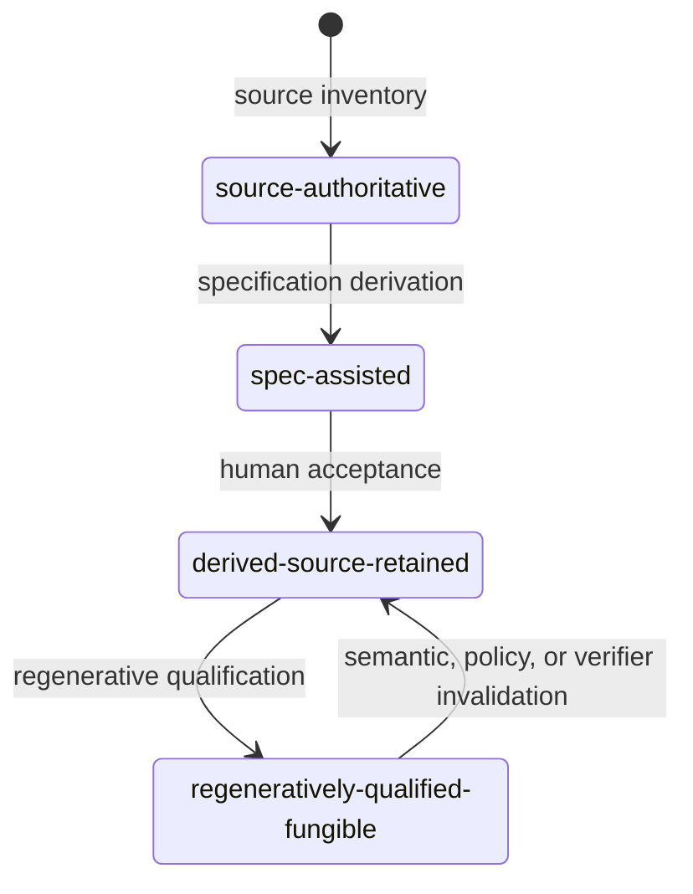

# Component authority is an append-only evidence projection

A Component's authored `component.md` says what the Component is and does. It does not say
which artifact currently has implementation authority. Literate AI records that fact
separately as an immutable, content-addressed projection under
`provenance/component-authority/`.



Every arrow creates a new projection that names its predecessor and the exact evidence
for the transition. The store rejects a skipped state, a fork from stale history, a
rewrite at an existing digest, a broken predecessor, and content whose digest does not
match its file name. Facts that do not exist yet are JSON `null`; Literate AI does not
invent hashes to make an incomplete record look complete.

Human acceptance of a source-derived specification deliberately stops at
`derived-source-retained`. Only a separate regenerative qualification can make source
fungible. Qualification binds the Component revision, target lock, complete
Flavor/skill/workflow/routing closure, verifier, policy, and evidence. A change to any
of those inputs makes the effective state retained-source again.

The original source is evidence, not generation input. Promotion journals live under
`provenance/source-promotion/`, outside every Component and specification root, and the
authority projection contains only the promotion record's content identity. Retention
is independent of authority: neither a transition nor qualification deletes source.

Inspect a project with:

```console
litai spec status . --json
```

The response distinguishes the recorded state from the effective state and lists
machine-readable blockers such as `regenerative-qualification-required` or
`verifier-changed`.
