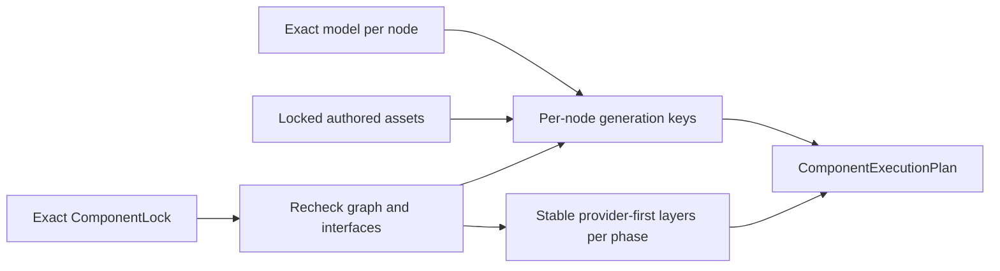
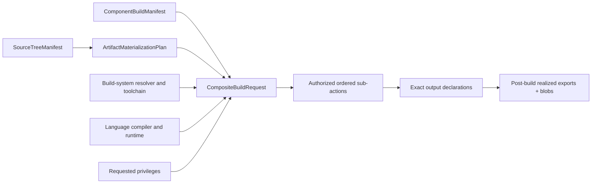

# Per-Component execution plans

A locked project is planned as independently cacheable Component work, not as one
flattened coding-agent request. `plan_component_execution` converts one exact
`ComponentLock` into a versioned `ComponentExecutionPlan` before any model egress.

## Generation-key boundary

Each `ComponentGenerationKey` binds the node's ordered specification set and document
identities, selected target/Flavors, specification-to-source skills, workflow, routing
policy, model, authored assets, its own exported public-interface identities, and the
public-interface identities of its direct generation dependencies.

It deliberately does **not** bind aggregate Component/authoring revisions because those
would smuggle acceptance-oracle and dependency-selection identities across the narrow
generation boundary. It also does not bind a dependency's revision, private
specifications, source tree, build output, tests, routing policy, or skills. Consequently:

- changing a leaf's private specification invalidates the leaf only;
- changing the leaf's exported interface invalidates the leaf and its direct consumers;
- a diamond leaf appears once in each provider-before-consumer layer; and
- a consumer key remains stable when private graph depth or implementation changes.

`ComponentGenerationPlan` retains the exact direct edges for audit, but cache
membership uses its `generation_key.identity`. The audit plan may change when a provider
revision changes even when the consumer source key correctly remains reusable.

## Stable action layers

A `ComponentActionPlan` names one lifecycle phase and schedules every locked revision
in explicit zero-based layers. Revisions within a layer are ordered by content-identity
URI, and every applicable edge requires the provider to occupy an earlier layer than
the consumer. `ComponentExecutionPlan` carries one action plan for every canonical
phase: generate, validate, build, run, package, and deploy.

The planner rechecks closure, cycles, and exact public-interface bindings even though
the lock contract already validates them. A missing/incomplete generation interface,
an open graph, or a cycle is therefore a stable planning error before a coding CLI can
run. It never repairs an interface failure by exposing a dependency's private material.

## Bounded incremental generation

Remote `build` and `test` preserve `--jobs` through the canonical dispatch request
and worker lifecycle, using the same 1–256 bound as local execution. The request
identity binds this scheduling policy; the shared artifact-input authority does
not, so a retained parallel build remains replayable with `run`. Omitted `jobs`
means one and retains the existing default request representation. Workers that
do not understand a nondefault `jobs` field reject that request during contract
validation. Dependency ordering and failed-predecessor cancellation still belong
to the lifecycle scheduler within the selected worker.

`schedule_source_generation` consumes the generation action layers, one exact
invalidation decision, the prepared bounded request for every node, and any typed
`SourceGenerationResumeCandidate` values. It revalidates every request against the
current per-node plan before starting a worker. A candidate is reusable only when its
generation key, context manifest, complexity budget and decision, prompt, recipe,
workspace allocation, and complete typed output all match. Missing, stale, over-budget,
or explicitly invalidated candidates run again.

The Standard lifecycle has a separate accepted-source membership path. Matching
Component revision and generation-key identities authorize reuse of the immutable
source artifacts across application roots; they do not authorize reuse of the old
request, plan, lock, recipe, workspace, provenance, or acceptance custody. The service
creates a new candidate/output/provenance projection bound to the current prepared node,
retains the input membership as origin evidence, and then runs the complete current
index, authorization, build, test, execution, and acceptance sequence. A different key
fails closed before reuse, explicit regeneration bypasses membership, and any prepared
recipe lock must equal the current execution-plan lock. Historical generation runtime
metrics remain on the input membership rather than being charged to the cache hit; the
new output reports no model execution. A hit is not republished.

Independent nodes in one layer may run concurrently up to the explicit bound. Results
are emitted in canonical Component-revision order rather than completion order. A
failed provider cancels dependent generation nodes before their adapters are called;
independent branches continue. Reused nodes report no current runtime observation.

The runner returns one `SourceGenerationRunOutput`: an immutable
`GeneratedSourceCandidate`, generation-only provenance, and optional runtime observation.
The candidate separately identifies its generated tree, source bundle, source manifest,
source SBOM, and generated-test suite. The per-node result is the common journal,
benchmark, and receipt-facing evidence surface. It binds the current context and budget
identities. A generation adapter may report actual model attempts, wall time, model
tokens, and cost; each absent measurement remains `null`, never an invented zero.
Supplied measurements that exceed the exact budget fail the node and retain the observed
values for diagnosis.

This boundary stops at source. Neither a candidate nor its provenance grants build,
acceptance, cache-membership, or publication authority. Reuse means only that the exact
source-only output remains eligible to enter the current post-source lifecycle.

The older host orchestrator is now a typed facade over the same authority distinction.
`GenerationRequest` names one exact locked Component, carries a
`GenerationContextBinding`, and supplies a `BuildRequestDeclaration` whose builder,
toolchain, sandbox, privileges, and outputs are known before generated bytes exist. The
declaration deliberately cannot name a source bundle. After the generated tree, current
test manifest, and source SBOM pass admission, the orchestrator realizes exactly one
source-bound `BuildRequest`, records exactly one `build-request-realized` event, and keeps
the typed request on `GenerationRun` for every downstream adapter and resume check.
Generation provenance v4 binds both the declaration and realized-request identities, as
well as both the application root and generated Component identities. Historical v3 wire
contracts remain readable rather than being rewritten.

## Standard project lifecycle

Worker routing primitives are available in `application/component_workers.py`.
An explicit assignment for every locked revision binds the execution plan, lock,
private catalog identity, worker identity, target profile and locked Flavor
selection. Revalidation rejects drift before dispatch. The public record contains
no worker endpoint, workspace, command or environment values.

The handoff planner selects direct build/runtime/package predecessors from the
existing action plans. Generation-only and transitive implementations are excluded.
The lifecycle caller must supply already accepted products; an acceptance identity
in this contract does not authenticate evidence. The filesystem custody adapter
uses the existing CAS to verify source bytes, copy regular files with bounded reads,
compare the resulting blob identity and verify destination bytes. Its receipt binds
the exact handoff, consumer worker and complete export set, preserving original
target, ABI, source, authorization and toolchain metadata.

The Standard scheduler now applies those primitives at its existing complete-node
boundary. One current routing record selects local, command, or SSH handlers without
creating a second scheduler. Every handler result must bind the exact request, worker,
Component and lifecycle-result identity, and its import receipt must bind the complete
handoff before the result enters downstream scheduling. Existing artifact contracts
retain target, ABI, authorization and toolchain evidence; final project acceptance is
unchanged. Byte custody alone still establishes neither ABI compatibility nor native
acceptance.

Failed predecessors remain undispatched. A caller-owned cancellation signal is shared
with active transports and prevents later actuation; transports receive an explicit
cancel callback for work they own. Recovery candidates bind the current routing,
request, worker, import receipt and result identities, so changed plans, assignments,
inputs or reuse selections run or fail instead of replaying stale evidence.

Independent portable and library acceptance distinguishes product data from canonical
contract JSON v1. Product JSON preserves finite fractional arguments and results with
sorted UTF-8 object keys, compact separators and shortest round-trip binary64 number
spelling. Invocation and evidence preserve those bytes, while result comparison
checks exact JSON values: integral numbers such as `1` and `1.0` compare equally.
Booleans remain distinct from numbers, negative zero retains its sign, and neither
tolerances nor integer-to-float rounding are introduced. Numeric application values
are not converted to strings.
Integer-only documents retain their previous bytes and identities. Contract JSON v1
remains integer-only. Oracle loading and invocation reject non-finite product values,
and non-finite observed output cannot enter passing evidence.
Retained library qualification stores and reopens the actual finite product bytes
for oracles, cases and results. The observed result identity may differ from the
expected value's encoding identity; reopening validates its exact bytes, canonical
product encoding and value against the current oracle. Its general contract JSON
reader remains integer-only.

`StandardProjectLifecycleService` is the reusable application-layer path above that
scheduler. It depends only on injected ports for project validation, generation,
source-bound build intent, indexing, current authorization, build-plan finalization,
building, generated tests, execution, acceptance, atomic project admission, and receipt
issuance. CLI and adapter packages remain outside this boundary.

The locked `litai plan` and source-only `litai generate` commands now reach this boundary
through filesystem Standard adapters and `StandardProjectApplicationService`. The
adapters own host PATH selection, locked per-node model resolution, fresh workspace
allocation, cache lookup, and model invocation; the CLI owns arguments, error mapping,
and JSON presentation. The filesystem planner projects every locked
`ResolvedComponentAsset` into the same typed authored-binary-asset tuple accepted by the
application service; an explicit tuple remains an adapter seam for tests and external
runtimes. Each asset identity enters the per-node generation key, its metadata enters
bounded model context, and its verified CAS blob is merged only after text generation.
An adapter never silently drops those identity-bearing inputs. Generation returns one
versioned custody record per Component,
binding its exact plan and generation key to the retained workspace, result, candidate,
and provenance. It grants no build authority and does not index, build, test, accept, or
publish the candidate. The outer rebuild command remains on its existing contract until
it can consume these distinct workspaces and preserve cache membership and project
authorization end to end.

The post-source authority flow is deliberately split:

The build-intent factory runs only after one node has generated or exactly resumed its
source. Its typed intent binds the Component, the exact source-tree identity used by the
indexer, a distinct source-bundle identity used by `BuildRequest`, and every completed
provider `ArtifactExport`. It carries no current authorization. Only after the source
tree is indexed may the authorizer issue a grant binding the exact intent, build request,
and index. The finalizer then creates the validated `ComponentBuildManifest`, isolated
materialization plan, and authorization-bearing `CompositeBuildRequest`. The service
rejects substitution at every edge.

Before compilation the manifest contains exact `ArtifactExportDeclaration`
values—role, producer, ABI, target, media type, toolchain, authorization, and dependency
closure, but no impossible future byte digest. The builder realizes each declaration as
an `ArtifactExport` with its exact `BlobRef`; one validator rejects missing, additional,
reordered, or shape-changing results before the realized manifest can enter the artifact
graph. The local Standard adapter binds a regular-file export directly to its bytes and
normalizes a directory export into a deterministic stored ZIP byte stream, so both forms
have retrievable immutable blob custody without confusing an operational host path with
artifact identity.

All lifecycle dependency edges are conservatively combined into provider-first layers.
One layer runs each independent node end to end—generation, planning, indexing,
authorization, build, tests, execution, and acceptance—before the next layer starts.
Consequently every provider reaches an accepted artifact before a dependent consumer
even starts source generation. Completion order inside a parallel layer remains
operational only; result and aggregate-plan evidence use canonical Component-revision
order.

Accepted node candidates are reusable only when both their bounded generation evidence
and complete typed build-plan identity remain current. Independent accepted nodes stay
reused when another branch fails. Failed nodes cancel their dependents, while unrelated
work may finish. Admission and receipt ports are project-wide and are not called until
every node has generated or resumed, indexed, authorized, built, tested, executed, and
passed acceptance. The Python `service-stack` sample is the first ordinary sample wired
through this service: its money library, invoice service, and executable root each
generate into a fresh bounded workspace, compile, run node smoke and acceptance probes,
and exchange declared artifacts before the root produces its pinned invoice result.
Authenticated conformance exposes this as additional operational adoption evidence;
the existing flattened Python path remains the receipted record until Standard executes
the generated test manifests and reconciles post-build CycloneDX per Component. The
legacy C++ sample and promotion paths remain separate until they receive equivalent
adapters.

This is the implemented core boundary, not the whole advertised product lifecycle.
Standard-bound projects now reach Standard membership and durable stage-by-stage
interruption through `litai rebuild`. Link/package/release stages and migration of the
remaining sample and qualification paths remain deferred. This repository itself still
selects the content-pinned external sample-conformance driver.

### macOS adoption observation (2026-08-07)

This experimental path was exercised with the authenticated coding CLI against fresh
temporary `BUILD_DIR` and `OBJ_DIR` roots. The deterministic three-node lifecycle took
1.406 seconds. The first live attempt took about 65 seconds before rejecting the money
node because its generated test reused the pinned acceptance arguments; that separation
remains mandatory. After adding the exact forbidden vector to the bounded node request,
a roughly 129-second cold attempt completed the money node and reached the invoice
node, which failed after generation as `node-lifecycle-failed`; the root was correctly
cancelled. No warm result is claimed. This is diagnostic evidence, not a benchmark:
generation visibly dominates local compilation, but the lifecycle still needs
phase-specific index/build/test/execute failure detail before another qualification run.

## Typed build boundary

Generated text and authored binary assets first become one exact `SourceTreeManifest`,
then an `ArtifactMaterializationPlan` projects those blobs into a fresh execution root.
A per-Component `ComponentBuildManifest` describes adapter-neutral actions and exports.
The `CompositeBuildRequest` is the authorization-facing envelope above those unchanged
`BuildActionRequest` records.

The composite request binds the Component and manifest identities, source-tree and
materialization identities, target, build-system resolver/toolchain, language
compiler/runtime, authorization, contiguous typed sub-action order, requested
privileges, and the complete output set. Every nested action must bind the same
Component, source, target, compiler toolchain, and authorization. Reordering the wire,
omitting a manifest action or output, changing one of those identities, or removing the
explicit build-tool execution privilege fails closed.

The v2 reader remains compatible with earlier manifests whose `exports` already contain
realized blobs. Canonical output expands their declarations explicitly; declaration-only
manifests require a builder result before graph construction.

The language runtime identity is required even for native builds: it identifies the
selected runtime/loader ABI rather than implying that a separate interpreter must be
launched. The pure constructor derives build-system toolchain, manifest, output, and
action membership from exact typed inputs. A separate pure validator rechecks a
deserialized request against the exact manifest and materialization plan before an
adapter may use it. The Standard lifecycle now consumes this envelope through its
authorization-bound build-plan finalizer. Compatibility builder decorators and the
sample-specific host path remain transitional integrations; their continued existence
does not weaken or complete the Standard boundary.
