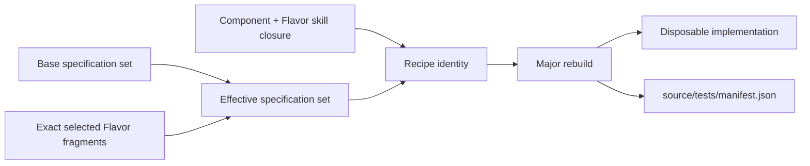

# Composable Component Flavors

## Purpose

Flavors let one target-neutral Component participate in multiple operating-system,
architecture, accelerator, language, build-system policy, toolchain, packaging, or
deployment realizations.
They prevent requirements such as “build with MSVC on Windows,” “optionally use CUDA,” or
“generate the Rust implementation” from contaminating the Component's durable behavioral
specification.

“Mix-in” describes how a Flavor contributes to an effective revision. It does not mean
free-form YAML merging, inheritance, or runtime monkey-patching.

## Object model

### `FlavorDefinition` and `FlavorRevision`

A Flavor is a first-class catalog, vocabulary, cache, package, and publication object. A
definition declares:

- a stable `flavor://<namespace>/<name>` coordinate and immutable revision;
- exactly one primary `FlavorAxis`, plus optional secondary constraints;
- applicability expressed through capabilities and semantic version ranges;
- provided/required capabilities and compatibility constraints;
- content-pinned spec fragments and authoring skills;
- typed workflow, validator, builder, toolchain, package, and runtime contributions;
- conflicts, co-requisites, ordering constraints, and exactly one primary-axis target
  value per revision;
- exact source-snapshot and parent lineage on the `FlavorRevision`.

Every selected contribution that affects the build also remains visible in dependency
evidence. The source CycloneDX graph contains intended Component, repository-source,
package, toolchain, and runtime relationships; the resolved graph records the exact
closure observed after the selected Flavor's native build. A Flavor may add or constrain
dependencies, but it cannot remove a base/managed node or weaken graph completeness.

A Flavor may itself be implemented and published by a Component, but its portable
variation contract remains a distinct object. This avoids making every target selection
look like a normal runtime dependency edge.

Cross-axis behavior is factored into three layers. An OS Flavor owns universal host
facts, including best-effort remote-worker clock synchronization to a public NTP source,
a language Flavor owns portable source semantics, and a toolchain realization
owns their intersection: compiler/SDK discovery, supported host constraints, and
mitigation. The language can declare an exactly-one `co_requisite_groups` alternative
set. Resolution requires one member and rejects zero or several; each realization's
secondary `platform.os` constraint rejects a mismatched OS before model selection.

The Swift catalog is the reference shape: one portable `swift` language Flavor plus
`swift-apple`, `swift-linux`, and `swift-windows` toolchain Flavors. Apple developer
tools do not belong in generic macOS policy because many macOS Components do not need
them. Conversely, Windows SDK/C++ prerequisites belong to the Windows Swift realization,
not to portable Swift or generic Windows.

### Selected-Flavor capability requirements

A Flavor may declare a Component capability in `requires` when selecting that target
necessarily introduces behavior owned by another Component. Packaging is the canonical
example: a product-specific `+ovpackage` Flavor can require an independently reusable
publication Component without putting NVIDIA packaging policy in the portable base
Component or in literate-ai.

Those requirements are conditional composition authority, not hidden plugin hooks. The
lock planner selects Flavors per reachable Component and then resolves the combined
Component-authored and selected-Flavor requirements to a deterministic fixed point.
Every selected requirement uses the ordinary unique provider, semantic-version,
constraint, optionality, and dependency-kind rules and produces an ordinary executable
Component edge. A recursively introduced provider receives its own target/Flavor
selection before its requirements are resolved. An unselected Flavor contributes no
provider, edge, prompt material, or identity.

The locked consumer revision records a `LockedFlavorRequirement` containing the exact
`FlavorRevision` and the exact requirement it declared. The binding must name a revision
already selected for that node, and the requirement must occur in that revision's
definition. Requirement IDs must remain unique across the Component and all selected
Flavors; collisions fail closed instead of creating precedence rules. Empty binding
sets are omitted from the wire representation, preserving existing lock bytes for
Flavors that do not introduce Component dependencies.

### `FlavorAxis` and `FlavorSlot`

Axes are semantic dimensions, not arbitrary labels. Initial standard axes include:

- `platform.os` and `platform.architecture`;
- `accelerator`;
- `implementation.language-ecosystem`;
- `implementation.ui-framework`;
- `build.system`;
- `toolchain`;
- `packaging`;
- `deployment`; and
- `documentation.ecosystem`.

A base Component may declare only the abstract slots it accepts, with `exactly-one`,
`zero-or-one`, `one-or-more`, or bounded cardinality and a capability contract. It need
not list concrete Windows, CUDA, Python, or Rust details. Catalog policy can also add
standard slots externally when the base is entirely neutral.

Slot IDs, rather than axes, identify roles. Most Components have one slot per axis and
may use an axis-wide target constraint. A multi-language Component may instead declare,
for example, `backend-language` and `frontend-language` on the same implementation
language axis. Such a target must constrain each slot explicitly; an axis-wide language
constraint is rejected as ambiguous. This permits a Rust backend and JavaScript frontend
without weakening either slot's exactly-one cardinality.

Project `default_flavor_selectors` are ordered preference inputs, not target mandates.
They are considered only on axes declared by the Component, then explicit request
selectors are applied afterward. An explicit positive selection replaces a project
preference at the same exclusive slot. A weak unqualified build-system preference binds
every exclusive role on that axis; a slot-qualified alternative replaces one role, and
unqualified `-bazel` removes all bindings without a replacement. In either case, the
removed Bazel revision and skill are absent before selected effective-set, recipe, input
closure, and prompt construction. Full catalog discovery remains separately identified
for audit, so a rejected catalog candidate cannot perturb semantic derivation identity.
A preference absent from a supplied catalog is unavailable, not ambient authority.
`litai init` makes this policy portable by installing the exact pinned `make`
Flavor/specification and build skill alongside its
`+flavor://literate-ai/build-make` project default; it does not
add runtime enforcement.

### `TargetProfile`

A request, workspace, release matrix, or downstream Component provides desired target
constraints independently from the base specification:

```yaml
target:
  platform:
    os: windows
    architecture: x86_64
  implementation:
    language_ecosystem: rust
  accelerator:
    capability: compute.cuda
    optional: true
```

An optional constraint means the resolver may produce a CPU/no-accelerator realization
when no compatible CUDA Flavor exists; it never silently pretends CUDA was selected.

### `FlavorResolutionDecision` and `FlavorSetLock`

Resolution records every candidate, version/platform/capability/policy constraint,
rejection, conflict, co-requisite, selected revision, and deterministic ordering. The
lock contains the base revision, target profile, exact ordered Flavor revisions,
resolution-policy identity, and a canonical digest.

There is no implicit host-platform selection for reproducible operations. “Build for
this machine” is an explicit target-profile provider whose resolved values enter the
lock.

### `EffectiveComponentRevision`

The effective revision is a derived immutable view:

```text
base ComponentRevision
  + TargetProfile
  + FlavorSetLock
  + typed Flavor contributions
  = EffectiveComponentRevision
```

It has its own identity but does not fork or mutate the base revision. Source generation,
evidence, validation, build authorization, bundles, cache aliases, and publication target
the effective identity. Multiple effective revisions share base objects in CAS.

### `EffectiveSpecificationSet`

The effective specification set is a manifest of manifests:

- the unchanged base `SpecificationSet`;
- each exact Flavor specification fragment;
- applicability and resolution decisions;
- conflicts/diagnostics; and
- the effective-set digest.

Base behavior and acceptance contracts apply to every Flavor set. Flavor fragments may
add target behavior and acceptance scenarios but cannot remove, rewrite, or weaken base
requirements. A target contradiction is a resolution/specification error requiring a
new base revision or an explicitly reviewed compatibility exception.

Generated implementation tests follow the effective set rather than living in either
catalog. The clean major rebuild consumes the unchanged base plus exact selected Flavor
fragments and skills, then replaces both implementation and tests together:



Each generated case may cite only current non-acceptance documents from that recipe.
Changing a Flavor revision or role binding changes the recipe identity and makes the old
suite unusable; suites are never patched or merged across effective revisions. Base and
Flavor acceptance contracts remain authoritative and verifier-side.

## Typed contributions instead of generic merging

Allowed contribution types include:

| Contribution | Example |
|---|---|
| Capability/requirement | `platform.windows`, `compute.cuda >= 13` |
| Specification fragment | Windows service-install behavior |
| Workflow binding | use a Rust generation/build profile |
| Authoring skills | CUDA kernel or MSVC packaging skill |
| Validator | Windows ABI or CUDA compute-capability check |
| Builder/toolchain | exact MSVC, clang, nvcc, Python, or Cargo toolchain lock |
| Packaging/runtime | wheel, MSI, OCI, driver/runtime compatibility |

Flavor schemas define merge operators for each field: additive set, keyed union, exact
single selection, or explicit conflict. Raw JSON/YAML patch operations, path-dependent
precedence, and “last wins” are rejected. Two contributions to the same singleton must
either be identity-equal or fail resolution.

## Examples

### Windows without contaminating the base Component

The base spec says the application starts, serves requests, persists state, and shuts
down safely. A `windows-msvc` Flavor separately contributes Windows service lifecycle,
MSVC toolchain constraints, filesystem conventions, packaging, and Windows acceptance
tests. A Linux Flavor can coexist without either appearing in the base requirements.

### Optional CUDA acceleration

The base spec defines correct CPU-observable results and performance-neutral behavior. A
CUDA Flavor adds `compute.cuda`, driver/toolkit/architecture requirements, accelerator
source-generation skills, validators, builder bindings, and performance scenarios. It
cannot remove correctness tests or grant GPU/device privileges; security policy issues
those authorizations separately.

### Language ecosystem selection

Python and Rust implementation Flavors can bind different generation workflows, skills,
validators, dependency providers, builders, and packages while both implement the same
base behavioral contracts. A single-role Component normally makes them mutually
exclusive. A multi-language topology declares named role slots on the same axis and can
select one exact Flavor for each role. One exact revision may satisfy several
compatible roles. The lock and effective contributions remain a set; a separate
slot-to-revision relation records every role binding, so source evidence, skills, and
contributions are not duplicated.

### Build-system preference

The standard `bazel` Flavor selects the value `bazel`, deliberately avoiding
a false “built with Bazel” assertion. Its exact skill gives the coding model a strong
default: produce faithful fine-grained Bazel targets unless explicit Component or
selected-Flavor authority calls for another system or the ecosystem cannot be modeled
honestly. A Bazel wrapper around Mix, `zig build`, or opaque generation remains a
coarse action, not a native Bazel dependency graph. Build execution evidence records
the actual source-to-binary path.

### Toolchain constraint artifacts

Toolchain requirements are data, not instructions hidden in prose. A toolchain Flavor
contributes an `exact-singleton` reference whose content kind is
`toolchain-constraint`. The referenced JSON uses the closed
`urn:literate-ai:schema:v2:toolchain-constraint` contract:

```json
{
  "schema": "urn:literate-ai:schema:v2:toolchain-constraint",
  "toolchain": "python",
  "minimum_version": [3, 11]
}
```

The optional `command` is an argument vector, never shell text. Optional
`minimum_version` and `required_version` values are one-to-three-part integer prefixes.
The Flavor contribution slot must equal the typed toolchain name. Its exact bytes must
match the `ContentReference` digest and resolve to a regular file inside the project
boundary before it enters an effective revision.

A Component may also pin the same typed artifact through an `authoring_inputs` reference
when the requirement belongs to the application rather than a target Flavor. Component
and selected-Flavor constraints are intersected: the strongest minimum survives,
compatible required prefixes narrow to the most specific prefix, and command vectors
must be exactly equal when more than one source pins them. Empty intersections and
command disagreements fail before toolchain discovery. The resolved constraint and all
selected remediation metadata remain content-pinned; remediation is diagnostic authority,
not permission to install software. Conflicting remediation records fail closed. The
source content identities are emitted in plans and sample evidence.

## Lifecycle integration

- **Vocabulary:** descriptors for all discoverable Flavors are available without
  materializing their sources; selected Flavor source/evidence remains lazy and exact.
- **Generation:** prompts receive base behavior plus the exact selected Flavor set and
  target-specific evidence; source contracts retain which Flavor introduced each claim,
  and the same major rebuild regenerates its recipe-bound implementation tests.
- **Source-to-specification:** skills classify observed target-specific behavior into
  `FlavorDraftSet` objects rather than polluting the proposed base specs.
- **Cache:** source-independent base objects are shared; target-sensitive run/build/
  artifact keys include the effective revision and Flavor set.
- **Security:** a Flavor can request privileges but cannot grant them, lower dependency
  risk, select `yolo`, or bypass source/classification/build/observation authorization.
- **Publication:** base Components and reusable Flavors publish independently; artifact
  releases identify their exact effective revision and target profile.
- **Settings/UI:** target profiles and Flavor preferences are their own typed section,
  separate from portable Component definitions and machine discovery.
- **Refresh:** source, Flavor, policy, toolchain, or target changes produce impact records
  for only the affected effective revisions.

## Product boundary

literate-ai owns Flavor contracts, resolution semantics, identities, and lifecycle
integration. A derived product owns its concrete domain policies and Flavor content—for
example development hosts, accelerator capability levels, middleware distributions, and
supported language/toolchain combinations. No product-specific Flavor name belongs in
the framework core.

## Conformance matrix

The living samples must cover:

- one portable base Component across Linux, macOS, and Windows Flavors;
- CPU-only and optional/required CUDA selection;
- Python versus Rust implementation Flavors;
- compatible multi-axis composition;
- conflicting singleton, version, and target constraints;
- Flavor source/signature failure and unavailable toolchains;
- cache reuse without cross-target artifact aliasing;
- security monotonicity and explicit yolo separation;
- independent Flavor publication/import; and
- source-to-specification separation of base and target-specific behavior.
