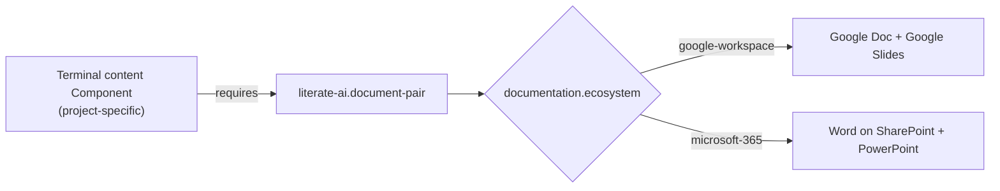
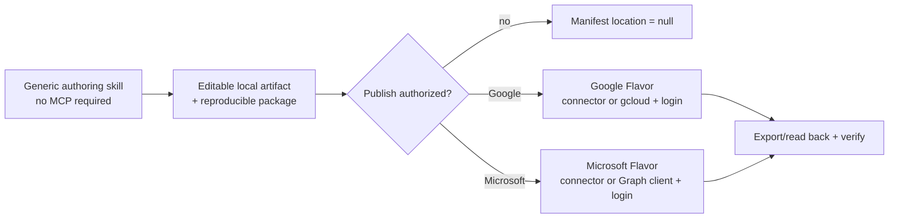

# Documentation artifacts as Components

[Documentation index](../README.md)

Maintained presentations and technical documents are modeled inside the Component system
rather than beside it. The framework does not ask projects to trust a hand-maintained
build script for artifacts whose whole argument is that readable specifications are the
durable authority.

## Three layers, one axis

| Layer | Artifact | Inheritable |
| --- | --- | --- |
| Capability | `component://literate-ai/document-pair` | yes — carried into every initialized project |
| Ecosystem binding | `flavor://literate-ai/doc-google-workspace`, `flavor://literate-ai/doc-microsoft-365` | yes |
| Project content | a project's own terminal document Component | no |

The capability Component owns what a document pair *is*: its members, its access
contract, its general formatting requirements, and its authoring-package obligation. It
owns no content.

## The pair

A document pair has two independently selectable members. A consumer declares one or
both, never a mixture of ecosystems:

| Member | `google-workspace` | `microsoft-365` |
| --- | --- | --- |
| `narrative` | Google Doc | Word on SharePoint or OneDrive |
| `presentation` | Google Slides | PowerPoint |

The realized pair is published through `LITAI_CAPABILITY_DOCUMENT_PAIR` as a manifest
naming the ecosystem, each member's local artifact, its published location or `null`, and
its resolved access record. Consumers bind to that manifest, never to provider layout.

## Access is contract, not deployment

Every realized member carries an explicit `audience`, `principals`, `permission`, and
`link_sharing` record. A provider may narrow but never widen the audience its consumer
declared, publication to any external destination requires explicit authorization, and no
credential material may appear in the manifest, the authoring package, or the repository.
Where an ecosystem's tenant policy forbids the declared audience, the provider fails
closed and leaves the member unpublished rather than silently resolving the conflict.

## Formatting is verifiable

The general formatting requirements are deliberately mechanical, so an independent
acceptance oracle can evaluate them without human judgment: exact surface geometry with
no escaping element, complete per-page notes on a presentation member, a heading
hierarchy with no skipped levels on a narrative member, preserved editable native objects,
no unresolved placeholders, and every consequential claim traceable to the authoring
package's factual ledger.

Flavors contribute the concrete mapping — Drive sharing states and Slides notes
placeholders on one side, SharePoint link types and PowerPoint notes slides on the other
— without touching content authority, claims, audience, or approval state.

## Portable authoring, optional publication

The agent-facing authoring skill has no mandatory MCP or collaboration-service
dependency. Its portable result is an editable local artifact, a deterministic authoring
package, and mechanical acceptance evidence. It may use a dedicated host capability when
present, but a generated package must declare any Node or Python format libraries it uses,
lock them, and isolate their installed closure beneath ignored `OBJ_DIR`. Missing tools are
detected before work; installation requires user authorization and never mutates a global
package environment implicitly.

Publication begins only after local acceptance and belongs to the selected ecosystem
Flavor:

The Google binding owns `gcloud` detection, optional authorized installation guidance,
`gcloud auth print-access-token`, exact-resource update, access mapping, and exported
round-trip verification. The Microsoft binding owns connector or Graph-client discovery,
optional authorized installation guidance, device-code/browser authentication, tenant
policy handling, upload, and download verification. A non-interactive worker must report
missing login as a prerequisite; it must never wait for an interaction it cannot relay.

## Terminal Components

A document Component that provides no capability is **terminal**. Its content is bound to
one project's factual ledger, so inheriting it would carry that project's claims into a
context where they no longer hold. A terminal Component cannot be forked as a template,
composed as a provider, or resolved as a dependency — resolution fails closed, because
there is no exported capability to bind.

Terminal is not private. A terminal Component remains citable by its Component URI and
its published locations remain linkable.

`component://literate-ai/literate-ai-overview` is this repository's terminal document
Component. It requires the document-pair capability, declares a `presentation` member
only, and is deliberately absent from the project template.

## Boundary

The capability Component and its Flavors describe the contract. Generation authority for
the build source is `skills/specification-to-source/document-pair/SKILL.md`. The
agent-facing authoring method,
`skills/agent/author-presentations-and-documents/SKILL.md`, is cited by these Components
rather than pinned as a generation input: it governs how an agent works, not what the
generator emits.

## The acceptance contract executes

`scripts/verify_document_pair.py` is the independent oracle. It reads the capability
manifest, the realized artifacts, the authoring package, and the consuming Component's
declaration — and nothing else. It imports no framework code and never consults the build
program that produced the artifact, so a defect in either cannot make the oracle agree
with it. Geometry, page count, and notes coverage are read straight out of the OOXML
package rather than from build-time exports.

The builder emits a `literate-ai/document-pair-manifest@1` into ignored `OBJ_DIR`, and
`regenerate.sh` runs the oracle against it. A vanilla worker bootstraps the pinned
`python-pptx` / `python-docx` toolchain with `make doc-toolchain-bootstrap` and does not
need a Codex presentations plugin. Plugin discovery remains a fallback until three-OS
visual parity closes. Because the build program holds no publication authorization, it
records `published_location: null`; publication is a separate authorized step.

An oracle that has never failed is a rubber stamp, so `tests/unit/test_document_pair_oracle.py`
mutates a conforming realization once per scenario — widened audience, credential material,
unauthorized publication, undeclared member, missing artifact, missing package element,
missing notes page, an element outside the surface, a surface disagreeing with the
declaration, and an unresolved placeholder — and requires each to be rejected. A control
asserts the unmutated realization is accepted, so the suite cannot pass by rejecting
everything.

## Boundary

Build-source generation through the ordinary lifecycle is not yet wired for the terminal
overview Component. Its deck is produced by the hand-maintained `build_deck.py` in its
authoring package, using a content-pinned OOXML toolchain isolated under `OBJ_DIR`. That
toolchain is project-local; derived projects do not inherit a Codex plugin. The contract,
the declaration, and the acceptance oracle are real; lifecycle generation of the build
source is not yet. This is an explicit exception for the repository's maintained deck,
not a hidden requirement imposed on derived projects.
