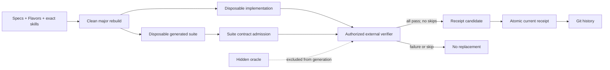

# Software-Neutral Domain Model

## Architectural style

literate-ai uses a hexagonal architecture:

```text
                         CLI / API / optional console
                                      |
                         application use cases
                                      |
      +-------------------------- domain ---------------------------+
      | Components  specs  capabilities  runs  evidence  packages  |
      | identities  lifecycle  security  settings  publications    |
      +-------------------------------------------------------------+
                                      |
       injected ports: model | validate | classify | authorize-build
                       build | workspace | events
                                      |
                              concrete adapters

       typed services: specification providers | source | intelligence | storage |
                       settings | publication
```

The domain package imports no adapter. It describes pure immutable values, transition
rules, and decisions. Application services coordinate ports. Adapters perform I/O.
Presentation layers invoke application services but never reach into adapter state.

This document describes the intended domain and its authority boundaries; it is not a
feature-completeness claim. The
[constraint classification decision](../decisions/0003-constraint-classification.md)
identifies which boundaries are invariants, which details are current policy, and which
guarantees still require end-to-end proof.

The first reference implementation is Python 3.11+ to make OVA extraction low-risk. Its
one deliberately admitted runtime capability is the exactly pinned CycloneDX library
with strict JSON validation, isolated in the dependency adapter. Later dependencies
require explicit maintenance, security, license, and boundary review. Wire schemas,
canonical identities, and lifecycle semantics remain language-neutral. `schemas/v1` is
the frozen compatibility catalog and `schemas/v2` is the current 0.2 writer catalog;
complete schema coverage of every internal value remains a delivery gate, not a present
guarantee.
Node.js is isolated contributor tooling for the OpenSpec CLI, not a framework runtime.

An agent or task ledger is a separate outer control plane. The stable integration is a
content-addressed derivation-run envelope, not shared mutable workflow state; see
[Literate AI and an agent ledger](agent-ledger-boundary.md).

## Ubiquitous language

### Component

A **Component** is a spec-driven logical, addressable unit of composition. It has
accepted behavioral specifications and exact specification-to-source skills, so its
implementation can be recreated for every target admitted by its Flavor-slot contract.
It can describe a
library, service, command, application, framework, data transform, documentation
generator, model adapter, or another workflow. Those are profiles and tags, not
different storage classes.

A Component coordinate is stable across changes:

```text
component://<namespace>/<name>
```

The coordinate does not identify content. A **Component Revision** binds the coordinate
to exact specification, authoring-input, workflow-policy, and source identities.
An OSS repository that has source but no accepted specification does not qualify as a
Component; it is a separately resolved
[`RepositorySourceDependency`](repository-source-dependencies.md).

### Component Definition

The human-maintained `component.md` declares (the domain contract remains
serialization-neutral, and legacy JSON is migration input only):

- coordinate, display metadata, and schema version;
- provided capabilities and required capabilities;
- specification provider and spec roots;
- content-pinned authoring inputs such as skills;
- workflow profile and model-routing policy;
- entrypoints and acceptance contracts;
- optional content-pinned repository source dependency declarations;
- required non-code asset selectors (component-relative, shared project URI, or
  external URI), assembled paths, roles, media types, and optional pins;
- optional sample metadata; and
- application-specific extension namespaces.

It does not contain machine-local cache paths, credentials, resolved dependencies,
mutable latest pointers, build output, or publication state.

Asset resolution belongs to compilation of authored intent into the exact Component
lock. The locked revision records a `BlobRef`; model context receives only asset
metadata, while the verified bytes stream into CAS and are overlaid after generated text.

### Component Revision

An immutable revision contains:

- the normalized Component Definition;
- a `SpecificationSet` containing exact artifact identities;
- exact `AuthoringInput` identities;
- the workflow definition and routing-policy identity;
- the source snapshot identity, once source exists; and
- parent revision/run lineage.

Revision identity is computed from canonical content only. Operational timestamps are
events and do not perturb deterministic identities.

### Capability and requirement

A **Capability** is a versioned semantic contract, not an import name. A **Requirement**
contains a capability range and explicit constraints such as platform, language,
license, trust policy, feature flags, ABI, and resource class.

Provider resolution returns a `ResolutionDecision` for every requirement, including all
candidates considered, rejection reasons, selected policy version, and tie-break data.
No invisible foundation Component or name-order fallback exists in core.

### Flavor and effective Component revision

A **Flavor** is a first-class, versioned, publishable mix-in that contributes one typed
variation axis—such as operating system, CPU architecture, accelerator, language
ecosystem, build-system policy, toolchain, packaging, or deployment—without modifying
the base Component.
A base definition may declare abstract `FlavorSlot` contracts and cardinality, but it
does not name Windows build steps, CUDA libraries, or Python/Rust implementation details.

A `TargetProfile` states desired target constraints for one operation. Resolution emits
an exact `FlavorSetLock` and an `EffectiveComponentRevision` derived from the base
revision, selected Flavor revisions, resolver policy, and target constraints. An
`EffectiveSpecificationSet` references the unchanged base specs plus separately identified
Flavor spec fragments. Base requirements and security policy cannot be removed or
weakened by a Flavor.

Flavor contributions use typed extension points for capabilities/requirements, spec
fragments, workflow bindings, authoring skills, validators, builders, toolchains,
packaging, and runtime constraints. Arbitrary document merge and silent last-writer-wins
precedence are forbidden. Conflicts produce an explainable failed resolution. Caches,
evidence, runs, packages, and publications identify the exact effective revision and
Flavor set.

### SpecificationSet

A `SpecificationSet` is the canonical behavioral input to a revision. It records:

- provider kind and provider version;
- every artifact path or URI and content digest;
- the normalized requirements/scenarios exported by the provider;
- active-change or baseline identity when the provider supports that model; and
- the complete set digest.

OpenSpec is the first provider. Core does not infer OpenSpec directory layouts.

An `IntentEvent` records a user's original request and actor context. A provider-specific
projection may update a proposal or spec. The immutable event and resulting spec diff
are both retained; raw prompts are not smuggled into canonical documents as idempotence
markers.

### Source-to-specification authoring

The inverse authoring lifecycle turns an existing exact `SourceSnapshot` and its
`EvidenceArtifact` set into a reviewable `SpecificationDraftSet`. It lives in the
separate `source_to_specification` bounded context so descriptive reverse engineering
cannot silently become authoritative behavior.

A `SourceToSpecificationRequest` selects either an exact Component revision or a
standalone exact source descriptor, output provider, scope, model-routing policy, and a
named/versioned ordered `SpecAuthoringSkillSet`. Skills declare the behavior facets and
evidence kinds they can analyze—for example architecture, public API, state/lifecycle,
configuration, errors, security, operations, and tests. Skill execution emits typed
`BehaviorObservation` objects, never unattributed prose. Standalone source also produces
a reviewable `ComponentDefinitionDraft`; a pre-existing manifest is not required.

The run produces:

- a `SpecificationDraftSet` containing provider-valid draft requirements/scenarios;
- a `SourceSpecificationCoverageMap` linking every draft statement to exact evidence and
  every in-scope behavior surface to covered, excluded, or unresolved status;
- an `UncertaintyLedger` separating observed behavior, inferred intent, suspected defect,
  compatibility quirk, conflict, and unknown;
- a proposed spec patch and validation report; and
- complete skill/model/evidence/run provenance.

Drafts do not become a Component's intent-authoritative `SpecificationSet` without an
explicit acceptance decision. Incremental runs compare source snapshots, invalidate
affected observations, and preserve reviewed statements unless new evidence creates a
visible conflict. The workflow never assumes every observed bug is desired behavior or
that unobserved code has no requirements.

For a source-derived set, acceptance does not immediately transfer release
implementation authority. The exact original source remains the `source-baseline` until
a versioned `RegenerativeQualificationPolicy` accepts independently verified clean-run
evidence. Every run must regenerate from specs and selected Flavors in an empty workspace
with the generated-source cache bypassed and the original source excluded; then build,
run the freshly generated tests, and pass independent source-baseline parity on the
required target/surface matrix. The source may enter only the independent parity side of
that boundary. See [source promotion](source-promotion.md).

### Specification-to-source skills

The root `SKILL.md` is an agent-facing project adapter: it explains how to operate the
framework but is not a domain input and never enters a generation prompt. Thin
provider-specific files point to that one onboarding authority.

The forward generation direction uses separate `specification-to-source-skill` authoring
inputs. A Component pins general planning and implementation manifests; selected
Flavors may pin target-specific manifests. The ordered resolved set is part of the
generation recipe identity and evidence supplied to model stages. Manifest hashes bind
the exact instructions. Dependencies bind skill ID, semantic version, and content
identity, while dependency and stage checks prevent an incomplete, changed, or
misordered skill set from reaching a coding adapter.

Skills are constrained implementation guidance. They cannot add behavioral authority,
change the effective Flavor set, select a model route, modify the workflow, or grant
build/execution privileges. This keeps both directions skill-directed without confusing
descriptive source-to-specification evidence with prescriptive specification-to-source
generation.

### Major-rebuild tests and the current project receipt

The current `GenerationRecipe` mode is exactly `major-rebuild`. One coding-CLI call in a
new empty external directory produces a complete replacement tree containing both the
implementation and `source/tests/manifest.json`. The suite binds its recipe identity,
contains bounded unique example/boundary/invariant cases, cites current non-acceptance
specification documents, and cannot reuse acceptance-interface arguments. Its content
identity is checked again in the generation report.

This generated suite is intentionally not a `SpecificationSet` member or verifier
oracle. It expresses current implementation checks derived from the same authority that
generated the code. A prior generated tree, generated suite, validation failure, or
hidden acceptance value is never an input to a new attempt.

`ProjectTestReceipt` is a separate public wire contract for the result side of the
boundary. Its closed, minified JSON contains only canonical semantic values:

- `schema`, project ID, and the complete authority-review input identity as
  `project_revision`;
- tested `subject` content identity;
- compact suite `id`, `version`, and `revision`, internally constrained to kind
  `test-suite`;
- one positive `tests` count, with all-passing status implicit in the wire shape;
- normalized `result` content identity; and
- a bounded object from each allowed evidence kind to one content identity.

`ProjectTestReceiptPolicy` is the project-owned admission boundary around that compact
record. It pins one suite ID and version, an exact `test-runner` content identity,
required evidence kinds, and a minimum test count. A configured receipt path without a
policy cannot accept or make any receipt current. The runner identity is an explicit
allowlist, not a substitute for authenticating an external evidence store. Consequently,
the committed file is a local, unauthenticated Git assertion of a passing run, not
cryptographic or remote attestation. A release system that needs stronger proof must
resolve and authenticate every recorded evidence identity before treating it as such.

It excludes generated source, tests, binaries, logs, host paths, timestamps, users, and
Git commit IDs, as well as redundant outcome or passed/failed/skipped fields. The
filesystem service accepts a bounded external candidate, checks its project, current
authority-revision, and configured policy binding,
canonicalizes it, and atomically replaces the configured current file.
An identical update is a no-op; invalid existing content, symlinks, project drift, and
concurrent replacement fail closed. The service never runs tests or invokes Git. One
ordinary committed `verification/current.json` is the project projection; Git provides
the historical sequence of passing states.



The contract and atomic filesystem projection are implemented, while the general
generation CLI deliberately does not select a project's test executor. The sample host
runner is the reference adapter: it executes model-produced cases as implementation
checks, then uses its separate hidden oracle for executable acceptance, and can emit the
compact candidate. Other integrations must preserve that authority separation.

### SourceSnapshot and source collection

A `SourceSnapshot` is an immutable canonical tree manifest. It binds:

- source-provider identity and configuration;
- resolved revision or local snapshot identity;
- every included file's relative path, type, mode, size, and content digest;
- aggregate-source members when a Component spans multiple repositories;
- dirty-source status and policy decision;
- LFS/submodule/archive member identities; and
- origin attestations and verification results.

Repository URL plus commit is useful provenance but is not the tree content digest.
Source collections model ROS-style repository manifests and monorepo subpaths without
pretending the manifest repository itself contains all APIs.

Remote platform qualification projects a `SourceSnapshot` through one of two transports;
the transport never becomes authority. A working-tree projection binds both its canonical
Git-visible manifest and its archive digest. Its digest-bound guard parses and validates
the complete archive member graph and payload set before creating a new destination.
A Git projection keeps a persistent object database only as a transfer cache, fetches an
advertised ref, proves the resulting exact commit, obtains and verifies the guard stored in
that commit, and lets the guard materialize verified blobs directly. Checkout filters,
worktree export, `git archive`, and system tar extraction are outside this trust boundary.

The shared portable tree contract rejects host-ambiguous or case-colliding paths,
absolute/drive/backslash or repository-escaping symlink targets, file/link parent aliases,
and archive special files. Parent-relative symlinks are valid only when their lexical
target remains within the repository. A Git submodule is not an ordinary directory or an
ambient recursive fetch: it requires a separately declared and locked recursive source
authority, so an undeclared gitlink fails qualification.

### KnowledgeIndex and EvidenceArtifact

A `KnowledgeIndex` binds an intelligence provider/version/schema to one exact
SourceSnapshot. Its readiness record contains deterministic index identity and bounded
statistics.

An `EvidenceArtifact` records:

- component revision and source/index identities;
- structured query identity and budget;
- returned paths, symbols, relations, and call paths;
- bounded verbatim content and its digest; and
- provider diagnostics.

Provider adapters return structured results. Human-formatted CLI output is never a wire
protocol. Default product policy selects no source-intelligence provider.

Two index identities exist at different trust boundaries when a project opts into
A leftover reserved `.codegraph/` tree covers the current authored tree as
agent-navigation evidence; it is not a mandatory preflight for build, run, or
rebuild. Each generated source candidate may receive a distinct source-tree-bound
sidecar. The project index cannot authorize a generated tree. Both are derived
evidence, never Component or specification authority.

### Component vocabulary

The vocabulary has two layers:

- `DescriptorVocabulary`: every discoverable Component, including unavailable entries,
  with capabilities and availability reasons; and
- `GroundedClosure`: the selected dependency closure and explicitly compared candidates,
  with exact source/index/evidence identities.

This preserves global discoverability without cloning and indexing the world for every
generation run. Evidence budgets reserve selected-closure detail before optional
catalog summaries.

### WorkflowDefinition and WorkflowRun

A `WorkflowDefinition` is a versioned DAG of typed stages. The reusable graph path
produces one source-only candidate per Component before any build authority exists. The
older host facade performs the same authority split for one selected Component:

```text
resolve -> plan -> prepare node -> generate or exactly resume source-only candidate
                                      |
                                      v
          index exact tree -> build intent -> current authorization
                                      |
                                      v
          finalize composite plan -> build -> test -> execute -> accept
                                      |
                                      v
                    atomic project admission -> receipt
```

Cache publication, packaging, and release are later explicit consumers of an accepted
result. They are not effects of source generation and are not yet stages of the Standard
service.

The reusable generation profile remains fail-stop: it never hides a second model call
behind validation, build, or test failure. The repository sample driver pilots one
narrower outer replacement policy. It permits one initial candidate and at most two
fresh replacements for exactly four terminal categories:

- a static generated-source Bzlmod rejection whose exact terminal event is the failed
  `validate` step, whose cause is a `DependencyObservationError` with the same allowlisted
  code, whose generation output binds the candidate tree, source bundle, and generated
  suite, and for which validation and every downstream lifecycle result remain absent.
  The closed allowlist is `dependencies.bzlmod-authority-unsupported`,
  `dependencies.bzlmod-dependency-duplicate`,
  `dependencies.bzlmod-generated-lock-forbidden`,
  `dependencies.bzlmod-literal-invalid`, `dependencies.bzlmod-module-ambiguous`,
  `dependencies.bzlmod-module-invalid`,
  `dependencies.bzlmod-module-location-invalid`,
  `dependencies.bzlmod-module-name-invalid`,
  `dependencies.bzlmod-source-intent-invalid`, and
  `dependencies.bzlmod-workspace-unsupported`;
- a `test-generated` behavior mismatch whose failed run binds the generation-stage
  output, source bundle, built artifact, generated suite, expected result, and observed
  result; or
- an application or full-stack backend nonzero exit occurring only while a generated
  implementation case runs. Its typed process evidence binds the case, expected result,
  `host_execution.nonzero_exit`, role, nonzero integer return code, and exact stdout and
  stderr digests; or
- a C++ generated-source `build` rejection whose generation output yields exact tree,
  source-bundle, and suite identities, whose validation, classification, and build
  authorization completed, whose terminal event matches the exact
  `builder.cpp_generated_source_rejected` `BuildError`, and which produced neither a
  build result nor a downstream lifecycle step. That code is emitted only after the
  candidate compile/link fails and a second compile-and-link canary succeeds with the
  same pinned toolchain. A failed canary remains terminal
  `builder.cpp_compile_failed`.

Every attempt uses a new empty root and the same original recipe; no prior tree,
diagnostic, generated expectation, or verifier-only fact enters the next model request.
All other failures stop immediately, and rejected trees cannot become workspace or
source-cache members. In particular, verifier failures, timeouts, process launch or
execution authorization failures, invalid output, missing process evidence, Python,
Rust, JavaScript, generic native, Bazel build/resolve/analyze, toolchain, authorization,
and all other dependency failures cannot trigger replacement. Bzlmod resolver or evidence errors,
codes outside the static allowlist, and failures after any lifecycle result has been
admitted are likewise terminal. A nonzero status is candidate
evidence only in the generated-test role; the same failure during independent acceptance
remains terminal.

A reusable repair policy remains future work. It will require an explicit, bounded
`CandidateAttempt` contract that gives every replacement tree and sanitized feedback
its own identity and reruns the complete guarded lifecycle. The sample pilot does not
claim that contract, perform general compiler/linker repair, or feed diagnostics back to
the model. Model selectors attach to stage capability requirements, not four globally
required names.

A `WorkflowRun` separates:

- `RunInputIdentity`: deterministic definition/spec/composition/workflow/policy and
  pre-source build-declaration identities;
- append-only `RunEvent` history with time, actor, attempt, decision, and diagnostics;
- immutable stage inputs and outputs; and
- a mutable rebuildable run-status projection.

Generated source and index identities cannot be predeclared as run inputs. The host
facade records them later through its typed realized build request and single
`build-request-realized` event; the Standard flow records them in its source-only output,
build intent, and current authorization.

Model calls record endpoint/model/group/provider identities, request and response
digests, decoding parameters, tool definitions, token/cost accounting, fallback reason,
and applicable privacy/policy decisions. The model portfolio is scoped to a run; one
mutable decision list is never shared between requests.

### Validation, classification, and build authorization

Validation is a plugin pipeline that can include schema, syntax, static analysis,
contract, test, integration, and application-specific validators. Generated-suite
admission first checks its exact recipe binding and closed case contract. A syntax-only
pass—or a model-produced test suite grading itself—is not acceptance for executable
software.

`SecurityClassification` is an immutable decision over exact source, dependency,
scanner, policy, and toolchain identities. `BuildAuthorization` binds a classification
to one requested builder profile and expires. Conforming guarded builder adapters reject
missing, expired, revoked, or mismatched authorization before invoking a compiler. Their
shipped default also rejects execution until composition supplies a live revocation
provider; snapshot-only verification must be chosen explicitly for isolated tests.

Before generated bytes exist, builder, toolchain, sandbox, privilege, and output policy
is a `BuildRequestDeclaration`; it cannot name a source bundle. The host facade realizes
one exact `BuildRequest` only after the generated source tree, current test manifest, and
source SBOM pass admission and binds both identities in generation provenance v4. The
Standard graph path then creates an authorization-free build intent that binds the exact
source tree and a distinct source bundle, indexes that tree, obtains a current grant for
the exact intent/request/index, and finalizes the authorization-bearing composite build
plan. A source-only candidate grants none of those later authorities.

Dynamic observation is a distinct privilege. An `ObservationExecutionAuthorization`
binds an exact source snapshot/closure, observation harness/command, runner, sandbox,
privileges, data-capture policy, outputs, and expiration. The observation sandbox adapter
cannot execute analyzed source without it. Static indexing and parsing operate under
their own bounded quarantine policy; they do not inherit build or execution authority.
YOLO observation is never inferred from a hand-constructed classification: issuance
requires explicit acknowledgement and binds the profile and persistent warning.
Host and dynamic-observation execution boundaries default to denial unless composition
provides a live revocation verifier. At the pre-launch boundary, the runner checks
current external revocation state and then revalidates its local input identities. This
closes grant-issuance drift but, like every userspace check followed by process creation,
does not make authorization and launch atomic.

The portable sample ladder uses explicit host-build and
`AuthorizedHostArtifactRunner` profiles. Build and execution each bind their exact
inputs, tools, outputs, and ambient host privileges and validate a distinct live grant.
The host builders check source-tree and selected front-executable identities before and
after compilation and reject non-exact cached artifact trees.
The host execution descriptor records the artifact tree, entrypoint, and support-tree
identities. The runner verifies them before launch and again after process exit, before
accepting output; argument variants can derive from one descriptor without recapturing
those identities. These temporal filesystem checks detect drift but are not an atomic
snapshot, so a production isolation backend still needs immutable mounted inputs or an
equivalent platform guarantee.
They deliberately do not implement or claim an OS sandbox; starting either requires
explicit host-execution acknowledgement and records a `yolo` decision.

The policy profiles include constrained, reviewed, privileged-review, blocked, and
`yolo`. `yolo`:

- is never selected through fallback;
- requires an exact signed Component Revision;
- enumerates each requested privilege and never expands the grant implicitly;
- records actor, reason, scope, and expiration;
- is persistently visible in run, package, publication, CLI, API, and UI views; and
- does not weaken signature, identity, or provenance checks.

### SourceBundle, BuildBundle, and ArtifactBundle

All packages are immutable CAS objects:

- `SourceBundle` packages the accepted source tree, specs, authoring inputs, and forward
  composition lock. Its identity is distinct from the source-tree identity over the
  generated files; the tree is what source intelligence indexes, while the bundle is what
  the realized build request and package lineage bind;
- `BuildBundle` records the authorized builder request, toolchain, logs, and raw outputs;
- `ArtifactBundle` exposes typed consumable artifacts and exact dependency bundle IDs.

`BuildInputConsumption` is the narrow transitional seam between an outer build-system
operation and a coverage-enforcing native builder. It names one consumer, one exact
source-bundle digest, and a sorted unique set of generated paths that the completed
operation proved it selected as inputs. It is evidence, not authority: it cannot change the build
request, authorize another tree, or excuse an unconsumed generated file. The Standard
lifecycle now uses the composite authorized action graph. The consumption record remains
a transitional seam for compatibility decorators and the sample-specific host path.

Every generated source bundle also contains a canonical CycloneDX 1.7 source SBOM at
`.literate/source-sbom.cdx.json`. A separate resolved BOM binds the exact resolved
package, toolchain, runtime, and binary closure. `CycloneDxManagedGraph` deterministically
projects the root Component, every composed Component revision, every repository-source
dependency, and their exact scoped edges into both standard documents. All inventory
nodes—including leaves—have an explicit dependency entry, every node is root-reachable,
and the root dependency composition is `complete`.

`CycloneDxBomBinding` keeps the raw BOM identity, normalized complete-graph identity,
managed-graph identity, lifecycle, root reference, and bounded counts together. This
binding can enter generation, cache, workspace, and receipt evidence without replacing
the standard document. A source-cache hit carries both BOMs but remains
current-acceptance-untrusted; historical evidence never issues a current build grant.

Package manifests never contain mutable reverse dependents or a `latest` field. Reverse
edges live in `DependencyIndex`; aliases and promotion channels live in `ReferenceIndex`.
Both are rebuildable projections over immutable records.

### Publication

A `PublicationRequest` names the exact Component and effective revision, source bundle,
blob closure, provenance records, security classification/profile, publisher/target,
policy, and actor. A short-lived `PublicationAuthorization` binds the canonical request
digest to an explicit policy decision. The immutable publication manifest embeds both;
the publisher revalidates target, policy, profile, expiry, and revocation before writing
the manifest, events, or remote blobs.

An `ImportRequest` is a distinct local decision over that manifest. It additionally
binds the source target and the exact local CAS/event destination. `ImportPolicy` checks
the currently trusted publication-policy and classification digests, permitted profile,
and both publication and local authorization revocation sets. A short-lived
`ImportAuthorization` is required before the importer writes local blobs or events.

A `PublicationRecord` is append-only and carries the same source, provenance, policy,
and authorization identities alongside progress, final remote identity, attestation,
and failure diagnostics. Local usability never depends on publication.

The installed external-driver rebuild protocol can validate and execute configured cache
publication before exposing a finalized receipt candidate. The current
`StandardProjectLifecycleService` includes per-Component accepted-source membership and
publication, atomic project admission, and receipt issuance. A Standard-bound
`litai rebuild` uses its public filesystem composition; package/release integration,
automatic project-root lock discovery, and migration of the remaining sample and
qualification paths remain deferred. Locked `litai plan` delegates its Component
execution projection through the Standard application service. Locked `litai generate`
additionally prepares and runs the source-only nodes, retaining each tree under an
independently identified workspace and returning typed project custody; it deliberately
executes none of the
later indexing, build, test, acceptance, admission, or publication phases.

Publication targets may eventually include filesystem, OCI/registry, object store, and
other transports. Promotion, retention, revocation, and replication are policies above
the transport.

### Settings

Settings are typed sections with explicit scopes and provenance:

1. framework defaults;
2. repository policy;
3. workspace profile;
4. user profile;
5. machine profile;
6. one-run override.

Each effective value reports its source. Secret values are never stored in ordinary
settings; only secret references are allowed. Settings schemas include migrations and
extension namespaces. CLI, API, and optional UI render the same registry.

## Canonical manifest sketch

This is illustrative; Phase 1 schema work owns the final syntax.

```yaml
schema: literate-ai/component@1
component:
  id: component://example/hello-service
  version: 0.1.0
  title: Hello service
  profiles: [service, sample]

specifications:
  provider: openspec
  root: openspec
  capabilities: [hello-service]
  active_change: null

authoring_inputs:
  - kind: skill
    id: skill://example/python-service@1
    source: skills/python-service/SKILL.md
    digest: sha256:...

provides:
  - capability: service.http.hello
    version: 1.0.0

requires:
  - id: runtime
    capability: runtime.python
    version: ">=3.11,<4"
    constraints:
      platforms: [linux, macos]

variation:
  accepts:
    - axis: implementation
      cardinality: exactly-one
      contract: capability://literate-ai/implementation-flavor@1
    - axis: accelerator
      cardinality: zero-or-one
      contract: capability://literate-ai/accelerator-flavor@1

workflow:
  profile: workflow://literate-ai/source-grounded-code@1
  routing_policy: routing://example/standard@3

acceptance:
  contracts:
    - acceptance/http-contract.yaml

entrypoints:
  run: src/hello_service/main.py

extensions:
  example.com/deployment:
    replicas: 2
```

## Lifecycle state machine

```text
defined
  -> specified
  -> resolved
  -> source-ready
  -> origin-verified
  -> indexed
  -> planned
  -> generated
  -> source-sbom-verified
  -> validated
  -> classified
  -> build-authorized
  -> built
  -> resolved-sbom-verified
  -> packaged             # optional later integration
  -> published            # separate explicit operation
```

Every transition produces an immutable object and event. Failure creates a diagnostic
event and preserves the last accepted state. A transition can be retried only when its
idempotency key and input identities match. Drift invalidates downstream projections
through the provenance graph; it never mutates accepted historical objects.

The replaceable project receipt is not another state in this immutable package machine.
It is a Git-tracked projection over a separately completed exact test run. A failure or
skip produces diagnostics outside that projection and leaves the last passing file
unchanged.

## Implemented application ports

The shared port package contains only boundaries that an application service actually
receives through dependency injection. The current generation orchestrator depends on:

| Port | Responsibility |
|---|---|
| `ReadinessProvider` | Prove the exact Component closure has source and evidence ready |
| `ModelProvider` | Execute a typed stage call after routing has selected an exact endpoint |
| `Validator` | Validate the exact generated artifact and return a checked decision |
| `Classifier` | Bind a security classification to the exact revision and source bundle |
| `BuildAuthorizer` | Bind an authorization to the exact classification and build request |
| `Builder` | Return an artifact bound to the exact source bundle and authorization |
| `DependencyResolver` | Validate the SOURCE BOM against the request's exact managed Component graph before build, then bind the resolved BOM to that same evidence after build |
| `WorkspaceCommitter` | Prepare and atomically accept the exact generated tree |
| `EventStore` | Append and replay run/lifecycle events |

The Standard per-Component service adds typed use-case-local seams for a source-only
generation runner, build-intent factory, source-tree indexer, current authorizer,
build-plan finalizer, Component builder/tester/executor/acceptor, atomic project admitter,
and receipt issuer. The finalizer is the only step that may combine the exact intent and
current grant into the composite build plan.

These are executable contracts: local adapters are checked against their runtime
protocols, and every lifecycle result is validated before it is recorded as a completed
step. The JSON shapes at these seams are typed because they are persisted in run events;
authority identities are checked again when results return from an adapter.

OpenSpec loading, source capture, source intelligence, settings, artifact storage, and
publication already expose typed value-oriented service APIs. They are not forced
through generic mapping protocols that do not match their real signatures. A shared
port is added only when an application use case consumes it as a replaceable boundary
and at least one adapter conformance test exists. Source-to-specification keeps its
typed callback protocols beside that use case until another application use case needs
the same contract. See
[ADR 0004](../decisions/0004-executable-port-boundaries.md) for the early correction.

## Proposed repository layout

```text
literate-ai/
  README.md
  docs/
    architecture/
    decisions/
    migration/
    security/
  openspec/
    config.yaml
    changes/
    specs/
  schemas/
    component/
    lifecycle/
    settings/
  src/literate_ai/
    domain/
      identity.py
      components.py
      specifications.py
      capabilities.py
      flavors.py
      source.py
      intelligence.py
      workflows.py
      models.py
      security.py
      packages.py
      publication.py
      settings.py
      events.py
    application/
      define.py
      resolve.py
      materialize.py
      generate.py
      validate.py
      classify.py
      build.py
      package.py
      publish.py
      refresh.py
      reconcile.py
    source_to_specification/
      contracts.py
      workflow.py
      skill_runtime.py
      observations.py
      coverage.py
      synthesis.py
      review.py
      qualification.py
    ports/
    adapters/
      specs/openspec.py
      source/git.py
      source/local.py
      intelligence/generated.py
      models/openai_compatible.py
      storage/filesystem.py
      builders/python.py
      publishers/filesystem.py
    cli/
    api/
  samples/
    hello-component/
    generated-library/
    service-stack/
    multi-repository-component/
    model-routing/
    publication/
    security-policies/
    self-hosting/
    source-to-specification/
  skills/
    source-to-specification/
      architecture/
      api-surface/
      behavior/
      tests/
      security/
      operations/
      language-python/
      language-cpp/
      language-rust/
      language-javascript/
  compatibility/ova/
  tests/
    contract/
    conformance/
    integration/
    migration/
  tools/
    openspec/
      package.json
      package-lock.json
```

The initial monorepo publishes one Python distribution with adapter extras. Package
boundaries must follow the layout so core and adapters can split into separately
versioned distributions later without changing wire contracts. Optional TypeScript UI
code, if introduced, remains a presentation adapter; native/Rust security helpers remain
behind ports. Neither becomes a dependency of domain contracts.

## Identity and schema rules

- Use a documented JSON Canonicalization Scheme for wire-object hashing; do not rely on
  a language runtime's incidental serialization.
- Hash immutable semantic content only. Store timestamps and host paths in events or
  projections.
- Every schema has a stable URI and explicit version.
- Unknown fields are rejected in core objects; extension data is allowed only beneath
  namespaced extension keys.
- Schema migrations are pure, versioned, fixture-tested transformations.
- Package and evidence identities are never derived from mutable aliases.
- Errors have stable machine codes, bounded safe messages, causal references, and
  actionable remediation.

## Living sample contract

Every sample is a complete Component and must declare:

- a canonical manifest and standalone-valid specifications;
- content-pinned authoring inputs;
- an explicit workflow and routing policy;
- expected lifecycle states and failure cases;
- an executable or otherwise verifiable entrypoint;
- empty-cache behavior; and
- assertions over locks, evidence, provenance, and packages.

Every live generation also produces the current recipe-bound implementation-test
manifest. The sample verifier's pinned oracle and post-build entropy case remain outside
that generation closure; they are the independent acceptance boundary, not inputs for
the generated suite.

The neutral ladder covers a hello Component, a reusable generated library, an
application/service, a multi-Component stack, a multi-repository aggregate, model
routing/fallback, publication, constrained and yolo security behavior, and framework
compatibility/readiness.

The primary `self-hosting` directory retains its historical coordinate but no longer
claims self-generation. Its Component is a normal coding-CLI-generated, self-contained
compatibility/readiness application whose compiled Python and C++ artifacts evaluate
the specified framework version and packaged skill set.

A separate verifier-only conformance manifest pins an exact snapshot-replication skill
set. Its deterministic replay adapter copies the complete current semantic
`src/literate_ai` file set through the public `GenerationOrchestrator`, syntax
validation, classification, build authorization, checked-hash compilation, atomic
workspace acceptance, and durable events. Its explicit `non-executing-exact-tree`
lifecycle profile is bound to a concrete generated suite artifact before promotion;
candidate conformance uses `python -S -P`
with the original checkout absent, then the first candidate repeats the replay. Missing
files, changed proof pins, import fallback, or unstable semantic identities fail. This
fixture invokes no coding CLI and is evidence about lifecycle and isolation—not evidence
that a model can generate, redesign, or safely execute the framework.
