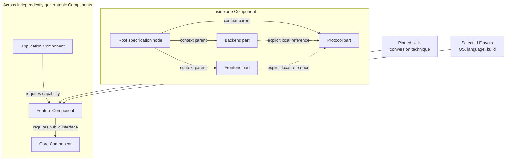

# Mission specifications, hierarchy, and readable authoring

The Virtual Factory Initiative (VFI) structure proposal is a useful stress test for
Literate AI: a large application needs narrow human-readable documents, reusable
cross-cutting guidance, independently generatable Components, explicit interfaces, and
enough structure for an agent to assemble the right context without flattening the
whole product into one prompt.

Literate AI supports that goal through three different relations. They must not be
collapsed into one directory tree.



- A **specification-node hierarchy** supplies local reading context inside one
  Component. It does not create a build, cache, or publication unit.
- An **explicit node reference** imports another local behavioral or interface
  statement. It does not select an OS, language, toolchain, package, or implementation
  method.
- A **Component capability edge** connects independently generated, built, tested,
  cached, versioned, and published units. Only the dependency's public interface crosses
  the coding-agent context boundary.

## Human-readable `literate-markdown@1`

The `literate-markdown` specification provider accepts UTF-8 Markdown with a small,
strict YAML-frontmatter subset. The body is genuinely free-form Markdown: prose,
tables, diagrams, and code are valid without Requirement/Scenario boilerplate. A node
needs only three fields:

```markdown
---
name: Scene loading
summary: Load and validate one factory scene
kind: component
references:
  - vfi.core.scene-contract
---

# Scene loading

### Requirement: Reject an invalid scene

...
```

The complete authoring vocabulary is intentionally small:

| Field | Required | Meaning |
| --- | --- | --- |
| `name` | yes | short human title |
| `summary` | yes | one-line purpose for navigation and model context |
| `kind` | yes | vertical-owned portable label such as `app`, `component`, `part`, `contract`, `flow`, or `kpi` |
| `references` | no | ordered local specification-node IDs whose statements constrain this node |
| `status` | no | `draft`, `review`, `approved`, or `deprecated` authoring signal |
| `id` | no | assertion of the path-derived dotted ID; rejected if it differs |
| `parent` | no | assertion of the folder-derived parent; rejected if it differs |

The first declared artifact is the corpus `spec.md`. A `spec.md` describes its folder;
another Markdown file is its child, and a subfolder's `spec.md` begins another subtree.
IDs and parents are derived. Authors may state them when that improves a review, but
they never maintain two independent truths. Unknown keys, duplicate keys, missing
containing `spec.md` nodes, unresolved references, and reference cycles fail before a
coding-agent call. JSON supporting artifacts such as `app.json` may be declared beside
the Markdown nodes but do not become hierarchy nodes.

There is deliberately no hand-bumped `revision` or required `date`. Component SemVer,
content identities, exact locks, and Git already record those facts more accurately.
There is also no language, OS, build-system, model, package-manager, or test-runner field:
those choices belong to Flavors, routing, dependency declarations, and skills.

The provider emits a canonical `effective-specification-context` document. For each
node it lists the root-to-parent ancestor chain, transitive explicit references with
their own ancestors, and finally the node itself. Original documents occur once in the
generation recipe; the context graph points at them rather than copying prose into every
effective bundle. It also derives one typed context requirement per node so the kernel
has a stable machine handle even when the human document is free-form. Authors may still
use `### Requirement` and `#### Scenario` blocks when a behavior benefits from exact
machine-addressable scenarios; those are additional to the derived handle.


## Where the VFI tiers belong

| VFI proposal concept | Literate AI representation | Reason |
| --- | --- | --- |
| VFI app | root application Component plus its local app specification | owns product objective and composition requirements |
| language, OS, runtime, frontend strategy, build system | Flavor slots and selected Flavors | target choices must be replaceable and conflict-aware |
| third-party source | repository-source dependency or an external package dependency recorded in the SBOM | not every dependency is a spec-driven Component |
| VFI core | independently generatable Component exposing a versioned capability contract | bounds source, tests, cache, build, and agent context |
| component contract | public capability-interface contract; reusable implementation guidance is a skill | behavior and conversion technique have different authority |
| each VFI feature | one Component, recursively composable through capability requirements | prevents application-wide context flattening |
| backend/frontend/protocol/test/KPI | local specification nodes when each subject is substantial; sections when it is not | file boundaries should improve navigation, not satisfy a ritual |
| cross-component flow | app integration spec or a dedicated integration/flow Component with explicit public interfaces | interactions need an owner and executable acceptance boundary |

A 50-feature VFI application should therefore not be one giant Component merely because
all documents live under one conceptual product. The application Component composes
feature Components. Each feature may use the familiar `spec.md`, `backend.md`,
`frontend.md`, `protocol.md`, `test.md`, and optional `kpi.md` shape locally, but only
when those files contain feature-specific intent.

## Common language belongs in skills

The Component specification states observable product intent: objective, scope,
interfaces, invariants, errors, examples, and measurable acceptance. A generation skill
states reusable conversion practice: how to reconcile inherited context, preserve public
interfaces, generate current tests, avoid private transitive coupling, and surface
contradictions. A Flavor states target-specific requirements. A workflow states stage
order.

Accordingly, a feature spec should not repeat statements such as “keep generated source
outside the repository,” “generate tests for every current requirement,” “use only
direct public dependency contracts,” or “prefer Bazel unless overridden.” The canonical
planning and implementation skills own those instructions once. Moving that language
out of a spec is not weakening the product contract; it prevents conversion mechanics
from masquerading as product behavior.

An agent may write implementation glue or planning rationale needed to make selected
Components work together. That language remains generated reasoning, not silent new
specification authority. If the glue creates observable behavior, a public interface,
or a new constraint, the agent must propose a spec change for review.

## Refinement and contradiction

The VFI proposal's “narrow but never contradict” rule is sound as an authoring policy,
but arbitrary natural-language contradiction is not a JSON-Schema decision. Literate AI
therefore separates two gates:

1. deterministic validation rejects structural ambiguity, cycles, missing nodes,
   identity mismatches, and invalid frontmatter; and
2. the exact planning skill instructs the coding agent to treat a child as a refinement,
   expose unresolved semantic conflicts, and never use “nearest wins” to erase a
   conflicting normative statement.

Human approval remains the authority transition for a semantic resolution. The prompt
journal records what the model concluded. This is more honest than describing an LLM
judgment as mechanically proven validation.

## Authoring boundary

`component.md` is now the one-file authored default and `literate-markdown` reads its
body as the root behavior node. The
[Component authoring and lock separation roadmap](../roadmap/component-authoring-and-locks.md)
tracks the remaining lifecycle compatibility exit: exact selections belong in generated
`component.lock.json`, while legacy welded JSON is read only by the explicit migration
bridge. Larger mission designs add child documents only for real named boundaries and
split independently generated capabilities into Components with public contracts.
