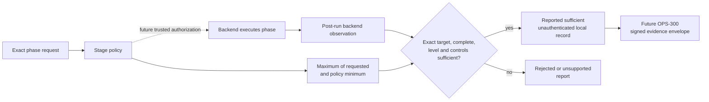

# Production containment threat model

This document defines the security boundary Literate AI must enforce before it can call
generated or acquired source “contained.” It is an architecture contract, not a claim
that production containment backends already exist.

Today, the normal live sample path runs with explicit `YOLO` authorization as the current
host user. The source-to-specification observation path has a narrower macOS
`sandbox-exec` and Linux Bubblewrap adapter. Neither fact satisfies this production
contract for generation, builds, tests, or application execution.

## The short version

Every executable phase asks for a minimum isolation level and concrete controls. After
execution, a backend may report the exact level and controls it says it enforced for the
exact source, platform, and execution. Missing, incomplete, wrong-platform, weaker, or
unknown facts cannot produce even a locally sufficient report. This local evaluation is
not permission to start a process: a future trusted launcher authorization must precede
execution and authenticated `OPS-300` evidence must qualify the resulting report.



The local decision explicitly says `unauthenticated-local`. It is useful for diagnostics
and deterministic policy evaluation only. It is neither execution authorization nor
release evidence. A trusted runner and the `OPS-300` evidence system must independently
authorize the run, authenticate the producer, and retain the decision plus observation.

## Ordered isolation levels

| Level | Guarantee | Legitimate use | What it does **not** claim |
| --- | --- | --- | --- |
| `host-yolo` | No containment boundary. Execution has the invoking user's ambient authority. | Explicitly acknowledged local development only, when policy also permits it. | Filesystem, credential, device, network, process, or same-user isolation. |
| `process-limited` | The launcher enforces declared process-tree, time, output, and resource limits. | Low-risk local diagnostics where policy permits host access. | A security boundary against filesystem access, credential theft, devices, network, or same-user races. |
| `os-sandboxed` | An operating-system mechanism enforces the declared read/write, environment, credential, device, network, process, and resource controls. | Planned Linux production reference and any later independently qualified native backend. | Protection from a compromised kernel or host administrator. A process wrapper alone does not qualify. |
| `vm-isolated` | The phase executes inside a separately provisioned VM boundary with declared inputs, outputs, egress, credentials, devices, and budgets. | Enterprise macOS and Windows claims until hardened native backends earn equivalent evidence; high-risk repository builds. | Protection from a compromised hypervisor/control plane or an incorrectly provisioned image. |

The ordering is:

```text
host-yolo < process-limited < os-sandboxed < vm-isolated
```

Names are guarantees, not implementation labels. Calling a subprocess “sandboxed,” or
running a native build inside a Bazel action, does not by itself establish
`os-sandboxed`. A backend earns a level only by producing complete, independently
checkable enforcement facts for the requested controls.

## Threats in scope

Generated source, downloaded repository source, dependency resolvers, build scripts,
compiler plugins, tests, and the resulting application are treated as potentially
hostile. The boundary addresses:

- model-generated code that reads unrelated files, credentials, devices, or environment;
- prompt injection embedded in repository prose or source comments;
- dependency and build scripts that use undeclared network, mutate inputs, or leave
  child processes behind;
- compromised or surprising compiler, package-manager, code-generation, and runtime
  behavior;
- denial of service through CPU, memory, disk, process, output, or wall-time exhaustion;
- source/output aliasing, symlink escape, and time-of-check/time-of-use races;
- a backend or worker reporting the wrong source, platform, architecture, policy, or
  execution; and
- replay, substitution, deletion, or partial retention of enforcement evidence.

Kernel, hypervisor, firmware, host-administrator, and provider-control-plane compromise
are outside an individual backend's boundary. They remain supply-chain and operational
trust concerns. `host-yolo` and `process-limited` explicitly retain the same-user host as
part of the trusted computing base.

## Phase separation

One broad grant must never leak across the lifecycle. Policies independently cover these
stages:

| Stage | Expected authority shape |
| --- | --- |
| `source-acquisition` | Network only to exact approved repository endpoints; no developer credentials beyond the narrowly supplied fetch identity; immutable destination. |
| `source-generation` | Read-only specifications, Flavors, skills, and public Component interfaces; write-only fresh output; provider egress only; no verifier oracle. |
| `source-observation` | Read-only inert source mirror and fixed harness; disposable scratch output; no ambient project or credentials. |
| `dependency-resolution` | Approved registries during the lock phase; exact immutable package outputs; subsequent build network denied. |
| `build` | Read-only admitted source and dependency blobs; separate outputs; no credentials/devices/network; resource and process-tree limits. |
| `generated-test` | Exact built artifacts and current generated suite; isolated result output; no release-secret or verifier access. |
| `application-execution` | Exact root artifact, explicit arguments, minimum runtime inputs, isolated output, independent timeout and process-tree control. |

## Required control vocabulary

The initial contract records controls separately from the isolation level:

- `read-only-inputs`
- `separate-outputs`
- `minimal-environment`
- `no-credentials`
- `no-devices`
- `network-denied`
- `network-egress-restricted`
- `resource-limits`
- `wall-time-limit`
- `output-limit`
- `process-tree-termination`

This prevents a coarse backend name from silently standing in for the specific
guarantees a phase needs. A policy may require additional controls beyond its minimum
level. The evaluator takes the union of request and policy controls and reports the exact
missing set.

`process-limited` intrinsically requires resource, wall-time, output, and process-tree
limits. `os-sandboxed` and `vm-isolated` additionally require read-only inputs, separate
outputs, a minimal environment, and credential and device removal. Network disposition
remains phase-specific: policy must require either denial or a concrete restricted-egress
control. A complete observation cannot claim a level while omitting its intrinsic
controls.

`network-egress-restricted` does not mean “the process promised to behave.” A backend
must identify the enforced destination policy. The present contract records only the
control outcome; endpoint-set and network-observation records belong in the future
backend-specific evidence attached through `OPS-300`.

## Contract boundary

The provider-neutral surface lives in the small
`src/literate_ai/security/isolation/` package. `contracts.py` owns immutable values,
`evaluation.py` owns the one policy decision, and `__init__.py` exposes only the concise
public vocabulary:

- `IsolationPolicy` owns canonical stage rules. An omitted stage is unsupported.
- `IsolationRequest` binds the stage, source or artifact identity, target OS and
  architecture, requested minimum, extra controls, and a reported `host-yolo`
  acknowledgement. That boolean is not trusted consent and cannot authorize execution.
- `IsolationObservation` binds caller-supplied backend/version/execution identities,
  the exact request and policy identities, exact target, achieved level, enforced
  controls, and completeness. It is deliberately not called an attestation and cannot
  be reused for another subject or policy.
- `IsolationDecision` binds request, policy, and observation identities and returns only
  `reported-sufficient`, `rejected`, or `unsupported`, with a closed stable-reason and
  field-consistency contract.
- `evaluate_isolation_policy` is deterministic and fail-closed. It never discovers a
  backend, executes a process, or upgrades an observation.

A consumer may call `IsolationDecision.require_exact_recomputation` with the exact
request, policy, and observation to reject a substituted input closure. Success proves
only deterministic reproduction of an unauthenticated report; it grants no authority.

The four `@1` records are registered in the current v2 schema catalog in
`schemas/v2/isolation.schema.json` and exposed through `literate_ai.security`.
The direct `literate_ai.security.isolation` imports remain available. Their wire
meaning stays non-authorizing and unauthenticated: authenticated runner evidence
must use a distinct enclosing contract rather than changing these records' meaning.
JSON Schema validates closed shapes, identities, enums, intrinsic controls and
decision consistency. Typed decoding additionally requires canonical control order
and unique stage rules; consumers must recompute decisions over the exact inputs.

## Fail-closed cases

The report cannot be `reported-sufficient` when:

- no policy rule exists for the stage;
- no backend observation exists;
- the observation targets another OS or architecture;
- the observation binds another request or policy;
- enforcement did not complete;
- the achieved isolation level is weaker than either the request or policy minimum;
- any required control is absent;
- `host-yolo` lacks either policy permission or a recorded request acknowledgement; or
- a record contains an unknown field, schema version, enum value, duplicate, or
  noncanonical ordering.

An `unsupported` result means the selected environment did not report the required
contract. It is a failure, not a skip. A `rejected` result means supplied facts or local
policy are inconsistent with the request. Neither status, nor `reported-sufficient`, is
an execution authorization.

Because `host-yolo` has no containment boundary, an observation at that level is also
forbidden from claiming any containment control. A policy which combines `host-yolo`
with required controls is therefore deliberately unsatisfiable.
Even when both local booleans permit and acknowledge `host-yolo`, the outcome is
`containment.host-yolo-reported-only`; a separate trusted, scoped, expiring, non-replayable
operator authorization is required before any future launcher may run it.

## Backend delivery sequence

`literate_ai.security.evidence` now provides bounded parsing of the external
[DSSE envelope](https://github.com/secure-systems-lab/dsse/blob/master/envelope.md)
and a local Ed25519 signature primitive backed by PyCA. Verification requires
explicit trusted public keys and the expected payload type; it returns the exact
verified bytes and identities of distinct verified keys. Envelope key IDs and
extension fields do not establish trust. This is a transport primitive: no runner
emits qualified enforcement evidence through it yet, and signature validity alone
cannot satisfy subject, context, revocation, freshness or retention policy.

The public evidence package also defines four closed v2 predicates in
`schemas/v2/evidence.schema.json`. Each is carried by a standard
[in-toto v1 statement](https://github.com/in-toto/attestation/blob/main/spec/v1/statement.md)
with DSSE payload type `application/vnd.in-toto+json`. One SHA-256 subject in the
statement must match the predicate's immutable subject. The predicate additionally
binds byte size and canonical media type, which the outer subject digest alone does
not express.

| Predicate | Bound assertions |
| --- | --- |
| `evidence-derivation-run` | Output subject, exact run context, named input blobs, journal blob and terminal status. |
| `evidence-platform-run` | Receipt subject, exact run context, derivation envelope, environment blob, named check evidence and terminal status. |
| `evidence-matrix` | Matrix-plan subject, exact run context, sorted required cell names and exactly one platform-envelope reference per cell. |
| `evidence-locator` | Immutable subject, configured store identifier and claimed retention deadline. |

Run context contains the invocation identifier, repository identifier, full Git
revision, workflow and target content identities, and ordered UTC Unix-second start
and finish times. Artifact collections are immutable, bounded, sorted and unique by
name. Failed and incomplete runs remain representable; neither can become a passing
receipt by signing them. Locators cannot supply URLs or filesystem paths: the
resolver maps the store identifier through explicit configuration and addresses the
object by digest.

`verify_evidence_statement` authenticates signatures before parsing the exact signed
bytes once. Its in-memory result retains those same bytes, including ignored standard
statement extensions. Our four predicate specifications explicitly reject unknown
fields. The result is a signed assertion, not a grant or qualified receipt. Admission
must independently supply and compare the required subject/media, repository, revision,
workflow, target, invocation, time window and matrix cells, then resolve and verify the
entire referenced closure. A producer's own required-cell list or claimed retention
deadline cannot establish policy. The graph services below check closure; persistent
admission integration remains open.

`EvidenceStore` and `EvidenceResolver` are executable ports. The configured resolver
copies its store-ID routing map, rejects ambiguous references/locators and missing
coverage before reads, and verifies each returned byte string against its expected
size and SHA-256 digest. Limits apply to each operation's object count, per-object
bytes and total unique bytes. An absent mirror may fall back to another configured
store; corrupt or otherwise failed mirrors abort resolution. Retention deadlines are
carried with the result but do not prove that storage will remain available.

Three adapters implement the store boundary:

- `FileSystemEvidenceStore` reuses the existing immutable CAS format and no-follow
  reads. Read-only construction requires an existing canonical root and creates no
  directories or locks. Writes require explicit writable configuration and verify the
  stored bytes again; an existing corrupt object is never silently overwritten.
- `MonorepoEvidenceStore` uses that same format below a configured relative prefix in
  a checked-out repository. It rejects traversal, reserved path segments and links.
  Git staging, commits and publication belong to the caller; store reads never invoke
  Git and do not establish repository/revision trust.
- `HttpsEvidenceStore` uses a fixed HTTPS origin and optional explicitly configured
  bearer token, with certificate and hostname verification. Object paths are
  `BASE/blobs/sha256/PREFIX/DIGEST`. GET requires exact `Content-Length` and
  `Content-Type`, rejects redirects and content/transfer encodings, and bounds each
  read. PUT sends `If-None-Match: *`, accepts creation or an already-existing object,
  and always reads the object back to verify it. It uses no ambient proxy or
  authentication configuration and closes responses on failure. The configured
  timeout bounds individual network I/O, not total operation wall time.

`resolve_statement_evidence` consumes the resolver port and retrieves all direct blob
references from any supported predicate. It does not recursively verify nested DSSE
envelopes or admit run context. The authenticated run-graph service below owns
those checks. `EvidenceResolutionSession` supplies one cumulative unique-object and
byte budget across successive resolver calls, checking new allocations before I/O.
Shared graph edges reuse exact verified bytes; a later edge cannot change an object's
size, media, store or retention claim. The session verifies exact backend coverage and
returned bytes before adding a batch to its retained objects. Calls serialize, and any
failure (including interruption) permanently prevents further session reads. One
session must cover the entire graph; creating a session per node would reset its bound.
Cached reads do not establish current store availability or refresh authorization.
The authenticated graph verifier adds signature-work bounds, graph-role and run
expectation checks, and post-resolution time/revocation refresh. Retention admission
remains a separate obligation.

The pinned-key assertion policy now has four closed public records in
`schemas/v2/evidence-trust.schema.json`: `EvidenceSignerRule`, `EvidenceTrustPolicy`,
`EvidenceRevocations` and `RunEvidenceExpectation`. These are trusted verifier inputs;
reading them from a producer's envelope cannot establish trust. Issuer labels bind to
explicit Ed25519 public keys in configuration. This profile does not validate OIDC
tokens, CI certificates or transparency proofs; the separate CI adapter remains open.

Each key must match configured repository, workflow, target and predicate scopes,
and locator signing additionally requires explicit store scope. Key validity intervals
are half-open; keys must be valid both when checked and for the asserted run interval.
Issuer aliases cannot duplicate a key or increase the distinct-signature count.
Revocation snapshots must be currently valid and within the policy's maximum age;
revoked keys, issuers and invocations are excluded before authentication. The caller
must supply current trusted revocation state and time, including a fresh check after
long-running closure resolution.

`check_run_evidence` compares the authenticated predicate with independently supplied
subject size/media/digest, repository, exact Git revision, workflow, target and
invocation. It enforces the expected run window, maximum age, maximum duration,
configured clock skew and required matrix cells. A producer cannot reduce its own
matrix requirements to avoid a missing platform, and failed or incomplete runs cannot
pass this check. Repeated read-only verification is idempotent; an old invocation does
not satisfy a new invocation's expectation.

`check_retention_evidence` authenticates a matching object/store assertion from keys
authorized for that scope and requires the declared retention interval to meet policy.
It does not prove current byte availability or future storage behavior. Both functions
return an in-memory `CheckedEvidenceAssertion`, retaining exact authenticated bytes,
qualified signer identities and the policy/revocation/expectation identities used.
This result is not a serializable receipt or execution grant. The graph services below
add complete closure and current revocation checks. CI identity and receipt promotion
remain open.

`verify_run_evidence_graph` now authenticates the complete run/artifact portion of a
verifier-owned plan. Each `EvidenceRunRequirement` binds an exact envelope, independent
run expectation, named child edges and named leaf artifacts. Matrix edges must lead to
platform runs, platform edges to derivations, and derivations to input/journal bytes.
Plans with missing, duplicate, unreachable or wrong-role runs fail before I/O. Every
signed edge and artifact role must equal that independent plan, so a producer cannot
substitute a cell, rename a check, omit an input or reduce coverage even when re-signing
the changed assertion with an otherwise trusted key.

One resolution session retains every required envelope and artifact. Shared derivations
are authenticated once per pass and fetched once; exact byte/reference identities remain
available in the result. One conservative signature-work budget charges every configured
key/signature pair in both passes. After all reads, the service calls its trusted state
provider again, rejects clock or revocation-snapshot rollback, and rechecks every retained
envelope for current run age, key validity, revocation and independent expectation.
The provider must obtain current trusted state; an envelope cannot supply that state.

`CheckedRunEvidenceGraph` is an in-memory result whose identity binds the plan, root,
policy, both state snapshots, qualified signers and exact resolved objects/locators. It
has no deserialization or receipt-grant path. Its locators provide routing metadata.
The retained variant below adds authorized retention claims and observed retrieval
from those stores. CI identity validation and final receipt admission remain required
before claiming production execution; a graph check does not authorize a process.

`verify_retained_evidence_graph` adds authenticated storage custody to that same graph
operation. Its `SignedEvidenceRetention` inputs contain exact detached DSSE bytes and
locator hints. Hints must equal the authenticated locator predicates, including the
retention deadline. Every required graph object needs a claim; extra and duplicate
object/store claims fail closed. Only authenticated claims supply resolver routing.
Each claim must be authorized for every run that references its object, including
shared child envelopes; a matrix-scoped store key cannot silently cover another target.
Missing authenticated mirrors may fall back, and the graph records the store that
actually supplied each object's verified bytes. A signed claim cannot replace a failed
retrieval or guarantee service after the observed verification interval.

Detached claim roots count toward the same unique object/byte budget as the graph.
They are supplied verification roots, retained exactly in the result, not fetched
through self-referential retention statements. Both run and retention checks share
one signature-work budget across initial and post-I/O passes. Refreshed trusted state
can reject an expired retention interval or revoked store signer even when all run
signers remain valid. `CheckedRetainedEvidenceGraph` binds the checked graph and every
exact claim, locator and referring-run policy check. Persistence must preserve these
detached proof bytes as evidence roots; this in-memory check still has no receipt
promotion or execution-grant path. The separately configured CI identity adapter and
public receipt verification/admission integration remain open.

The live GitHub OIDC identity profile uses pinned PyJWT 2.14.0 with the existing
PyCA backend. [GitHub's OIDC reference](https://docs.github.com/en/actions/reference/security/oidc)
documents custom audiences, immutable repository/owner IDs, workflow commit claims,
run attempts and job check-run IDs. Policies match those provider strings exactly,
including subject, event, ref and runner environment; optional environment and reusable
workflow claims must also be explicitly configured. A trusted policy maps the provider
workflow to the framework workflow identity and allowed targets. Runner-environment
labels do not prove a target platform or production containment.

`GitHubEvidenceIdentityRequest` binds the expected run, exact evidence reference,
Ed25519 public key, provider run/attempt/job IDs and a verifier-owned fresh challenge.
Its custom audience also includes the policy identity, preventing a token requested
for one binding from satisfying a different key, evidence object, challenge or policy.
The caller must construct the request from independent authority, and must separately
verify possession through the referenced DSSE signature and admit the run evidence.

`verify_github_evidence_identity` accepts only the fixed GitHub issuer and RS256 keys
from an explicitly supplied, fresh `GitHubIssuerKeySet`. Token headers cannot select
URLs, embedded keys, critical extensions or another algorithm. Token/JWKS byte bounds,
strict duplicate/nonfinite JSON, an explicit 32-level nesting bound and canonical
base64url decoding precede PyJWT; key
selection rejects unknown/ambiguous IDs, private/encryption/signing keys and RSA sizes
outside 2048–8192 bits. Signature, exact issuer and single audience checks stay enabled.
Token dates are required integer seconds and are checked against the caller's trusted
clock, including expiry, not-before, issuance, maximum age and maximum lifetime.
See [PyJWT's API contract](https://pyjwt.readthedocs.io/en/stable/api.html).

The returned immutable identity retains only token/request/policy/JWKS identities and
times, never a bearer token in a diagnostic representation. This is a live identity
check, not durable historical attestation, an evidence signer grant or receipt admission.
The JWKS snapshot must come from trusted issuer transport; loading producer-supplied
keys or timestamps would not establish trust. The GitHub issuer loader obtains both
documents afresh from fixed HTTPS endpoints with hostname/certificate verification.
It refuses redirects, endpoint substitution, content encodings, ambiguous framing and
bodies above 64 KiB, and validates every returned RSA key. It sends no credentials
and uses no ambient proxy routing. Explicit local freshness starts before discovery;
clock rollback or completion at/after expiry refuses the result. Socket timeouts bound
individual I/O operations, not a whole-operation execution deadline. No cache or stale
fallback exists. Live workflow qualification, DSSE admission and authority-signed persistent receipt issuance
remain required before the CI adapter task closes. An expired OIDC token cannot be
silently reinterpreted as durable signing authority.

The live run entry point verifies the audience-bound envelope digest and size,
requires a DSSE signature from the exact named Ed25519 key, and checks the shared
run-context rules against independent expectations. Exact subject, invocation,
repository/revision, workflow/target, passed status, matrix coverage and run-window
constraints still apply. Explicit run age/duration limits are included in the CI
policy identity and therefore its audience. The returned immutable result retains
both authentication results and the original envelope for subsequent admission.
This possession check does not consult revocations, consume a challenge, prove graph
closure or mint durable signing authority; the trusted admission step must do so.
Pinned-key verification retains its separate current and whole-run key validity
requirements. No ephemeral CI key is retroactively inserted into that policy.


The compact current-map preparation API binds the full matrix subject to canonical
finalized receipt bytes and preserves existing project, suite, runner and finalization
validation. Its closed v2 map contains project/policy identities and content references
for the receipt, independent plan, matrix and detached retention roots. It contains no
log, historical event array or authentication-success bit. The map is an index whose
roots must be freshly verified against independent authority before admission or use.

Stored-map verification accepts independent project, plan and policy authority and
preflights the combined graph, plan and detached roots before any bundle read. It
verifies exact plan/proof bytes from an explicitly configured immutable bundle,
reauthenticates the complete graph and checks actual availability through the signed
store mappings. It repeats receipt finalization and project authority checks. The
read-only CLI requires a canonical map, rechecks it after retrieval and reports its
identity only after success. Neither a complete local bundle nor an earlier verified
map carries authority to bypass current revocations, expiry or remote availability.

Preparation retains every graph object and detached proof, charges the serialized plan
to the same object/byte budget, and rechecks project authority afterward. Immutable
storage preflights the complete plan closure, verifies each reference before writes and
reads back every stored object. Failure may leave unreferenced immutable objects but
never publishes a mutable current pointer.

The separate publication adapter installs a previously retained map at the configured
receipt path under the existing project lifecycle lock. It stages canonical bounded
bytes, freshly verifies the graph and finalization, and rechecks independent policy,
project authority, staging bytes and the prior pointer before atomic replacement.
An identical map still requires fresh verification. Failed verification or replacement
preserves the prior pointer and removes the staging file. The lock serializes cooperating
lifecycle writers; it is not an isolation boundary against hostile host processes.

Ordinary receipt inspection recognizes a canonical map but returns
`authentication-required` with `authenticated: false`. Legacy `require-current`
refuses that state rather than accepting an index as signed evidence. Callers use
fresh `verify-evidence` results with independently configured authority and stores.
The public `publish-evidence` command composes preparation, immutable retention/readback
and fresh atomic publication. It reads explicit independent plan, policy, revocations
and signed store mappings; the bundle destination is the only configured writable
evidence store. Plan/policy files and project authority are rechecked during preparation
and publication. Failure after immutable retention can leave unreferenced CAS objects
while preserving the previous pointer. The closed publication-result schema records
the observed verification identity and update outcome without granting execution.
Authenticated release/currentness policy integration remains open; publication never
grants permanent authentication.

The read-only `require-current-evidence` gate resolves the current receipt from project
configuration and performs the full independent plan/policy/revocation/retention
verification. It reopens project configuration, validates current authority and checks
the configured map again before reporting its path. Arbitrary-map overrides and unsigned
fallback are refused. Local legacy receipt inspection explicitly reports
`authenticated: false`; a local `current` state alone is not authenticated release proof.
Release workflows still need independently provisioned trusted inputs and must bind
this gate into their required policy before accepting authenticated release evidence.

This architecture intentionally creates no pretend backends. Delivery should proceed in
this order:

1. Register the four records as immutable schemas and expose the contracts through the
   public security boundary (implemented; full integration qualification remains open).
2. Bind isolation requests into build and execution authorization identities.
3. Implement Linux `os-sandboxed` first using read-only mounts, separate outputs,
   namespaces, seccomp, credential/device removal, network policy, resource budgets, and
   process-tree termination.
4. Wrap enterprise macOS and Windows workers in `vm-isolated` execution until native
   implementations independently pass the same adversarial suite.
5. Isolate acquisition, generation, dependency resolution, build, generated tests, and
   application execution separately.
6. Have `OPS-300` sign and retain each observation and decision, then bind their complete
   closure into the platform run and current receipt.
7. Run an independent security review before enabling an enterprise profile.

Minimum adversarial fixtures attempt to read a host canary, steal an environment secret,
write outside outputs, follow an escaping link, contact an undeclared endpoint, exhaust
each resource class, retain a child process, substitute another platform observation,
and forge or truncate evidence. A release claim remains unavailable until every required
fixture fails safely on its actual target backend.


## Single-use build admission prerequisite

`SingleUseBuildAdmission` composes the existing exact `BuildAuthorization` validity
checks, a supplied live authorization verifier and a durable consumption store. It
checks validity and live revocation before spending the grant, durably consumes its
authorization ID, then repeats the checks at a fresh launcher clock observation.
Only a successful return permits the trusted launcher to proceed with that exact
request. It does not launch a process or provide a contained runtime.

`SQLiteBuildGrantConsumptionStore` serializes competing processes with an immediate
transaction and commits with full SQLite synchronization before returning. The
store records digests of the authorization ID, complete grant and exact request.
Changing grant bytes under the same authorization ID cannot create another use.
A failed second check or crash after consumption leaves the grant spent; retry
requires a separately authorized fresh grant. Failed first checks do not spend it.

Initialization is an explicit provisioning method and refuses an existing file.
Admission opens an existing database only; a missing or corrupt store refuses
instead of creating a new replay ledger. The trusted operator must own the file,
its directory and storage outside worker authority. This adapter cannot prevent a
host administrator from rolling back or replacing storage. Recovery must revoke
outstanding grants before replacing lost state. No refund or reset API is exposed.

This prerequisite is not wired as a substitute for the existing repeatable validity
verifier. Production phase/runtime profile validation, trusted launcher composition,
issuer authentication, authenticated enforcement evidence, cancellation quarantine
and actual platform qualification remain required by ADR 0041.

### Exact production build binding

`ProductionBuildBinding` now commits the complete existing isolation request and
policy, independent runner identity, and immutable runtime, image, configuration
and host-profile references into the existing `BuildRequest.sandbox_profile` field.
The existing grant consequently binds these inputs along with source, toolchain,
builder, privileges, outputs, actor and expiry. Each reference includes digest,
size and media type. This internal commitment adds no public wire schema and does
not change existing request or grant formats.

Only the build stage is accepted here. The isolation subject must equal the source
bundle, the policy must configure that stage, and the effective requested minimum
must be at least `os-sandboxed`. A host-YOLO acknowledgement cannot enter this path.
`admit_contained_build` requires the launcher's independently reviewed binding to
match the request before invoking single-use admission. Altering a binding or
rebinding the request requires a new authorization; it cannot reuse the old grant.

These references are commitments, not configuration validation or enforcement
evidence. Trusted launcher composition must retrieve and validate all exact bytes
before admission, including the command, environment, mounts, finite budgets,
egress and output policy in configuration, and the qualified kernel or guest and
provisioned controls in the host profile. It must then use those exact inputs for
execution. The configuration format, runtime adapter, other phase authorization
bindings, signed observations and actual platform qualification remain open.

### Linux cgroup budget preflight

`inspect_cgroup_v2_budget` inspects an existing operator-provisioned leaf. It creates
no hierarchy, changes no settings and moves or kills no processes. The caller must
derive the expected finite limits from independently reviewed, grant-bound runtime
configuration. A producer-supplied set of limits cannot supply that authority.

On Linux, it opens the directory through descriptor-relative, non-symlink components
and matches that descriptor's mount ID against the current process's cgroup-v2 mount.
Ordinary files cannot impersonate this interface. Reads are bounded. Two passes
require the exact CPU quota/period, zero CPU burst, memory and swap limits, process
limit and whole-group OOM setting. The domain leaf must be empty and unfrozen, with
CPU, memory and process controllers available and no enabled subtree controllers.
Missing files, malformed values, observed drift and unlimited settings refuse.
Opening `cgroup.procs` and `cgroup.kill` for writing checks current permission without
writing anything. The immutable snapshot retains the directory identity, mount ID
and exact observed text; it is not authorization or a signed enforcement assertion.

The [kernel cgroup-v2 contract](https://www.kernel.org/doc/html/latest/admin-guide/cgroup-v2.html)
defines these control files. CPU bandwidth limits do not cover every scheduling
class: the runtime must require qualified fair-class scheduling. Output storage,
wall time, worker exclusion from the control hierarchy, actual process membership,
tree termination, cleanup quarantine and authenticated evidence remain launcher
obligations. The two reads are not an atomic kernel snapshot and cannot defeat a
trusted administrator changing the hierarchy. Native enforcement qualification
must test the actual provisioned runtime; filesystem fixtures do not replace it.
