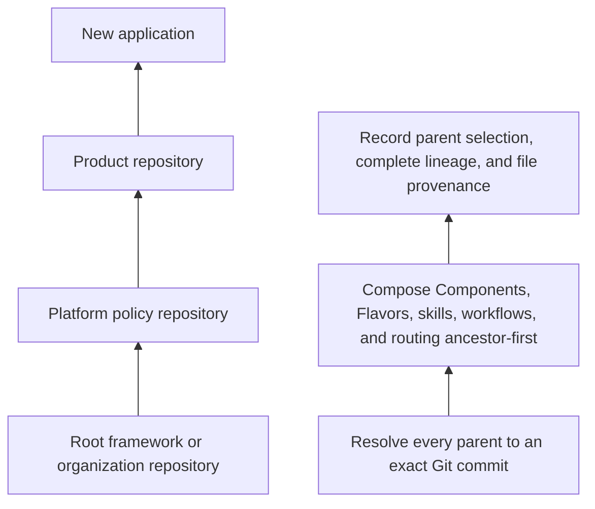
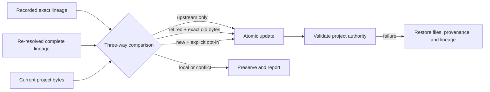
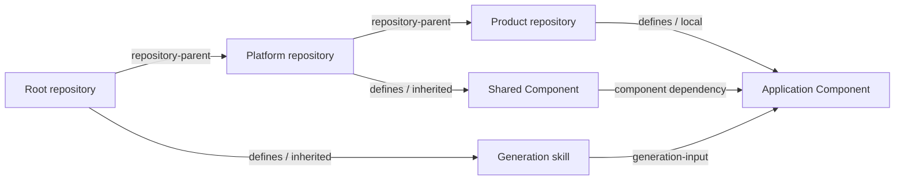

# Repository inheritance

Literate-AI repositories form a directed acyclic graph. A project may name one or more
parent repositories; each parent may name its own parents. `litai init --from` and
`litai update` follow the complete graph to explicit roots. A stopped or ambiguous
chain is an error, never an implicit fallback to whichever framework happens to be on
`PATH`.



The arrows mean “inherits from,” not Git remotes or submodules. Git supplies immutable
repository bytes; Literate AI supplies the parent relationship, catalog composition,
and update policy.

## Initialization

```console
litai init my-app --from https://example.com/acme/product-platform.git#main
```

The optional suffix is a Git revision selector. The selection is recorded, while every
resolved node is pinned to its exact commit in `.literate/repository-lineage.json`.
Resolution uses non-interactive Git plumbing in `OBJ_DIR/repository-lineage`; it reads
only `literate.project.json`, `.literate/repository-parent.json`, and regular tracked
catalog blobs. It does not check out a working tree, run hooks, recurse through
submodules, or execute repository code. URLs containing passwords, query credentials,
or fragments are rejected before persistence.

Each shallow fetch is bounded by an explicit operational policy. The framework default
allows 300 seconds total, 180 seconds without bytes from forced Git progress, and 30
seconds for one non-interactive SSH connection attempt. `init`, `update`, and `reparent`
accept corresponding `--repository-fetch-total-seconds`,
`--repository-fetch-no-progress-seconds`, and
`--repository-fetch-connect-seconds` overrides. Fixed framework bounds are respectively
30–1800, 15–600, and 5–120 seconds; connect must not exceed no-progress, and no-progress
must not exceed total. Invalid policy fails before Git starts.

The selected policy is content-identified in deterministic command evidence together
with `framework-default` or `cli` provenance. It is operational availability policy, not
repository authority, so it does not alter exact commit, lineage, or imported-catalog
identities. Timeout diagnostics name code, elapsed time, applicable deadline, policy
identity, and provenance without retaining the repository locator. Git receives only
per-process environment/configuration: no global Git configuration is changed, and
successful resolution never depends on a warmed object cache. Total or no-progress
expiry terminates the complete process tree and drains its already-bounded output.

Catalogs are composed in ancestor-first order:

- Components inherit by default; an individual `component.md` may declare
  `inheritable: false` when it is local teaching, qualification, or private composition
  authority that should not flow automatically to descendants;
- a descendant may deliberately replace a Component, Flavor, skill, workflow, or
  routing policy with the same catalog coordinate;
- two incomparable parents defining the same coordinate are rejected because neither
  has precedence;
- nested Components and skills remain separate items rather than being flattened into
  one context;
- global workflow and routing documents remain independently provenance-bound so an
  inherited Component retains its complete declared generation authority;
- only regular tracked files are admitted; links, Gitlinks, unsafe paths, invalid UTF-8
  paths, oversized files, and oversized trees fail closed.

The derived project records exact per-file provenance in `.literate/imports.json` and
includes that evidence in its initialization baseline. With no `--from`, the installed
framework remains the default parent at its highest published `vX.Y.Z` tag at or below
the installed CLI version, never `HEAD`. Its packaged scaffold supplies the same
taxonomy without requiring callers to spell its URL.

Samples are therefore available without becoming ambient application authority. A
developer may inspect a parent's samples or explicitly copy one with `litai catalog
copy`; ordinary `init` and `update` omit Components that explicitly opt out. Flavors,
skills, workflows, and routing policies retain their existing catalog inheritance
semantics. The framework's portable `hello-component` deliberately keeps the default so
each derived project receives one runnable host smoke test.

## Updating and reparenting

`litai update` re-resolves the recorded selection through every ancestor, composes the
prospective catalogs, and classifies inherited files against their previous provenance
and current local bytes. Planning is read-only. `--apply` writes only upstream-only
files; `--adopt-added` is required for new upstream files. Local-only files and
conflicts are preserved and reported by default. A repeatable `--take-upstream PATH`
may authorize only an explicitly reviewed inherited-catalog conflict, allowing a
dependency-closed set of safe changes, additions, and chosen conflicts to validate and
commit together. A repeatable `--keep-local PATH` may preserve only a planned retired
catalog path that remains a local compatibility input. Before mutation, both local and
upstream state are rechecked. Catalog files, provenance, and the lineage lock are
rolled back together if validation fails.

An explicit `--follow-ref B` uses the prospective parent selection for read-only
catalog planning as well as apply. The enclosing follow plan binds the recorded and
prospective parent authority; simulating that stage does not write either lineage
file. A changed project, recorded lineage or newly resolved parent rejects the plan.
The inherited file classifications and prospective identities match apply for the
same inputs. Framework local identities for preserved dynamic imports and lineage
metadata can change when apply writes that metadata; those hashes describe observed
local bytes, not proposed framework replacements.

When an exact prior catalog import disappears from the prospective export, its recorded
per-file identity makes removal another three-way comparison. `--apply` removes the item
only when every surviving local file still equals its exact import provenance. If any
file diverged, every surviving file in that retired item becomes local authority so a
multi-file Component, Flavor, or skill cannot be broken by partial retirement. The old
import record is removed either way. Framework-template removals remain conservative
because their initialization baseline does not prove the same catalog ownership boundary.



`litai reparent URL[#REVISION]` plans a different complete parent graph.
`litai reparent none` explicitly makes the project a root—its “divorce” operation.
Applying a reparent uses compare-and-swap and validation, but it does not pretend that
catalog reconciliation is free: run `litai update` after reviewing a changed parent
selection. An explicit root makes `litai update` a documented no-op.

For an inherited project, unchanged import records retain their `copied_at` timestamp:
it describes when that exact source and file provenance was established, not the most
recent update observation. A changed source revision, ancestor binding or file closure
still establishes fresh provenance. When the serialized imports are unchanged, apply
and failure recovery leave `.literate/imports.json` untouched. Final validation still
runs; this is not a promise that the whole update command performs no filesystem or
operational-state writes, nor is it a successful migration receipt.

For a canonical project created before repository-lineage evidence existed, `reparent`
is also the sole bootstrap operation. Its read-only plan represents the simultaneous
absence of both lineage documents as a typed legacy-root state. Apply succeeds only if
both remain absent and restores that exact absence if project validation fails. One
missing document, malformed evidence, or concurrently introduced evidence is never
treated as legacy state. Ordinary validation and `update` continue to require complete
recorded evidence.

## Precedence and trust boundary

## Effective-authority graph

`litai graph` projects the resolved repository lineage and the effective local or
inherited Component, Flavor, and skill catalog into one canonical directed graph. It
also includes generation-input edges from Components to the skills they invoke. Every
node records its owning project, provenance, local/inherited state, and inheritance
policy; every edge has a typed direction.

Inheritance planning also records candidates that do not materialize. A private
`inheritable: false` Component is shown as `withheld`; an ancestor definition replaced
by a descendant or a locally edited imported file is shown with a `shadowed-by` edge.
The graph therefore distinguishes the effective catalog from the decisions that formed
it instead of silently erasing non-selected authority.



The solver canonicalizes nodes and edges, rejects missing endpoints, and computes a
stable topological order. Any directed cycle is a validation failure, not a rendering
oddity. The identical graph can be exported as compact JSON, readable text, Mermaid,
Graphviz DOT, or standalone SVG:

```bash
litai graph --format text
litai graph --format json --output _build/authority.json
litai graph --format mermaid --output docs/authority.mmd
litai graph --format dot --output _build/authority.dot
litai graph --format svg --output _build/authority.svg
litai graph --kind component --ownership inherited --inheritance inheritable
litai graph --kind flavor --edge-kind flavor-selection
```

Repeat `--kind`, `--provenance`, or `--edge-kind` to select a union. `--ownership`
distinguishes local from inherited authority; `--inheritance` distinguishes entities
that pass downstream from those deliberately kept private. Filters are pure closed
views: an edge is retained only when both endpoints remain selected.

Graph inspection is read-only. A future rebalancing advisor may identify authority
duplicated byte-for-byte across descendants and recommend moving it toward the lowest
common repository ancestor. `litai graph rebalance` now implements that conservative
exact-identity case. Its evidence names the current repositories, lowest common
ancestor, affected repository descendants, duplicate-node/copy cost, estimated copies
avoided, and review risks. It reports `automatic_action: false`; it never moves,
commits, or pushes authority and deliberately makes no claim that merely similar
entities are semantically equivalent.

The standalone SVG is a structural export, not a screenshot. Each node group carries
its stable ID, kind, project, and provenance; each edge group carries source, target,
kind, and label. That lets a dependency-free renderer remain visually useful while an
engineer or test can prove it represents the same solved graph as JSON, text, Mermaid,
and DOT. Nodes are layered by dependency depth, so independent authority is visibly
parallel rather than stretched into a misleading single chain.

Large graphs should be inspected through closed filters before model context is
assembled. Start with repository-parent edges, then select one Component and its exact
dependency/generation inputs; use ownership and inheritance filters to separate local,
effective inherited, shadowed, and withheld candidates. This bounds the reasoning
surface without flattening private Component implementation detail into an application
prompt. Export compact JSON for tooling and Mermaid or SVG for review; both remain views
of the same immutable graph identity.

Repository inheritance is reusable authority, not remote code execution. The selected
repository is more specific than its ancestors; local project edits remain more
specific than inherited bytes. The installed framework still owns its packaged
scaffold, so a composite update settles parent catalogs first and then re-plans the
framework-template half. This preserves parent and local authority when paths overlap.

The repository-lineage cache is only an optimization. Exact commits, manifest content
identities, lineage-node identities, imported file hashes, and compare-and-swap guards
are the durable trust boundary.

## Parent contribution checkouts

Lineage resolution above never checks out a working tree. Searching a parent,
updating it, or filing issues and review requests against it is a different path:
run `litai project parent checkout URL[#REVISION]` in the *current* project. That
command clones or updates the parent at `parents/<id>/`, initializes submodules, and
pulls Git LFS when pointers are present. Do not clone parents into `/tmp` or extra
Git worktrees. `parents/` is a working checkout prefix, not catalog authority; it is
excluded from the current repository's Git index via `.git/info/exclude`.

Contribute back with the tracker CLI from `litai project tracker inspect` (`gh pr`
or `glab mr`) from that checkout. Never push the parent's default branch directly.
