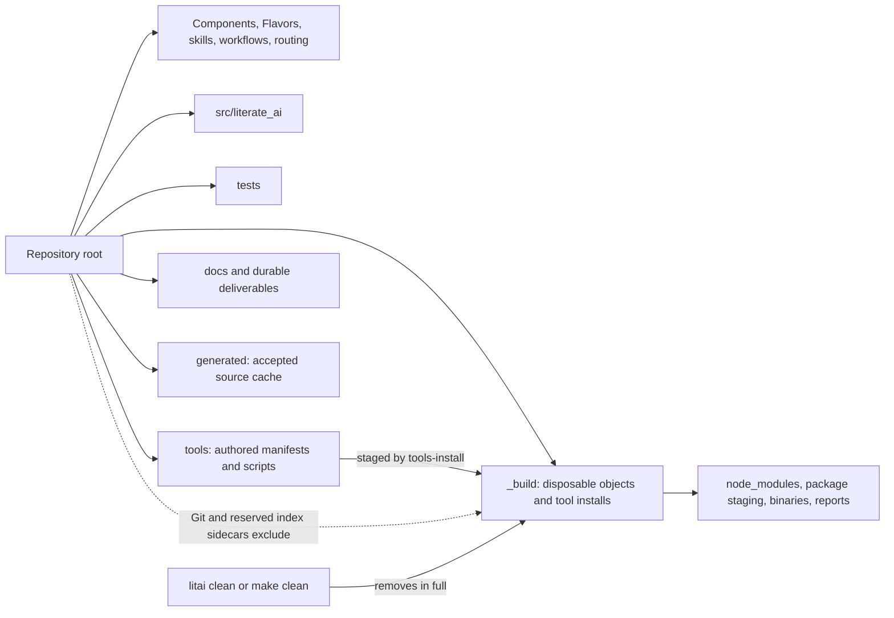

# Repository layout

Literate AI uses Python's `src/` layout and keeps its framework taxonomy visible at the
root. The latter is intentional: Components, Flavors, skills, workflows, and routing are
authored authority, not implementation packages.

The [Python Packaging User Guide's src-layout guidance](https://packaging.python.org/en/latest/discussions/src-layout-vs-flat-layout/)
explains the main Python boundary: importable product code belongs beneath `src/` so the
working directory cannot accidentally supply modules missing from an installed
distribution. [PEP 517's in-tree backend contract](https://peps.python.org/pep-0517/#in-tree-build-backends)
allows project-specific build backends in a declared `backend-path`; Literate AI keeps
that exceptional packaging tool beneath `tools/build_backend/`, not at the root.

## Root inventory

| Class | Retained entries | Reason |
|---|---|---|
| Orientation and policy | `README.md`, `CHANGELOG.md`, `LICENSE`, `AGENTS.md`, `CLAUDE.md`, `SKILL.md` | Conventional human and agent entrypoints |
| Python packaging | `pyproject.toml`, `setup.cfg`, `MANIFEST.in` | Standard build metadata; no importable Python module |
| Contributor entrypoint | `Makefile` | Short discoverable wrapper around repository gates |
| Literate AI authority | `literate.project.json`, `components/`, `flavors/`, `skills/`, `workflows/`, `routing/`, `openspec/` | The framework's first-class, reviewable design inputs |
| Product and verification | `src/`, `tests/`, `samples/`, `schemas/` | Python package, independent verification, spec-only examples, and wire contracts |
| Supporting material | `docs/`, `scripts/`, `tools/`, `packaging/` | Durable explanation, maintenance entrypoints, authored tool projects, and release recipes |
| Provider and CI adapters | `agents/`, `.cursor/`, `.github/` | Thin provider-specific discovery and automation surfaces |
| Local-only configuration | `literate.workers.example.json`, `literate.test.example.json` | Synthetic templates for the ignored private worker catalog and project test-matrix selections |

A durable presentation now lives beside its authoring package under
`docs/presentations/`; a generic root `outputs/` directory added no ownership boundary
and was removed.

Host dependencies follow the same taxonomy as the behavior they support.
`flavors/os-base/toolchain.cdx.json` owns only universal capabilities;
`flavors/<selected-flavor>/host-toolchain.cdx.json` contributes language, package,
build, accelerator, or OS-specific logical capabilities; and
`flavors/os-<family>/host-install/<os>/<architecture>/<accelerator>.cdx.json` maps
the composed capability IDs to one concrete host package manager and artifact set.
The Python installer detects a tuple, composes selected mix-ins, de-duplicates
identical declarations with a warning, and consumes the one realization leaf. It
does not reproduce package policy in conditionals or merge leaves into a
cross-platform manifest.

## Generated-state boundary

`_build/`, `node_modules/`, `__pycache__/`, and bytecode are forbidden from the
current Git inventory and every reachable Git object. The layout gate intentionally fails
even if a dependency tree was committed and later deleted: deletion does not remove Git
history. Repairing that state requires a coordinated history rewrite.

The accepted generated-source cache remains a separate `generated/` sibling. It is the
advisory default prefix for fungible generated application source that may be deleted
and regenerated; it is not an object directory and `clean` does not remove it. It is
not a mandatory cage for load-bearing project authority such as Components, Flavors,
skills, or this repository's own Makefile.

Framework-managed Python environments live at
`_build/python-envs/<validated-session-id>`. The session boundary is required even when
parallel agents share one checkout: installing into a repository-global `.venv` lets
one process replace another process's interpreter. A root `.venv` is therefore
user-owned only and is never created or cleaned by Make. `clean` deliberately runs its
small cache-validation entrypoint with the system Python so the command never attempts
to delete the environment containing its active interpreter, which would fail on
Windows. It removes object and artifact children while retaining the exact
`_build/python-envs` subtree, so another session's interpreter remains usable.
`really-clean` is the explicit exclusive reset that may remove all managed environments;
do not run it while another agent or build session is active.

`.litai-cache-locks/` is small persistent coordination state, not build output. It stays
outside `_build` so a clean operation cannot unlink an advisory lock protecting another
active cache publication. Interrupted one-shot operation locks are removed by their
own transaction cleanup and are not a general artifact directory.

## Python package audit

The `src/literate_ai/` package has 14 direct modules for cross-cutting project, version,
cache, documentation, and facade concerns. Its remaining 258 Python modules already sit
under named domains such as `contracts`, `application`, `adapters`, `cli`, and
`source_to_specification`; moving those directories would add churn without a clearer
ownership boundary.

The material structural debt is inside a few oversized modules, not at the package root.
The largest dependency-lifecycle, CLI, model-workflow, Standard-lifecycle, and coding-CLI
modules range from roughly 2,800 to 6,800 lines. They need call-graph-guided decomposition
along stable typed ports. A line-count-only split would make navigation worse, so that
work is recorded separately as `LAYOUT-003` with behavioral evidence gates.
