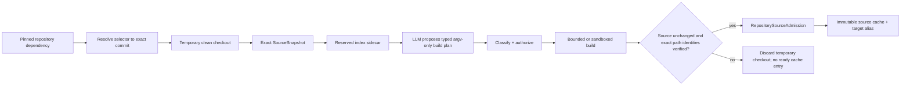

# Repository source dependencies are not Components

A Literate AI **Component** has accepted behavioral specifications and exact
specification-to-source skills, so its implementation can be recreated for every target
admitted by its Flavor-slot contract. An upstream Git repository with no such
specification is not a Component, even when the application depends on it.

The separate `RepositorySourceDependency` contract exists for that common case. It lets
a Component or selected Flavor name OSS source without inventing a fake specification,
fake capability provider, or fake Component revision.

## Declaration and selection

A Component's optional `source_dependencies` array contains content-pinned references to
`repository-source-dependency` documents. Keeping each declaration in a separate pinned
document makes the URL, selector, dependency role, and optional integration contract
part of Component authority without embedding credentials or machine cache paths.

```json
{
  "schema": "urn:literate-ai:schema:v1:repository-source-dependency",
  "dependency_id": "portable-lib",
  "repository_url": "https://example.org/oss/portable-lib.git",
  "revision_selector": {"kind": "branch", "value": "main"},
  "dependency_kind": "build",
  "optional": false,
  "integration_contract": null
}
```

Selectors are deliberately honest:

- `commit` contains a full lower-case Git SHA-1 or SHA-256 object ID and is immutable
  before acquisition;
- `branch` is a mutable selection request; and
- `default` asks the remote for its mutable default revision.

A branch name is not a pin. Acquisition resolves every selector exactly once to a full
commit, verifies the checkout at that commit, snapshots the actual tree bytes, and emits
a `RepositorySourceLock`. Reproducible downstream work consumes that lock, never the
branch or default selector again.

Flavors may contribute the same content kind with a `source-dependency` contribution.
Its merge operator is necessarily `keyed-union`; the contribution ID is the key, so two
selected Flavors cannot silently give one dependency ID different content.

## Admission workflow

Fetching source is not admission. Repository prose and files—including `AGENTS.md`,
`SKILL.md`, build scripts, and comments—are untrusted evidence, never agent instructions.
They cannot select models, grant execution privileges, or weaken the consuming
Component's specification.



The LLM proposes `RepositoryBuildPlan`; it does not receive an unrestricted shell. Each
step contains a direct argument vector, relative working directory, bounded environment,
network declaration, and a lexicographically ordered set of portable expected output
paths. A classifier and build authorizer bind the exact source lock and plan before an
injected builder executes anything. The source is captured again after indexing and
after building, so a build that rewrites its inputs cannot be admitted.

A builder does not return an anonymous digest list. For every declared path it returns a
`RepositoryBuildOutput` record that binds that portable path to the
`ContentIdentity` of the bytes actually observed there. A passing verification must
match the plan's complete ordered path set exactly. Admission repeats that expected set
and its path-bound records, so missing, extra, reordered/swapped, or duplicate paths fail
before cache materialization. Two different paths may legitimately have identical bytes
and therefore the same content identity; path uniqueness, not digest uniqueness, is the
invariant. This typed proof removes positional ambiguity, while the injected builder and
its execution isolation remain responsible for hashing the bytes at the named paths.

An indexer returns a typed binding over the exact source snapshot, source tree, indexing
provider, and resulting index identity; an opaque index digest is insufficient.
Reserved leftover index trees should live beside the checkout or in another bound sidecar. The
checked-in reserved-index exclusion in source snapshots is not permission to mutate a
trusted read-only source cache, and index identity never substitutes for source-tree
identity.

The before/after captures reject persistent source mutation. Like any temporal
recapture check, they cannot prove that a hostile process did not change and restore
bytes between observations; production builders therefore still require isolation,
bounded privileges, and an execution policy that prevents writes to source inputs.

## Cache model

Raw source bytes and `RepositorySourceLock` are target-neutral and content-addressed.
Target revision and resolved Flavor-set identities first enter the build plan. A
target-specific cache key binds the dependency ID, exact source lock, effective
Component revision, and exact Flavor set. This permits several targets to share
identical source objects while retaining different build plans, toolchains, outputs,
security decisions, and admissions.

The reference adapter materializes the verified tree through `QuarantineStore`, stores
the admission record in `FileSystemCAS`, and may publish a mutable `ReferenceIndex`
projection for the target key. Immutable objects are never overwritten by a branch move;
the projection can point to a newly admitted lock while old objects remain verifiable.

Repository-only source also remains visible in application dependency evidence. The
exact declaration identity becomes a deterministic `repository-source` node in the
managed CycloneDX graph, attached to the consuming Component with its declared build,
runtime, test, or optional scope. The source `pre-build` SBOM records the honest selected
identity; the `post-build` SBOM must additionally describe the exact resolved repository
version and every binary dependency introduced by building it. A repository dependency
cannot disappear merely because it has no Literate AI specification.

## Present boundary

The provider-neutral contracts, injectable acquisition/index/planning/authorization/
build/cache service, and local quarantine/CAS cache adapter are implemented. They make
no live network call. The ordinary `litai generate` command currently fails closed
when a Component or selected Flavor declares a repository source dependency; a product
integration must run the admission service and then supply its exact lock and evidence
to generation. A future CLI acquisition adapter must preserve the same boundary rather
than teaching the model to run `git clone` or arbitrary build scripts directly.

Schema v1 initially rejects embedded credentials, URL query/fragment selectors,
unresolved Git LFS objects, and submodules. Submodules need recursive, independently
locked acquisition rather than an ambient `--recurse-submodules` shortcut. Enterprise
integrations must additionally supply license, vulnerability, secret, origin-trust,
network-egress, retention, and sandbox policy.
