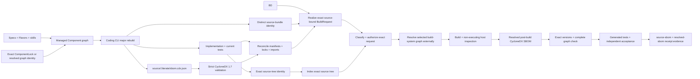
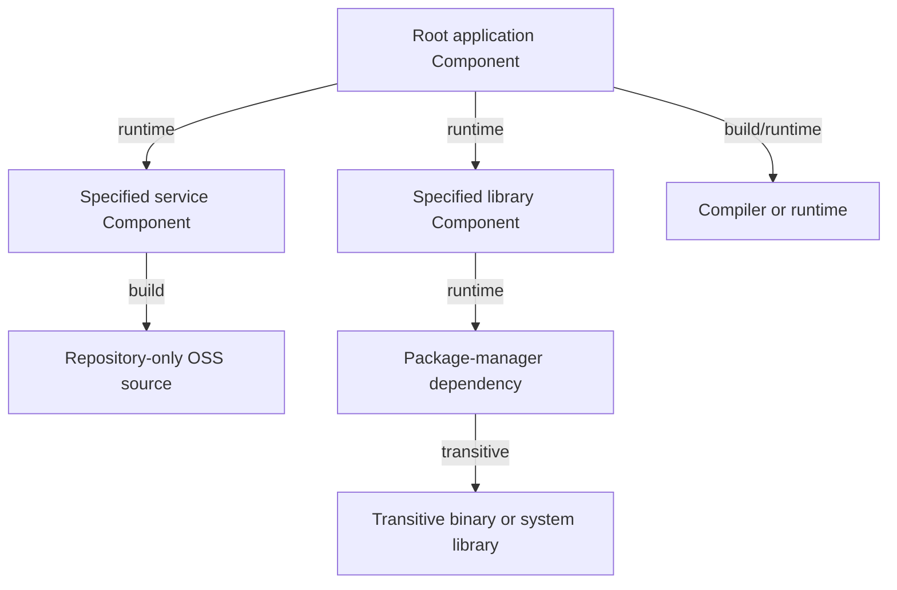

# CycloneDX SBOM and dependency graph

Every Literate AI-generated application carries one standards-based dependency story.
The framework uses CycloneDX 1.7 JSON for every SBOM; it does not define a competing
inventory format. The official JSON schema is the wire authority, and Literate AI adds
only namespaced properties that bind framework identities.

The two SBOMs answer different questions:

| Evidence | Lifecycle | Location | Required precision |
| --- | --- | --- | --- |
| Source SBOM | CycloneDX `pre-build` | `source/.literate/sbom.cdx.json` inside the disposable generated tree | Exact managed Component/repository graph and every known direct relationship; an explicitly deferred third-party closure uses `incomplete_third_party_only` plus honest version ranges |
| Resolved SBOM | CycloneDX `post-build` | External build evidence | The preserved source graph plus the complete observed package, toolchain, runtime, and binary closure at exact versions |

The source SBOM is generated from the same specifications, selected Flavors, exact
skills, and complete Literate-AI-managed dependency graph as the implementation and
current tests. The post-build SBOM is produced and verified after the native build has
resolved the actual toolchains, packages, runtimes, and binary closure, but before any
generated or independent test executes. A missing, partial, or invalid document stops
that lifecycle boundary.

## Component and package inventory

The graph begins with dependencies managed by Literate AI itself. Both the source and
resolved SBOM bind the same exact resolved graph identity and always include:

- the root Component revision;
- every Component revision in its exact selected dependency closure;
- every declared repository-source dependency, even though that source has no Literate
  AI specification of its own; and
- every exact managed relationship, including its source, target, dependency kind,
  optionality, and relationship identity.

Stable `bom-ref` values derive from exact framework identities. Namespaced CycloneDX
metadata binds that authority as `literate-ai:resolved-graph-identity`; lock-native
generation uses the exact `ComponentLock` identity, while legacy composition-native
generation uses the exact `ComponentComposition` identity. Component properties preserve
the Component revision or repository-source declaration identity, node kind and scope,
and one canonical record for every managed relationship. Standard CycloneDX `dependsOn`
represents reachability and may deduplicate the same source/target pair; the namespaced
record still preserves each relationship's kind, optionality, and exact identity.
Package-manager, toolchain, runtime, system-library, and other binary
nodes may extend this managed subgraph; they cannot change its resolved graph identity or
replace, rename, add, or omit a managed Component relationship.

A Component is distinguished by its accepted specification and ability to regenerate
source. Repository-only OSS remains a normal managed dependency node without pretending
that it has a Literate AI specification. A mutable selector may become an exact commit
only through typed source-lock evidence binding the snapshot, tree, resolver, index,
admission, and cache record. The provider-neutral admission service and local cache
adapter implement that contract, but the ordinary `litai generate` CLI does not yet
perform live repository acquisition; it fails closed until an integration supplies the
exact admitted evidence. See
[repository-source dependencies](repository-source-dependencies.md#present-boundary).

## What “complete” means

The validated profile follows the CycloneDX dependency-graph and composition rules:

- the root and every Component or service inventory object has exactly one explicit
  `dependencies` entry;
- every direct and transitive edge uses `dependsOn` and references an existing
  `bom-ref`;
- leaves have an explicit empty `dependsOn` array rather than an omitted entry;
- every inventory node is reachable from the root; and
- the root dependency composition is declared `complete`, except that the pre-build
  document may use `incomplete_third_party_only` when an authorized build resolver is
  explicitly responsible for a still-unknown external transitive closure.

For the managed portion, inventory inclusion is not enough. The framework compares the
document with the exact resolved Component and repository-owner projection. Unknown
or omitted owners, alternate references that claim the same managed identity, changed
node scopes, and missing or changed relationship records all fail validation.

An omitted dependency entry means unknown dependency information in CycloneDX, so it is
not accepted as a compact spelling for a leaf. Explicit incompleteness belongs in the
standard composition aggregate, never in a missing `dependsOn`. A build adapter that
cannot resolve the direct and transitive binary closure must fail the resolved-SBOM gate
rather than label a partial graph complete. The source document may identify an external
unresolved dependency with `isExternal: true` and an honest `versionRange`; the resolved
document requires an exact version for every node and always returns to `complete`.

Range resolution is semantic, not merely syntactic. The reference adapter uses the
[Package URL Version Range Specification](https://github.com/package-url/purl-spec/blob/main/VERSION-RANGE-SPEC.rst)
through its pinned `univers` library and rejects unsupported ecosystems, malformed
ranges, and exact versions outside the declared range before build admission.

The managed-graph and BOM-binding envelopes are version 2 and write only
`resolved_graph_identity`. Readers admit the exact version-1
`composition_identity` field and the legacy CycloneDX metadata property for bounded
migration; a record or BOM that mixes old and new names is rejected. The resolved graph
identity is the transitive attestation, so repository snapshot, tree, and resolver facts
remain in `ComponentLock` instead of being copied into proprietary SBOM fields unless
CycloneDX-standard evidence requires them.

Before any generated build begins, source admission reconciles supported generated
manifests, locks, and external imports with the source SBOM. The reference checks Python
requirements/`pyproject.toml` plus `poetry.lock`/`uv.lock`, JavaScript `package.json`
plus `package-lock.json`, Rust `Cargo.toml` plus `Cargo.lock`, C++ `vcpkg.json`, and
corresponding source imports or local includes. Resolution repeats that check against
the unchanged generated tree before admitting post-build evidence. A declaration,
locked package, or external import missing from dependency evidence is a hard failure,
not permission to execute or silently extend an allegedly complete graph.
JavaScript import observation first performs an inert lexical projection: comments,
regular-expression bodies, template text, and ordinary string contents cannot masquerade
as executable syntax, while a quoted literal reached through static import/export,
dynamic `import()`, or CommonJS `require()` remains an observed dependency specifier.

For Bzlmod, a literal `bazel_dep` version is requested intent rather than final lock
evidence because Minimal Version Selection may choose a newer compatible request from
the transitive graph. Inert pre-build inspection accepts only the supported literal
`module()`/`bazel_dep()` subset. The root `MODULE.bazel` must begin with exactly one
keyword-only literal `module(name = "<valid_module_name>", version =
"<exact_component_version>")`; both fields precede every literal `bazel_dep`. Inspection
reconciles every direct module and root edge with the source SBOM. Overrides, extensions,
includes, legacy `WORKSPACE` repository authority,
and dynamic Starlark remain fail-closed until separately modeled. The coding model never
fabricates a public lock or transitive graph.

After classification and build authorization, the Bazel lifecycle adapter copies the
exact source into an external projection, resolves there, captures the public
`MODULE.bazel.lock`, raw `bazel mod graph --output=json` result, raw streamed repository
definitions, and exact direct Bazel binary/version identity, and then replays in lockfile
error mode. The conformance adapter analyzes and compiles the complete `//...` target
graph, including native test targets, but does not execute a generated test binary in
the pre-SBOM build phase. It then queries `buildfiles(//...)` and the source-file closure
of `deps(//...)`, and creates a typed, content-addressed `BuildInputConsumption` record
bound to the admitted source-tree digest. A consumption-aware native delegate may use
only those exact local BUILD, loaded `.bzl`, target-source, root `MODULE.bazel`, and
explicitly loaded `.bazelrc` paths to satisfy its generated-file coverage check; an
unused generated file still fails closed. Overlap is legitimate when Bazel and the
native compiler both read the same file, but duplicates within one consumer remain
invalid. The raw queries and canonical record are retained at
`.literate/bazel/buildfiles.txt`, `.literate/bazel/source-inputs.txt`, and
`.literate/bazel/build-input-consumption.json`.

The composite artifact preserves the dependency-resolution public bytes at
`.literate/bazel/MODULE.bazel.lock`, `.literate/bazel/module-graph.json`, and
`.literate/bazel/repositories.ndjson`; its canonical manifest binds every artifact file
and all resolver identities. The lifecycle independently parses the raw evidence rather
than trusting the adapter's normalized claim. Those observations extend the resolved
CycloneDX graph before any generated or independent test. Bazel output roots, caches,
convenience symlinks, and the generated lock never mutate the admitted generated source
tree.

Standard Bazel commands use the dedicated Bazel adapter's finite 30-minute command
budget, including dependency resolution, analysis, compilation and output lookup.
Ordinary local lifecycle commands retain their 60-second default. Every command still
uses process-tree termination on timeout; a failed analysis cannot publish an artifact
or cache checkpoint.

The Bazel-native Standard executor uses the same graph and build-input collectors for
the one locked Component target. It freezes the public triplet, both raw query results,
and canonical `BuildInputConsumption` in a detached
`urn:literate-ai:schema:v1:standard-bazel-dependency-evidence` manifest before creating
the resolved BOM. That manifest binds the exact authorization, Component revision,
build plan, source tree, resolver/build toolchain, normalized graph, and every retained
evidence-file digest. The ordinary Standard artifact manifest is written afterward and
separately binds the executable, detached evidence, and resolved BOM as one final tree.
This two-manifest boundary keeps the dependency proof replayable while allowing the
resolved BOM to be produced only after that proof passes. Missing, extra, replaced,
linked, oversized, noncanonical, or authority-mismatched evidence fails before tests or
execution.

The source projection, output base, and convenience links are disposable. The adapter
does not override Bazel's normal user-level content-addressed repository caches, so
verified downloads can be reused across projections and runs; the lock, registry hashes,
and repository-integrity checks remain authoritative rather than trusting cache presence.
Cross-run compiled-action reuse belongs to the composite build graph in `BUILD-220`.

The initial profile supports one selected version per module name and BCR-backed
`http_archive` repositories. It recognizes Bazel's exact well-known `platforms` module
repository-name exception across its selected versions; it does not use fuzzy repository
matching.
Raw graph/evidence files are bounded at 16 MiB and artifact traversal at 100,000 entries.
Root-authored overrides and extension declarations, multi-version graphs, and selected
modules backed by other repository rules require an explicit future adapter profile
rather than permissive fallback.

That completeness claim is deliberately transitional: dependency-module extensions may
create repositories or actions that remain present only in the retained raw evidence.
The current normalized observation projects the selected Bzlmod module graph, not every
extension-generated repository or target-used build action, so it must not be marketed as
universal dependency knowledge. `SBOM-340` defines the knowledge profile and CycloneDX
mapping needed to state those remaining unknown classes honestly.

The bootstrap sample adapter is intentionally a conformance decorator around the
language-native artifact builder. Its outer `host-yolo` authorization binds the native
build request, while the exact direct Bazel binary/version identity is bound in the dependency
observation rather than in that request identity. It does not claim that
the delegate artifact was produced by Bazel. The typed composite
build-request/toolchain contract now exists, and the Standard lifecycle creates a
source-bound intent, indexes its distinct source tree, obtains a current authorization,
and only then finalizes that composite plan. Production integrations should consume that
boundary—or separately authorize Bzlmod resolution—so resolver identity is authorization
input rather than post-action evidence alone. The sample decorator remains transitional.

## Non-executing host observation

Binary dependency discovery must not launch an untrusted generated executable. The
reference lifecycle recursively observes the selected host format and includes its
inspection tools in the resolved dependency evidence:

| Host | Reference observation | Compatible adapter choices |
| --- | --- | --- |
| macOS | Resolve `dyld_info` through exact `xcrun`, then inspect Mach-O UUIDs, linked images, and `LC_RPATH` recursively | A directly configured exact `dyld_info` may replace `xcrun` resolution |
| Linux | Use `readelf` plus exact `ldconfig` loader-cache and declared search-root evidence to inspect ELF interpreter, `NEEDED`, `RPATH`, and `RUNPATH` data recursively | A compatible adapter may use non-executing `objdump`; `ldd` is forbidden for untrusted generated binaries |
| Windows | Select `dumpbin` first, otherwise `llvm-readobj --coff-imports`; recursively resolve direct and delay-load PE imports through application, `System32`, toolchain, declared, and bounded `PATH` roots; resolve virtual API-set contracts through the exact parsed `System32\apisetschema.dll` namespace | Bind the inspector executable/version/digest, API-set file digest and parsed-map identity; record unavailable delay-only imports honestly and fail closed on every unresolved required import |

An npm package graph is not an execution graph. The reference observer therefore rejects
non-native build-tool launchers. Bazel autodiscovery never executes PATH Bazelisk: it
selects a direct Bazel 9 binary from Bazelisk's SHA-256-addressed cache, verifies that the
binary digest equals its cache-directory name, probes that binary directly, and passes
the same path to the builder and host observer. `BAZEL` remains an explicit operator pin,
but it must name the exact digest-matching binary in that SHA-addressed cache. A native
Bazelisk executable is still a dynamic wrapper and is rejected.

No package-backed lifecycle exception remains for a source-graph indexer; opaque npm launchers are
not an execution exception. The PATH command is only a locator for the exact npm `bin`
owner. The resolver requires its installed, exact-version current-platform optional
bundle instead of admitting self-healing downloads, then bypasses both the npm shim and
the bundle's shell/cmd script. Literate AI invokes the bundle-owned native Node directly
as a direct Node launch of a bundle-owned entrypoint, binds both files and manifests against
drift, records the package-to-bundle-to-entrypoint graph, and includes the bundled Node's
native closure. The host Node, `/usr/bin/env`, shells, `cmd.exe`, `dirname`, and `readlink`
are not executed. Opaque npm launchers and missing or mismatched bundles fail closed.
Nested global installs and lockfile-hoisted installs use the same model: the logical root
remains the owning package, while dependency lookup is bounded to its resolved npm
installation root and only manifest-declared reachable packages are admitted.

Only dependency names matching npm package grammar may be traversed. Every expected
`node_modules` path is contained beneath the graph root, link/junction-free, and required
to declare the requested package name; selector aliases and path escapes are rejected.
The traversal rejects every symlink, Windows reparse point/junction, resolved-path alias,
and containment escape in package-owned files. It has graph-global package, file,
aggregate-byte, and per-file limits, and rechecks manifests, package trees, and direct
execution inputs after observation. Orphan packages
remain excluded. Logical SBOM edges remain unflattened: package-owned native files and
launcher runtimes seed native inspection but do not become false direct root
dependencies.

The self-hosting Python observer applies the same rule to this framework. It starts at
the exact `[project].dependencies`, evaluates PEP 508 markers and requested extras for
the bound host, follows installed distribution metadata recursively, and records exact
versions, direct/transitive edges, and deterministic installed-file tree identities.
Development-only and otherwise installed but unreachable distributions are excluded.

An adapter binds the resolved inspector executable, its content-derived version and
SHA-256 digest, and its bounded argument/output contract. Launcher and helper tools such
as `xcrun` and `ldconfig` are bound as well. Their digests are checked again
after observation. A missing inspector, changed executable, ambiguous or unresolved
library, malformed/oversized output, unsupported binary, or incomplete package graph
fails dependency resolution before tests. A product version string or a successful
native build is never a substitute for exact inspector and closure evidence.

The documents are canonical UTF-8 JSON, use document version `1`, and omit timestamps
and random serial numbers so equal observations produce equal bytes. Validation combines
the official strict CycloneDX 1.7 JSON validator with the framework's deterministic,
complete-graph, lifecycle, and managed-subgraph checks.

Completeness is also a transition invariant, not two unrelated snapshots. The
post-build document binds the exact pre-build BOM identity and revalidates the complete
managed graph. It retains every pre-build `bom-ref`, standard dependency edge, and
namespaced relationship record—including kind, optionality, and relationship identity.
It may only replace an external `versionRange` with an exact `version` on that same
reference; independently observed transitive nodes and edges may be added. Silent
removal, reparenting, relabeling, or alternate-reference substitution fails before
generated tests run. Mutable repository selectors additionally require a typed
source-resolution lock; the resolved commit and its snapshot, index, admission, and
cache evidence replace neither the stable declaration-derived reference nor the
consuming Component relationship.

See the official [CycloneDX specification overview](https://cyclonedx.org/specification/overview/),
[software-dependency guidance](https://cyclonedx.org/use-cases/software-dependencies/),
and [dependency-composition guidance](https://cyclonedx.org/use-cases/compositions-dependencies/).

## Cache, receipt, and trust boundaries

`GenerationRequest` carries the exact managed SBOM graph as application authority. The
orchestrator independently compares its Component nodes and relationship evidence with
the current `ComponentComposition`, then includes the full graph in the immutable run
and model-stage inputs. Before build, the dependency-resolver port must return a typed
SOURCE-BOM binding whose byte identity matches the generated source file and whose
managed-graph, composition, and root identities match that request authority. The
post-build result must reproduce that exact pre-build binding and validation identity;
two internally consistent bindings for a different composition are rejected.

The concrete dependency resolver remains in the trusted computing base for semantic
validation and observation of the resolved BOM bytes. The application port deliberately
does not open an adapter-owned filesystem path or duplicate the CycloneDX implementation
in the application layer. It validates the returned content identities and current
authority bindings. When resolved evidence is admitted to a source-cache entry, the
cache adapter reads both BOM objects from its CAS and repeats strict source/resolved
CycloneDX validation against the serialized managed graph before publication and on
every reload. A custom resolver therefore requires the same operator trust as another
project-pinned lifecycle adapter; a typed result alone is not a remote attestation.

The source and resolved BOM byte identities, normalized graph identities, exact managed
graph identity, and resolved-to-source BOM identity travel with generation, cache,
workspace, and receipt evidence.
An accepted source-cache entry therefore carries both validated SBOMs together with the
exact source, generated tests, acceptance records, and the ordered typed
repository-source resolutions used to turn mutable selectors into exact
commits. Reload validation replays those projections; cache serialization cannot erase
Component-level dependencies merely because their source was fetched rather than
generated from another Literate AI specification. Provider artifacts such as a
source-intelligence artifacts are detached attachments governed by publication
policy; they do not participate in source-cache candidate identity.

That historical evidence is provenance, not current authorization. Materializing a
cache hit yields an acceptance-untrusted candidate. The current lifecycle must re-index,
validate, classify, authorize, build, verify its resolved SBOM, run generated tests,
and independently accept the exact materialized tree before it becomes workspace truth.

An SBOM is inventory evidence, not a vulnerability verdict, license approval, signature,
or safety claim. Those decisions remain separate policy gates. The compact Git receipt
records the `source-sbom` and `resolved-sbom` binding identities when project policy
requires them; it does not embed either document or authenticate a remote evidence store.
