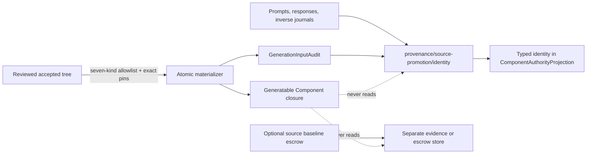
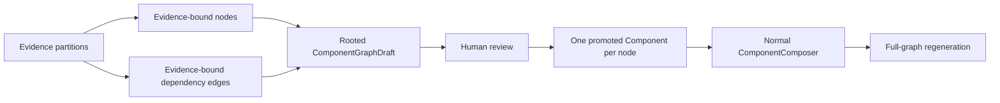
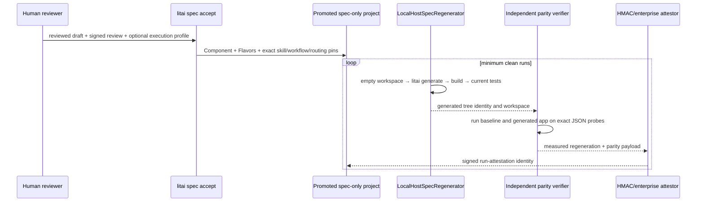
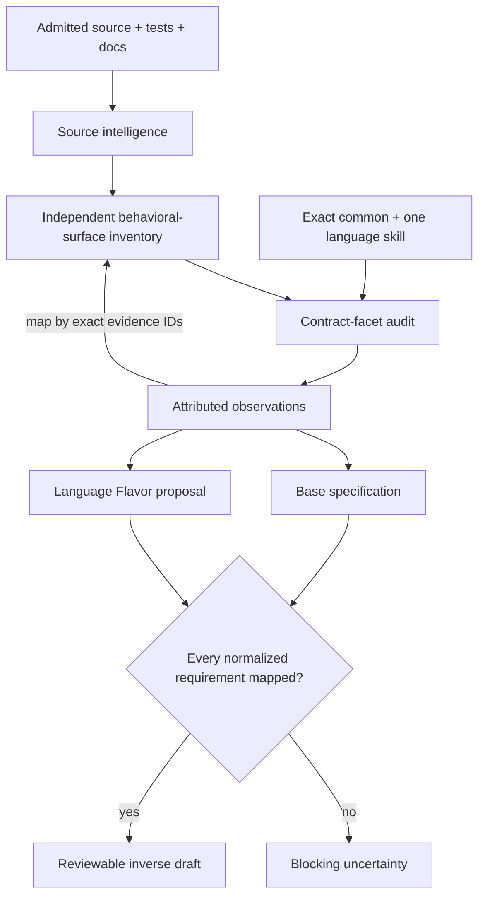

# Promoting source into regenerative specification authority

Source-to-specification has two deliberately different promotion boundaries. Review can
make a source-derived `SpecificationSet` authoritative for intent. It cannot by itself
prove that the specification can replace the original implementation. Until a separate
regenerative qualification decision passes, the exact original `SourceSnapshot` remains
the release implementation authority.

> **Current containment boundary:** historical v1 decisions remain non-authorizing and
> always report `qualification-v2-required`. The packaged local provider can now create
> current lifecycle evidence, but only by executing the trusted workflow itself. There
> is no caller-supplied evidence option. Direct projection appends remain forbidden; a
> qualified successor enters through locked admission against the exact current
> Component lock and a content-addressed qualification record.

```mermaid
flowchart LR
    O[Exact original source baseline] --> I[Inert inventory + evidence]
    I --> C[Inventory over classified temporary mirror]
    C --> L[Common inverse skills]
    C --> X[One or more bounded coding-agent calls per detected language skill]
    L --> D[Specification + Component graph + Flavor drafts]
    X --> D
    X --> J[Versioned complete model-call journals]
    J --> D
    D --> R[Explicit review]
    R --> S[Accepted intent authority]

    S --> G[Spec-only generation in empty workspace]
    F[Selected Flavors + pinned forward skills] --> G
    G --> B[Build exact generated tree]
    B --> T[Run freshly generated tests]
    T --> P[Independent parity verifier]
    O -. parity oracle only .-> P
    P --> E[Verified run attestation]
    E --> Q{Policy satisfied for every target and surface?}
    Q -- no --> O
    Q -- yes --> A[Specification becomes release implementation authority]
```

The dotted edge is intentionally narrow. The baseline may be built or run by an
independent, authorized parity verifier. Its files, tests, comments, documentation, and
derived summaries must not enter the coding model's generation context. Qualification
also disables the generated-source cache and starts in a new empty workspace. A Bazel or
other source-to-binary cache may still be used when its exact input and output identities
are part of the build evidence; it is not a substitute for a new spec-to-source run.

## Qualification contract

`RegenerativeQualificationPolicy` declares at least two independent clean runs, one or
more exact target profiles, one or more required behavioral surfaces, and skip policy.
The minimum applies independently to every required target, not to the matrix in
aggregate. An empty target or surface set can never authorize promotion. Each
already-verified `CleanRegenerationEvidence` record binds:

- the original source snapshot and reviewed specification set;
- exact target, Flavor lock, generation recipe, generated tree, and build result;
- freshly generated-test and independent parity results;
- complete generated-test accounting and covered surfaces; and
- explicit proof that generation used an empty workspace, excluded the original source,
  and missed or bypassed the generated-source cache.

Every required surface must be covered on every required target. Runs and their
attestations must be independently unique. Any build, generated-test, parity, cache,
workspace, target, or coverage failure leaves `source-baseline` as the release authority.
Model confidence never transfers authority.

`run_regenerative_qualification` is the provider-neutral application service for this gate. It creates
each temporary workspace and observes that it is empty; exposes only the exact
specification-set, Flavor-lock, generation-recipe, target, and surface identities to the
regenerator; requires the regenerator to report that exact input set and no source-cache
hit; invokes a distinct parity provider only after generation; and sends the complete
measured payload to a third, distinct attestation provider. The source snapshot ID first
appears in the parity request, never the generation request.

The built-in local qualification integration is `litai spec qualify`:
`LocalHostSpecRegenerator`
invokes the real forward CLI plus exact build and test commands,
`LocalHostParityVerifier` receives the original source only after generation and compares
strict JSON observations, and `LocalHmacQualificationAttestor` signs each complete
measured payload. A generated application that exits unsuccessfully or emits invalid JSON
is measured as failed parity, while an unavailable command, timeout, output-limit breach,
or failing trusted source baseline remains an operational error. Their content-derived
provider identities are distinct. The local
profile is project-contained, versioned execution data. When every measured condition
passes, the CLI closes those results over the exact Component revision, lock, Flavor and
skill sets, workflow, routing policy, promotion audit/tree, generation recipe, inverse
custody, and three distinct provider identities. Each profile case binds a stable ID,
positional argument array, and verifier-owned expected result. The Standard regenerative
rebuild receives that exact case set only through its independent acceptance oracle;
generation recipes, prompts, and generated implementation tests never receive it. A
profile without expected results is incomplete authority and is rejected rather than
being guessed from the original or generated application. Baseline commands execute
from the pinned original source root; generated commands execute from the profile's
declared native root beneath the retained per-Component generation workspace. That
projection is resolved and checked without flattening or treating the outer custody
directory as a language build workspace. The CLI persists the v3
qualification record at
`provenance/qualification/<identity>.json` before locked authority admission.
Execution is an explicitly authorized ambient-host operation. Enterprises can inject
remote builders, independent test systems, and organizational signing roots through the
same protocols.

For an importable library, every clean Standard rebuild uses the project-contained
`library-acceptance-oracle@1` document and its identity-bound in-language harness. Its
case IDs, arguments, and expected results must match the qualification profile as
canonical JSON bytes, preserving nested JSON types such as booleans versus integers;
the locked library contract separately checks specification, public-interface,
import-surface, language, and capability bindings. Executable Components retain the
profile-projected portable-application oracle.

The measurement wire records are
`regenerative-qualification-policy`, `clean-regeneration-evidence`, and
`regenerative-qualification-decision`, plus the payload supplied to the trusted
`operational-qualification-attestation` provider, in
[`source-qualification.schema.json`](../../schemas/v2/source-qualification.schema.json).
Strict `from_dict` parsing proves only that a record is well formed. The application
boundary must configure trusted providers and resolve and verify referenced attestations.
There is intentionally no CLI argument that accepts arbitrary JSON evidence and presents
it as trusted. The current `regenerative-qualification-evidence` record is constructed
only from the typed results returned by configured providers. The locked admission
service requires its retained projection, content-addressed record, audited closure,
inverse custody, exact current `ComponentLock`, verifier, and policy to agree before the
projection store can append the qualified successor. Partial, stale, drifted, missing,
cached, or failed evidence cannot enter that path.

Qualification distinguishes a generated-source cache from an execution-evidence
checkpoint. A clean run must still generate into a new empty workspace and report
`generated_source_cache_hit: false`; reusing generated files would invalidate the claim
being measured. After such a run has built, tested, passed independent parity, and been
signed, however, `spec qualify` atomically stores its compact
`qualification-run-checkpoint` beneath `BUILD_DIR/qualification-checkpoints/`. The key
binds the exact run plan, source snapshot, audited source-exclusion result, target,
Flavors, recipe, and all three provider identities. An interrupted retry
cryptographically verifies that payload and reuses only the completed evidence, then
executes each missing run. Corrupt, stale, differently keyed, or differently signed
checkpoints fail closed. `really-clean` removes these checkpoints with the
generated-source cache; `clean` does not. Thus resumability saves coding-agent work
without pretending cached source is a fresh independent regeneration.

The decision wire keeps the producer's `claimed_authority` separate from its
schema-constrained `effective_authority: source-baseline`. These records are retained as
historical evidence only. Their evaluator cannot name the specification as current
release authority. The standalone record must be written outside both the source
baseline and promoted project trees. Immediately before that write, the CLI rechecks
the source snapshot, Component revision, authority head, and promotion audit.

Qualification is one gate in becoming a full Component, not a shortcut around the
Component contract. `spec accept --project-target` now materializes that full spec-only
project boundary automatically: canonical readable `component.md`, the temporary welded
manifest retained only during compatibility, selected-Flavor slots, pinned portable
specification-to-source skill, workflow, routing, and optional pinned local qualification
contract. It then resolves and persists the exact qualification target/Flavor
`component.lock.json` without generating source. A missing acceptance profile or failed
qualification leaves release authority at the source baseline.

An incremental adopted project keeps each promoted native boundary as a complete
source-free child beneath `.literate/native-projects/`. Its root registry binds the exact
relative child path, project identifier, and project-definition identity. Conversion
authority aggregates projection heads across the owner and registered children, rejects
coordinate collisions or registry drift, and verifies qualified promotion evidence at
the project boundary that owns it. This avoids merging template Flavors or project
configuration into the retained root while still giving that root exact evidence for
the `drafted` and `qualified` transitions.

Promotion itself now uses a closed allowlist rather than copying the accepted tree. Each
admitted specification is read through `SourcePromotionMaterializer` with an exact
SHA-256 pin, a portable source and target path, and one of seven forward-authority
kinds.

When model-backed inverse translation is unavailable, a reviewer may attach one
source-bound Component graph to a deterministic-static bundle with
`spec review --component-graph`. The graph is not detector output: it is explicit human
authority covered by the local review signature. Its root must exactly match the
derived Component definition; its one node must assign every observation exactly once;
all source paths, capability contracts, entrypoints, and edge evidence must close over
the bundle's exact evidence; and unknown semantics remain blocking. Acceptance renders
the reviewed public capability contracts into the accepted specification set and
revalidates the graph before creating any project or authority projection. Promotion
also records the reviewed lifecycle kind in each Component authoring document; in
particular, a zero-entrypoint `library` must remain explicitly distinguishable from the
implicit base Component so planning projects an import surface instead of a CLI.
A multi-node static promotion is deliberately rejected because inert inventory does not
provide a reviewable statement partition across Component boundaries.
The resulting `GenerationInputAudit` records every materializer read, kind, target,
identity, and byte count. Source, prompts, model journals, `.literate`, Git,
and provenance paths have no admitted kind and cannot be written into the Component
closure. A journal edit therefore leaves both the audited tree and audit identities
unchanged; a specification edit changes both.

New model-semantic promotions write the complete translation record, generation-input audits,
and `inverse-evidence.json` beneath `provenance/source-promotion/<identity>/`. That
content-addressed custody document binds the exact source inventory, behavioral-surface
inventory, path-disposition manifest, bounded batch plan, and translation identity.
Before any qualification host execution—and again before authority transition—the CLI
reopens it, rebuilds the partition and batch plan from retained provider-neutral
intelligence, requires every safe path to be covered, and checks every journal against
the exact planned call. Static translation explicitly has no model custody and
qualification therefore checks the signed static review plus ordinary source-exclusion
and lifecycle evidence instead of demanding nonexistent prompt journals. A semantic
v2 promotion that predates this evidence remains readable but cannot qualify.
The atomic legacy migrator moves or copies an
old `.literate/source-translation.json` to the same content-addressed closure while
rejecting traversal, overlap, symlinks, mutation, and an occupied digest with different
bytes. The authority history is separate again under `provenance/component-authority/`;
human acceptance appends the exact `source-authoritative → spec-assisted →
derived-source-retained` chain and `litai spec status --json` reports qualification as
the remaining blocker.

Semantic inverse translation also emits an evidence-bound `ComponentGraphDraft`. Every
observation belongs to exactly one node; every node binds exact source paths and evidence;
every dependency edge binds exact evidence and a capability provided by its target. The
graph is rooted, acyclic, and fully reachable. Node evidence and source paths are closed
deterministically over the exact observations assigned to that node; display titles are
normalized from stable coordinates so wording differences between language calls cannot
masquerade as semantic conflicts. An incoming edge capability is likewise added to its
target's provided-capability set when the model omits that redundant declaration; this
does not rename an edge or reconcile conflicting cross-language edge semantics, which
must still agree. A
single node is the correct answer when the evidence does not justify a logical boundary.
Review signs this graph as part of the complete result. Multi-node promotion writes one
source-free Component per node and projects graph edges into capability requirements; it
does not flatten the recovered application into one oversized manifest. Recovered
project-level Flavor manifests list the capabilities of the recovered nodes whose slots
they may fill. The lock resolver evaluates membership against each node-local slot; it
does not flatten those capabilities into the root or require their union from one
Component. Dependency-owned capabilities and specifications remain on their Components.

## Language translators are independent skills

The inert inventory selects exact language translators after the common inverse skills.
Each translator emits language-binding observations into a separate Flavor proposal so
review can change or reject implementation-specific details without contaminating base
behavior.

| Detected source | Inverse skill |
| --- | --- |
| Python | `language-python` |
| C++ | `language-cpp` |
| Rust | `language-rust` |
| JavaScript or TypeScript | `language-javascript` |

These manifests are independently content-pinned, packaged with the installed
framework, and selected from detected inventory rather than from instructions in the
analyzed repository. Common architecture, API, behavior, test, security, and operations
skills remain separate. In semantic mode each language gets exactly its relevant common
and language skills, its own evidence partition, and its own coding-agent call.
Before any such call, the framework projects admitted evidence into a versioned
`BehavioralSurfaceInventory`. Each item has a detector-owned stable ID, language,
interface kind, path/symbol, exact evidence, required status, and disposition. Model
observations can map those items by evidence ID but cannot rename or delete them; any
mapping also requires the observation's reviewed skill facet to agree with the interface
kind, so citing one broad file cannot claim every surface in it. Required unmapped items
block derivation. Well-known `package.json`, `pyproject.toml`, `Cargo.toml`, and Bzlmod
declarations add manifest-derived entrypoint, export, Component, and dependency surfaces.
The collector and the set of translator calls have distinct content identities. A human
exclusion is representable only with both a reason and a reviewed identity. Broader
verifier-surface collection and the operator-facing exclusion workflow remain roadmap
work. Current semantic result bundles retain the complete inventory outside Component
authority; acceptance re-derives it from the exact admitted evidence and prompt journals
and rejects a missing or substituted current record. If a model observation names a
facet/evidence combination that matches no independent surface, it is retained as a
translator-owned advisory proposal. It cannot erase a required detector/verifier item or
become required merely because the model proposed it.

The same pre-egress boundary creates a content-addressed
`EvidencePartitionManifest`. Every path in the complete inert `SourceInventory` receives
exactly one disposition—full, sliced, sensitive-excluded, unsupported, duplicate,
budget-partitioned, or blocking-omitted—with its source identity and byte count, admitted
evidence IDs and bytes, language, and canonical partition ordinal. Required safe content
without evidence blocks before a coding-agent call; identical bytes at another path do
not hide that omission. Semantic result bundle v4 retains the inventory and manifest.
Acceptance strictly decodes both and reconstructs the manifest from the persisted
provider-neutral intelligence before accepting its claims. These records distinguish the
complete checkout, policy exclusions, indexable material, and actual model admission;
they are not Component authority. A content-addressed `ModelEvidenceBatchPlan` then
partitions each language in canonical path/evidence order under a positive byte budget.
The default is 262,144 UTF-8 evidence bytes per call and
`--model-evidence-byte-budget` overrides it. One evidence item larger than the ceiling
fails closed. Every partitioned model-call journal binds the exact batch IDs,
language-local ordinal, and batch count. Current v3 model-call journals,
translation-run v5, and result-bundle v5 retain that plan;
acceptance reconstructs it and requires the journal sequence to match before merging
observations and Component graph fragments deterministically. Project promotion retains
the same facts as inverse custody outside Component authority, and qualification repeats
that proof rather than trusting acceptance-time validation.

The response may cite only supplied evidence and exact skill facets; confidence uses
integer basis points so the complete response remains canonical JSON v2. Every graph
node carries reviewed kind, profiles, public capability contracts, entrypoints, and
node-local build needs. Library entrypoints must be empty; CLI and service entrypoints
must be evidence-backed. Unknown semantics and missing contracts are blocking, and the
admission layer never closes an incomplete graph by inventing defaults. The frozen
Source-index identity and exact prompt/response transcript are retained with the accepted
draft under the public contracts in
[`source-translation-semantics.schema.json`](../../schemas/v2/source-translation-semantics.schema.json).

The reviewed graph may refine the static inventory's coarse `behavior.*` capability
labels into exact public capability names. The root coordinate and title remain bound
to the source-derived Component draft, while graph closure still requires every
observation and evidence item exactly once and a public contract for every renamed
capability. This refinement is required for libraries because capability suffixes are
the reviewed module and symbol names projected into their import surface. A qualified
Rust capability uses a tagged final segment: for example,
`trickle-common.config.type-trickle-config` projects to module
`trickle_common::config` and symbol `TrickleConfig`, while
`trickle-common.logging.fn-init-logging` projects to module
`trickle_common::logging` and symbol `init_logging`. An unqualified capability retains
the portable module-equals-symbol convention for compatibility.

The semantic gate is deliberately stronger than symbol recovery. Before emitting a
draft, each language call audits every observable input, bound, normalization rule,
aggregation, calculation and rounding rule, output field, ordering or tie rule, JSON
interface, and error behavior present in its admitted evidence. Machine-derived
behavioral-surface inventory makes ordering independently mandatory when source evidence
contains a language-recognized sequence sort or selection comparator. The corresponding
observation must state sequence order and selection tie-break separately, including
direction, the exact language comparison domain, observable stability, and independence
from input encounter order; generic "sorted" or "lexicographic" prose cannot discharge
that surface. This is coverage location evidence, not detector-authored product intent:
the language translator still derives the rule from the cited source bytes.
The same independent treatment applies to recognized normalization constructs. Their
observations must recover transformation order and every observable output or downstream
consumer separately, preventing a draft from preserving a normalized grouping key while
silently losing the normalization of a returned field.
Machine-derived
skill-to-facet and skill-to-scope allowlists reject observations that cannot be
attributed to the exact selected conversion skill. Mixed C++ source/header graphs are
one C++ partition; standalone C remains unsupported rather than being mislabeled. A
provider warning or missing relationship edge does not create a behavior surface by
itself. Conventional test paths and language test filenames remain admitted supporting
evidence but cannot manufacture required public Component surfaces from their exported
test symbols. Unknown, inferred-intent, conflict, and suspected-defect observations
require a named observable surface grounded in exact admitted source evidence;
otherwise the model would manufacture blocking uncertainty from an indexer's admitted
blind spots.

Language skills must recover observable runtime failures that are implicit in ordinary
language semantics as well as explicit validation branches. For Python, proven built-in
mapping subscription establishes that an absent required key raises before result
construction unless a default or handler intercepts it; semantic comparison treats an
inverse draft that omits that missing-field behavior as lossy.

When an inverse Flavor proposal names an initialized canonical language or platform
Flavor, promotion merges recovered applicability and prose into that authority instead
of replacing its operational contributions. The promoted input audit retains every
selected Flavor file, including Standard command profiles and toolchain constraints.
Host qualification also selects exactly one host platform Flavor when the reviewed
proposal did not already select one. Every promoted runnable Component declares that
platform slot even when the inverse translator observed no platform-specific product
behavior: executable naming and launch commands are operational authority, not inferred
business semantics. Promotion rebinds every selected initialized operational Flavor
from the starter Component's capability to the recovered graph capabilities before
locking, so applicability filtering cannot silently discard the language, build, or
platform command profile.

The live bidirectional conformance case proves the boundary operationally: one stable
specification generates and runs in Python, C++, Rust, and JavaScript; every generated
tree is independently translated back and compared against the same normalized graph of
inputs, outputs, invariants, normalization, aggregation, ordering, tie-breaking, errors,
and invalid inputs. Each recovered specification is accepted into its own source-free
project and passes two clean generation, build, current-test, and baseline-parity runs
to reach fungible authority. This is the
minimum shape of evidence for claiming a language translator is regenerative rather
than merely descriptive.

That proof is intentionally host-scoped rather than multiplied across every application
and platform. Cross-platform regression uses one representative forward sample through
macOS, Linux, and Windows. A separate composed case generates the invoice application,
selects the exact root source tree from typed per-Component generation custody without
flattening the retained workspaces, recovers its three logical Components and two edges,
promotes them, composes the promoted catalog, and regenerates a passing root binary.

## This is not an external repository dependency

A source-only OSS dependency stays a `RepositorySourceDependency`: resolve it to an
exact commit, inspect and build it in quarantine, then admit its immutable bytes to the
external source cache. It does not become a Component. Promotion is the more laborious
path chosen only when the project wants reviewed regenerative intent to outrank the
original implementation.
