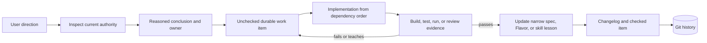

# User-directed work is durable project authority

A conversation can explain intent, but it cannot be the only place a project remembers
what remains to be done. Before substantive implementation, Literate AI agents use the
provider-neutral `skills/agent/record-user-directed-work/SKILL.md` skill to turn
direction into a reasoned, evidence-gated item in
[`docs/roadmap/active-work.md`](../roadmap/active-work.md). Every `litai init` project
receives the same skill, queue, and changelog structure.

The queue is deliberately compact. It records desired outcome, conclusion, ownership,
dependencies, implementation subtasks, and completion evidence. Detailed designs live
in focused roadmap documents and are linked rather than copied. Git preserves prior
states, so the project does not maintain a second timestamped task ledger.

This loop does not convert every suggestion directly into source. Diagnostic inspection
may establish what the suggestion means; the recorded conclusion then selects the
narrowest owning Component, Flavor, skill, workflow, routing policy, documentation area,
or framework rule. Reusable lessons change that authority and are rebuilt. One-off model
mistakes remain compact run evidence rather than becoming permanent instructions.

Secrets, worker hostnames, credentials, and raw private prompt journals never enter the
queue. Test workers are supplied through ignored per-user configuration, while the work
item records only the portable evidence requirement and durable report identity.
