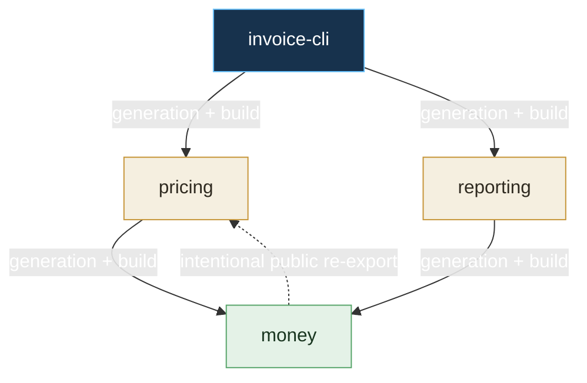

# ADR 0005: Make Components Independently Executable

- Status: Accepted for contract implementation
- Date: 2026-08-06
- Decision owners: literate-ai maintainers
- Roadmap: `COMP-190`

## Context

The current generation path can resolve a Component dependency graph, but then flattens
dependency manifests, specifications, authoring inputs, and acceptance material into one
coding-agent recipe. That makes a dependency's private authority visible to its consumer,
makes one prompt grow with a transitive graph, and prevents independent cache and
invalidation decisions.

A Component needs an executable meaning before a per-Component planner can replace that
flattening. In particular, the framework needs one stable answer to four questions:

1. What may cross a dependency boundary during generation?
2. What does each dependency kind order and consume?
3. Which target, Flavor, asset, and driver decisions belong to each node?
4. Which nodes regenerate, rebuild, and retest after a classified change?

## Decision

### The unit is a Component revision

One immutable Component revision is the unit of generation, source caching, build, test,
and publication. Each graph node has its own generated source tree, derivation identity,
build/test evidence, public interfaces, and publication result. A project or application
may compose those units, but composition does not merge their private authority.

This decision defines domain contracts. `LOCK-200` will define authored intent and exact
locks, and `DAG-210` will make the planner execute these semantics.

### Generation sees public interfaces, not dependency internals

`PublicInterfaceContract` is the complete and only dependency material visible while a
consumer is generated. It contains stable API semantics:

- one provided capability and semantic version;
- exported types and protocols;
- behavioral preconditions, postconditions, and typed errors;
- a compatibility promise;
- its canonical content identity; and
- exact, intentional re-exports of a direct dependency interface and named symbols.

It deliberately does not contain a provider or dependency Component revision. An exact
`ComponentInterfaceBinding` separately associates one provider revision and capability
with one interface identity. A private provider change therefore creates a new binding
without changing the semantic interface identity or a consumer's generation key. The
planner validates the binding against the provider's declared capability and validates
each re-export against one of the provider's direct generation dependencies.

It contains no implementation instructions, source, private specifications, private
skills, workflow/routing material, acceptance oracles, or verifier-only facts. Those
remain in the provider's authority boundary. A transitive interface is invisible unless
a direct dependency deliberately re-exports it as part of its own public contract. A
re-export therefore changes the direct dependency's interface identity and invalidates
its consumers.

A missing, ambiguous, or incompatible public interface is a planning error. Injecting
the provider's full specification or source is not a fallback.

### Every dependency edge has one phase-specific meaning

The semantics are versioned as `executable-component-edge-semantics@1`.

| Edge kind | Consumer phase | Provider barrier | Consumed input | Visible during generation |
| --- | --- | --- | --- | --- |
| generation | generate | none; interface is already locked | public interface | yes |
| build | build | provider build | artifact export | no |
| runtime | run | provider build | runtime artifact export | no |
| validation | validate | provider validation | validation evidence | no |
| toolchain | build | provider build | toolchain export | no |
| packaging | package | provider package | package export | no |
| deployment | deploy | provider deploy | deployment evidence | no |

An edge has exactly one kind. When a relationship has more than one effect—for example,
a public API used during generation and a library linked during build—the lock contains
two edge records. This avoids an overloaded edge whose meaning changes by phase.

### Target and Flavor resolution is per node

Every Component revision resolves one named target, one exact target-profile identity,
one selection-policy identity, and one result for every declared Flavor slot. A slot
result repeats the exact declaration and contains zero, one, or many exact Flavor
revision selections according to its `zero-or-one`, `exactly-one`, `one-or-more`, or
bounded cardinality. Optional empty and multi-selection slots remain explicit rather
than disappearing from the lock. A Component may not
inherit the root node's language, operating-system, or build-system selection merely
because it is in the same graph. Different nodes may select different languages or
toolchains under the same named target. Readable authored intent and
`component://namespace/name::+selector` overrides are now supported; the lock result
remains one `NodeTargetFlavorSelection` per node.

### Authored bytes never become model-owned source

An `AuthoredBinaryAsset` is a content-locked blob with a portable destination path,
target identity, role, and authorization identity. It is assembled as an immutable
overlay after generation and is never placed in the model-writable generated-text tree.
This applies to images, fonts, fixtures, archives, and any other authored bytes.

Repair also preserves the authority boundary. A failed generation candidate may be
retained only as external runtime evidence. A repair attempt starts in a fresh empty
workspace and replaces the complete generated tree; it never patches the accepted tree
in place or learns hidden state from a failed candidate. The contract bounds repairs to
zero, one, or two attempts. Authored assets are overlaid unchanged on each candidate.

### Lifecycle drivers have explicit trust provenance

A standard lifecycle driver is distributed by literate-ai and binds the exact framework
distribution and policy identities. It cannot carry project authorization. An external
driver is project-supplied and requires an exact project authorization and policy
identity. It cannot claim a framework distribution identity. The two trust modes are
mutually exclusive and fail closed when their required authority is absent.

## Exact diamond example

`invoice-cli` generates against the direct public interfaces of `pricing` and
`reporting`. Both depend directly on `money`. `pricing` intentionally re-exports the
`money` interface; `reporting` does not.

For this exact graph, build changes propagate through build edges and interface changes
propagate through direct generation edges. The re-export makes the `money` public
interface part of `pricing`'s public identity. A private `money` revision changes its
`ComponentInterfaceBinding`, but the bound interface identity remains unchanged.

| Change | Regenerate | Rebuild | Retest |
| --- | --- | --- | --- |
| `invoice-cli` local authority | `invoice-cli` | `invoice-cli` | `invoice-cli` |
| `pricing` private/local authority | `pricing` | `pricing`, `invoice-cli` | `pricing`, `invoice-cli` |
| `reporting` private/local authority | `reporting` | `reporting`, `invoice-cli` | `reporting`, `invoice-cli` |
| `money` private/local authority | `money` | `money`, `pricing`, `reporting`, `invoice-cli` | `money`, `pricing`, `reporting`, `invoice-cli` |
| `money` public interface, with the shown re-export | all four | all four | all four |
| `money` target or Flavor selection | `money` | all four | all four |
| `money` authored binary asset | none | all four | all four |

If neither direct consumer intentionally re-exported `money`, a `money` interface change
would regenerate `money`, `pricing`, and `reporting`, but not `invoice-cli`. The root
still rebuilds and retests because its dependency artifacts changed. The exact table is
also represented by the versioned `ComponentInvalidationTable` contract and enforced by
the diamond fixture test; it is not merely explanatory prose.

## Compatibility and consequences

These are new version-2 wire contracts. They do not change the frozen version-2
Component definition or claim that the current CLI planner already honors the boundary.
Catalog registration is additive. Existing flattened generation remains a known
temporary implementation gap until `LOCK-200`, `SPEC-205`, and `DAG-210` land.

The immediate benefit is one executable vocabulary for those later slices: interfaces,
edges, node selections, assets, repair, driver trust, and invalidation can no longer be
reinterpreted independently by each adapter. The cost is that public interfaces and
re-exports become maintained, identity-bearing API artifacts. That cost is intentional:
it is what bounds coding-agent context and makes change propagation reviewable.
