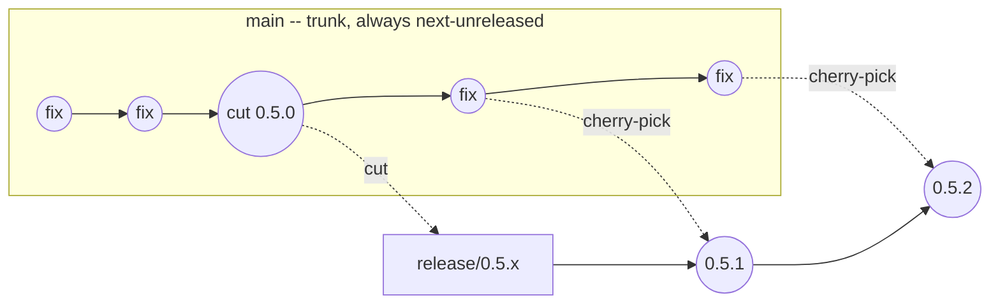

# Release branching model — trunk-based development, branch at cut time

- **Status:** historical
- **Owning queue item:** [RELEASE-BRANCHING-001](../../roadmap/active-work.md#x-release-branching-001-adopt-trunk-based-development-with-cut-time-release-branches)
- **Completion / archival evidence:** [RELEASE-BRANCHING-001](../../roadmap/active-work.md#x-release-branching-001-adopt-trunk-based-development-with-cut-time-release-branches) model and backport CLI; remaining `prepare` cut owned and completed by [RELEASE-BRANCHING-002](../../roadmap/active-work.md#x-release-branching-002-refuse-a-versioned-release-cut-on-the-default-branch)

## Why this document exists

During the 0.5.0 cycle, work landed on a long-lived `planning/0.5.0-scope` branch,
created specifically to avoid disturbing the 0.4.1 release while it was in flight.
Once 0.4.1 shipped, that isolation reason no longer applied, but the branch kept
being used out of habit — and `main` kept moving independently (a peer PR merge for
#131, `CONTRIBUTING.md`) while `planning/0.5.0-scope` kept moving independently too
(the patch bundle, the process-robustness epic, design docs). By the time this was
noticed, the two branches had diverged by 15 and 19 commits respectively. Reconciling
them required a real merge with real conflicts (`CHANGELOG.md`, the doc-authority
marker, `active-work.md`, the TCB pin) — pure integration overhead, not
value-adding work.

This is the textbook failure mode of a long-lived integration/"develop" branch (the
GitFlow pattern): the longer two branches move independently, the more expensive and
riskier the eventual reconciliation. This document records the better practice going
forward and proposes what would need to change in `litai`'s own release tooling to
make it easy to follow.

## The model

**`main` is the single trunk. All work lands there, continuously, directly** —
matching the convention this repository already mostly follows day to day (commit
directly to `main`, no long-lived feature branches for ordinary fixes). This applies
equally to bug fixes, small features, and even multi-issue epics like the
process-robustness work: none of those needed architectural isolation from `main`:
each issue was independently shippable, and bundling them onto a separate branch for
weeks only manufactured the exact divergence problem this document is about.

**A release branch (`release/0.N.x`) is cut from `main`'s exact tip only at the
moment of `litai release prepare`** — not before, not as a staging ground during
development. Once cut, it is frozen except for release-critical fixes for that
specific release line (security patches, regressions found post-cut).

**Backports are fix-forward-then-cherry-pick, never fix-only-on-the-branch:**

1. Land the fix on `main` first. `main` must never be missing a fix that only exists
   on a release branch — that's how fixes get silently lost across release lines.
2. Cherry-pick that exact commit onto the release branch for a patch release
   (`0.N.1`, `0.N.2`, ...). Agents decide which default-branch commits are small
   enough for that patch (see `skills/agent/release-project/SKILL.md` and
   `docs/architecture/project-releases.md`). Humans decide when the next minor or
   major is cut, and override a patch-content call only when they disagree.
3. If the fix doesn't apply cleanly (the branch has diverged too much from `main` at
   that file), that is itself a signal the release branch has drifted further than
   intended — resolve the conflict deliberately, don't let it become routine.

**`main` perpetually represents "next, unreleased."** This already matches the
convention this repository's own `CHANGELOG.md` follows (an `## Unreleased` section
that becomes a version heading only at prepare time) — this model just extends the
same idea to the branch topology, not only the changelog.

The current Release Policy makes that statement precise: `main` is always writable for
ordinary new work, whether its state is Free or Pre-release. Pre-release names one
`major.minor` target and permits green RC tags only on exact `main`. Once the matching
line is cut it is locked down; only README Release Engineers merge release-line pull
requests or create/publish major/minor releases. A project's strict/loose patch authority
may grant listed writers a reason-bearing break-glass patch, but only after the exact fix
lands on `main`.

## Working on an already-branched release

Once a release branch exists — cut at prepare time per the model above, or (as
happened this cycle, see below) created earlier as a pragmatic branch-consolidation
step — the same discipline applies going forward: **only commits *for* that release
go on its branch. Forward-looking work (design docs, planning for a later release,
anything not part of shipping the current one) goes on `main`.**

This isn't just topology hygiene. Every commit on a release branch is expensive in a
way a commit on `main` isn't: this repository's self-hosting TCB pin and
documentation-authority marker (see `CONTRIBUTING.md`) have to be recomputed and
re-verified — including a full `make python-check` run — for every commit that
touches `src/` or `docs/`, on whichever branch it lands on. Landing planning/design
work for a *future* release on the *current* release's branch means paying that full
convergence cost (TCB re-pin, doc-marker refresh, full suite) for content that has
nothing to do with what's actually shipping, and it pollutes the release branch's
history with commits an eventual `git log release/0.N.x` audit has to mentally filter
past. Keep all convergence/reconciliation work for a release confined to its own
branch; keep everything else — including planning for whatever comes after — on
`main`, where it costs nothing extra and is immediately available without waiting for
the current release to ship and merge back.

## Deviation observed and corrected (2026-08-20)

Practice drifted from this document without anyone deciding to: `0.5.0`, `0.5.1`, and
`0.5.2` were each cut onto their *own* branch — `release/0.5.0`, `release/0.5.1`,
`release/0.5.2` — rather than one `release/0.5.x` line as the model and the diagram
above both specify. `skills/agent/release-project/SKILL.md`, which is what an agent
actually reads at release time, had codified the deviation as `release/x.y.z`; that is
now corrected to `release/<major>.<minor>.x` and states the rule explicitly.

The topology was, fortunately, already correct: each branch is a strict ancestor of the
next (`79ba1409` → `f3359691` → `20441519`), so the three names were one maintenance
line wearing three labels, and consolidating onto `release/0.5.x` at the 0.5.2 tip
required no history rewriting.

The naming mattered more than it looks. A per-patch branch destroys this model's central
drift signal: the rule that "a backport which no longer cherry-picks cleanly means the
release line has drifted from the trunk" only functions when drift accumulates against
one persistent branch. Cutting a fresh branch for every patch silently resets that signal
to zero each time — which is a plausible reason the `main`-versus-`v0.5.x` divergence
went unnoticed across two releases. The tag, not the branch, is the per-release artifact.

## What this replaces

Not GitFlow's persistent `develop` branch, and not this cycle's ad hoc
`planning/0.N.0-scope` pattern — both are long-lived integration branches that
accumulate divergence risk with every day they're not merged. A planning *document*
(like `0.5.0-scope.md`) is still useful and belongs on `main` directly; only the
*code* isolation is the anti-pattern, and code doesn't need isolation for work that
was never architecturally coupled to a specific release in the first place.

## What `litai`'s own release tooling does and does not do

When `literate.release.json` names `default_branch`, `litai release plan` is
read-only on that trunk or on `release/<major>.<minor>.x`. A plan from the
trunk records `release_line.create: true` only when that line does not exist
locally or on the remote; `prepare` then creates it from the plan revision and
checks it out. `check` and `publish` refuse `default_branch` and any other
name, including a per-patch `release/x.y.z`. If the line already exists, plan
on the trunk fails: checkout the existing line (or
`litai release backport --from`) and plan there.

`litai release backport COMMIT... --to BRANCH [--from REF]` cherry-picks
already-landed commits onto a release branch (creating it from `--from` if
needed). `litai release backport-status BRANCH [--against REF]` lists trunk
commits not yet applied.

Every pull request declares `Literate-AI-Release: major.minor` or
`Literate-AI-Release: none`; absent, duplicate, malformed, or stale values remain unknown.
LitAI commands enforce release state, authorization, trunk-first backports, exact-main RC
tags, and line publication. Forge branch protection is an independent control that should
mirror these rules; this document does not claim it is configured. End-of-cycle cleanup
uses durable `merged`/reason-bearing `dead` markers and dry-run-first `litai project
peer-work gc`, which rechecks worktrees, open reviews, branch ancestry, protected branches,
and exact marker heads before an explicitly authorized safe deletion.

## What actually happened this cycle (tactical resolution)

`planning/0.5.0-scope` and `main` were reconciled via one non-destructive merge
(preserving both branches' existing commit history rather than rebasing, since
agents were still actively pushing to `planning/0.5.0-scope` at the time and a
rebase would have broken their next push). Once the epic's remaining items land,
the combined branch replaces `main` directly and `planning/0.5.0-scope` is retired —
all subsequent 0.5.0 work lands on `main` directly, per the model above.
