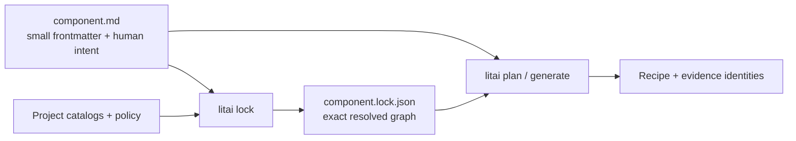

# Component authoring and lock separation

- **Status:** partial
- **Owning queue item:** [Framework score-improvement program](active-work.md#framework-score-improvement-program)
- **Completion / archival evidence:** [Landed foundation and remaining cutover](#already-landed-specification-node-foundation)

`component.json` currently combines two different jobs: human intent and exact
resolved identities. The result is trustworthy for machines but unnecessarily expensive
for humans to maintain. This roadmap separates those jobs without weakening any current
identity, review, or fail-closed boundary.

## Deliverable 1: classify every field

Produce a reviewed field matrix for Component, Flavor, workflow, routing, skill,
acceptance, and repository-source references. Mark each field as authored intent,
resolvable selector, resolved identity, or runtime evidence.

Acceptance criteria:

- no field is left dual-purpose;
- behavioral meaning, capability names, version ranges, optionality, entrypoints, and
  catalog-relative locations remain authored intent; and
- content digests, selected exact revisions, transitive closure, and resolver identities
  are classified as lock data unless an explicit security boundary requires an authored
  pin.

## Deliverable 2: define the authoring manifest

Add a versioned Markdown-frontmatter authoring schema for `component.md` that keeps the
Component readable and composable. Follow the same constrained-YAML rule as
`literate-markdown@1`: reject unknown keys and parser-dependent YAML features, derive
obvious IDs and paths, and keep descriptive prose in Markdown. Preserve explicit pins
when the author intends them, but do not require a human to recalculate derived hashes
after every ordinary documentation edit.

Acceptance criteria:

- a complete small Component fits on one readable screen excluding prose specifications;
- a person or LLM can author the declaration without producing minified JSON or content
  digests;
- Component requirements remain capability-based and recursively composable;
- explicit user pins always outrank defaults and resolution; and
- schema migration is deterministic and rejects ambiguous legacy fields.

## Deliverable 3: define `component.lock.json`

Add a canonical, Git-friendly lock schema containing exact Component and Flavor
revisions, specification/skill/workflow/routing/acceptance identities,
repository-source locks, identity-bound requirement-constraint satisfaction decisions,
composition decisions, toolchain constraints, and the
resolver/policy identity that chose them. The lock contains no product behavior that is
absent from authored inputs.

Acceptance criteria:

- canonical serialization is byte-stable across machines and catalog traversal order;
- every generation recipe input can be traced either to authored intent or one lock field;
- stale, missing, forged, cyclic, or policy-mismatched locks fail before model egress; and
- lock diffs are concise enough for ordinary code review.

## Deliverable 4: implement `litai lock`

Add `litai lock [COMPONENT|PROJECT]`, `litai lock --check`, and a structured diff mode.
The update command resolves current catalogs and writes locks atomically. The check
command is non-mutating and suitable for CI. No coding model is needed for deterministic
identity resolution.

Acceptance criteria:

- two clean updates produce identical bytes;
- `--check` identifies the exact authored or catalog input that made a lock stale;
- interrupted resolution never replaces the prior valid lock; and
- generated source, source-cache contents, and runtime evidence never enter the
  repository through this command.

## Deliverable 5: consume locks throughout the lifecycle

Make `plan`, `generate`, `rebuild`, publication, SBOM generation, and source promotion
consume the exact current lock. Recipe and CycloneDX identities must bind the same
resolved Component graph.

Acceptance criteria:

- plan output explains authored selector → lock decision → exact revision;
- changing only the lock changes the recipe identity when and only when effective inputs
  change;
- source-cache lookup cannot reuse an entry resolved under another lock; and
- component-level dependencies appear consistently in composition, source SBOM, resolved
  SBOM, and publication evidence.

## Deliverable 6: migration and compatibility exit

`litai component migrate COMPONENT|PROJECT` now provides the explicit non-destructive
migration command and focused welded-manifest fixtures. Project mode preflights every
Component and publishes the complete set under one project lock; an injected failure
proves that it removes only exact documents created by that transaction and preserves
every legacy byte. All 17 current sample Components have migrated authoring documents
and pass the semantic migration recheck. Newly written and source-promoted projects use
the split format immediately. Legacy authoring is deprecated in 0.2.0, 0.2.x is the
final migration/equivalence window, and 0.3.0 removes the reader. Ordinary project
operations already reject legacy-only Components with the exact
`litai component migrate COMPONENT` remediation.

Acceptance criteria:

- every current sample migrates without semantic graph change;
- old → migrate → lock → plan matches the pre-migration effective recipe identities where
  serialization did not itself participate in authority;
- rollback instructions preserve the original files; and
- the removal release and error messages are documented before deprecation begins.

## Deliverable 7: authoring ergonomics and proof

Update `litai init`, the top-level skill, JSON schemas, editor hints, examples, diagrams,
and tests. Add one three-level Component fixture to prove that locks remain factored
rather than becoming a monorepo-sized generated manifest.

The default authoring surface is one `component.md`, not a directory template full of
peer serializations. That document contains both readable Component metadata and the
observable behavioral specification. `component.lock.json` is generated separately;
normalized JSON views are inspection output, not hand-maintained authority. Split prose
only at a named domain/module boundary, retain a separate public-interface document only
for an actual compositional contract, and keep repository harness metadata plus private
acceptance oracles outside the Component directory.

Acceptance criteria:

- a new user can author, lock, plan, and explain the invoice graph from the
  getting-started path;
- the smallest initialized or sampled Component has exactly one authored file before
  lock resolution, and every additional authored file states the boundary it represents;
- deterministic unit tests cover schema, ordering, atomic writes, stale checks, and diffs;
- conformance covers migration and the three-level graph; and
- documentation authority review binds the new taxonomy before release.

## Already-landed specification-node foundation

This roadmap no longer needs to invent the behavioral document shape. Schema v2 now
includes strict `specification-node-authoring`, `specification-node`, and
`effective-specification-context` contracts. The `literate-markdown@1` provider derives
node IDs and parents from `spec.md` folder structure, validates explicit local
references, rejects cycles and unknown frontmatter, and supplies one canonical context
graph to generation without copying ancestor prose. `LOCK-200` must preserve those
semantics while removing the remaining welded Component manifest.

Deliverables 1 through 4 and the transactional migration writer are operational:
strict `component.md` parsing, selected lock and separate catalog-audit contracts,
deterministic resolution, atomic update, non-mutating check/diff, and a round-trip-proven
legacy projection that preserves `component.json`. Project planning and the simplified
sample portfolio consume `component.md`; the external default rebuild driver and final
compatibility-removal release remain the open Deliverable 5/cutover work. Legacy JSON is
therefore migration input, not newly authored sample authority.
