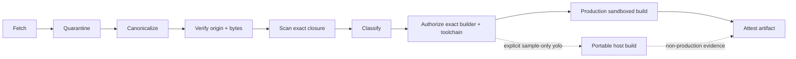

# Source Trust, Classification, and Build Policy

## Status

This is the initial security architecture and delivery plan. It is not yet an enforced
security boundary. No implementation may claim source is safe merely because this plan
exists or because a signature is valid.

## Assumption and invariant

Cache population receives authoritative signed source. Verification establishes that
the fetched canonical source tree is the source authorized by an accepted signer and
has not changed. It does **not** establish that the source is non-malicious, suitable for
a given machine, free of vulnerable dependencies, or safe to compile and execute.

The mandatory trust path and the explicit sample-only exception are:

The solid route is the production path. The dotted route describes only the portable
sample adapters. The shipped Python, C++, Rust, JavaScript, and composite
Rust/JavaScript host builders have no cross-platform OS sandbox. They accept only the
explicit unsandboxed-host profile, complete ambient privilege enumeration, and an
acknowledged `yolo` authorization; a request that labels them constrained is rejected.

Every arrow emits an immutable event. A cache hit may reuse an unexpired decision only
when all bound source, dependency, scanner, policy, trust-root, builder, and toolchain
identities match.

## Security objects

- `OriginAttestation`: signer, trust root, verification method, canonical tree digest,
  source-provider facts, revocation data, and verification result.
- `FindingSet`: normalized scanner/tool findings over exact source or artifacts,
  including tool/version/config/database identities and uncertainty.
- `SecurityClassification`: effective policy decision over source, dependency closure,
  attestations, findings, exceptions, and policy version.
- `BuildAuthorization`: short-lived capability binding one classification to one builder,
  toolchain, sandbox profile, machine/resource class, and requested outputs.
- `BuildAttestation`: inputs, authorization, environment/sandbox facts, logs, outputs,
  and reproducibility result.
- `ObservationExecutionAuthorization`: short-lived authority to execute exact analyzed
  source through a named harness/runner/sandbox for dynamic evidence, separate from
  compilation/build authority.
- `SecurityException`: actor, reason, approval policy, exact scope, expiration, and
  revocation state. It never changes historical findings.

All objects are content-addressed where deterministic; operational timestamps and
revocation events remain append-only event data.

## Classification profiles

| Profile | Intended behavior |
|---|---|
| `constrained` | minimal network/filesystem/process privileges; accepted low-risk policy |
| `reviewed` | human or delegated review required for enumerated findings/privileges |
| `privileged-review` | stronger approval and isolation for elevated build requirements |
| `blocked` | no build authorization may be issued |
| `yolo` | exceptional explicitly enumerated privileges with full warnings and audit |

Profiles are policy inputs, not trust labels embedded by a Component author. Dependency
risk propagates to the effective closure; a consumer cannot erase a dependency finding.

## Full-yolo policy

`yolo` deliberately supports the “go crazy knobs all turned up” workflow for users who
accept the risk. It must still be difficult to confuse with a normal secure build:

- no default, inference, compatibility fallback, environment accident, or missing config
  may select it;
- it applies to one exact signed Component revision and exact dependency closure;
- the request enumerates each privilege it actually needs from network, host filesystem,
  device, process, secret, compiler, package-manager, and sandbox escape capabilities;
  no hidden wildcard or automatic all-privilege expansion is allowed;
- an authenticated actor supplies a reason, expiry, and interactive or policy-approved
  acknowledgement of maximum risk;
- warnings remain visible throughout CLI/API/UI, run events, logs, cache views, bundle
  manifests, provenance, and publication records;
- revocation prevents new work immediately, while historical records remain intact;
- it bypasses safety classification restrictions only as explicitly listed; it never
  bypasses signature, exact identity, provenance, audit, or output attestation; and
- published yolo-built artifacts remain marked so downstream policy can reject them.

For automation, acknowledgement is a signed policy grant, never a generic `--force` or
ambient environment variable.

## Enforcement boundaries

- Source is initially quarantined and cannot be imported/executed by framework code.
- Scanners operate with bounded parsers and do not execute repository hooks or build
  scripts.
- The builder port requires a valid `BuildAuthorization` argument; adapters reject calls
  that lack or mismatch it. Shipped builder defaults fail closed until composition
  supplies a live revocation provider; the direct verifier is only for isolated tests.
- Portable host builders hash the authorized source tree before compilation and again
  before accepting an artifact. As with the execution checks below, this detects
  observed drift but is not an atomic immutable-source guarantee.
- The Rust/JavaScript full-stack builder authorizes the whole generated tree and exact
  composite toolchain once. It does not derive weaker role-local grants: the sealed
  artifact binds the Rust backend executable and every checked frontend script under
  the same request and authorization.
- Dynamic observation runners require a valid `ObservationExecutionAuthorization` and
  cannot reuse a build authorization or infer authority from a source signature. A
  blocked or pre-labeled yolo classification still requires explicit
  `yolo_acknowledged` issuance, and the grant binds its profile and warning. Shipped
  host and dynamic-observation boundaries fail closed until composition supplies a live
  revocation provider. Current revocation state and local input identity are distinct,
  adjacent pre-launch checks; neither is an atomic transaction with process creation.
- The portable host-artifact runner verifies its recorded artifact-tree, entrypoint, and
  support-tree identities before launch and after exit, before accepting any output.
  Those checks are temporal rather than an atomic filesystem snapshot: they detect
  observed drift, including self-modification by a successful child, but cannot exclude
  a change-and-restore race. Production isolation must provide immutable input mounts,
  handles, or an equivalent platform guarantee.
- Production build execution uses a policy-selected sandbox. The policy records network,
  mounts, credentials, devices, process limits, and output extraction rules. No shipped
  portable host builder currently satisfies that production boundary.
- Toolchains and dependency downloads are identity-locked. The Python builder binds the
  interpreter bytes and runtime identity; C++ binds the compiler command, bytes, family,
  and version; Rust binds both a possible rustup launcher and the selected sysroot
  compiler bytes, paths, arguments, and verbose version; JavaScript binds the Node.js
  command, bytes, arguments, and version. The full-stack identity combines the exact
  Rust and Node.js identities. Builders check the relevant identities before and after
  compilation or syntax checking. This is not a complete toolchain closure: dynamically
  loaded libraries, SDK headers, and the host OS remain non-hermetic and require a
  captured production toolchain image. Dynamic downloads require a separately
  authorized, captured source object.
- Flavor selection may request toolchains, devices, network, or filesystem privileges but
  cannot grant them, lower effective classification, or select `yolo`; authorization
  remains a separate policy decision over the exact effective revision.
- Output is scanned/attested before it becomes an `ArtifactBundle` or can be published.
- Publication policy can reject classifications and yolo provenance independently of
  local build policy.
- Publication manifests embed their exact request and short-lived policy authorization.
  Filesystem publication validates source/effective-revision/provenance identities,
  target, profile, expiry, and revocation before writing local or remote publication
  state. Legacy manifests require explicit migration context for facts they did not
  record; the reader never invents them.
- Import requires a distinct current local policy and authorization over the exact
  manifest, source/provenance/classification, source target, and local destination.
  Classification or authorization revocation, profile rejection, expiry, or destination
  mismatch fails before local CAS and event writes.

## Delivery plan and gates

1. Define strict schemas, canonical identities, policy evaluation, and denial errors.
2. Implement trust-root and signature verification adapters with revocation tests.
3. Implement quarantine, static scanners, finding normalization, and dependency
   propagation without executing source.
4. Implement classifier policy plus explicit reviewed and yolo exception workflows.
5. Require expiring build authorization in every builder adapter and add sandboxed
   reference builders.
6. Attest/scan outputs and enforce publication policy.
7. Expose typed settings and unmissable status/warnings through CLI/API/UI contracts.
8. Run adversarial tests for valid-signed-malicious source, confused deputy, TOCTOU,
   stale/revoked decisions, dependency substitution, sandbox escape requests, forged
   yolo acknowledgement, and warning/provenance removal.

Constrained or production build execution remains unavailable until step 5's sandboxed
reference builders and adversarial tests exist. The sample ladder's separately named
host builders run only after explicit unsandboxed `yolo` acknowledgement. A future
production-security claim additionally requires a threat model, independent review,
supported-platform isolation evidence, incident and revocation procedures, and
continuous policy/scanner update management.
