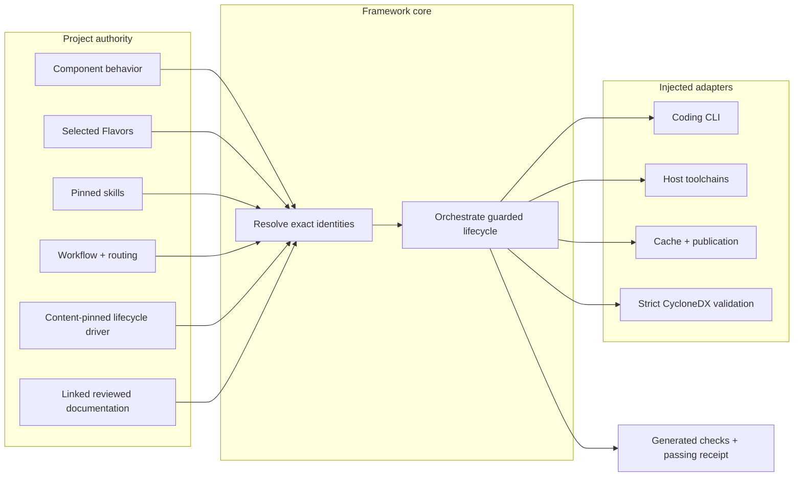

# Literate AI user guide

Literate AI is a release-engineering and SDLC harness: it templates new
repositories, converts existing ones, and runs an evidence-gated `dev`
workflow through verify, rebuild, and versioned release. Readable Component
specifications remain authority; generated source is disposable. This guide
separates what an operator does from the lower-level framework contracts a
product integrates.

“Literate” keeps Don Knuth's human-first idea without imposing a notebook or tangled
source format: readable intent leads, while exact machine identities make the
explanation executable and auditable. The diagrams in this guide are reading maps for
that relationship, not extra framework layers.

## Architecture at a glance

The project artifacts decide intent and policy inputs. The provider-neutral core
resolves and enforces them; adapters are the only layer that talks to coding agents,
host compilers and runtimes, filesystems, or publication destinations.

## Choose a path

Start with [Getting started](getting-started.md) for a runnable tour, then use
[the framework flow](framework-flow.md) for the one-page golden path and the
[canonical project layout](project-layout.md) for the repository taxonomy. The sections
below are task-specific follow-ons.

### I have an existing source tree

1. [Install Literate AI](installation.md).
2. Run `litai doctor`, then inspect `litai onboard adopt PATH`. Re-run it with
   `--apply --acknowledge` when the catalog can wrap the tree. Follow
   `skills/agent/convert-project/SKILL.md` after the harness stamps the taxonomy.
   See [Getting started](getting-started.md).
3. Inverse [source to specification](source-to-specification.md) remains a later
   authority-transfer tool for promoting original source to spec-led release
   authority; it is not the adoption path.

### I am designing a Component

1. Start with [Getting started](getting-started.md) and the
   [framework flow](framework-flow.md), then read
   [core concepts and layered Components](concepts.md).
2. Write [readable, factored specifications](specifications.md), then define
   [identity and exact versioning](components-and-versioning.md).
3. Keep OS, GPU, language, and toolchain differences in
   [Flavors and target profiles](flavors-and-targets.md).
4. Select [model groups, selectors, and generation workflow](models-and-generation.md).
5. Keep generated checks, verifier acceptance, and the current receipt separate by
   following [the framework test flow](framework-flow.md#three-test-artifacts-three-jobs).
6. Decide how [caches, packages, and publication](caches-packages-publication.md) work.
7. Preserve the complete [CycloneDX SBOM and dependency graph](../architecture/sbom-and-dependency-graph.md).
8. Apply [source trust and build security](security.md) before any build.
9. Release the exact repository authority through the
   [project release protocol](../architecture/project-releases.md).

### I am maintaining a release line

1. Read the [Release Policy](../architecture/project-releases.md#release-policy).
2. Keep ordinary work on writable `main`; classify every pull request with exactly one
   `Literate-AI-Release: major.minor` or `Literate-AI-Release: none` line.
3. Use LitAI release commands for state transitions, RC tags, backports, checks, and
   publication. Treat forge branch protection as a separate setting that should mirror
   the policy, not as something LitAI silently configures.
4. Inspect worktrees and pull requests before using the marker-based, dry-run-first
   peer-work garbage collector.

### I am integrating the framework

1. Read the [CLI and configuration reference](configuration-and-cli.md) to understand
   the current supported operator surface.
2. Run the [conformance samples](samples.md).
3. Read [product integration, migration, and rollback](ova-and-migration.md) for the
   application-specific adapter and compatibility-reader boundary.

## Reference

- [Troubleshooting](troubleshooting.md)
- [Glossary](glossary.md)
- [Repository documentation index](../README.md)
- [JSON Schemas](../../schemas/v1/)

## Current boundary

The installed `litai` catalog is an SDLC: onboard (`doctor`, `onboard create`,
`onboard adopt`, `status`), lower-level project mutation (`init`, `init --convert`,
`update`, `reparent`), the `dev` workflow (`verify`, `lock`, `plan`, `rebuild`,
`build`/`test`/`run`, `package`), and versioned `release`. Authority, operator,
and inverse `spec *` commands stay available but are not the product front
door. `--target` selects a
generation/Flavor profile, while `--worker` selects local or command execution through a
typed dispatch contract. `litai rebuild`
runs a content-pinned project lifecycle driver; project-specific native builders remain
adapters rather than hidden policy in the neutral CLI. Product-specific UIs, domain
policy, native adapters, and operator workflows are not framework commands.

Today, `litai rebuild` selects the lifecycle binding declared by the project. A
Standard-bound project runs the provider-neutral per-Component application service with
source-only candidates, typed artifact assembly, accepted-source cache custody, and an
aggregate receipt. This repository declares a content-pinned external driver whose
samples still use the host lifecycle facade. Complete sample and qualification
migration, link/package actions, and root-integration acceptance remain delivery work.
See [the framework flow](framework-flow.md) for the explicit boundary map.

The [constraint classification decision](../decisions/0003-constraint-classification.md)
separates framework invariants from current repository policy and future delivery
claims. In particular, the high-level lifecycle is not a claim that every stage has an
independent mutable CLI command or that the included runners form a hardened OS sandbox.
