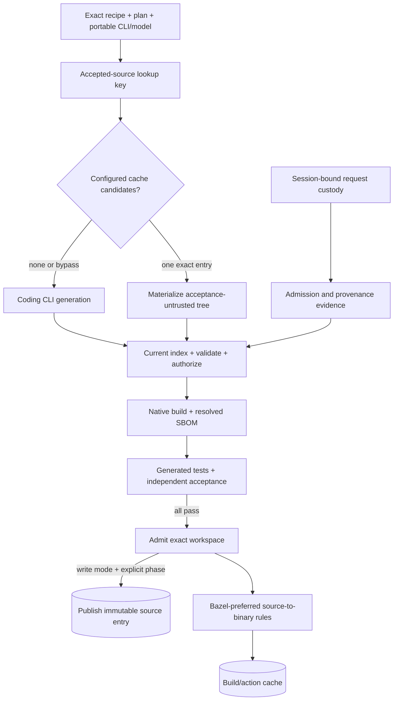
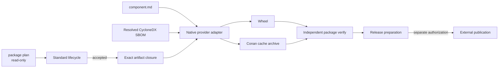

# Caches, packages, and publication

Local cache readiness and publication are different concerns. A Component can be usable
from a local cache without being published, and importing a publication must not trigger
republishing.

## Empty-cache operation

Each user may begin with an empty cache. Resolution first works with lightweight
descriptors, then faults exact source, specifications, indexes, evidence, and packages
into content-addressed storage for the selected dependency closure. Objects are verified
by identity when stored and read.

Mutable aliases such as `latest` live outside immutable objects. A broken alias can be
repaired without rewriting content. Cache deletion is an explicit user operation; a
compatibility reader never deletes legacy data.

## Iteration directories

Two conventional environment variables make ordinary development incremental:

| Variable | Default | Contents |
| --- | --- | --- |
| `BUILD_DIR` | `<project>/generated` | Git-friendly immutable accepted source, its derivation manifest, and the complete coding-agent prompt |
| `OBJ_DIR` | `<project>/_build` | Host/CPU/toolchain-specific objects, executables, build-result records, Bazel caches, and other disposable build state |

Relative overrides are resolved against the project root. Standard runtimes publish a
`BUILD_DIR` entry only after generated tests, root packaging, packaged execution, and
independent project acceptance complete. Component acceptance may stage exact membership
evidence, but it does not make the source reusable by another run. The key covers the
exact Component lock, recipe/specifications, selected Flavors and skills, execution plan,
coding-CLI executable binding, model selector, and exact prompt. A miss invokes the
coding CLI; a hit materializes the bytes into a fresh runtime path and recreates current
source-intelligence evidence before every downstream gate.

The accepted derivation, source and resolved CycloneDX bindings, managed dependency
graph, publication request, import request, and transfer receipt must all name that same
Component lock. A missing or substituted lock is not a cache miss fallback: it is
invalid provenance and fails closed.

Standard also admits a narrower source-only member after coordinator generation and
independent source verification, before target-specific object work. Its closed
evidence binds the exact source manifest/tree/BOM/test suite, Component plan/lock/key,
recipe, Flavor and skill closures, coding-CLI tool/transcript, source selectors,
framework distribution, verifier, test plan/results, and admission time. The enclosing
component-orchestration request and exact per-node coding-CLI planned request are
separate custody bindings. Neither is the reusable lookup identity: fresh workspace,
channel, session, nonce, or transaction allocation may change both without changing
accepted source semantics. The versioned accepted-source lookup instead binds the
recipe (which closes over Component definition, lock, selected Flavors, skills, and
source-relevant inputs), execution plan (workflow/routing policy), portable coding-tool
binding, model/provider binding, and a sanitized source-semantics identity over the
effective target authority: Component generation plan/key, context manifest, direct
interfaces, entrypoints, and bounded prompt. The Component lock independently binds
repository lineage. Complete project-review authority remains in the exact coding
transaction and its provenance, but is deliberately absent from reusable lookup so an
unrelated sibling catalog, narrative document, receipt policy, or other downstream-only
project change cannot cause another paid model invocation. Admission still verifies both
request identities through candidate
provenance and never equates or accepts either in place of the other. It contains no
build, binary, package, resolved-SBOM, or final acceptance claim.
Publication rehashes the complete source closure and requires every lookup, custody,
cache-entry, and evidence identity to match.

`litai rebuild --from-accepted-source` admits only this source-only membership for each
planned Component. The worker restores bytes, rechecks membership against its current
plan and target selector, and begins at source indexing/object construction without a
generator fallback. Before local or remote dispatch, the staging side discovers exactly
one provider/tool binding from entries that retain valid key membership and referenced
cache objects. It binds that non-secret identity into request authority and carries the
same binding into the local Standard rebuild or remote worker, so continuation
reconstructs the published provider/tool key without receiving a session, channel,
authentication key, original checkout path, or usable generator transport. Missing
membership, a mixed-provider cache, and any later semantic mismatch fail closed. The
worker's ambient coding provider cannot silently replace that binding. Downstream
lifecycle results retain the source-admission identity; any later failure prevents
project admission and receipt finalization.

`OBJ_DIR` entries additionally bind the generated tree, exact semantic build request,
the content identity of the builder implementation closure, selected build-system
Flavor, host toolchain byte identities, and a canonical
operating-system/architecture/ABI/target-triple namespace. Its full identity is the
filesystem key in the compact `t/<target-digest>/{a,r,s}` layout; the readable values
remain in each cache report and record without lengthening every nested artifact path.
One shared object root therefore cannot alias Linux, macOS, Windows, CPU, ABI, or target
configurations. The cached artifact tree is rehashed before reuse. A first
build whose adapter returns an artifact outside `OBJ_DIR` is copied into the managed
target namespace and rehashed before it can become reusable. Bazel receives persistent
repository and disk caches beneath `OBJ_DIR`, so a source change invalidates affected
actions rather than the entire compiler universe.

Build bytes and permission to use them have deliberately different lifetimes. The
artifact key excludes both the ephemeral authorization ID and the specification
revision: a revision change must reconsider source generation, but byte-identical
generated source does not need recompilation. Every hit still revalidates the current
revision-bound grant (including live revocation and explicit unsandboxed-host policy
where applicable). The returned result names that fresh grant while
`cache_origin_authorization_id` preserves the grant that originally produced the
artifact bytes. Cached evidence is therefore reusable; historical authority is not.

Cache roots contain a portable project-owner marker. Literate AI refuses to adopt a
non-empty unmarked directory except for the exact conventional `<project>/_build`
boundary, whose name explicitly designates all contents as disposable. Before adopting
or removing that boundary it rejects links, reparse points, and special files. Cleanup
requires the marker's exact project owner and cache kind everywhere else and refuses a
foreign or wrong-kind root:

```console
litai clean          # remove OBJ_DIR only
litai really-clean   # remove OBJ_DIR and BUILD_DIR
# The Makefile exposes the same make clean / make really-clean targets.
```

Cache lifecycle locks live in the project-local `.litai-cache-locks` namespace, outside
the roots that cleanup removes. Initialization, publication, and cleanup take the root
lifecycle lock before any entry lock, and subtree creation rejects symbolic links and
Windows reparse points component by component before writing. Concurrent writers use
first-writer convergence: later writers verify and return the persisted result, while a
build-result loser must revalidate its current authorization before reusing those bytes.
Build artifacts must remain at the digest-derived path beneath their exact OS, CPU, ABI,
target-triple, and target-material namespace; mere containment somewhere in `OBJ_DIR` is
not sufficient.

Both roots are ignored in this repository and in newly initialized projects by
default. To publish generated source in a Git/monorepo cache, explicitly change the
ignore policy or force-add only the source marker and immutable source entries, for
example `git add -f generated/.litai-cache-root.json generated/sources`. Never
force-add the whole `generated` tree. The sibling `_build/` boundary must never be
versioned or indexed. `really-clean` removes the complete
marked `BUILD_DIR`, including tracked or uncommitted generated-source entries; tracked
copies are recoverable from Git, but uncommitted entries are not. Prefer an explicit
project-relative `source_cache` publication target when the generated cache is durable
shared project state, and reserve `BUILD_DIR` for the destructible local iteration
cache. Cold and warm durations plus hit/miss counts appear under the
report's non-authoritative `operational_metrics`; they are deliberately excluded from
the passing receipt identity.

The sample conformance lifecycle currently installs these local source and build cache
adapters and provides the executable reference behavior. A remaining framework-wide
milestone is to make the same cache composition a mandatory outer lifecycle seam for
every derived driver, with conformance tests proving that custom drivers cannot omit
fresh authorization, artifact containment, target separation, or force-bypass
semantics. Until then, a custom lifecycle driver must opt into the adapters explicitly;
the cache directory names alone do not provide reuse or authority.

## Two derivation caches, two authority boundaries

Ordinary lifecycle commands also retain one target- and worker-bound artifact export.
For local execution it identifies the admitted runnable artifact. A synchronous command
worker returns the same versioned export contract with an immutable artifact URI; the
short Component lookup used by the CLI never replaces the authoritative Component path
inside that record. `litai run` rejects an export when its Component, target profile,
worker, parameters, generated source, or toolchain authority differs from the
current request. Export retention enables reuse; it does not make an artifact portable
across incompatible workers or targets.

For a multi-entrypoint Component, one export retains the shared build custody and every
named command. `litai run COMPONENT --entrypoint NAME` selects one exact command;
omission uses the first declared entrypoint. Unknown names fail closed. Worker-CAS
locators distinguish identical artifact bytes built with different execution manifests,
so a cached command can never silently survive a command-only authority change.

Literate AI treats specification-to-source and source-to-binary as separate rule
engines:



The new Standard source runner makes the publication boundary more explicit than the
diagram can show. Generation writes immutable files and evidence to local CAS and
returns a source-only candidate. That is storage, not publication. The corresponding
coding-CLI/cache result remains pending until the outer lifecycle supplies the exact
accepted candidate; only then can `publish_accepted_candidate` expose it through the
configured source-derivation cache. A substituted candidate, generation failure, or
later lifecycle rejection cannot publish the pending result.

The authenticated `service-stack` adoption proof exercises that runner three times—one
generation request per Component—and reports both source-cache and build-cache outcomes.
Its current node test and execution commands are smoke/acceptance probes, not generated
test-manifest execution. It therefore remains operational evidence rather than a
receiptable Standard result until generated-test execution and post-build CycloneDX
reconciliation are present; aggregate hashes must not stand in for either evidence role.

Tree and storage identities also remain distinct:

- `tree_identity` is the canonical normalized file-tree digest;
- `source_bundle_identity` identifies the retrievable CAS tree-record root;
- `source_manifest_identity` identifies the immutable CAS manifest that references
  that record and the generation evidence.

For remote accepted-source staging, the canonical tree manifest also retains one
portable executable-intent bit per regular file. Archive extraction applies only safe
`0644`/`0755` modes on POSIX. Windows revalidation uses the accepted manifest's intent
because its filesystem cannot represent POSIX executable bits, but it still rehashes
every path and payload; a content, type, symlink, or path change remains an identity
failure. The transport archive digest separately protects executable metadata in
transit.

Do not compare a builder's semantic tree digest with the source-bundle digest. The
former proves the normalized path/size/content tree being built; the latter locates the
immutable storage record needed to retrieve those exact file blobs. Release publication
uses a typed `SourceBundleClosure` containing that root and every child file `BlobRef`;
publishing the root alone is invalid because publication storage does not recursively
interpret arbitrary manifests.

`SourceDerivationCacheKey` binds the exact recipe, execution plan, coding-CLI
selection, resolved model identity, and prompt request. A model can legitimately
produce several trees for that same request, so one key may have several immutable
`AcceptedSourceDerivation` records. Every record additionally binds the source tree,
fresh generated-test suite, build evidence, test evidence, and acceptance identity;
callers must use an explicit selection policy rather than a mutable `latest` guess.
The model binding records the provider selector and, when the provider exposes one, its
exact model revision. When no model flag is configured, the portable
`cli-configured-default` selector records that omission; it does not claim that the
provider's mutable default or underlying weights are independently attested. The
selector spelling is reserved and cannot also name an explicitly configured model. A
selector-only key is honest evidence that an already accepted output answered that exact
request; it is not byte-replay attestation for the provider implementation behind the
selector. Current full acceptance is required either way.

Only a tree that previously completed a guarded lifecycle can be published, but that
history is never current authorization. Lookup returns a structurally and
content-identity-verified `SourceCacheCandidate` with
`current_acceptance_trusted: false`. Materialization retains that state. The current
run must re-index the final path, validate, classify, authorize, build, verify the
resolved dependency graph, run current generated tests, and independently accept the
tree before workspace admission. A corrupted entry, stale key, ambiguous multi-target
result, or failed current acceptance is a miss or failure—not permission to fall back
to historical claims. Content-identity verification proves internal byte consistency,
not who published the entry; origin authentication requires a separately configured
signature or trusted ledger policy.

The project manifest can configure the source-only `filesystem-v2` adapter directly:

```json
{
  "source_cache": {
    "schema": "urn:literate-ai:schema:v2:source-cache-configuration",
    "mode": "read-write",
    "targets": [
      {
        "schema": "urn:literate-ai:schema:v2:source-cache-target",
        "target_id": "project-derived",
        "format": "filesystem-v2",
        "root_kind": "project-relative",
        "root_reference": "derived/source-cache"
      },
      {
        "schema": "urn:literate-ai:schema:v2:source-cache-target",
        "target_id": "team-shared",
        "format": "filesystem-v2",
        "root_kind": "operator-bound",
        "root_reference": "team-cache"
      }
    ],
    "write_target_id": "project-derived",
    "require_unique": true
  }
}
```

Modes are `off`, `read-only`, `write-only`, and `read-write`. Read order follows the
declared targets; schema v2 names at most one write target. A missing read-only target is
an empty cache and is not created. `require_unique` prevents an integration from
silently choosing between distinct eligible entries.

Git cannot preserve the empty directories in a newly created filesystem-v2 layout. A
committed read-only target containing only the exact canonical `format.json` marker is
therefore also an empty cache: opening it does not create or repair any path. Once a
target contains entries, its entry, key, and CAS namespaces are mandatory and any
partial layout fails closed. Empty source-intelligence namespaces are optional because
they likewise disappear from a Git tree; memberships that do exist retain full path,
identity, and object verification.

The frozen v1 cache wires and genuine `filesystem-v1` roots remain readable through a
read-only compatibility adapter. It locates the old key and entry identities, verifies
their source, evidence, and SBOM object, then exposes a migrated v2
source-only candidate. The embedded index is not reused as current intelligence:
final-path policy derives fresh evidence. New writes never reuse the old layout or
schema identities, and selecting a v1 target for writes fails explicitly. The current
target wire retains `format: filesystem-v1` when one of these roots is configured; that
read-layout designation survives configuration round-trips until an explicit physical
cache migration replaces the root.

A `project-relative` root is resolved beneath the project but must be explicitly
declared, non-overlapping with `literate.project.json`, onboarding, receipt, and every
Component/Flavor/skill/workflow/routing/documentation authority path. Path comparison is
case-insensitive and real-path aware on every host. This form can be a derived-data
subdirectory in the same Git repository or monorepo. Git publication remains ordinary
external Git synchronization of the immutable filesystem layout; a branch name or file
timestamp never makes an entry newer than the current recipe identity.

An `operator-bound` root keeps machine or deployment paths out of project authority.
The operator binds its portable name to an absolute directory for the current lifecycle
with `--source-cache-root NAME=/absolute/path`; every and only configured operator name
must be bound. That directory may itself be another Git worktree, mounted storage, or a
provider-synchronized blob tree. A transport-specific publisher can be added behind the
same immutable-entry boundary without changing the project recipe.

The manifest-level `source_cache` remains the publication/import policy for portable
accepted entries. `BUILD_DIR` is the local iterative default used even when no shared
target is configured; checking it into Git is an explicit repository decision.

`litai cache publish --project PROJECT [--target TARGET]` is the deliberate bridge from
the verified runtime cache beneath `BUILD_DIR` into exactly one declared
project-relative target. The CLI is only a presentation adapter: it delegates to the
public `SourceCachePublicationService` and
`FilesystemProjectSourceCachePublicationAdapter`. Product UIs may compose those same
Python boundaries directly and must not import `literate_ai.cli` or duplicate the
filesystem-v2 copy protocol. The application service compares exact entry identities,
propagates detached source-intelligence attachments, and treats replay as idempotent;
the filesystem adapter owns project discovery, target selection, and read-only runtime
access. Publication is never automatic, never promotes generated source to authority,
and never makes a future cache hit acceptance-trusted.

Each entry carries the accepted derivation record, exact generated files, generated
test manifest, pre-build and post-build CycloneDX 1.7 SBOMs,
build/test/acceptance evidence, provenance, and the exact typed repository-source
resolutions used to validate mutable OSS selectors. A provider artifact may be published
as a separately keyed source-intelligence attachment; replacing or re-deriving that
attachment never changes the source candidate or membership. Cache
replay supplies those resolutions back to resolved-SBOM validation; an empty list is
valid, but silently dropping a Component-level dependency is not. Membership
records are published last after every immutable object verifies. Read-only mode never
creates or repairs cache state. A forced major rebuild bypasses both configured
publication lookup and the local `BUILD_DIR` lookup, then invokes the coding CLI in a
new empty workspace; it does not delete or overwrite valid entries. Use
`--force-regeneration` for that explicit choice. When one exact key has several accepted
results, repeated `--source-cache-entry sha256:...` can select the intended immutable
entry; forced regeneration and explicit entry selection are mutually exclusive.

The lifecycle driver does not receive ambient write access as cache policy. Before the
normal lifecycle, `litai` requests a non-executing `plan-derivations` pass and freezes
its bounded typed manifest of exact full derivation keys into the outer request and
cache control. Drivers that cannot plan without generating, compiling, testing, running,
or publishing are rejected. The execution pass may resolve only manifested keys and
must return exactly the same key set in its decision and current-lifecycle membership;
an omitted, extra, or changed key fails closed. `litai` verifies the driver's per-key
decision and binds the result to `source-cache-decision` receipt evidence. The driver
also returns one canonical current-lifecycle member for every complete derivation key.
If a bounded generated-candidate retry adds sanitized rejection feedback to a later
coding-agent prompt, that attempt-specific request identity remains in generation
provenance; it does not replace the immutable derivation key planned before execution.
The driver may bind the accepted attempt back to that outer key only when the recipe,
execution plan, coding tool, and model axes are unchanged and the report carries the
complete ordered retry chain. A prompt mismatch without that evidence fails closed.
Each member joins the exact source tree and current source-intelligence observation to
the current build, generated
test, independent acceptance, workspace admission, provenance, source-SBOM, and
resolved-SBOM evidence. `source-cache-lifecycle` identifies that membership graph; the
receipt's aggregate evidence identities are deterministically derived from every member,
  so unrelated successful evidence cannot authorize publication. Cache hits bind the
  materialized source tree; any required final-path intelligence is separately verified
  against that exact tree. Source intelligence may satisfy this boundary from immutable
  content/provider-bound index custody, but it never trusts a path-local marker or skips
  verification merely because the source bytes were seen before. Hits are omitted from
  publication; only a newly accepted current
entry may be offered. If
`publish-source-cache` is a configured lifecycle extension, the driver returns a
bounded publication offer after current acceptance and workspace admission; only then
does `litai` verify and copy the immutable entry to the single configured write target.
The receipt binds that copy as `source-cache-publication-result`; artifact publication
uses the distinct `artifact-publication-result` evidence role, even when both extensions
run in one rebuild.

The driver receives a provisional assertion path below the external runtime root, not
the operator-requested promotion path. The assertion has a distinct schema, binds the
exact outer finalization context, and is rejected by the public receipt-update command.
After lifecycle validation and every configured outer publication succeeds, `litai`
emits a distinct finalized candidate envelope at the requested path and removes the
provisional assertion. Public promotion accepts only that envelope; extracting its raw
receipt or extracting the raw receipt from a provisional assertion is rejected. The
project's Git-friendly `verification/current.json` remains the compact nested raw
receipt after promotion.

This is the **supported API/TCB boundary**: the trusted outer CLI is the only supported
finalizer. The schema separation prevents accidental or ordinary public-API promotion;
it is not cryptographic isolation from another process with the same filesystem
authority. Environments that do not trust that operator boundary must authenticate the
finalized envelope with an external signing or ledger trust anchor.

After the complete project passes independent acceptance, multi-entry cache publication
is intentionally restartable rather than transactionally all-or-nothing. Every object
and membership record is immutable and idempotent, with membership published last. If
entry two fails after entry one succeeds, entry one is safe because project acceptance
already passed, no partial entry is reachable, and retrying the same offer converges
without rewriting entry one.

“Newer” is therefore an identity relationship, not a file modification time. The
consumer compiles the current recipe key from the exact specification, selected
Flavors, skills, execution plan, coding CLI/model binding, and prompt request. A local
or published entry is eligible only when that key matches exactly and current import
policy trusts its acceptance evidence. Source-intelligence observations and provider
artifacts may be attached for inspection or publication, but never create another
candidate, enter the derivation key, or turn a miss into a hit. Otherwise generation
runs locally.

Bazel's own cache starts at the next boundary: it maps declared source/rule/toolchain
inputs to actions and binaries. It neither proves that generated source satisfies the
specification nor admits that source to the derivation cache. Deleting either cache
must affect cost only, never the ability to reconstruct and verify the application from
authority.

A leftover reserved index sidecar is another rebuildable local projection, but it
has a distinct job: structural source intelligence, not source reuse or binary reuse.
Its SQLite bytes are excluded from generated-source identity and need not be included in
a source-cache entry. A stable intelligence-evidence identity binds the provider/runtime
and exact source tree into generation provenance and the passing receipt when that stage
is enabled. Deleting the DB triggers re-indexing where policy requires it; it cannot
change application authority or excuse generation/materialization validation,
compilation, dependency verification, or tests.

## Source and object packages

The framework models immutable source, build, and artifact bundles. A source package
records its exact contents and direct source dependencies. A build or artifact bundle
binds the effective revision, builder/toolchain inputs, authorization, outputs, and
direct object dependencies.

Dependency direction matters:

- a package's dependency list is part of that package's immutable manifest;
- consumers of a package belong in a rebuildable reverse index; and
- adding a consumer never mutates the dependency package.

Transitive closures can be derived, but direct and transitive edges are not flattened
into the same meaning.

## Native package batches

`litai package plan COMPONENT` resolves every selected `package.*` Flavor into one
read-only declaration. Repeating compatible package Flavors is additive: pip and Conan,
for example, produce two plans over the same eventual accepted closure. Platform
constraints reject apt outside Linux, Homebrew outside macOS, and WinGet or Chocolatey
outside Windows before generation.

`litai package build COMPONENT --allow-host-execution` first runs the complete Standard
lifecycle. Only after generated tests, application execution, independent acceptance,
and resolved CycloneDX evidence pass does it construct native bytes. The
current executable providers are deterministic pip wheels and portable Conan cache
archives. Each contains the accepted product closure, the human-authored Component
specification, and the resolved CycloneDX SBOM. The content-addressed batch is retained
under `OBJ_DIR/packages/`; construction grants no install or registry authority.

`litai package verify COMPONENT` reopens the declaration, exact plans, materialized
inputs, package results, and package bytes from disk. Wheel metadata and `RECORD` hashes
are checked without trusting the builder instance. Conan verification restores the
archive into a fresh isolated cache and requires the exact exported package reference.
Changing the Component, target, Flavor selection, accepted product, or SBOM invalidates
the batch. Native apt, Homebrew, WinGet, and Chocolatey construction remains provider
work; their planning and OS-compatibility authority is already live.



## Portable ZIP packages

Select `--flavor=+package-zip` with `litai package plan`, `build`, and `verify`
for a portable archive provider. Construction still runs the complete accepted
Standard lifecycle and requires host execution acknowledgment. The ZIP preserves
planned payload paths and executable modes, includes the authored specification
and source/resolved CycloneDX SBOMs, and binds the exact target and compression
runtime. It grants no ABI portability or publication authority.

Verification reads the exact plan, result, custody and archive bytes again. Changed
inputs, target or tool identities, duplicate or undeclared members, altered modes,
and content digest mismatches fail before release preparation. Outputs remain in
`OBJ_DIR/packages/`; the release lifecycle owns any separately authorized upload.

## Publication

Publication is an explicit, resumable operation over exact immutable objects. A
publication request binds the Component and effective revision, source bundle, complete
blob set, provenance, security classification/profile, publisher, exact target, policy,
and actor. A short-lived policy authorization binds that canonical request. The
publication manifest embeds both, and append-only records retain those identities with
state and errors. Promotion or `latest` naming is a separate mutable projection.

The provider-neutral Standard release bridge keeps that boundary explicit. After a
successful accepted lifecycle, `standard_release_evidence_identities` derives the
canonical semantic evidence index, including project admission/membership/receipt and
each node's generation, build-plan, index, authorization, build, test, execution,
acceptance, and accepted-source membership identities. The caller stores the canonical
`standard_release_evidence_manifest_bytes` result and supplies its `BlobRef` together
with the accepted root source-bundle closure. `create_standard_release_artifact_set`
derives the artifact graph from the lifecycle's retained typed build plans and accepted
exports. Every package plan is reconstructed from an explicit
`StandardReleaseDeclaration`, rather than treating a submitted package result as its own
authority. The bridge verifies every logical/package-output byte and derives the exact
root Component ref, lock, target, workspace, resource, source-file, and evidence closure.
It rejects caller-substituted authority. The local Standard adapter's export `BlobRef`
names the compiled export bytes themselves and exposes those bytes through verified
custody; build metadata is never packaged in place of an executable.

`create_publication_request_from_release` projects that verified closure into the
existing publication protocol. It independently checks the exact typed Component lock,
uses the release's source and package artifacts as roots, and publishes the compact
evidence manifest as provenance. The compact manifest is an immutable index of semantic
evidence identities; it is not a claim that the underlying evidence records are already
available from an authenticated evidence store. That stronger locator/signature/retention
boundary remains separate release engineering work.

`StandardProjectReleaseService.publish_accepted` is the explicit external-state phase.
It derives package plans from the declarations, runs their package adapters, asks target
policy to authorize the exact request, ingests every verified source/package/evidence
blob into the publication CAS without changing its `BlobRef`, publishes it, validates the
transfer receipt,
and returns a `StandardProjectReleaseReceipt` binding the lock, execution plan, lifecycle
receipt, declarations, artifact graph, release set, request, transfer, root, and build
target. A failed lifecycle never enters this phase; a package or ingestion failure never
calls the publisher. Publication destination identity is deliberately distinct from the
compiled artifact's target identity. Target policy authorizes the exact request before
CAS ingestion, so a policy-rejected release makes no publication-storage changes.

Publication policy can reject objects independently of cache usability—for example,
because security classification or explicitly exceptional `yolo` provenance is not
acceptable to a target registry.

The filesystem publisher validates policy, target identity, expiry, and revocation
before it writes a manifest, event, release record, or remote blob. Reusing a target
label for another filesystem root does not reuse its authorization.

Import is a separate local trust decision, not an implication of historical publication
approval. An `ImportRequest` binds the remote manifest, exact source/provenance and
classification, source target, and local CAS/event destination. A current `ImportPolicy`
must explicitly trust the publication policy and exact classification/profile, and a
short-lived `ImportAuthorization` must still be unexpired and unrevoked before any local
CAS or event write. Import receipts retain both publication and local import decisions.

The framework provides a filesystem publication service for Component releases. That
service is reusable infrastructure, but it is not yet wired up as the generated-source
cache resolver described above. Product UIs should expose publication in its own
section rather than hiding it under cache controls.

The Standard service now consumes exact per-Component accepted-source memberships,
re-indexes and re-authorizes every hit, and calls the runner's exact-candidate publisher
only for a newly generated node after acceptance. It is not yet the default `litai
rebuild`/sample composition. The current outer rebuild protocol and its
manifest-configured filesystem cache publication remain the supported operator path
until that adoption is completed.

A resolver must materialize cached bytes into the currently allocated fresh workspace
and return the accepted membership for the exact Component revision and generation
key. Unlike a direct same-run resume candidate, that membership may originate under a
different application root, plan, request, recipe, or workspace. The Standard service
projects only its immutable tree, source bundle, source manifest, source SBOM, and
generated-test identities into a new source output whose candidate and provenance bind
the current plan, request, Component lock, application root, recipe, and workspace. The
input membership remains recorded as the origin; stale custody and acceptance evidence
never become current authority.

A different generation key or explicit regeneration prevents reuse, and a prepared
recipe lock outside the current execution-plan lock fails closed. Historical model
attempt, time, token, and cost observations remain on the input membership; the rebound
output records no current generation runtime because no model call ran. Every hit is
still indexed, authorized, built, tested, executed, and accepted under the current
lifecycle. Hits are not republished. A miss is published only after its replacement
passes component acceptance and the complete project passes independent acceptance.

The Standard aggregate records one decision for every planned Component: `hit`, `miss`,
or `forced-regeneration`. Each decision binds the exact generation plan/key and lifecycle
result, plus any input membership, accepted output membership, and publication identity.
The plan-node, decision, and result sets must be identical and canonically ordered.
Publication can appear only on an accepted non-hit and must identify that exact output
membership. An incomplete lifecycle may retain accepted membership with no publication;
a successful aggregate receipt requires every accepted non-hit to have its exact
publication. The aggregate receipt repeats the membership identity and every ordered
lifecycle-result identity; omitted, extra, reordered, or substituted evidence fails
before receipt issuance.

## Executable examples

- [`empty-cache-restart`](../../samples/empty-cache-restart/) demonstrates exact object
  faulting and restart recovery.
- [`generated-library`](../../samples/generated-library/) demonstrates a generated
  dependency and consumer closure.
- [`publication-import`](../../samples/publication-import/) demonstrates idempotent
  publication, import verification, and tamper rejection.
- [`service-stack`](../../samples/service-stack/) demonstrates transitive composition.

Run all four through the [sample ladder](samples.md).
