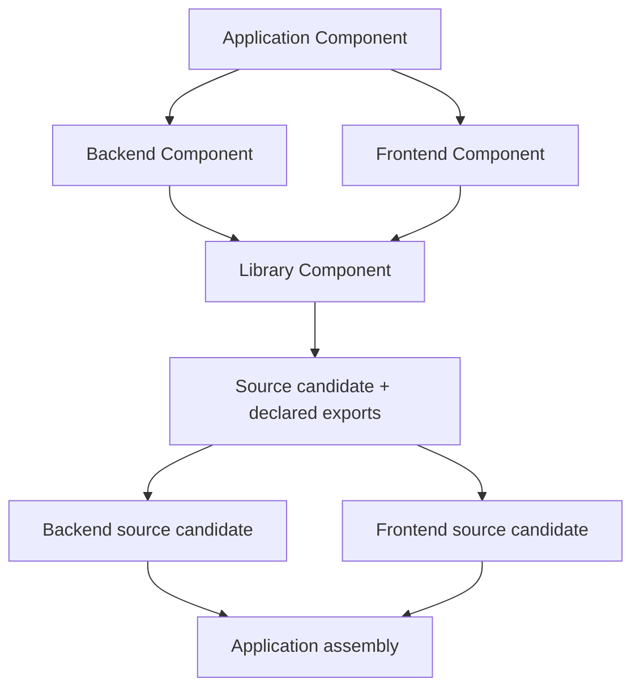

# Components, identities, and exact versioning

Version labels and content identities answer different questions:

- the coordinate says **which logical Component**;
- SemVer says **which compatible release line**;
- the content identity says **which exact immutable revision**.

All three are required for an exact reference.

## Coordinates

Component coordinates are portable lowercase names:

```text
component://<namespace>/<name>
```

For example, `component://samples/hello-component` remains stable across releases.
Names are not filesystem paths and do not identify bytes.

## Exact revision references

An exact Component reference has this form:

```text
component://samples/hello-component@1.0.0#sha256:<64-lowercase-hex-digits>
```

The framework validates SemVer 2.0.0, including prerelease and build metadata, and uses
SHA-256 content identities in schema v1. A version-only reference is a selection query,
not a lock. Resolve it under a recorded policy and persist the returned exact reference.

`VersionedContentRef` applies the same identifier/version/content triple to first-class
objects such as Flavors, skills, model groups, workflow definitions, packages, and
publications.

## Deterministic identity

Contract identity is SHA-256 over canonical JSON v1: sorted string keys, UTF-8, no
insignificant whitespace, signed 64-bit integers, and no floating-point values. Local
paths, timestamps, aliases, and status projections must remain outside semantic hashes.

The schemas under [`schemas/v1`](../../schemas/v1/) remain wire authority for those
contracts. A minimal authored Component is easier to study at
`samples/hello-component/component.md`; its normalized machine projection and exact
target lock are derived rather than hand-maintained beside it.

## Version selection and coexistence

Registries may contain multiple versions and multiple content revisions for the same
coordinate. Resolution uses compatibility requirements and policy, but a run always
records one exact result. Never overwrite an immutable object because a newer version
appears, and never let a mutable `latest` alias enter provenance.

Different exact revisions may coexist in a cache. A reverse dependency index is a
rebuildable projection; it is not stored by mutating the dependency package.

## Versioning generated Components

Generated projects use the same rules as framework or spec-driven third-party
Components. Their
accepted source becomes an exact source identity, their definition carries SemVer, and
their packages refer to exact direct dependencies. A higher-layer generated Component
can then consume them without inventing a separate project vocabulary.

The Standard lifecycle keeps that composition graph intact during execution. Each
Component revision receives its own generation plan, fresh workspace, source candidate,
build intent, declared exports, and lifecycle result. Dependency edges determine which
nodes may run concurrently and which exact upstream exports a downstream build may
consume. The scheduler does not flatten the whole application into one coding-agent
prompt or one anonymous source tree.



That bounded context is an architectural property, not a promise that every current
sample is already driven through the Standard core. `service-stack` is the first
ordinary adoption proof: its three Python nodes generate independently, compile and run
their own tests, pass explicit provider artifacts downstream, and produce a known root
invoice result. The installed outer rebuild still delegates to the project's host
driver while broader CLI and sample adoption proceeds.

An OSS Git repository without accepted specifications is not a third-party Component.
Declare it through the separate
[repository source dependency](../architecture/repository-source-dependencies.md)
contract; its mutable selector resolves to an exact source lock before it can influence
generation or enter a target cache.

For detailed invariants and migration guidance, see
[Exact versioned Components](../architecture/exact-versioned-components.md).

## Reviewed native library imports

A `kind: library` Component can declare `library_imports` in its `component.md`
frontmatter when its public native API differs from the conventional names derived
from its Component and capability names. For example, a Component named `source`
can expose the root Rust function in Cargo package `import-proof`:

```yaml
library_imports:
  - language: rust
    package: import_proof
    capability: fixture.checked-sum
    module: import_proof
    symbols:
      - checked_sum
```

The capability must also appear in `provides` with its reviewed public interface.
Each declared language must cover every provided capability exactly once and use
one package. Rust and Python modules can name the package root or a nested module;
JavaScript uses an explicit package subpath. Symbols are sorted, unique native
identifiers. These declarations describe import names; selected Flavors still
choose the implementation language and toolchain.

The resolver inserts current interface identities into the import surface. Both
generation and execution use that same surface. Changing a declaration changes
Component authority and requires fresh locking and qualification. Omitted
`library_imports` preserve existing authoring identities and naming conventions.
Declarations do not grant acceptance or override current package checks.
Source-derived Component graphs accept the same optional declarations. Signed
review binds these names, and promotion carries them into the final Component
document. Conflicting declarations from language translators are rejected;
changing reviewed names requires a new signed review and fresh qualification.
