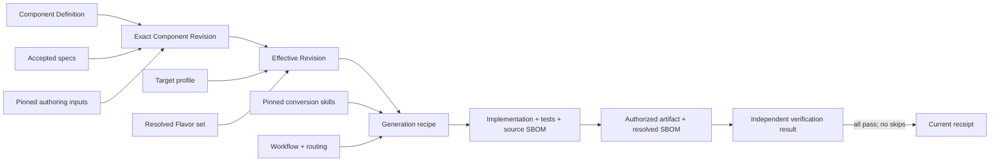
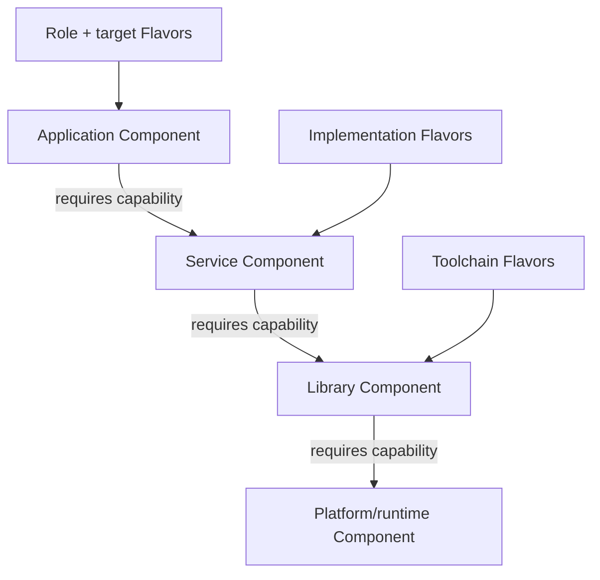

# Core concepts and layered Components

## Component

A Component is the framework's fundamental unit of composition. A library, service,
application, tool, framework, generated project, model adapter, or documentation
generator can all be Components. Generated applications are therefore peers in the same
model, not terminal artifacts outside it.

A Component gathers:

- one or more specification artifacts;
- exact authoring inputs, including skills;
- workflow and model-routing policy;
- disposable generated source and current implementation tests;
- pre-build and post-build CycloneDX dependency evidence;
- build/test evidence and one current passing receipt projection;
- direct source and object dependency packages;
- cache and publication records; and
- lineage connecting every result to its inputs.

Machine-local paths, credentials, mutable `latest` aliases, and publication state do
not belong in the logical definition.

The central concepts form an authority chain, not a pile of interchangeable files:

Specs and selected Flavors say what the effective application must be. Skills guide
the conversion, workflow and routing say how model work is organized, and generated
source is a replaceable result rather than a second behavioral authority.

## Literate documentation

Every derived project has required declared documentation roots and a provider-neutral
root `SKILL.md` that leads agents into their linked narrative. The project validator
checks that graph, including local targets, heading fragments, reachability, and
content identities. Exactly one authority-review marker binds the current narrative to
the current project, Component, Flavor, skill, workflow, and routing authority graph.

This makes documentation first-class and freshness-checkable without confusing prose
roles. A behavioral specification can be normative application authority; an
architecture guide explains ownership and flow; an artful diagram teaches the same
system at a different altitude. The review marker proves which exact graph a person
reviewed, not that every sentence is automatically correct.

## Tests have three roles

Tests are not one interchangeable pile:

| Artifact | Authority | Lifetime |
| --- | --- | --- |
| Generated implementation tests | Current specs, selected Flavors, and exact skills | Recreated with each disposable major rebuild |
| Verifier-only oracle | Independently pinned acceptance evidence | Hidden from the coding CLI and retained by the verifier |
| Project test receipt | Exact all-passing run bound to the complete project authority revision, one subject, and one suite | One replaceable file; prior versions live in Git history |

The generated suite lives at `source/tests/manifest.json` in the external generated
tree. It checks the current implementation but cannot grade itself into acceptance.
The verifier oracle never enters the generation request. A receipt contains identities
and one positive test count with passing implicit, not generated tests, source,
binaries, logs, host paths, or a second history database. Failed or skipped runs cannot
replace it.

## Specification-node context and Component composition

One Component may contain a small hierarchy of `literate-markdown` specification
nodes. That hierarchy is a reading-context relation: `spec.md` describes its folder,
child documents state narrow local subjects, and explicit references import other local
constraints. IDs and parents are derived from paths, and the generation recipe carries
one canonical context graph instead of copied ancestor prose.

This is deliberately different from the Component graph below. A feature that needs
its own generation, cache, build, test, version, SBOM, or publication lifecycle is a
Component, not merely another nested Markdown node. Shared OS/language/build guidance
belongs in Flavors and skills rather than a hierarchy of boilerplate constraint specs.
See [Writing readable specifications](specifications.md) for the authoring format.

## Layered Component composition

Composition is recursive. A generated application can require capabilities from a
generated library, which can require a lower-level runtime, which can in turn bind to
product or platform Components. Each selected layer is an exact Component revision.
There is no special storage class for "application" versus "dependency."

Components and samples do have different repository roles. `components/` is the
reusable building-block catalog: services, libraries, modules, and other authority meant
to be selected by downstream compositions belong there. `samples/` contains complete
working demonstrations that combine Components, Flavors, and skills to teach a concept
and prove build/test/run behavior. A sample can emit a useful package or executable, but
it is not the canonical reusable provider merely because its generated artifact is
useful. Samples are explicitly private to their repository except for the single
`hello-component` starter inherited by derived projects.

Every node resolves to an exact revision. The labels describe semantic requirements;
they are not hard-coded package paths or imports.

A `kind: library` Component has no product entrypoint. Its locked command authority
instead names one package-shaped directory artifact and an exact language-native import
surface for each provided capability. Python consumers import only from the sealed
package root, dependency-free JavaScript consumers use the sealed CommonJS manifest and
exports map, and Rust consumers compile the sealed Cargo package as an exact path
dependency. The provider artifact identity, public interface, import surface, target,
toolchain, and dependency closure all enter the consumer build binding, so a same-named
ambient package cannot satisfy the edge.

Requirements select semantic capabilities rather than import names. Resolution records
all candidates, rejection reasons, policy identity, and the selected provider. This
makes the full closure explainable and allows a cache to start empty: the resolver can
fault exact objects into a user's local cache as the selected closure needs them.

## Definition, revision, and effective revision

- A **Component Definition** is the human-maintained declaration: coordinate, SemVer,
  capabilities, requirements, specs, skills, workflow, routing policy, Flavor slots,
  entrypoints, and acceptance contracts.
- A **Component Revision** binds that definition to exact specs, authoring inputs,
  workflow policy, and source identities.
- An **Effective Component Revision** combines an unchanged base revision with an exact
  resolved Flavor set and target profile.

Mutable operational events such as timestamps do not change semantic identities.

## Specs are authority; source intelligence is evidence

OpenSpec is the original requirement/scenario provider. `literate-markdown@1` retains
that readable body syntax while adding strict frontmatter, local hierarchy, explicit
references, and deterministic context assembly. Source snapshots and source-intelligence
indexes are exact, versioned evidence used to form generation requests. They do not
silently override accepted specifications. Conversely, the generator must not treat a
rapidly changing dependency as an opaque binary SDK: it binds source evidence and its
index to the exact dependency revision used for that run.

The inverse workflow derives reviewable specification drafts from source. Drafts remain
descriptive evidence until a human acceptance decision promotes them.

Semantic inverse translation uses provider-neutral source-intelligence evidence
and one separately pinned
Python, C++, Rust, or JavaScript conversion skill per detected language. Every model
observation must cite admitted evidence and a facet from an exact selected skill. The
accepted draft retains the complete model command, prompt, response, bounded output,
provider/artifact identity, typed relationship provenance and confidence, unresolved
reference statistics, and hash chain. Relationship edges are derived hints rather than
authority and require exact source corroboration for consequential claims. That journal
explains how source became a draft; it
does not grant the draft release authority.

Release authority moves from the source baseline to the specification only after clean,
cache-bypassed, spec-only regeneration produces runnable artifacts whose generated tests
and independently verified behavior match on every required target. The regenerator,
parity verifier, and attestor must be distinct trusted providers. This keeps “the model
described the code” separate from “the specification can now recreate the product.”

## Lifecycle shape

A typical lifecycle resolves specifications and dependencies, snapshots source,
acquires source intelligence, routes model work, performs a clean major rebuild of the
implementation, current tests, and source SBOM, validates it, classifies and authorizes
the exact build, verifies the resolved SBOM and exact subject, records a passing receipt
when configured, stores
immutable bundles, and explicitly publishes selected results. Stages and their inputs
are identity-bearing so retries and restarts can be reconciled without guessing.

See the [domain model](../architecture/domain-model.md) for the full framework
architecture.
