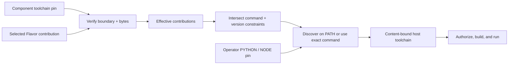

# Flavors and target profiles

A Flavor is a versioned, publishable mix-in for one variation axis. It keeps target
choices out of a Component's base behavior.
Each Flavor revision names exactly one primary-axis target value; portability across
several values is represented by separate, independently selectable Flavor revisions.

Typical axes include:

- operating system and CPU architecture;
- accelerator, such as CPU-only versus CUDA;
- implementation language or ecosystem;
- build system, toolchain, and packaging; and
- deployment environment.

## Keep the base neutral

The base Component declares behavior and abstract `FlavorSlot` contracts. It should not
embed Windows build steps, CUDA dependencies, or a Python-versus-Rust choice. A
`TargetProfile` expresses the constraints for a particular operation. Resolution then
produces an exact `FlavorSetLock` and `EffectiveComponentRevision`.

For example, a Component might declare exactly one OS slot, exactly one accelerator
slot, and exactly one language slot. Linux + CPU + Python and Windows + CPU + C++ are
different effective revisions even when they share the same base specification.

Axes classify choices; slot IDs identify application roles. A full-stack Component can
declare both `backend-language` and `frontend-language` on the implementation-language
axis, then target `rust` for the former and `javascript` for the latter. When an axis has
more than one slot, every target constraint on that axis must name a slot. An axis-wide
constraint is intentionally rejected because the intended role cannot be inferred.

The CLI expresses those constraints directly:

```console
litai lock samples/full-stack-rust-js \
  --target macos-host \
  --flavor=+flavor://literate-ai/os-macos \
  --flavor=+backend-language:rust \
  --flavor=+frontend-language:javascript
litai plan samples/full-stack-rust-js \
  --target macos-host \
  --flavor=+flavor://literate-ai/os-macos \
  --flavor=+backend-language:rust \
  --flavor=+frontend-language:javascript
```

Use `+name` and `-name` for an ordinary axis with one slot. Use `+slot-id:name` and
`-slot-id:name` whenever an axis is repeated. The slot binding is part of the exact
target and generation recipe; ordered selectors support replacement, but their order
does not assign roles. The same exact revision can be bound to more than one compatible
slot, such as Rust for both `backend-language` and `worker-language`. This is one
selected Flavor revision with two role bindings, not two copies of its documents,
skills, or contributions.

The CLI accepts compatibility aliases, but manifests, locks, diagnostics, and examples
use canonical coordinates such as `+flavor://literate-ai/lang-swift` and
`+flavor://literate-ai/os-macos`. Canonical coordinates are the final disambiguator, so
catalog growth never forces a guess between two equal aliases.

Sample conformance follows the same rule. An unpinned sample runs one row by default:
`flavor://literate-ai/lang-python`, `flavor://literate-ai/build-make`, and the current
host OS coordinate. A non-empty language pin list or multi-role map in the sample
execution contract is authoritative. Explicit wildcard selectors such as
`flavor://literate-ai/lang-*`, `flavor://literate-ai/build-*`, and
`flavor://literate-ai/os-*` expand unpinned axes; the expanded tuple participates in
reports, cache authorities, and remote checkpoints.

## Separate portable policy from host realization

Put syntax, standard-library constraints, source layout, and portable runtime behavior
in a language Flavor. Put facts true for every installation of an OS in the OS Flavor.
Put a language/OS-specific compiler, SDK, discovery probe, and mitigation in a
`toolchain` realization Flavor. A portable language may declare an exactly-one
co-requisite group of such realizations.

Swift demonstrates the boundary. `flavor://literate-ai/lang-swift` owns portable Swift
source; `flavor://literate-ai/toolchain-swift-apple`,
`flavor://literate-ai/toolchain-swift-linux`, and
`flavor://literate-ai/toolchain-swift-windows` own their host probes and installation
guidance. `litai init --flavor flavor://literate-ai/lang-swift` adds the realization
for the selected OS.
Selecting Swift without exactly one realization, selecting two realizations, or pairing
`swift-apple` with Linux fails during lock planning. Tool discovery then runs before
source generation: macOS probes `xcrun swiftc`, while Linux and Windows probe their
native `swiftc` launchers.

The primary sample applications keep one shared base behavior and select either the
Python or C++ Flavor. Those language Flavors conflict explicitly; changing languages
requires an ordered `-current` then `+replacement` selection rather than an implicit
winner.

## Build systems are replaceable Flavors

`build.system` is independent of operating system, implementation language, and
toolchain. A Component opts into build-system composition by declaring a build-system
slot. Projects created by `litai init` prefer
`+flavor://literate-ai/build-make`; a project may instead select the exact
`+flavor://literate-ai/build-bazel` revision. A later explicit selector is applied after
project preferences. A positive selection on the same exclusive slot replaces the
weaker project default; subtraction is available when no replacement is wanted:

```console
litai lock path/to/component --target host \
  --flavor=-build-make --flavor=+flavor://literate-ai/build-bazel
litai plan path/to/component \
  --target host \
  --flavor=-build-make --flavor=+flavor://literate-ai/build-bazel

litai lock path/to/component --target host --flavor=-build-make
litai plan path/to/component --target host --flavor=-build-make
```

Replacement or subtraction happens before prompt assembly, so only the selected
build-system Flavor and its content-pinned build skill enter the generation closure. A
missing preference Flavor or an axis the
Component does not declare is inapplicable rather than an implicit constraint. Explicit
positive selectors remain strict. When a Component has several exclusive build-system
roles, the weak default binds all of them; a slot-qualified alternative replaces one
role, while an unqualified negative removes every matching binding. Removed catalog revisions
remain visible only through a separate catalog-audit identity and do not enter the
selected effective set, generation recipe, or semantic input closure.

When selected, the lock says `bazel`, not “built with Bazel.” The skill asks the coding LLM
to choose Bazel by default while deferring to explicit Component and selected-Flavor
requirements. It also tells the model when fine-grained translation is likely to be
misleading: Mix-based Elixir/Erlang applications, arbitrary Zig `build.zig` programs,
dynamic metaprogramming or image-based systems, and projects with opaque code
generation. Wrapping Mix, `zig build`, or another native build as one Bazel action is
different from translating it into fine-grained Bazel rules; generated build evidence,
not preference selection, must identify what actually ran.

## Typed composition, not document merging

Flavor contributions enter typed extension points: capabilities, requirements, spec
fragments, skills, workflow bindings, validators, builders, toolchains, packaging, and
runtime constraints. Arbitrary patches and last-writer-wins precedence are rejected.

Resolution fails explicitly when:

- an exactly-one slot is unfilled;
- more than one candidate satisfies a singleton slot;
- selected contributions conflict; or
- a Flavor attempts to weaken base security or requirements.

Cardinality belongs to the Component slot, not to the axis itself. Singleton slots
require ordered replacement. `one-or-more` and bounded multi-valued slots may select
several exact Flavor revisions. Distinct named slots may also share an axis when they
represent roles such as frontend and backend, and one compatible revision may satisfy
several of those slots. A target profile may contain no
constraints when the base Component declares no Flavor slots.

The lock records candidates and rejection reasons, making the result reviewable.

Flavor selection also scopes generated implementation tests. A clean major rebuild
uses the exact selected Flavor specifications and skills when it regenerates both the
implementation and `source/tests/manifest.json`. A changed Flavor set changes the
recipe identity, so an old generated suite is stale by construction. Suites are never
merged across target trees, and a generated case cannot weaken or replace base or
Flavor acceptance requirements.

## From a typed requirement to an exact host tool

A language Flavor can contribute a content-pinned `toolchain.json`; a Component can pin
the same closed contract as an authoring input when it has an application-wide
requirement. Literate AI verifies each file's path and SHA-256 identity, resolves only
the selected Flavor contributions, and intersects all constraints for the same named
toolchain. It never mines a version or command from Markdown.



`command` is a JSON argument vector. `minimum_version` is a lower bound;
`required_version` is an exact prefix, so `[3, 12]` accepts Python 3.12 patch releases.
Two required prefixes must overlap, and two declared command vectors must match exactly.
Optional `remediation` and HTTPS `remediation_uri` fields carry selected, reviewable
failure guidance; they authorize no installation and conflicting metadata fails merge.
An operator `PYTHON` or `NODE` command remains authoritative; it is still probed against
the effective typed version constraints, and an incompatible operator pin fails without
falling back to another executable.

## Cache and publication isolation

Generated source, evidence, build output, packages, and publication records bind the
effective revision and Flavor set. Mutable aliases for one target must never resolve to
objects from another. This prevents, for example, a CPU build or Windows package from
contaminating a CUDA/Linux result.

Bazel is the preferred source-to-binary rule engine because its action cache avoids
rebuilding unchanged rule inputs. That cache is distinct from the accepted
specification-to-source derivation cache described in
[Caches, packages, and publication](caches-packages-publication.md); neither cache is
authority.

## Learn from the samples

Run the executable matrix:

```console
make samples
```

Then inspect
[`samples/flavor-matrix`](../../samples/flavor-matrix/) and the source-derived
[`flavor-split` case](../../tests/fixtures/source_to_specification/flavor-split/). The full
contract design is in [Composable Component Flavors](../architecture/component-flavors.md).
The current sample runner deliberately uses its guarded native language builders and
does not claim Bazel execution; samples do not declare a `build.system` slot yet.
