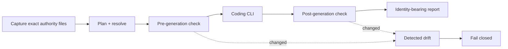
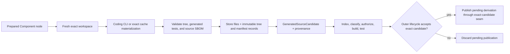
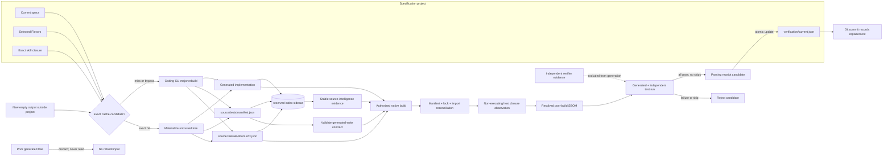

# Model groups, selectors, and generation

Long provider model names should not leak through every Component. Literate AI separates
an endpoint, a named model group, and the stage-level selection decision.

## Endpoints and groups

A `ModelEndpoint` describes an exact provider/model binding plus capabilities and
constraints such as context size, structured output, locality, network egress, cost,
latency, and availability.

A `ModelGroup` is a short, versioned policy name whose ordered members and fallback
behavior can change only through a new exact group revision. Examples might represent
"local-private," "fast-review," or "large-code," but the names and policies belong to
the integrating product or repository.

A selector binds each workflow stage to a group plus hard requirements. The router
records candidates, rejections, selected endpoint, fallback status, and policy identity.
Routing state is scoped to one run; a fallback must not silently become a global default.

## Source-grounded generation

A generation request should contain:

- the exact effective Component revision;
- its bounded local specifications, selected Flavors and skills, plus only the public
  interfaces of direct generation dependencies;
- exact source snapshots permitted for that selected Component;
- source-intelligence evidence tied to those source identities;
- the full `ComponentLock` identity as local, non-egressing authority and a node-scoped
  managed graph rooted at the selected Component;
- workflow and routing-policy identities; and
- validation and acceptance contracts, including the clean-major-rebuild test-suite
  requirement.

The application layer verifies the exact bytes behind both pinned policy references and
compiles them into one identity-bearing execution plan. That plan contains the ordered
model-stage semantics, immutable route decisions, and guarded lifecycle steps consumed
by the orchestrator. A stale pin or a policy that cannot produce a complete plan fails
before any model call.

The application keeps the complete lock document locally for validation, resume, and
provenance. A model stage receives neither that document nor the project-wide managed
graph. Its egress contains the selected Component identity, a versioned bounded-context
binding (plan, key, context, complexity decision, prompt, recipe, and fresh workspace),
selected readiness evidence, route decision, prior stage outputs, and the exact bounded
instructions. Two nodes under one lock therefore have different run and stage identities
without disclosing sibling or private-transitive authority.

### One exact input closure

Before planning, Literate AI captures the regular-file bytes that actually influence
the decision: the project and Component manifests, OpenSpec or `literate-markdown`
artifacts, acceptance
interface, workflow, routing policy, exact skills, candidate Component evidence, and
Flavor manifests, specifications, skills, and typed contributions. It bounds that set,
gives it one portable identity, and checks the same files before and after the coding
CLI. A changed, missing, oversized, escaping, or symlink-replaced input fails the run.



The sample verifier keeps the authority boundary honest: its generation closure has no
oracle, while a separate repository harness closure extends it with the versioned
sample manifest and pinned acceptance oracle under `samples/_harness/`. Thus oracle bytes remain unavailable to the generation recipe but
cannot change unnoticed while the built artifact is being tested.

The generated implementation-test suite sits on the generation side of that boundary.
It is derived from current recipe inputs and therefore checks the implementation's
current interpretation of them; it is not independent acceptance authority. The hidden
oracle remains the verifier-side check that the generated artifact produces the known
result.

### Pinned spec-to-code skills

Skills sit between recipe composition and model invocation. The root onboarding
`SKILL.md` is not one of these inputs. A Component selects general skills through
content references whose kind is `specification-to-source-skill`; a Flavor may select a
more specific skill through the same mechanism. Each reference pins the exact UTF-8
`SKILL.md` bytes by SHA-256. Strict frontmatter names its version, target workflow
stages, dependencies, limitations, and trust classification; the Markdown body is the
sole instruction authority.

Resolution is deterministic: Component skills retain declaration order, followed by
skills from selected Flavors in Flavor order. Every dependency includes its exact
semantic version and content identity. Duplicate IDs, missing or late dependencies,
dependency identity drift, an unsupported manifest schema, or a digest mismatch reject
the recipe.
The resolved list and hashes are part of the recipe identity, model evidence, prompt,
and generation report. Instructions are supplied to the coding CLI only after this
resolution and explicitly cannot override the specifications, Flavors, workflow,
routing, validation, security, or execution policy.
In a canonical project, a referenced generation skill must also be an exact
`SKILL.md` beneath a declared skill root's `specification-to-source/` catalog.
Pointing at an otherwise valid file elsewhere in the project is rejected before its
instructions are loaded.

Shared conversion rules belong here rather than in every Component document. The
portable planning skill tells the coding agent to honor the derived local spec-node
context, use only direct public Component interfaces, avoid private transitive
flattening, generate tests from current intent, and surface semantic conflicts instead
of silently applying “nearest wins.” Platform, language, and build techniques remain
Flavor-selected skills. None of those instructions becomes product behavior.

When a Component selects `literate-markdown`, the recipe adds one canonical
`.literate/specification-context.json` document before the original specification
documents. It contains node/parent/reference identities and each node's effective
document order. Original Markdown occurs once; context assembly does not duplicate
ancestor prose for every child.

`litai generate` consequently accepts a Component directory rather than a loose
specification file. The Component is the smallest bundle that can pin the behavioral
specifications, skills, workflow, and routing policy together. The framework does not
treat ambient coding-CLI configuration as recipe evidence. A provider without a clean
mode may still read that configuration; the Cursor Agent adapter reports this explicitly
as a non-hermetic deferred limitation.

For a greenfield Component there is no source snapshot to cache or pretend to resolve.
Its request carries accepted specification and execution evidence with an empty source
snapshot list; generation creates the first source tree. The public CLI includes every
selected non-root Component's exact definition, OpenSpec documents, and content-pinned
authoring and acceptance inputs under collision-free dependency paths. Source snapshots
and source-intelligence evidence for an existing implementation are not yet represented
by this CLI surface; integrations that have them must use the application evidence ports
and must reject identity drift. Generated output is validated, classified, authorized,
and built before it can be accepted.

The dependency documents make the complete selected Component closure part of the
generator's vocabulary and the source SBOM. Each managed relationship remains distinct
by source, target, kind, optionality, and exact relationship identity even if standard
CycloneDX `dependsOn` represents multiple relationships as one node pair. A rapidly
changing source dependency must additionally be understood through its current source
snapshot and evidence rather than treated as an opaque SDK name. An index that does not
match its source identity is stale and must not be used. The current public generation
CLI does not acquire repository-only source itself; it fails closed until an integration
supplies exact repository lock and admission evidence.

The neutral domain retains provider-independent structured-intelligence ports and
artifacts: its business types do not import indexer wire, SQLite, or filesystem
behavior. Default product policy selects provider `none` with every stage `off`.
Product `validate`/`build`/`run`/`rebuild` do not require a source-graph indexer.

For every source-grounded query, the integration resolves the exact Component revision
and source snapshot first, then finds or faults in the knowledge index for that identity.
The query is formed from the selected Component closure, relevant source-level symbols
and relationships, accepted specs, and the evidence budget. Relationship types,
provider provenance and confidence, and unresolved-reference counts remain explicit.
Those relationships are derived and potentially heuristic: consequential conclusions
must cite corroborating source excerpts, and absence of a graph edge is never proof of
absence. A missing artifact may trigger
index creation; a source/index identity mismatch rejects the evidence. Model recall or
an SDK name is not a substitute for this gate.

## Generation lifecycle

The orchestrator executes an identity-bearing workflow DAG. Typical stages resolve,
acquire evidence, generate, validate, authorize, build, package, and accept. Model
request and response identities, templates, decoding parameters, tool parameters,
usage, and fallback decisions are provenance.

There are currently two callable lifecycle surfaces. The installed `litai generate`
and `litai rebuild` commands use the established generation orchestrator and the
project's content-pinned host driver. Separately, the implemented Standard lifecycle
core consumes an exact Component execution plan and schedules one prepared node at a
time (concurrently where dependencies permit). It is a provider-neutral application
service today; making it the default CLI and sample implementation is still adoption
work.

### Authenticated inherited IDE sessions

An integration may select the already-running, already-authenticated IDE session as
the coding provider without starting a nested CLI:

```text
LITAI_CODING_PROVIDER=inherited-session
LITAI_INHERITED_SESSION_PROVIDER_IDENTITY=sha256:<provider-digest>
LITAI_INHERITED_SESSION_IDENTITY=sha256:<session-digest>
LITAI_INHERITED_SESSION_AUTH_KEY_ID=<ephemeral-channel-key-id>
LITAI_INHERITED_SESSION_CHANNEL=<fresh-private-directory>
LITAI_INHERITED_SESSION_AUTH_KEY=<64-or-more-lowercase-hex-digits>
LITAI_INHERITED_SESSION_TIMEOUT_SECONDS=900
```

`InheritedSessionProviderConfig.from_environment()` is the corresponding application
API. `InheritedSessionSourceGenerator` is the injectable Standard-generation API and
`DirectoryInheritedSessionTransport` plus `DirectoryInheritedSessionCoordinator` are
the built-in CLI/coordinator protocol. The channel directory must already exist, be
non-linked, and mode `0700` on POSIX. Each Component request gets a random,
exclusively-created `exchange-*` transaction directory containing create-once,
mode-`0600` canonical request and response envelopes. Coordinators use
`DirectoryInheritedSessionCoordinator.discover(channel)` to find pending transactions.
Replacement, unsafe permissions, oversize, disconnect, duplicate consumption, or
replay fails closed.

Configuration and durable evidence carry only public identities and a key ID. API
integrations supply at least 32 bytes of secret key material through `secret_provider`.
The CLI reads the same ephemeral key from its inherited process environment; launchers
must inject it directly, must not place it in a checked-in configuration file or shell
history, and must discard it with the channel after the run. Literate AI uses the key
for request/response HMACs and never writes it into a request, response, transcript,
cache, or receipt. No provider CLI or nested agent process is invoked.

The public request discloses identities for the exact generation request, plan, context
manifest, prompt, Component lock, recipe, model binding, output contract, context bundle,
and writable boundary. Its authenticated ephemeral `InheritedSessionContextBundle`
carries the exact bounded prompt bytes, workspace locator, model name, repeated scope
identities, and allowed `source/**` output path. Bundle bytes are authenticated together
with request bytes but are excluded from durable handoff evidence, receipts, and caches.
The coordinator verifies every repeated identity before exposing either the request or
bundle. The authenticated response binds that request, provider, session, one allowed
sequence number, source-tree and source-payload digests, a transcript digest, and a
provider-evidence digest. Only one owner may move the adapter from runner custody to
session custody and then terminal custody. Reuse, late/duplicate responses, changed
session/request/context identities, stale responses, bad authentication, and changed
source bytes fail closed. Timeout, user cancellation, and runner cancellation are
distinct typed terminal outcomes. Terminal transaction cleanup removes only the exact
`exchange-*` directory after the runner has imported its response.

#### Cursor Agent Chat hook adapter

Cursor's supported hook API is the only documented current-IDE-session surface used by
the built-in Cursor adapter. The `stop` hook receives conversation, model, workspace-root,
authenticated-user, and transcript fields and may return `followup_message`, which
Cursor submits as the next user turn in that same conversation. Configure a user,
project, or plugin hook with a command equivalent to:

```json
{
  "version": 1,
  "hooks": {
    "stop": [{
      "command": "python3 -m literate_ai.integrations.cursor_inherited_session",
      "failClosed": true,
      "loop_limit": null
    }]
  }
}
```

The hook admits only a request whose provider identity hashes the authenticated Cursor
user, whose session identity hashes that provider plus the current conversation, whose
model name equals the current hook model, and whose workspace locator is beneath a
current Cursor workspace root. Its create-once claim prevents another conversation,
model, workspace, or request from completing the transaction. On the first `stop`, it
returns a transport wrapper plus the exact authenticated bounded prompt. On the next
completed `stop`, it hashes the enabled Cursor transcript, collects only regular UTF-8
files beneath the bound `source/`, writes the authenticated response, and returns no
further continuation. Symlinks, output escape, missing transcripts, oversized output,
aborted turns, and mismatched scope fail closed.

The current Cursor hook contract does not provide a runtime API to inject new
environment variables into an already-running Agent Chat. Therefore the hook command
and all seven ephemeral `LITAI_*` values must be present in the Cursor application's
environment before the target conversation starts. The key remains process memory only;
do not place it in `hooks.json`, a shell history, an environment file, or a repository.
An already-running conversation without that pre-provisioned hook environment cannot be
upgraded in place and cannot provide a real inherited-session transaction.

A successful handoff is still only a generated-source candidate. Its public
`InheritedSessionHandoffEvidence` must be retained in generation provenance and passed
to `StandardSourceAdmissionService`; admission checks the exact request/plan/context/
prompt/tree bindings and then runs the independent verifier. The canonical source
admission identity, not possession of a handoff response, is what can enter later
worker/build receipt composition.

#### Physics Workbench sample private-waiter removal

After this change is available at a pinned Literate AI revision, Physics Workbench sample should:

1. delete its private waiter executable and every `CODING_CLI=claude` override;
2. create one fresh private exchange directory and one random 256-bit-or-stronger key
   per lifecycle, then launch `litai generate`/`build`/`rebuild` with exactly the seven
   `LITAI_*` values above (the key is process-injected, never committed or logged);
3. install the generic Cursor `stop` hook above before launching Cursor, with the
   ephemeral environment injected into that Cursor process; do not add mission code or
   a private coordinator to Physics Workbench sample;
4. remove Physics Workbench sample's polling format, custody state, timeout/cancellation translation,
   transcript storage, and private handoff receipt fields. The framework now retains
   `InheritedSessionHandoffEvidence`, binds it into generation provenance, and passes it
   through verifier-owned Standard source admission;
5. preserve only Physics Workbench sample mission specifications and provider-selection policy, require
   `StandardSourceAdmissionMembership` before build/test/execution/acceptance/
   publication, and delete the exchange directory and key after terminal custody.

For pre-release qualification, pin Literate AI to the exact merge commit of the
upstream pull request. Replace that temporary commit pin only with the first released
version containing issue #43; do not pin a moving pull-request branch.

### The source-only candidate boundary

The Standard coding-CLI adapter stops immediately after it has validated and recorded
the generated tree, generated test manifest, and source SBOM:



The candidate's `tree_identity` is the canonical digest of normalized path, size, and
content entries. Its `source_bundle_identity` currently has the same digest value
because that is the exact builder-verifiable source bundle; the two fields express
different roles and must not be substituted by storage metadata. The CAS tree-record
identity is separate. `source_manifest_identity` identifies an immutable CAS manifest
that points to that tree record. Generation never treats either CAS record identity as
permission to build or publish.

The adapter retains a pending cache-publication handle internally. Only a later call
with the byte-for-byte exact accepted candidate may publish it. This closes the old
accidental path where successful generation alone could make an entry reusable.
The Standard lifecycle supplies that call only after node acceptance. An imported
membership is a source-only hit: it bypasses model generation but still traverses
current indexing, authorization, build, test, execution, and acceptance, and is not
republished.

The `litai generate` command exposes the source-generation phase for local use. It
first requires a canonical `component.lock.json` created for the same named target and
Flavor assertions. It projects the recipe directly from that lock without rerunning a
Component composer or Flavor resolver. The lock identity enters the one
content-identified, `major-rebuild` recipe. The command then compiles the pinned
execution plan and invokes
exactly one supported coding CLI in noninteractive composite-stage mode:

```console
litai lock path/to/component \
  --target linux-host \
  --flavor=+flavor://literate-ai/lang-cpp \
  --flavor=+flavor://literate-ai/os-linux
CODING_CLI=codex litai generate path/to/component \
  --output /tmp/generated-component \
  --target linux-host \
  --flavor=+flavor://literate-ai/lang-cpp \
  --flavor=+flavor://literate-ai/os-linux
```

### Clean major rebuilds

A major rebuild is replacement, not incremental patching. The output directory starts
empty, and the coding CLI regenerates the complete implementation, current
implementation-test manifest, and CycloneDX source SBOM. No previous generated source,
tests, SBOM, or repair transcript enters the next recipe.

The reference sample driver's bounded candidate replacement obeys the same rule. Each
of at most three attempts uses a distinct empty root and the unchanged original recipe.
Exactly four terminal categories are eligible: a static Bzlmod source-validation
rejection with an exact failed `validate` event, matching `DependencyObservationError`,
generated tree/source-bundle/suite bindings, one code from the closed static allowlist,
and no admitted lifecycle result; a generated-test behavior mismatch with complete
run/build/suite/result identities; a generated application/backend
`host_execution.nonzero_exit` raised only during generated implementation tests, with a
nonzero integer return code and stdout/stderr digests; or a C++ generated-source
rejection after successful validation, classification, and authorization. The latter must bind the
generated tree, source bundle, and suite, have no build result or downstream step, and
carry an event-matching `builder.cpp_generated_source_rejected` `BuildError`. That code
exists only when the candidate compile/link fails but a second compile-and-link canary
succeeds with the same pinned toolchain. A failed canary remains terminal
`builder.cpp_compile_failed`. Python, Rust, JavaScript, generic native, Bazel
build/resolve/analyze, toolchain, authorization, and all other dependency failures do not qualify.
Neither do verifier failures, execution timeouts, launch or execution-authorization
failures, invalid output, or missing process evidence. Bzlmod resolver/evidence errors,
unknown codes, toolchain/framework failures, and failures after any admitted step are
also terminal.
The next request receives no prior tree, expectation, diagnostic, or verifier-only fact.
This is repeated clean generation, not incremental repair or acceptance feedback.

Clean materialization and cache policy are distinct. An accepted source-derivation
record can materialize an exact previously verified tree into a new output, but it never
becomes generation authority or input to a different recipe. It remains
acceptance-untrusted until the current full lifecycle succeeds. A forced regeneration
bypasses lookup and invokes the coding CLI. `litai generate` always takes the fresh
source-phase path; a configured project lifecycle driver uses cache resolution through
`litai rebuild`.



`source/tests/manifest.json` is required generated source-tree content. It binds the
exact recipe identity and `major-rebuild` mode and contains 3–256 cases with unique IDs
and JSON argument vectors. At least one `example`, `boundary`, and `invariant` case is
required. Every case cites current non-acceptance base or selected-Flavor specification
documents; acceptance argument vectors are forbidden. The generation result binds the
manifest's content identity.

Those tests remain beside the disposable generated implementation only for the current
build/test attempt. They are never copied into the specification repository, used as
the next rebuild's input, or promoted to acceptance authority. A malformed, missing,
stale-recipe, or acceptance-copying manifest rejects generation.

`source/.literate/sbom.cdx.json` is equally mandatory. It is canonical CycloneDX 1.7
JSON with lifecycle `pre-build` and the exact managed graph projected for the generated
Component: that Component is the sole root, only its reachable dependency closure is
included, and repository sources appear only for reachable owners. Unrelated siblings
and their private dependencies are absent. The projection still binds the complete
`ComponentLock` identity so it cannot be detached from project authority. Every included
relationship retains its kind, optionality, and identity, and the explicit dependency
graph includes empty leaf entries. Source admission reconciles manifests, locks, and
imports with that document before compilation. Because the managed projection is
framework authority rather than model discretion, when the generated tree introduces no
component beyond the managed graph and selected Flavor/skill authority the framework
authors `source/.literate/sbom.cdx.json` deterministically from that projection; a
generated document that declares a genuine additional third-party component is kept and
validated as authored. A selected resolver may mark only an unresolved external
transitive closure `incomplete_third_party_only`; known direct declarations and the
managed graph remain explicit. After the authorized build and before tests, the same
reconciliation is rechecked and non-executing binary inspection produces separate `post-build`
evidence. That document binds the exact source-BOM identity, preserves every source
reference, edge, and managed relationship, resolves ranges to exact versions, and adds
the observed package, toolchain, runtime, and binary closure. See
[CycloneDX SBOM and dependency graph](../architecture/sbom-and-dependency-graph.md).

With the Bazel Flavor, a literal `bazel_dep` version is requested Bzlmod intent rather
than a final selected version. The generation agent records each direct request and
must first emit exactly one keyword-only literal root
`module(name = "<valid_module_name>", version = "<exact_component_version>")`, with
both fields before every `bazel_dep`. The agent does not run Bazel or fabricate its
public lock. The authorized Bazel adapter resolves
in an external projection, captures the public lock plus raw public module-graph and
repository-definition bytes, independently derives a normalized observation, and
replays in lockfile error mode. Its normal guarded order is resolution, analysis, source
queries, complete Bazel build, and evidence checks; only a nonzero full build then invokes
the exact authorized native delegate diagnostically. A healthy native build rethrows the
generic Bazel failure. A failed generated C++ build becomes candidate-specific only when
the native builder's same-toolchain canary succeeds; a failed canary remains a terminal
native failure. The adapter also records Bazel's exact local
build-file and target source-closure queries as typed source-bound input-consumption
evidence, so
coverage-enforcing Rust builders can distinguish files in the selected Bazel graph from
dead generated files. Only that verified
observation may add the modeled exact
transitive build graph and return the post-build composition to `complete`. The current
profile retains extension-generated repositories as raw evidence but does not yet
project them into normalized SBOM nodes; see the explicit `SBOM-340` limitation in the
architecture roadmap.

The diagram's receipt step is separate from generation. A runner or integration creates
the candidate after exercising an exact subject. The public receipt command verifies
its complete project-authority binding and atomically installs that passing-only
candidate; it does not run the tests or create a Git commit. The general generation CLI
does not choose a project's test executor; the sample host runner provides the reference
executor and candidate producer. See
[Configuration and CLI](configuration-and-cli.md#project-test-receipts).

Components with repeated axes use slot-qualified positive selectors so role assignment
is content-identified rather than positional:

```console
litai lock samples/full-stack-rust-js \
  --target macos-host \
  --flavor=+flavor://literate-ai/os-macos \
  --flavor=+backend-language:rust \
  --flavor=+frontend-language:javascript
litai plan samples/full-stack-rust-js \
  --target macos-host \
  --flavor=+flavor://literate-ai/os-macos \
  --flavor=+backend-language:rust \
  --flavor=+frontend-language:javascript
```

The resolved target profile, recipe identity, prompt, and report all bind Rust to the
backend slot and JavaScript to the frontend slot. Reversing those explicit bindings is
a different recipe and target identity. When the Component's generation-safe interface
pins those role values, the reversed selection is rejected. Omitting bindings from a
positive selection on a repeated axis is always an error; an unqualified negative
selector instead removes every role bound to that exact Flavor.

Plans and reports separate the two concepts deliberately: `selected_flavors` is a
unique set of exact revisions and `flavor_bindings` is the slot-to-revision relation.
Consequently, binding one revision to several roles does not duplicate model context,
specification evidence, selected skills, or effective contributions.

`CODING_CLI` may be `codex`, `claude`, `cursor-agent`, or `opencode`. Attended
`litai generate` without `CODING_CLI` still discovers those names on `PATH` in that
order. Live qualification does not: it requires an explicit CLI and model (see
[ADR 0017](../decisions/0017-explicit-live-test-coding-cli.md)). Each coding session
keeps a never-empty per-agent model stack
([ADR 0018](../decisions/0018-never-empty-per-agent-model-stack.md)); popping the last frame is a warning that
logs the caller. The full text and
content identities of the base and selected Flavor specifications and the exact
resolved skill instructions are included in the request. The agent may only return
UTF-8 files under `source/`, including the required generated test manifest and source
SBOM; plans,
caches, symlinks, build products, and out-of-tree files are rejected.
File count, total bytes, path length, and path depth are bounded before the proposed
tree is accepted from the adapter. Coding-CLI stdout and stderr are drained concurrently
into separate bounded buffers. Stdout and JSON-task stderr are limited to 1 MiB;
source-generation stderr defaults to 16 MiB because coding agents such as Codex stream
their file-operation progress there. For a larger Component, set
`LITERATE_AI_CODING_CLI_GENERATION_STDERR_LIMIT_BYTES` to an explicit byte allowance up
to 256 MiB. This setting does not change the generated-source-tree limit. Invalid or
excessive values fail closed before generation. Crossing the applicable stream bound
terminates the process instead of buffering unbounded output. Those buffers are a
private adapter input used only to classify recognizable authentication failures. They
are never copied into a `CodingCliError`, CLI JSON, generation report, or lifecycle
event because a provider can echo forwarded credentials. A non-authentication failure
reports only the selected provider and numeric exit status and directs the operator to
that agent's local diagnostics.

Before an OpenCode prompt can leave the workspace, the adapter runs a separate bounded
`opencode --pure run --help` probe against the exact pinned executable and requires the
pure-plugin, detached-workspace, agent, and output-format options used by generation.
The probe has no prompt or model selector. A failed probe or missing option is
`coding_cli.incompatible` with upgrade guidance; it is distinct from authentication,
provider execution, and generated-tree admission failures, and an explicit OpenCode
selection never falls through to another provider.

Finding an executable does not imply that it is authenticated. A persisted interactive
login belongs to one machine and user profile and is normally needed once, then again
when it expires or is revoked. Log in with `codex login`, `claude auth login`,
`cursor-agent login`, or `opencode auth login`, or provide a credential supported by the selected provider in the
invoking environment: Codex accepts `OPENAI_API_KEY` through
`codex login --with-api-key` or `CODEX_ACCESS_TOKEN` through
`codex login --with-access-token`; Claude accepts
`CLAUDE_CODE_OAUTH_TOKEN`, `ANTHROPIC_API_KEY`, or `ANTHROPIC_AUTH_TOKEN`; Cursor accepts
`CURSOR_API_KEY`. OpenCode accepts its provider-specific stored login or the documented
environment key for that model provider; the bounded allowlist includes common
OpenCode, OpenAI, Anthropic, Google, OpenRouter, Bedrock, Azure, and other documented
provider inputs. Literate AI recognizes provider authentication diagnostics, including
the unusual case where a CLI prints one but exits zero without generating the required
tree, and reports `coding_cli.authentication_required` with provider-specific recovery
instead of a generic generation failure. It never falls through to another provider.
The adapter also forwards `CODEX_API_KEY` for compatibility with custom provider
configurations, without presenting it as the standard Codex login credential.

Model names are provider-specific rather than translated. `--model MODEL` establishes
the enclosing pipeline default for `plan`, `build`, `test`, `generate`, and `rebuild`.
The application specification can map each supported CLI to a model name. A Flavor can
provide the same map through a content-pinned `model-selection` authoring input, and a
typed specification-to-source skill may declare a `models` map in its manifest. For each
Component DAG node, resolution enters pipeline, Component, selected Flavor role, and
selected skill invocation scopes in that order. An omitted value inherits its parent;
an explicit value overrides it; equally specific disagreement fails before model egress.
Because bindings are immutable and parent-linked, completion of an inner task restores
the enclosing binding for the next sibling instead of mutating process-global state.

The resolved value is sent through that CLI's model option. Omitting every value
preserves the coding CLI's configured default. Cache and provenance records represent
that omission
with the portable selector `cli-configured-default`; it means no model flag was sent and
does not attest immutable provider weights or prevent the provider's configured default
from changing independently. That spelling is reserved provenance vocabulary and cannot
be supplied as an explicit model name in a Component, Flavor, or skill.

`litai plan` invokes no model but resolves and reports the complete per-node scope trace.
The binding identity enters each generation key, recipe, coding-agent prompt, source
cache identity, lifecycle evidence, and receipt closure. Command-worker dispatch carries
the pipeline selector and exact aggregate model-scope identity. `run` executes a
previously built artifact and therefore does not accept a model selector. Inverse
`derive` and `audit` use the same immutable pipeline frame at the
source-to-specification translation boundary. Each exact inverse authoring skill may
declare its provider-specific `models` map; the selected skills for one language
partition form the narrower Skill-invocation scope. One agreed selector overrides the
pipeline default only for that partition, omission inherits, and conflicting selected
skills fail before model egress. The complete binding is included in the exact inverse
request prompt and therefore in its retained model-call journal; the next language
partition starts again from the unchanged pipeline frame.

A coding CLI is an opaque transport boundary. Selection resolves the executable to an
absolute path and hashes it before compiling the route; that path, content identity, and
selection identity are bound into the endpoint, plan, prompt, and command. The adapter
executes that exact path and verifies its bytes immediately before and after the process.
It also passes only an explicit launch, certificate/proxy, and provider-auth environment
allowlist, replacing inherited `PWD` with the generated workspace. The common launch
set includes `USER` and `LOGNAME` because macOS credential stores used by supported
CLIs require the login identity; it does not include unrelated ambient variables.
Documented enterprise credentials such as `AWS_BEARER_TOKEN_BEDROCK` are provider-scoped
in the same way. Provider credential locations such as `CODEX_HOME` and
`CLAUDE_CONFIG_DIR`, plus documented OAuth provisioning inputs, are retained so
environment scrubbing does not manufacture a logged-out state. Reports retain
environment variable names, never their values.
The two hashes detect persistent drift but are not an atomic kernel attestation against a
hostile executable being replaced and restored while the process is running.

Provider isolation is reported without claiming hermeticity. Codex normally uses its
ephemeral, clean-config workspace-write sandbox. A Windows worker that is independently
contained by a disposable VM may explicitly set
`LITAI_CODEX_SANDBOX=danger-full-access`; the resulting evidence records the external VM
boundary and the absence of a Codex host-filesystem sandbox. This exception is rejected
on non-Windows hosts and is never selected implicitly. Every Codex invocation remains
noninteractive through `--ask-for-approval never`. Claude uses safe mode with only Read,
Write, and Edit tools, which is a provider tool policy rather than an OS sandbox. Cursor Agent uses
its provider sandbox but has no enforceable clean-config mode, so ambient configuration
is explicitly a deferred limitation. OpenCode uses `--pure run` against a detached
temporary workspace, with project/Claude instructions, plugins, sharing, updates, and
automatic LSP downloads disabled. Its deny-by-default permission map enables only
read/edit/list/glob/grep, but OpenCode explicitly does not claim that policy as an OS
sandbox; LitAI therefore materializes only the validated file map into the real
candidate root. OpenCode session and authentication state remain provider-managed
outside that workspace. Network egress, provider internals, authentication
state, and immutable model weights are not attested for any of these opaque CLIs. Their
locality therefore remains `unknown`, and a no-egress routing policy cannot select one.
An integration that needs a verified local model must expose an endpoint whose locality
and revision can actually be attested.

Run `litai plan` with the same Component and Flavor selectors first. It resolves and
verifies the domain identities, recipe, exact skill closure, workflow, routing-policy
identity, declared model mappings, entrypoint, and guarded lifecycle without selecting
or invoking a coding CLI. The concrete CLI/model route is selected during generation;
the coding-CLI request is bound to that exact execution-plan identity. The generation
result records the requested model stages and route decisions. Those fields prove what
the framework put in the request; they are not an independent acknowledgement that an
opaque coding CLI followed or completed each declared internal stage.

The complete sample runner wraps this source phase in Flavor resolution, validation,
security classification, exact build authorization, compilation, pre-acceptance
generated-test execution, verifier-side known-output comparison, and workspace
acceptance. Generated-test and independent-acceptance results bind their exact runner,
suite, source bundle, built artifact, classification, tree, and typed execution evidence;
either failure prevents workspace preparation and commit. The runner keeps its hidden
oracle and entropy-derived probe separate from the model-produced suite and never places
them in a model-stage request. Product integrations such as OVA can continue to invoke
the lower-level application services and add their own providers, validators, builders,
test adapters, UI, and runtime policy.

## Offline routing example

[`samples/model-routing`](../../samples/model-routing/) proves deterministic offline
fallback with no egress. Run it as part of the full ladder:

```console
python3 scripts/run_samples.py --allow-host-execution
```
