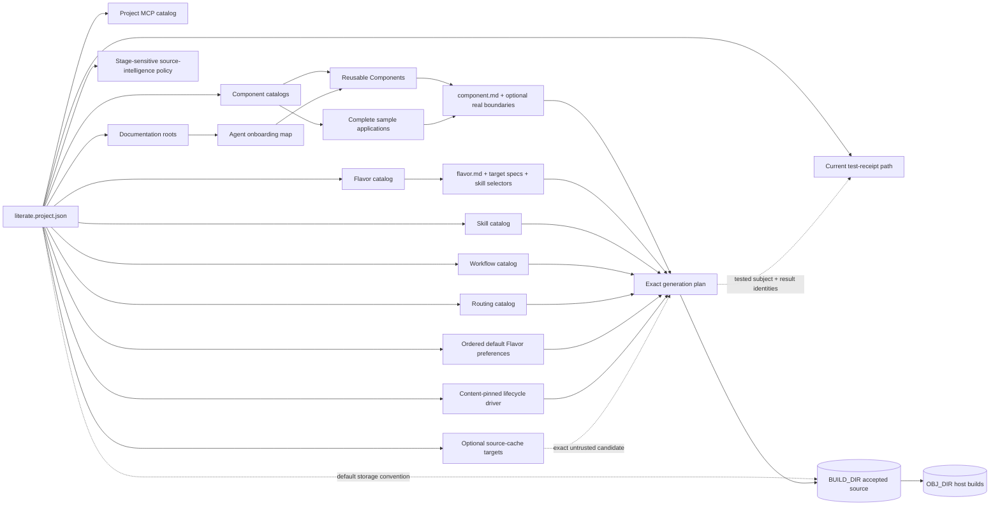

# Project layout

A Literate AI project is recognizable from its root. An agent or tool should not need
to infer conventions from neighboring directories. The manifest and provider-neutral
onboarding skill define authority:

```text
project/
├── literate.project.json       # exact catalog roots and structural profile
├── SKILL.md                    # provider-neutral agent onboarding
├── AGENTS.md                   # optional provider shim → SKILL.md
├── CLAUDE.md                   # optional provider shim → SKILL.md
├── agents/openai.yaml          # optional provider UI metadata
├── .cursor/rules/              # optional provider shim → SKILL.md
├── components/                 # reusable building-block Component catalog
├── samples/                    # complete demos; private except hello-component
├── flavors/                    # optional target-specific mixin catalog
├── skills/                     # optional conversion-skill catalog
│   ├── specification-to-source/# exact skills used during code generation
│   └── source-to-specification/# exact skills used for inverse authoring
├── workflows/                  # optional workflow.md stage-DAG/instruction catalog
├── routing/                    # optional model-eligibility catalog
├── mcps/                       # optional project-owned MCP servers (`mcp.md`)
├── docs/                       # required declared, linked narrative spine
│   └── architecture/
│       └── design-traceability.md # one authority-review marker
├── generated/                  # advisory BUILD_DIR; fungible accepted-source cache
├── _build/                     # advisory OBJ_DIR; disposable, ignored, never indexed
└── verification/
    ├── acceptance/             # verifier-only per-Component acceptance contracts
    └── current.json            # optional passing receipt; created after success
```

The taxonomy is a small authority graph, not a set of folders tools search by guesswork:



A Component owns what the application must do. Selected Flavors add target-specific
requirements, skills guide the conversion, workflows order the stages, and routing
limits eligible models. Only catalogs named by the manifest can contribute to that
plan. Optional `mcp_roots` hold project-owned MCP servers (`mcps/<id>/mcp.md`); see
[ADR 0024](../decisions/0024-project-mcp-catalog-hygiene.md). Operator MCP opt-in lives
under the platform-resolved `literate-ai` user configuration root, not in git. On
Linux/macOS that defaults to `$HOME/.config/literate-ai`. An interactive session follows
`skills/agent/configure-operator-mcp/SKILL.md` to discover connected MCPs and
write that catalog
([ADR 0021](../decisions/0021-operator-local-mcp-catalog.md),
[ADR 0022](../decisions/0022-channel-author-recipient-vocabulary.md),
[ADR 0023](../decisions/0023-mutagenic-cli-channel-fan-out.md)).

When a selected Flavor declares `requires`, its Component providers join the same exact
project DAG as Component-authored dependencies. The closure is recursive and
selected-only: choosing the Flavor adds its typed phase edge and provider; omitting the
Flavor omits both. This is the intended way for a derived project to add a packaging,
deployment, accelerator, or other target-specific capability without patching its base
Component or installing a runtime plugin.

Documentation is first-class project state, but it does not silently become application
behavioral authority. Prose in a Component specification remains normative; the
declared narrative spine explains how that authority fits together, while nearby
Mermaid diagrams make its behavior, boundaries, and examples legible in the
literate-programming tradition.

Run `litai project validate` from anywhere below the root. The command discovers
`literate.project.json`, requires the declared root `SKILL.md`, checks every declared
catalog boundary, validates each provider shim that is present, checks the configured
source-intelligence evidence without mutation, and requires a supported runtime, regular non-symlink
database, exact project-root binding, and zero pending/worktree drift. It then validates
Components and Flavors, verifies all content pins, checks exact skill dependencies and
cycles in the forward and inverse catalogs, enumerates every declared Markdown document
with a content identity, and rejects retained generated Component source. `SKILL.md`
must link into declared documentation; a local link to an undeclared ambient document
fails validation. Exactly one declared document must contain a current
`literate-ai:authority-reviewed` marker bound to the whole authority and documentation
graph. If `test_receipt` is configured, validation also reports whether its admission
policy is absent, its file is missing, or its receipt is current, stale, or mismatched.
A `policy-unconfigured` scaffold is valid for onboarding; it is not authority to accept
or claim a passing run.

The manifest's `source_intelligence` object is configuration authority. Default
init selects provider `none` with every stage `off`.

## Framework origin and project updates

`litai init` creates and validates the canonical scaffold, initial Component locks,
Standard lifecycle binding, default-off source-intelligence policy, authority-review marker, exact
`.literate/initialization-origin.json`, and a content-addressed
`.literate/initialization-baseline.json`.

A safe framework update cannot compare a project with whichever `litai` happens to be
on `PATH`. The planned `UX-275` contract records the repository from which the installed
distribution originated—including an operator fork—plus its exact Git revision,
framework/template protocol, and a content-addressed manifest of initialized files.
Built wheels retain that URL/revision in a generated package resource rather than
depending on the installer-local `direct_url.json`, which ordinarily names only the
wheel file. The release gate installs the wheel outside every checkout, initializes a
project, and requires the recorded origin to equal the build checkout exactly.
`framework_distribution_identity` identifies the exact logical payload of the built and
installed wheel, including that embedded origin resource; it is not a synonym for the
Git commit. The identity observed from the exact wheel artifact being distributed is
authoritative. Repeated clean builds are comparable only when revision and canonical
build-origin inputs are also identical, and `make wheel-check` verifies that such builds
produce the same logical payload identity even when archive container metadata differs.
`litai init --from URL[#REVISION]` records an authored direct-parent selection plus a
complete ancestor-first lock in `.literate/repository-lineage.json`. It materializes
regular tracked Component, Flavor, skill, workflow, and routing files with exact
provenance in `.literate/imports.json`; it never checks parent code out or executes it.
Workflow and routing documents are inherited as independently named catalog items so
Component-global generation references remain resolvable. Descendants override
ancestors, while incomparable definitions of the same catalog coordinate are rejected.
See [repository inheritance](../architecture/repository-inheritance.md).

`litai update [PROJECT]` verifies initialization evidence, re-resolves the complete
parent chain, and emits versioned three-way plans for both inherited catalogs and the
static framework scaffold: `unchanged`, `already-current`, `upstream-only`,
`local-only`, `conflict`, `upstream-added`, or `preserved-dynamic`. `--apply` updates
only mechanically safe files and the exact lineage/provenance records; local changes
and conflicts are preserved. `--adopt-added` remains an explicit capability-adoption
decision. After review, repeatable `--take-upstream PATH` choices can include exact
inherited-catalog conflicts in that same transaction; other paths fail before writes.
A repeatable `--keep-local PATH` can retain an exact planned removal when local
authority still depends on it. Validation failure rolls inherited files, provenance,
and lineage back.

`litai reparent URL[#REVISION]` resolves and reviews a new complete chain before a
compare-and-swap change. `litai reparent none` explicitly makes the repository a root;
for that project, `litai update` is a no-op. Semantic conflict migration, lock refresh,
Tests and receipt finalization remain subsequent gates.

Each catalog-root field remains explicit in the manifest, but unused Component, Flavor,
skill, workflow, and routing lists may be empty. `documentation_roots` is required and
non-empty because the project must retain an obvious onboarding path. Every listed root
must be an existing directory inside the project. This lets a narrowly scoped project
avoid manufacturing unused catalogs while keeping its narrative discoverable.

`test_receipt` is different from a catalog root. It is an optional normalized relative
file path outside every catalog, `SKILL.md`, and `literate.project.json`. The canonical
initializer sets it to `verification/current.json` but does not invent a receipt. Only
an exact passing test result admitted by `test_receipt_policy` may create or replace
that file. The policy pins the suite ID/version, exact runner identity, required
evidence kinds, and minimum passing-test count. Without it, no receipt is current.

`default_flavor_selectors` is also optional. It is an ordered list of `+flavor` and
`-flavor` preference operations applied only when a Component declares the Flavor's
axis; explicit request selectors run afterward. This repository and every initialized
project record `+flavor://literate-ai/build-bazel` and include the exact pinned
Flavor/specification and build
skill. An explicit alternative or `-bazel` wins before prompt assembly. Components
without a `build.system` slot—including the current samples—remain unchanged, and a
selected preference is not evidence of the build system that actually ran.

`lifecycle_driver` is the explicit project TCB used by `litai rebuild`. It binds sorted
implementation paths and their aggregate content identity, one shell-free command
template, the allowed environment-key subset, timeout, specification scope, and complete
phase order. Project validation admits that declaration; rebuild verifies those files,
the resolved executable, expanded command, and project revision before and after the
host lifecycle.

`source_cache` is optional derived-state policy. It can name project-relative roots
that do not overlap any authority/onboarding/receipt path and operator-bound roots whose
absolute paths are supplied at runtime. A Git repository or monorepo may track a
declared project-relative immutable cache layout. That does not make its source entries
authority: every cache hit remains acceptance-untrusted until the current lifecycle
rebuilds and independently verifies it.

## Documentation is a reviewed project graph

Every Markdown file and local asset beneath `documentation_roots` is declared project
content. Local links must resolve without symlinks or path escapes, fragment anchors
must exist, remote images are rejected, every declared document must be reachable from
the root `SKILL.md`, and every declared asset must be referenced. Ambient Markdown
outside those roots does not join the graph.

One marker records that a human reviewed the current narrative against the current
authority graph. Its digest covers the project definition, onboarding skill,
Components, Flavors, exact forward and inverse skills, workflow/routing catalogs,
normalized declared Markdown, and declared assets, excluding the tactical execution
queue under `docs/roadmap/`. Graph validation still admits those queue files so broken
links fail closed; checkbox churn does not stale the marker. Any other relevant change
makes it stale.
Run `litai project documentation-update .` first for a deterministic, non-writing drift
plan. An explicitly authorized `--apply --allow-model-egress` run can propose and apply
only validated replacements for existing declared Markdown; it never records review.
After inspecting the diff, run `litai project documentation-review . --record` to write
the exact marker and validate again. This keeps documentation changes explicit and
reviewable without pretending a hash or model can judge the quality of the explanation.

## Authority follows the catalog, not the directory name

The full paths above are the canonical defaults created by `litai init`, not a
minimum-validity checklist. Tools read their actual roots from
`literate.project.json`; they do not search arbitrary parents for a directory that
happens to be named `_shared`. References may cross catalog directories only inside the
explicit project root and only when their SHA-256 identity matches.

Containment and identity are necessary but not sufficient admission checks. A Component
or Flavor can use a specification-to-source skill only when the exact `SKILL.md` file
is enumerated beneath one of the declared `skill_roots`. An identical, correctly pinned
file elsewhere inside the project is ambient content and validation rejects it. An
undeclared directory named `skills/` has no authority, while a differently named root
listed in the manifest does. This keeps the manifest's catalog graph—not filesystem
proximity or a matching digest—the single source of admission authority.

The same rule governs inverse authoring: descriptor-based source-to-specification cases
load the union of `source-to-specification/` manifests under declared `skill_roots`,
including differently named and multiple roots. They never climb parent directories in
search of a conventional `skills/` directory. An explicit `--skills-root` remains an
operator-selected catalog; arbitrary-source analysis additionally requires exact
reviewed built-in identities.

A Component normally keeps all authored metadata and behavior in its own
`component.md`. That single-file default makes ownership obvious without manufacturing
an `openspec/` directory, JSON projection, and acceptance directory for a small unit.
Add another specification file only for a named domain/module boundary and add an
`interfaces/` document only when another independently generated Component consumes the
public contract. Generated `component.lock.json` records exact resolution beside the
authoring document; it is not maintained as prose or copied into `component.md`.

Repository conformance selection, fixed invocation vectors, and private oracle values
are test infrastructure, not Component prose. Keep them in a separately declared test
or harness area and bind them to the exact Component/specification identity; never place
private oracle content in the model-visible Component tree. Shared OS and language rules
belong in `flavors/`. Conversion technique belongs in `skills/`. Stage order belongs in
`workflows/`, and model eligibility belongs in `routing/`. This framework repository
declares both `components/` and `samples/` as Component roots for resolution, but their
roles are not interchangeable: `components/` contains reusable providers and `samples/`
contains complete demo compositions. Samples remain private downstream except for the
explicitly inheritable hello starter; `litai init` uses `components/` for ordinary
projects.

## Generated source and generated tests are outside the project

Tracked source under a forward-generation Component would bypass the workflow this
layout exists to test. Generate into a new, empty directory outside the project:

```console
litai lock samples/hello-component --target macos-host --flavor=+flavor://literate-ai/os-macos --flavor=+flavor://literate-ai/lang-python
litai plan samples/hello-component --target macos-host --flavor=+flavor://literate-ai/os-macos --flavor=+flavor://literate-ai/lang-python
litai generate samples/hello-component \
  --output /tmp/hello-component \
  --target macos-host \
  --flavor=+flavor://literate-ai/os-macos \
  --flavor=+flavor://literate-ai/lang-python
```

Build products, accepted workspaces, and runtime state stay outside project authority.
Direct generated application output can never target the project as a second source of
truth. `BUILD_DIR` (default `generated/`) and `_build` (`OBJ_DIR`) are the advisory
default prefixes for that fungible product source and its disposable objects; they are
not mandatory for load-bearing project authority. A coding CLI writing a root Makefile
as generated application output remains wrong; writing or updating the project's
Makefile as project authority is allowed. A source cache may live in a
declared project-relative derived-data path or an operator-bound external path, but it
cannot overlap `components/`, `flavors/`, skills, documentation, or another authority
root. Bazel output/action caches follow the selected build integration's own declared
derived-state policy.
Each clean major rebuild creates this external shape:

```text
generated-output/
├── source/                     # disposable generated source tree
│   ├── .literate/
│   │   └── sbom.cdx.json       # strict CycloneDX 1.7 pre-build SBOM
│   └── tests/manifest.json     # current generated implementation tests
```

The implementation, suite, and source SBOM are derived from the current specs, selected
Flavors, exact skills, and managed dependency projection, then discarded with that
generated tree. Both source and resolved SBOMs bind the same exact
`ComponentComposition` identity and contain its complete managed graph: the root, every
transitive Component, every declared repository-source dependency, and every
relationship's source, target, kind, optionality, and identity. The resolved
post-build CycloneDX SBOM is separate external evidence because it binds and preserves
the exact source SBOM while adding the package, toolchain, runtime, and binary closure
actually observed after build and before tests.

The one exception is not generated source: `verification/current.json` is a small,
canonical passing-only receipt bound to the complete current authority-review identity.
A test adapter creates a candidate outside the project; the receipt command atomically
replaces the configured file, and a user or CI commits that one file. Git provides the
history. Test logs, generated tests, binaries, host paths, and failed or skipped
receipts remain outside the repository.

Source under a source-to-specification fixture is an analysis input, not generated
Component output, and is therefore a separate taxonomy.

## Create a project

`litai init PATH` intentionally creates the complete canonical taxonomy plus the
root onboarding skill, thin Codex, Claude, Cursor, and generic agent entrypoints (the
generic `AGENTS.md` is also consumed by OpenCode), and the
pinned `bazel` Flavor/specification with its exact build skill. Its manifest selects
`+flavor://literate-ai/build-bazel` as a removable generation-prompt preference, not
runtime enforcement. Those
defaults provide an obvious starting point, while hand-authored manifests may leave
unused catalog lists empty and omit every provider shim. Initialization creates no
generated application source and no synthetic passing receipt. Add only the catalogs the
project needs, then keep `litai project validate` green.
