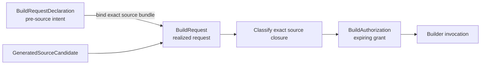

# Source trust and build security

Literate AI assumes caches may receive authoritative signed source. A valid signature
proves origin and byte integrity; it does **not** prove that compiling or executing those
bytes is safe.

## Required decision chain

### 1.1 execution support

The 1.1 local generation/build/test path runs as the invoking user when explicitly
authorized with `--allow-host-execution`. It has no production OS/VM containment
backend. Process limits, content identities and passing acceptance do not establish
filesystem, network or credential isolation. See the
[production containment contract](../architecture/production-containment-threat-model.md)
for the qualification required before a production containment claim.

The local MCP facade starts with `litai-mcp --project-root PATH`. Tool paths are
resolved inside that root, including symlinks, and mutations require
`acknowledge: true`. Changing the global operator MCP catalog additionally requires
the startup option `--allow-operator-config`. Tool annotations describe risk; they
are not authorization. These helper checks do not constrain an agent that separately
has shell access as the same host user, nor do they sandbox generated code or paths
referenced inside project metadata. Clients upgrading to 1.1 must send explicit
mutation acknowledgement; read-only calls retain their existing input shape.

The facade uses the [MCP tool contract](https://modelcontextprotocol.io/specification/2025-03-26/server/tools).

Before compilation, the lifecycle must:

1. resolve and verify the exact source closure;
2. retain origin attestations and revocation state;
3. quarantine and scan source as inert content;
4. propagate dependency classifications;
5. classify the exact effective revision; and
6. issue a short-lived authorization for an exact builder, toolchain, sandbox,
   privileges, and allowed outputs.

Builder invocation fails when authorization is absent, expired, revoked, or mismatched.
Changing source, dependencies, effective revision, toolchain, or privileges requires a
new decision.

Build intent is split across three different facts. A `BuildRequestDeclaration` is
pre-source intent: it names the effective revision, builder, toolchain, sandbox,
privileges, and allowed outputs, but cannot name bytes that do not exist yet. After
generation, realization adds the exact `source_bundle_digest` and produces a
`BuildRequest`. Classification and policy then issue a separate, expiring
`BuildAuthorization` for that realized request. Neither declaration nor realization is
authorization.

The Standard per-Component lifecycle preserves these identities independently through
indexing, authorization, build, execution, acceptance, and project admission. The
current host facade applies the same conceptual ordering, but its checkpoint model is a
compatibility surface rather than a substitute for the newer typed Standard contracts.

## Profiles

The contracts support constrained execution, reviewed privileged execution, blocked
execution, and an explicit `yolo` maximum-risk exception.

> **YOLO MAXIMUM RISK:** this profile may bypass normal classification restrictions for
> the exact privileges named by the request. It never adds privileges implicitly. Use it
> only as a deliberate, audited, time-limited exception for exact signed source.

`yolo` is never a fallback, including for dynamic observation. A caller cannot make it
effective merely by constructing a classification labeled `yolo`; authorization
issuance requires explicit acknowledgement and binds the resulting profile and warning.
It requires:

- a blocked exact revision and explicit acknowledgement;
- actor identity and a non-empty reason;
- an explicit least-privilege list with no wildcard or automatic expansion;
- a bounded expiration; and
- persistent warning and provenance.

Identity verification, provenance, expiration, revocation, and audit remain enabled.
Published artifacts retain the warning so downstream policy can reject them. A Flavor,
model, skill, or source comment cannot select `yolo` or weaken security.

## Source-to-specification trust

Unsigned source can be statically analyzed but cannot be promoted. The CLI's HMAC
attestation and signed-review flow is suitable for local bootstrap; production systems
should use an authoritative signing and verification design. Dynamic observation is
separately authorized and fails closed without supported OS sandbox tooling or a live
revocation provider. Current external revocation state is checked at the pre-launch
boundary, including when revocation occurs after grant issuance; that check and process
creation are not an atomic transaction.

The spec-to-host sample ladder has a separate portability profile. Its
`--allow-host-execution` switch acknowledges that generated source is compiled and the
resulting bytecode or native executable runs as the current user without an OS sandbox.
The builder and host runner fail closed unless their exact requests have live matching
grants; the runner rechecks external revocation plus the artifact tree, entrypoint, and
support-tree identities before launch. It checks those input identities again after the
process exits and rejects even successful output if the child changed them. These are
temporal checks, not an atomic filesystem snapshot: a production backend needs
immutable input mounts or an equivalent platform guarantee to exclude change-and-restore
races. Both unsandboxed grants are explicit `yolo` decisions. This profile must not be
substituted for the sandboxed dynamic-observation path.

Generated implementation tests do not grant permission to compile or run generated
code. Their manifest is model-produced current-state evidence inside the disposable
source tree, so the same exact build and execution authorizations still apply. A
passing project receipt records identities after an authorized run; it is not a
signature, safety attestation, sandbox claim, or substitute for live revocation checks.
Persistent-service acceptance is verifier-owned host execution under the same explicit
Standard lifecycle acknowledgement. Its contract can add bounded arguments and
non-secret environment values, allocates only a loopback endpoint, caps request/response
and process output, and owns graceful-then-forced process-tree termination. These controls
bound accidental hangs and evidence growth; they are not an OS sandbox, do not prevent the
service from opening other network connections, and must never carry credentials in the
tracked acceptance document.

Receipt finalization is a **supported API/TCB boundary**: the lifecycle driver can emit
only a provisional assertion, while the outer CLI emits the distinct promotable
envelope after current lifecycle and outer-side-effect validation. Public promotion
rejects the provisional assertion and any extracted raw receipt. This schema/API split
prevents accidental promotion, not forgery by a process holding the same filesystem
authority; deployments requiring adversarial separation need an authenticated operator
ledger or signing trust anchor.

The rebuild control protocol uses descriptor-relative, no-follow directory operations
on hosts where Python exposes them. Windows' portable Python API has no equivalent
reparse-point-safe directory-handle primitive, so its named-path fallback can detect
ordinary replacement but cannot rule out a same-user replace-and-restore race. On
Windows the external runtime/protocol directory is explicitly same-user TCB. Use an
ACL-isolated runtime owned by the operator, or a native handle-backed protocol adapter,
when same-user processes are outside the trust boundary.

SSH lifecycle stdout is a fixed one-MiB control plane, not an evidence container. Its
typed result exposes only bound identities, declared manifest/bundle sizes and transfer
handle, observed facts, status, and a bounded redacted summary. Complete manifests,
artifacts, logs, and failure diagnostics travel through the digest-bound evidence bundle.
The coordinator verifies both declared sizes and digests before parsing or accepting the
manifest, imports every listed byte into coordinator custody, and acknowledges the exact
manifest/bundle pair before worker cleanup. Oversized controls, missing content,
tampering, replay conflicts, disconnects without completed import, and acknowledgement
failures retain worker custody and fail closed; no worker-local path is attestation.

CycloneDX source and resolved SBOMs are dependency inventory, not security decisions.
Complete graph validation does not imply vulnerability, license, signature, origin, or
execution approval. Those policies consume exact SBOM identities and findings but still
issue their own decisions. Likewise, a source-cache entry's historical build and
acceptance records never reactivate an expired authorization: a materialized hit is
explicitly current-acceptance-untrusted and traverses the present gates.

Before any generated-tree identity or lifecycle step is accepted, every file must use
one normalized relative POSIX path and must be `source` itself or beneath `source/`.
Paths that can change meaning on Windows (including drive, device, alternate-data-stream,
reserved-name, trailing-dot, or trailing-space forms) are rejected on every host. So are
case-insensitive aliases and file/ancestor overlaps; an application accepted on macOS or
Linux therefore cannot silently overwrite a different member when materialized on
Windows.

Coding-agent credentials remain machine-local inputs. The adapter forwards only the
selected provider's documented authentication environment variables and records only
their names in generation evidence; Literate AI never writes their values, and the values
are neither prompt input nor report content. Interactive credential stores remain outside
the generated workspace. Raw coding-agent stdout and stderr never enter framework
exceptions, CLI JSON, reports, or lifecycle events: both authentication diagnostics and
generic generation failures use stable metadata and direct operators to provider-local
diagnostics. This is a structural non-disclosure boundary rather than best-effort secret
substitution, because a provider can echo credentials in unrecognized forms.
Specifications and Flavors must never contain credentials.

OpenCode is invoked with an isolated LitAI configuration directory, pure-plugin mode,
project and Claude compatibility discovery disabled, and a deny-by-default permission
map that enables only workspace read/edit/list/glob/grep. Its source-generation process
runs in a detached temporary workspace, and LitAI materializes only the completely
validated file map into the candidate root. OpenCode's own security model identifies
permissions as a user-control policy rather than an operating-system sandbox, so the
recorded isolation profile makes that limitation explicit; provider-managed session and
authentication state may persist outside the temporary workspace.
Before any prompt or model invocation, a bounded `--pure run --help` probe verifies that
the exact pinned OpenCode executable exposes every option required to maintain this
profile. An incompatible release fails closed with `coding_cli.incompatible`; LitAI does
not remove `--pure` or fall back to a different provider.

Execution-worker catalogs are private operator configuration, not project authority.
`--worker-param` values are validated against the selected worker declaration and enter
the content-bound request; they must not carry secrets. Credentials belong only in the
worker's named environment bindings and are excluded from requests, artifact exports,
CLI results, and Git. A command worker is trusted code execution with the privileges of
its dispatcher. Literate AI validates its typed result and immutable artifact reference,
but that protocol is not an operating-system sandbox or a remote-host attestation.
Remote source identity binds canonical paths, entry kinds, bytes, and executable intent
from the accepted transport manifest. On Windows, revalidation compares content against
that manifest without pretending NTFS exposes POSIX executable bits; POSIX hosts must
also reproduce the canonical executable state. This does not weaken archive integrity:
the archive byte digest and manifest executable flag remain independently bound.

Standard worker bootstrap accepts only a canonical manifest and bounded binary wheels
whose SHA-256 digests, names, versions, sizes, and requirement metadata match it. The
manifest's content identity binds the complete target-specific dependency closure; the
separate project pin continues to bind Literate AI's logical installed payload. Links,
sdists, unsafe paths, `.pth` startup code, missing mandatory dependencies, incomplete
RECORD, digest drift, incompatible wheels, and installed-payload drift fail closed.

The worker verifies every file before invoking pip with `--no-index --find-links` against
only that wheelhouse, removes inherited `PYTHON*` and `PIP_*` settings, then verifies
installed RECORD content and records closure evidence before exposing a relative,
atomically movable launcher. Explicit replacement retains the old environment until
activation and restores it if the swap fails. The legacy single-wheel verb remains only
for dependency-free wheels and rejects the production Literate AI wheel.

## Security boundary

The included rule-based scanners and guarded Python and native C++ builders demonstrate
policy enforcement; they are not a claim that arbitrary source is safe or that the
framework is a hardened operating-system sandbox. Read the complete
[source trust and build-security plan](../security/source-trust-and-build-policy.md)
before integrating compilation or execution.

Run [`samples/security-policies`](../../samples/security-policies/) to exercise blocked
and explicit exceptional-privilege paths.
