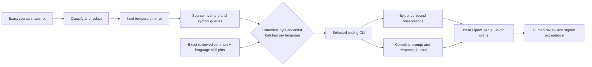

# Source to specification

The `litai spec` workflow turns existing source into a reviewable OpenSpec draft. It
is an inverse authoring workflow: source observations are evidence, not automatic
authority.

## Safety model

Both derivation modes inventory source without importing or executing it.
Instruction-like text found in source remains untrusted evidence and cannot select
skills, grant review authority, or enable execution. Unsigned source may be analyzed,
but its result is quarantined and cannot be accepted.

The default `static` translator is deterministic, local, and deliberately shallow. It
is useful for safe inventory, trust-envelope, review, and conformance exercises. The
`coding-cli` translator is unavailable. Model-backed inverse translation that
required graph evidence is not part of the product; use the static translator.
The static translator inventories an inert
temporary mirror of only admitted UTF-8 source, test, configuration, and documentation
files.
It requires explicit source-egress consent. Sensitive, binary, generated, minified, and
oversized content never enters that mirror or prompt.

The built-in reviewed skill set covers architecture, public API, behavior and state,
operations, security, and tests. Inert inventory also selects separate, exact Python,
C++, Rust, and JavaScript/TypeScript translators when those languages are present. Each
translator produces reviewable language-Flavor evidence; source text cannot select or
rewrite the translator:

```console
litai spec skills
```

For a case descriptor inside a project, the workflow loads the
`source-to-specification/` subcatalog from every `skill_roots` entry declared in
`literate.project.json`. Differently named and multiple roots work; a nearby undeclared
`skills/` directory has no authority. `--skills-root` (`--skills` is an alias) selects
an explicit catalog for case-driven conformance work. Arbitrary-source classification
accepts only exact reviewed built-in skill identities, including when an explicit root
is supplied.



## 1. Attest exact source

Keep the local bootstrap key and generated envelopes outside the source tree:

```console
head -c 32 /dev/urandom > local-source.key
litai spec attest path/to/source \
  --signer local-user \
  --machine local-host \
  --key local-source.key > attestation.json
```

This HMAC flow is a local bootstrap mechanism, not a replacement for organizational PKI
or signed release provenance.

## 2. Derive and inspect

```console
litai spec derive path/to/source \
  --attestation attestation.json \
  --trust-key local-source.key > bundle.json
litai spec coverage bundle.json
```

To perform semantic translation through the selected coding agent:

```console
litai spec derive path/to/source \
  --translator coding-cli \
  --allow-model-egress \
  --attestation attestation.json \
  --trust-key local-source.key > bundle.json
```

`CODING_CLI` may select `codex`, `claude`, `cursor-agent`, or `opencode`; otherwise the first
available command in that order is used. `--model MODEL` pins a model for every inverse
language call.
Before an OpenCode inverse call, the exact executable must pass LitAI's bounded,
prompt-free `--pure run --help` capability probe; incompatible releases fail before
source evidence or a prompt can leave the process.
`--model-evidence-byte-budget N` sets the positive UTF-8 evidence-byte ceiling for each
call; it defaults to 262,144. An individual evidence record above the ceiling is an
explicit error, not a truncation.
For an npm installation, the command is only a package locator: Literate AI bypasses its
scripts and executes the bundled native Node as
the configured runtime. Index evidence binds those direct
inputs; complete reachable package-graph evidence belongs to dependency/SBOM observation,
not to the index executable identity alone. Omit
`--model` to use the selected CLI's configured default. Missing or expired login state
is reported as an explicit authentication prerequisite.

The bundle includes the exact source inventory, attributed observations, provider-valid
draft artifacts, a coverage map, an uncertainty ledger, skill-stage provenance, proposed
Flavor drafts, and security metadata. Model mode additionally records runtime,
executable and frozen-database identities, exact counts and queries, plus the complete
coding-CLI command, prompt, response, stdout/stderr, isolation claims, selected skills,
model, egress policy, batch plan, and exact batch membership for every language call.
Acceptance keeps that versioned translation record in a content-addressed
`provenance/source-promotion/` directory; it does not keep generated application source.
For semantic promotion it also retains a compact inverse-custody document containing
the exact source inventory, behavioral inventory, path dispositions, and byte-bounded
batch plan. Before writing it, acceptance re-hashes every transcript field,
replays strict evidence/skill admission, re-derives the Flavor proposals, and verifies
that the journal call IDs reproduce the reviewed draft request identity.

Run `litai spec audit --baseline accepted.json path/to/source` when comparing the
derived result with a prior accepted baseline. Run `litai spec diff left.json
right.json` for a deterministic bundle comparison.

For the default static translator, author one complete Component graph JSON document
after inspecting the bundle's `component_definition_draft`, observations, and evidence.
The graph must use the exact source snapshot, the same root coordinate/title/capability
set, one reviewed `library`, `cli`, or `service` kind, non-empty profiles and build
needs, a public contract for every capability, evidence-backed entrypoints for CLI or
service Components, every observation exactly once, and only source paths/evidence IDs
present in the bundle. Static review intentionally supports one Component per
promotion; repeat the process for another independently bounded source tree instead of
inventing a multi-Component split from inventory.

A reviewed `library` graph deliberately carries an empty entrypoint set. On forward
generation, the selected language Flavor projects its public capabilities into an exact
package/module/symbol import surface; generated source must implement that surface and a
framework-only generated-test adapter, not invent a CLI application.

## 3. Review uncertainty

Blocking uncertainty IDs are listed in `bundle.json`. Resolve each one explicitly:

```console
litai spec review bundle.json \
  --actor local-user \
  --reason 'reviewed against current source and tests' \
  --component-graph reviewed-component-graph.json \
  --resolve uncertainty:first \
  --resolve uncertainty:second \
  --key local-source.key > review.json
```

Do not treat a suspected defect or contradictory test as desired behavior merely to
clear the gate. Update source, scope, evidence, or the review disposition deliberately.
The signed review binds the Component graph identity. Editing, replacing, or omitting
that graph after review invalidates acceptance.

## 4. Accept into a complete spec-driven project

```console
litai spec accept path/to/source bundle.json \
  --review review.json \
  --target path/to/new-spec-root \
  --project-target path/to/new-project \
  --qualification-target host \
  --flavor=+flavor://literate-ai/lang-python \
  --qualification-profile qualification-profile.json \
  --trust-key local-source.key
```

Acceptance verifies the source and review envelopes again. The output becomes intent
authority through this explicit review decision. The acceptance record binds the exact
source snapshot and says `release_implementation_authority: source-baseline`; review
alone does not claim that a from-scratch regeneration is feature complete.

`--project-target` additionally creates a canonical project, copies no implementation
source, installs the provider-neutral onboarding files plus exact portable-generation
skill/workflow/routing inputs, and turns each reviewed inverse Flavor draft into a
selectable Flavor. It writes readable `component.md` as the Component authority and
never creates welded `component.json`; the migration-only reader remains through the
documented 0.2.x compatibility series and is removed in 0.3.0. Acceptance
then folds the ordered `--flavor` additions and removals into the promoted project's
default Flavor selectors and runs the deterministic lock resolver for
`--qualification-target`. This prevents template-machine defaults from leaking into the
recovered application and avoids replaying an already-effective selector as a no-op.
If every recovered Flavor axis has exactly one reviewed candidate,
the selectors may be omitted and acceptance selects those unique candidates. Ambiguous
axes require an explicit selection. Locking reads no generated source, invokes no coding
model, and leaves no implementation source in the project. A one-node inverse writes one
complete Component definition. A
multi-node `ComponentGraphDraft` writes one Component per evidence-backed logical node
and capability requirements for its reviewed dependency edges; every node keeps only its
own accepted specification roots and remains independently generatable. Each node's
reviewed kind (`library`, `cli`, or `service`), profiles, public capability contracts,
entrypoints, and build Flavor axes become that node's manifest. Libraries retain no
runnable entrypoint. CLIs and services require an evidence-backed entrypoint; unknown
semantics block project promotion instead of becoming a fabricated
`portable-application/run`.

For incremental conversion of an existing retained adopted project, use
`--integrate-project path/to/adopted-root` instead of `--project-target`. Acceptance
creates the same source-free project beneath `.literate/native-projects/` and atomically
registers its exact path, project identifier, and project-definition identity in the
adopted root. The conversion-stage gate reopens every registered child, rejects registry
drift and duplicate Component coordinates, and verifies each projection in the child
that owns its promotion evidence. The adopted root can therefore advance to `drafted`
without copying generated authority files across project boundaries or rewriting the
retained project configuration.

When a reviewed `local-regenerative-qualification-profile` is supplied, acceptance
content-pins it as
the Component's independent acceptance contract. Every case has a stable ID, a
positional argument array, and an exact verifier-owned expected result. The profile is
withheld from generation prompts and generated implementation tests, then supplied only
to the independent packaged-application acceptance boundary. Profiles from the earlier
unreleased v1 shape are rejected because they did not contain expected results and
cannot be upgraded without inventing verification authority. Omit the profile when
authoring intent only; qualification then remains unavailable until a reviewer adds
such a contract.

## 5. Qualify regenerative authority

Moving release authority above the original implementation is a second promotion. For
each required target, repeatedly generate from only the accepted specification, selected
Flavors, and pinned forward skills in a new empty workspace; bypass the generated-source
cache; build the exact tree; run its freshly generated test suite; and compare it through
an independent parity verifier with the original source baseline.

The original source may be compiled or run as that parity oracle under explicit host
execution authorization. It must never be included in a coding-model prompt, generation
workspace, generated-test input, or source-cache hit. Every required behavioral surface
must pass in the configured minimum number of clean runs on every required target before
a `regenerative-qualification-decision` can name `specification` as release
implementation authority. Otherwise the decision remains
`source-baseline` with explicit blockers.

Before it authorizes any host execution, `qualify` independently reopens semantic
inverse custody and reconstructs the complete path-disposition and model batch plan.
Missing, substituted, blocking-omitted, or over-budget evidence fails closed. The same
check repeats immediately before a lifecycle-backed authority transition. Deterministic
static translations are explicitly exempt because no model egress occurred.

Admitted test source remains valuable evidence for examples, boundaries, and expected
behavior, but test classes, fixtures, and test functions are not public product surfaces.
The independent collector excludes conventional language test paths and filenames from
its required surface set while retaining their bytes in the evidence partition. Product
source must still supply at least one independently detected surface.

The independent surface inventory treats recognized language sorting and selection
constructs as required ordering surfaces. An inverse statement must name the comparison
direction and domain—such as Python Unicode code-point order, JavaScript UTF-16 code
units, Rust UTF-8 byte order, or the evidenced C++ comparator—and say whether encounter
order can affect the result. Merely calling output "sorted" or "lexicographic" is not a
complete mapping.

Recognized trimming, case conversion, and pattern-rewrite constructs are likewise
required normalization surfaces. The inverse draft must state the transformation order
and map each normalized value to every observable consumer and returned field. Mentioning
that a trimmed value is used for grouping or an identifier does not establish that the
returned value is also trimmed.

The local-host command first requires the canonical `component.lock.json` for `--target`
and the ordered `--flavor` selectors. It rejects stale authoring, Flavor, specification,
or lock bytes before host execution. Historical v1 decisions remain readable but always
retain `effective_authority: source-baseline` and `qualification-v2-required`. New runs
that satisfy every policy condition produce a v3 current qualification record binding
the exact Component revision, lock, generation closure, inverse custody, provider
identities, and both complete runs. The record is content-addressed under the promoted
project's `provenance/qualification/` directory; locked admission then appends the
`regeneratively-qualified-fungible` authority successor.

There is no command-line option that accepts caller-authored qualification evidence.
The CLI constructs `VerifiedSourcePromotionEvidence` only from the trusted providers it
invoked; callers cannot inject it as JSON. Missing, partial, stale, cached, failed, or
drifted facts fail closed. Reopening qualified authority also re-hashes the persisted
qualification record and checks its source, specification, revision, lock, promotion,
inverse-custody, verifier, and policy bindings.

Write the historical qualification record outside both the original source baseline
and the promoted project. The CLI rejects either overlap and rechecks the source
snapshot, Component revision, authority head, and promotion audit immediately before
persisting the record.

See [source promotion and regenerative qualification](../architecture/source-promotion.md)
for the complete flow, public wire records, trust boundary, and language-skill matrix.
The framework exposes the pure decision rule, `run_regenerative_qualification`, concrete
local-host providers, and a safe CLI integration:

```console
litai spec qualify path/to/new-project/components/APP \
  --source path/to/exact-source-baseline \
  --profile path/to/new-project/components/APP/qualification/profile.json \
  --target host \
  --output /tmp/literate-ai-qualification.json \
  --key local-source.key \
  --signer local-user \
  --allow-host-execution
```

Use `--model MODEL` to select the pipeline model explicitly for qualification.
The public plan and every clean runtime receive the same selector, with normal
Component and lexical model-scope rules still applied. Select the configured coding
CLI through `CODING_CLI`. Omitting `--model` keeps the CLI-configured default;
`LITAI_LIVE_MODEL` by itself does not replace this command's pipeline selector.

`qualify` independently resolves the exact forward recipe, creates at least two empty
workspaces, forces real `litai generate` calls, runs the profile's build and current-test
commands, executes baseline and generated applications on the profile's JSON probes,
compares their parsed values, and HMAC-signs every measured run payload. The profile is
a content-pinned execution plan inside the project, not precomputed evidence. The CLI
does not accept caller-supplied evidence, `passed` flags, result identities, or
attestations. Local execution is explicitly authorized and unsandboxed; organizational
integrations may replace these providers and the local HMAC root with their own trusted
execution and signing services.

Each successful clean run is checkpointed under
`BUILD_DIR/qualification-checkpoints/`. This is signed evidence caching, not generated
source caching: every measured run still requires a source-cache miss. If a later run is
interrupted or rejected, repeat the same command. Literate AI verifies the prior run
against the exact source, spec, Flavor lock, recipe, target, source-exclusion audit, and
provider identities and executes only the missing run. Changing any of those inputs—or
the signing key—prevents reuse. `litai really-clean` deliberately removes the
checkpoints.

## How this path is tested

The test ladder keeps network variability out of the mandatory gate while still making
the real integration reproducible:

| Layer | What it proves | Normal command |
| --- | --- | --- |
| Strict adapter tests | Four language partitions, exact skills, evidence admission, model-output parsing, complete journals, tamper rejection, and pre-egress pin checks | `make validate` |
| Installed source-inventory test | A real temporary mirror is inventoried and content-bound | `make validate` |
| Regenerative parity | Two empty, cache-bypassed source generations per language compile/run through Python, C++, Rust, and JavaScript and match independently observed baseline output, including invalid input | `make validate` |
| Live model integration | Unavailable; coding-cli inverse translation fails closed | n/a |
| Live bidirectional promotion | One stable application spec generates, builds, tests, and runs in Python, C++, Rust, and JavaScript; every generated tree is translated back and compared against the complete normalized requirement graph; every inverse spec is promoted and completes two new spec-only build/test/parity runs to reach fungible authority | `LITERATE_AI_RUN_LIVE_ROUNDTRIP=1 CODING_CLI=codex PYTHONPATH=src python -m unittest tests.conformance.test_live_bidirectional_roundtrip` |
| Live composed promotion | The invoice sample generates, reverses into three evidence-bound Components and two capability edges, promotes the full graph, composes it normally, regenerates, builds, tests, and matches known output | `LITERATE_AI_RUN_LIVE_COMPOSED_ROUNDTRIP=1 CODING_CLI=codex PYTHONPATH=src python -m unittest tests.conformance.test_live_composed_roundtrip` |

The live commands spend coding-agent calls and require the selected CLI to be installed
and authenticated, so they are explicit rather than part of credential-free CI.
`CODING_CLI` may instead name `claude`, `cursor-agent`, or `opencode`; set
`LITERATE_AI_LIVE_MODEL` only when the integration must pin a particular model.

These tests are deliberately host-scoped. Literate AI does not require every application
to implement both directions or repeat inverse translation on every OS/Flavor. The
separate `make samples-platform-regression` target fans one representative forward sample,
or a configured glob, across macOS, Linux, and Windows.

### What the four-language round trip established

The `regenerative-roundtrip` application is intentionally richer than a symbol
inventory. Its contract includes bounds, whitespace normalization, aggregation,
integer discount arithmetic, stable ordering, tie-breaking, exact output fields, and
invalid-input behavior. The inverse translator performs an exhaustive contract-coverage
audit over those facets before it may claim a draft is complete. Semantic comparison is
therefore based on separately attributable behavioral anchors, not prose similarity or
byte equality with the original specification.

OpenSpec emission preserves that structure mechanically: every recovered statement has
one unique Requirement heading keyed by its statement ID, and all of that statement's
scenarios remain beneath it. Multiple scenarios never duplicate a Requirement name.
This matters because strict provider validation is part of derivation, not a cleanup
step after review.

The same accepted contract generated working Python, C++, Rust, and JavaScript programs.
Each portable executable receives one JSON array of positional arguments as its first
application argument; language launchers decode that array and call the generated
application contract. This avoids shell-specific quoting and gives the forward generator,
baseline runner, promoted project, and independent verifier one cross-platform ABI.

The live test also exposed conversion technique that belongs in skills, not product
intent. The Bazel skill now pins known-compatible rule-set baselines, requires explicit
Bazel 9 rule loads, requires the root `MODULE.bazel` to begin with one keyword-only
literal `module(name = "<valid_module_name>", version =
"<exact_component_version>")` before every `bazel_dep`, places shared C++ headers in
`cc_library`, sets every Python
`main`, and uses `entry_point` plus `data` for JavaScript launchers. Those details can
change with a skill revision without changing what the application means.

## Incremental refresh

Preserve reviewed statements when possible and invalidate only affected surfaces:

```console
litai spec refresh path/to/source \
  --previous bundle.json \
  --changed-path src/changed.py > refreshed.json
```

For deterministic tutorial fixtures, `derive`, `refresh`, and `conformance` also accept
the case descriptors under [`tests/fixtures/source_to_specification`](../../tests/fixtures/source_to_specification/).

Dynamic observation is a separate, explicit authorization path. It fails closed unless
`sandbox-exec` is available on macOS or `bwrap` is available on Linux; missing sandbox
tooling never means execute source directly.

## Forward-generated tests are not authoring authority

Tests found in an independently maintained existing checkout can be useful inverse-flow
evidence: the reviewed `tests` skill attributes their assertions and records conflicts
or gaps. That does not make all test-shaped files durable intent.

A forward major rebuild generates `source/tests/manifest.json` beside its disposable
implementation. That suite is derived from the same current specs, selected Flavors,
and exact skills as the code. Do not copy it into a specification project, feed it into
the next inverse-authoring run, or preserve it as a baseline. Change accepted specs or
Flavor requirements, review exact skills when technique changes, then regenerate the
implementation and suite together. The separate verifier oracle remains independent
acceptance evidence.
