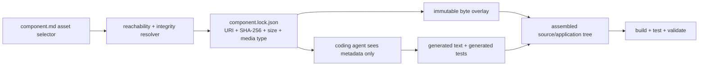

# Writing readable specifications

Use specifications for observable product intent. Use Flavors for target choices and
skills for reusable conversion guidance. This separation keeps a Component readable to
both a person and a coding agent without repeating framework boilerplate in every file.

## Begin with one document

The normal Component is one `component.md`. Its constrained frontmatter identifies the
Component and its composition selectors; its Markdown body is the readable behavioral
specification. When `specification_provider` and `specification_roots` are omitted, the
authoring adapter selects `literate-markdown` and this same `component.md` document.
Exact resolved identities belong in generated `component.lock.json`, never a second
hand-maintained JSON rendition of the Component.

```markdown
---
namespace: acme
version: 1.0.0
display_name: Work-cell status
profiles:
  - application
sample: false
provides:
  - name: acme.work-cell-status
    version: 1.0.0
requires: []
authoring_inputs: []
workflow_definition: workflows/default.md
routing_policy: routing/default.json
flavor_slots: []
entrypoints:
  - name: run
    kind: portable-application
    path: run
acceptance_contracts: []
source_dependencies: []
assets:
  - asset_id: currency-table
    source: assets/currencies.csv
    path: source/data/currencies.csv
    role: runtime-data
    media_type: text/csv
---
# Work-cell status

Describe the objective, public input and output, behavior, errors, examples, and
measurable acceptance here.
```

Components pass through repository inheritance by default. Add `inheritable: false`
beside `sample` only when a Component is intentionally local—such as a teaching sample,
qualification fixture, or private composition helper. The current project can still
build and test it, and users can copy it explicitly; descendants simply do not receive
it automatically during `init` or `update`.

## Declare non-code inputs as assets

A Component may require data, images, model weights, templates, certificates, or any
other bytes. Declare them in `assets`; do not ask the coding agent to recreate them and
do not disguise them as generated source.

| Field | Meaning |
| --- | --- |
| `asset_id` | Stable Component-local name |
| `source` | Component-relative path, `project:///shared/path`, or reachable HTTP(S) URI |
| `path` | Portable relative path in the assembled source/application tree |
| `role` | Portable purpose such as `runtime-data`, `reference-image`, or `test-fixture` |
| `media_type` | MIME type; defaults to `application/octet-stream` |
| `pin` | Optional `sha256:…` authoring constraint; the generated lock always records the exact digest, size, and media type |

Relative sources should normally live below the Component directory. Use
`project:///…` only when several Components intentionally share one repo-owned asset.
Use HTTP(S) for large externally stored assets. HTTP credentials must come from an
authorized resolver/environment and never appear in the URI. At lock/compile time every
asset must be reachable and must match its pin when one is present; otherwise Literate
AI stops before invoking a coding agent or generating tests.



Keep explicit `openspec` or `literate-markdown` roots when migrating an existing corpus
or when several files represent real named boundaries. Provider choice is a parsing
decision, not a reason to manufacture `openspec/spec.md` and `openspec/app.json` beside
an otherwise complete `component.md`.

## Author a bounded DMN decision table

Use `specification_provider: dmn` when the Component's behavioral authority is a
decision table rather than prose scenarios. List hand-authored or modeling-tool-exported
DMN XML files directly in `specification_roots`:

```yaml
specification_provider: dmn
specification_roots:
  - decisions/risk-category.dmn
```

The initial provider deliberately accepts only DMN 1.3 XML in the
`https://www.omg.org/spec/DMN/20191111/MODEL/` namespace. Every `<decision>` must contain
exactly one `UNIQUE` decision table. Inputs must have `typeRef="number"`; each input cell
must be either one closed numeric interval such as `[18..25]` or `-` for don't care.
Outputs may be `string`, `number`, or `boolean` literals matching their declared type.
Every rule must have exactly the table's input and output arity, and no two rules may
overlap across all input columns. Open intervals, comparisons, lists, negation, string
input tests, other hit policies, and general FEEL expressions fail closed rather than
being partially interpreted.

Literate AI validates this structure during lock planning and preserves each `.dmn`
file as exact content-addressed generation context. It does not execute DMN or derive a
table from legacy source. The shared `SpecificationSet` contains one clearly synthetic
structural-validation requirement solely for compatibility with the existing provider
transport; DMN rows are not represented as invented WHEN/THEN scenarios. Any runtime
translation or execution belongs to generated code and its selected implementation
skills. Replacing or changing an artifact after loading is rejected as drift.

The [Loan Risk Gate](../../samples/loan-risk-gate/) sample is the portable-application
proof of this provider: a UNIQUE two-input table plus a pinned JSON `assets:` overlay
for named income bands. The sample catalog admits `.dmn` files and loads them through
the shared specification-provider registry. Live source generation still requires
explicit model-egress acknowledgement.

## Author a bounded SCXML state chart

Use `specification_provider: scxml` when the Component's behavioral authority is a
state chart rather than prose scenarios or a decision table. Declare exactly one
`.scxml` chart and optional `.trace.json` sidecars in `specification_roots`:

```yaml
specification_provider: scxml
specification_roots:
  - playback.scxml
  - playback.trace.json
```

The provider accepts SCXML 1.0 in the W3C namespace, including compound states,
parallel regions, and shallow or deep history. It validates unique IDs, resolved
transition targets, and reachability. It does not execute the chart as a live
interpreter: generated code owns runtime stepping. Trace sidecars use
`$schema: litai-scxml-trace-sidecar/v1` and must name the chart file they accompany.
Each step records `event` and `expect_active` leaf configuration; history reentry
uses `via_history` and optional `expect_regions`. Unsupported executable content,
conditions, and mismatched traces fail closed.

The [Playback Controller](../../samples/playback-controller/) sample is the
portable-application proof: a parallel transport/audio chart with deep history and
two replay traces. Live source generation still requires explicit model-egress
acknowledgement.

## Split only at a real boundary

```markdown
---
name: Work-cell protocol
summary: Messages exchanged by the viewer and scene service
kind: contract
status: review
---

# Work-cell protocol

### Requirement: Report an unknown work cell

The service SHALL return a typed `work-cell-not-found` result when the requested
identifier does not exist.

#### Scenario: Missing cell

- **WHEN** a client requests an absent work-cell identifier
- **THEN** the service returns `work-cell-not-found` without changing scene state
```

For an additional layered document, only `name`, `summary`, and `kind` are required.
`references` imports other local nodes.
`status` is optional. `id` and `parent` are normally omitted because the provider derives
them from the path; when present they are assertions and must match.

Ordinary prose, tables, Mermaid diagrams, and code blocks may follow the frontmatter.
The provider derives a stable typed context requirement for every node. Add explicit
Requirement/Scenario blocks only for behaviors that need separately addressable
acceptance scenarios.

```text
spec/
├── spec.md                 # root ID from the Component coordinate
├── backend.md              # <root>.backend
├── frontend.md             # <root>.frontend
├── protocol.md             # <root>.protocol
└── rendering/
    ├── spec.md             # <root>.rendering
    └── kpi.md              # <root>.rendering.kpi
```

Every layered subfolder containing nodes needs its own `spec.md`. The provider rejects unknown
frontmatter keys, duplicate IDs or references, missing parent nodes, unresolved
references, cycles, path aliases, and drift before generation. The first declared
artifact is the Component's `component.md` self-root or an explicit corpus `spec.md`.
Supporting JSON may be listed when it is itself an external machine contract; do not use
JSON merely as a second rendering of prose already present in the Component.

## Keep the ownership boundary obvious

Put these in a Component specification:

- objective, scope, non-goals, and vocabulary;
- input/output shapes and public interfaces;
- behavioral invariants, state transitions, errors, ordering, and bounds;
- examples and measurable acceptance outcomes; and
- feature-specific test intent and KPIs.

Put these elsewhere:

| Concern | Owner |
| --- | --- |
| Linux, macOS, Windows, language, accelerator, packaging, deployment | Flavor |
| Bazel preference or another build technique | build-system Flavor and skill |
| how to reconcile layered specs, generate current tests, or avoid private dependency coupling | specification-to-source skill |
| coding model eligibility and fallback | routing policy |
| stage order and gates | workflow |
| external package/repository selection | dependency declaration and lock/SBOM |
| exact resolved content identities | generated lock and evidence |

A specification may explicitly override a removable skill preference when the product
really needs a particular implementation. Do not copy a default into every spec merely
to make it visible.

## Hierarchy is not Component composition

Split a Markdown file when it improves navigation inside one independently generatable
Component. Split a Component when the unit needs its own public capability contract,
generation context, source cache, build, tests, SBOM, version, or publication lifecycle.

The coding agent receives each local document once plus a canonical context graph. That
graph records the ancestor and transitive-reference order for every node. It does not
paste ancestor prose into every child or expose private specifications from transitive
Component dependencies.

For a larger vertical architecture and VFI mapping, see
[Mission specifications, hierarchy, and readable authoring](../architecture/mission-specification-composition.md).

A Standard executable Component declares exactly one entrypoint. A product with several
cooperating surfaces — an HTTP API, an embedded MCP server, a scheduled worker, a web
frontend — is not one Component with several entrypoints; it is several single-entrypoint
Components, each with its own `component.md`, joined by the ordinary `provides`/
`requires` capability-edge mechanism described above. Give any code the surfaces share
(data access, domain logic) to a library Component the others `requires`.

## Validate through the normal plan

Run the same plan that generation will consume:

```console
litai lock components/my-component \
  --target macos-host \
  --flavor=+flavor://literate-ai/os-macos \
  --flavor=+flavor://literate-ai/lang-python
litai plan components/my-component \
  --target macos-host \
  --flavor=+flavor://literate-ai/os-macos \
  --flavor=+flavor://literate-ai/lang-python
```

Planning validates the provider, exact declared artifacts, frontmatter, node graph,
current Component lock, pinned skills, workflow, routing, and target assertions.
It emits no source. Review the plan before `litai generate` or the complete
`litai rebuild` lifecycle.

CLI and UI adapters can compose `SpecificationCorpusService` with the strict
`LiterateMarkdownProvider` and its in-memory document formatter, without making the
application layer depend on filesystem adapters or reimplementing hierarchy rules. `validate`
returns derived IDs, parents, references, content identities, and each node's ordered
effective document context. `explain` returns that report or one selected node.
`format` returns canonical UTF-8 frontmatter and line endings as an in-memory preview;
supporting JSON remains byte-exact. The CLI previews by default, `--check` reports drift
without writing, and `--write` makes the filesystem mutation explicit at the adapter
boundary.

```console
litai spec validate specs/my-component --id-prefix acme.my-component
litai spec explain specs/my-component --id-prefix acme.my-component \
  --node acme.my-component.backend
litai spec format specs/my-component --id-prefix acme.my-component --check
litai spec format specs/my-component --id-prefix acme.my-component --write
```
