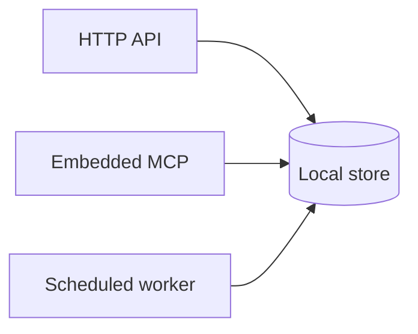

# Back-end base

Unpinned peer of hello-component for the back-end parent. Empty language lists still
default to Python plus Make plus the host OS. Both language-chapter skills are pinned
here so `+lang-rust` keeps the Rust delta and omits the Python one.

## Application contract

| Concern | Decision |
| --- | --- |
| Kind | `persistent-service` |
| Store | Local; request paths do not call the expensive upstream |

### Requirement: Local store answers requests

The HTTP API and embedded MCP server SHALL answer from the local store. Only a
scheduled worker MAY call an expensive upstream source.

#### Scenario: Missing resource is a structured error

- **WHEN** a caller requests a resource absent from the local store
- **THEN** the API returns a typed error and does not contact the upstream source
