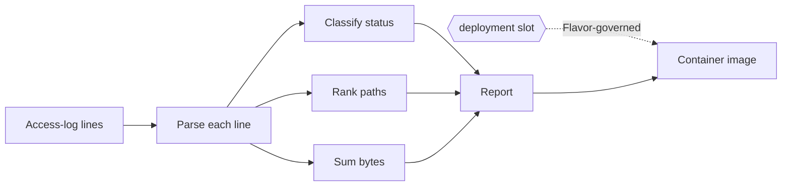

# Access-Log Tally

Every operator has piped an HTTP access log through `awk` at two in the morning.
This Component is that ritual expressed as authority: read Common Log Format lines,
tally them into a deterministic health report, and ship it as a container image
without ever writing image plumbing by hand.

The report's wire contract lives in
[`interfaces/spec.md`](interfaces/spec.md) — it is the named public
boundary consumers depend on and changes under its own review, not as a side effect of
this document. Image packaging is likewise *not* specified here: when the `deployment`
slot selects the Docker Flavor, the selected Flavor requirements and its
container-assembly skill govern base-image inheritance, package installation, and
entrypoint wiring. This Component states observable behavior only.

## Requirements

### Requirement: Parse Common Log Format lines

Each input line SHALL match the Common Log Format
`host ident authuser [day/month/year:time zone] "METHOD path PROTOCOL" status bytes`.
A line that does not parse SHALL be counted as malformed and SHALL NOT contribute to
any other field. The application SHALL accept between 0 and 1024 lines.

#### Scenario: Well-formed lines are accepted

- **WHEN** every input line matches the Common Log Format grammar
- **THEN** `parsed_lines` equals the line count and `malformed_lines` is zero

#### Scenario: Malformed lines are isolated

- **WHEN** an input contains a non-conforming line
- **THEN** only `malformed_lines` counts it and parsing continues

### Requirement: Classify statuses and sum bytes

For each parsed line the application SHALL map its three-digit status to its class
counter (`status_2xx`, `status_3xx`, `status_4xx`, `status_5xx`) and add its byte
value to `bytes_total`. A missing or
`-` byte field SHALL contribute zero.

#### Scenario: Mixed traffic is classified

- **WHEN** a log contains successes, redirects, and client errors
- **THEN** each class counts exactly its own lines

### Requirement: Rank requested paths deterministically

`top_paths` SHALL list at most `top_count` distinct request paths ordered by hit count
descending, ties broken by ASCII path ascending. `top_count` SHALL be clamped to the
range 0 through 100.

#### Scenario: Ties resolve stably

- **WHEN** two distinct paths have equal hit counts
- **THEN** ASCII order decides their relative position

The complete result shape, field names, and ordering contract are normative in
[the report-format boundary](interfaces/spec.md).

### Requirement: Executable host outcome

The generated application SHALL perform the complete tally workflow as a real compiled
or checked host artifact, and SHALL remain a single bounded JSON-in/JSON-out program
with no network access, standard-input reads, or third-party packages.

#### Scenario: Full stack runs end to end

- **WHEN** the application is built for the selected host and invoked with a valid tally request
- **THEN** it writes exactly one report JSON matching the declared result shape
