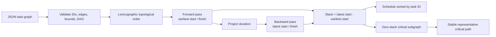

# Critical Path Scheduler

The scheduler turns an unordered project graph into two complementary views: a legal
execution order and a time-aware schedule. The forward and backward passes meet at
slack; zero-slack tasks form the critical subgraph from which one stable path is
selected. The Component is directly reusable in project planning, workflow
orchestration, build scheduling, migration planning, and operations runbooks.

## Application contract

| Concern | Decision |
| --- | --- |
| Application ID | `critical-path-scheduler` |
| Kind and algorithm | `critical-path-scheduler` using `critical-path-method` |
| Entrypoint | `run` |
| Task count | 1 through 512 |
| Per-task duration | 1 through 1,000,000 (`maximum: 1000000`) |
| Maximum total duration | 2,147,483,647 (`maximum_total: 2147483647`) |
| Stable ordering | ASCII task ID ascending (`ascii-task-id-ascending`) |

The diagram is an explanatory map; the requirements below define the exact behavior,
validation limits, fields, and tie-breaking rules.

### Requirement: Portable directed-acyclic-graph input

The application SHALL accept exactly one JSON request whose only member is `tasks`.
`tasks` SHALL contain between 1 and 512 task objects. Every task object SHALL contain
exactly `id`, `duration`, and `depends_on`:

- `id` is unique and matches `[A-Za-z][A-Za-z0-9_-]{0,63}`;
- `duration` is an integer from 1 through 1,000,000 inclusive;
- `depends_on` is a duplicate-free array of IDs naming other tasks in the same request;
  and
- the dependency graph is acyclic and the sum of all durations is no greater than
  2,147,483,647.

Task and dependency array order SHALL have no semantic effect. Dependencies MAY name
tasks that appear later in the request. An input outside this contract SHALL terminate
unsuccessfully without emitting a successful result object.

#### Scenario: Forward references and shuffled input

- **WHEN** a valid project lists tasks and dependencies in an arbitrary order
- **THEN** the application resolves the same graph as it would from dependency order

### Requirement: Deterministic critical-path method

For every valid request, the application SHALL perform the critical-path method using
integer arithmetic. A task's earliest start is zero when it has no dependencies and
otherwise is the maximum earliest finish of its dependencies. Its earliest finish is
its earliest start plus its duration. `project_duration` is the maximum earliest finish.

For the backward pass, a task with no dependents has latest finish equal to
`project_duration`; every other task has latest finish equal to the minimum latest start
of its dependents. Latest start is latest finish minus duration. Slack is latest start
minus earliest start, and a task is critical exactly when slack is zero.

The application SHALL also emit a deterministic topological `execution_order`. At each
step it selects the lexicographically smallest ASCII task ID among all tasks whose
dependencies have already been emitted. It SHALL emit `schedule` sorted by task ID;
each schedule record contains exactly `id`, `duration`, sorted `depends_on`,
`earliest_start`, `earliest_finish`, `latest_start`, `latest_finish`, `slack`, and
`critical`.

#### Scenario: Parallel work has exact float

- **WHEN** a valid project has parallel branches of unequal lengths
- **THEN** both scheduling passes report exact integer starts, finishes, slack, and critical flags

### Requirement: One stable representative critical path

The application SHALL return one `critical_path` in dependency order. It SHALL begin at
the lexicographically smallest task whose earliest finish equals `project_duration`.
Walking backward, it SHALL repeatedly select the lexicographically smallest direct
dependency whose earliest finish equals the current task's earliest start, and SHALL
reverse that walk for output. The selected path is therefore stable even when several
critical paths have the same duration.

#### Scenario: Equal critical branches

- **WHEN** more than one predecessor can extend the selected critical path
- **THEN** the lexicographically smallest eligible predecessor is selected

### Requirement: Executable host outcome

For every declared request, the application SHALL perform the scheduling rules and
return exactly one result object containing only `critical_path`, `execution_order`,
`project_duration`, `schedule`, and `task_count`.

#### Scenario: Compiled scheduler runs

- **WHEN** the declared `run` entrypoint receives a valid multi-branch project
- **THEN** it returns the complete deterministic critical-path schedule
