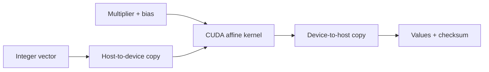

# CUDA Vector Transform

This Component is a small but real GPU data-processing primitive: it applies one affine
transform to an arbitrary integer vector in parallel. Image normalization, telemetry
scaling, quantization, and simulation pipelines routinely build on this operation. The
sample stays exact and deterministic so an independent CPU oracle can detect both
arithmetic mistakes and dishonest CPU fallback.

## Application contract

The `run` entrypoint accepts exactly one object containing `values`, `multiplier`, and
`bias`. `values` is a nonempty array of signed integers. `multiplier` and `bias` are
signed integers. The implementation SHALL reject any input whose transformed values or
checksum cannot be represented as signed 64-bit integers.

The complete result contains exactly `backend`, `device_executed`, `count`, `values`,
and `checksum`. `backend` is the string `cuda`; `device_executed` is true only after a
CUDA kernel completed successfully on the selected NVIDIA device. The output value at
index `i` is `values[i] * multiplier + bias`; `checksum` is their exact sum.

### Requirement: Execute the affine transform on an NVIDIA device

The application SHALL allocate device memory, copy the complete input to that device,
launch a CUDA kernel with enough threads for every element, synchronize and check every
CUDA operation, then copy the result back. A CPU implementation or CPU fallback does
not satisfy this CUDA-qualified Component even when it produces the right numbers.

#### Scenario: The compiled CUDA C++ entrypoint runs

- **WHEN** a nonempty integer vector, multiplier, and bias are supplied
- **THEN** the NVIDIA device computes every transformed value and the application returns the exact vector, count, checksum, CUDA backend, and device-execution evidence
