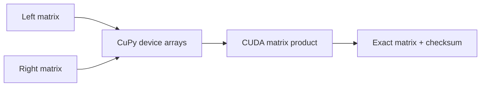

# CUDA Matrix Product

This Component performs an exact batched linear-algebra building block with a Python
interface and CUDA execution. Matrix products sit beneath inference, graphics,
recommendation, scientific computing, and signal-processing applications. The integer
domain provides a stable black-box oracle while still exercising a genuine GPU library
stack rather than merely querying device metadata.

## Application contract

The `run` entrypoint accepts exactly one object containing `left` and `right`. Each is a
nonempty rectangular two-dimensional array of signed integers, and the left column count
must equal the right row count. All input values, products, accumulated cells, and the
final checksum SHALL fit in a signed 64-bit integer.

The complete result contains exactly `backend`, `device_executed`, `rows`, `columns`,
`values`, and `checksum`. `backend` is `cupy-cuda`; `device_executed` is true only after
CuPy performed and synchronized the matrix product on the selected NVIDIA device.
`values` is the conventional matrix product and `checksum` is the exact sum of its cells.

### Requirement: Execute matrix multiplication through CuPy CUDA

The implementation SHALL use an exactly resolved CUDA-specific CuPy distribution,
construct both operands as signed 64-bit device arrays, perform the product on the
selected CUDA device, synchronize it, and transfer only the final result to the host.
NumPy, an alternate CPU backend, or implicit fallback does not satisfy this Component.

#### Scenario: The generated Python CUDA entrypoint runs

- **WHEN** two compatible rectangular integer matrices are supplied
- **THEN** CuPy executes their exact product on the NVIDIA device and the application returns its dimensions, cells, checksum, backend, and device-execution evidence
