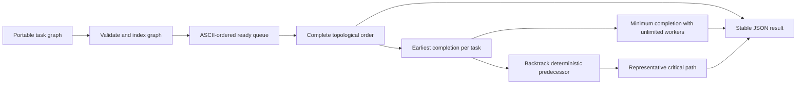

# Dependency Planner

The planner preserves dependency truth while exposing the parallelism hidden by a
simple list of tasks. A deterministic ready queue gives one reproducible legal order;
dynamic programming over that order gives the earliest possible completion and a
representative longest chain. It is the smaller Rust-first building block for build and
release pipelines; the richer Critical Path Scheduler additionally exposes full
earliest/latest schedules and slack.

## Application contract

| Concern | Decision |
| --- | --- |
| Application ID | `dependency-planner` |
| Kind and algorithm | `dependency-planner` using `critical-path-method` |
| Entrypoint | `run` |
| Task count | 1 through 512 |
| Duration field and bounds | `duration_minutes`, 1 through 1,000,000 (`maximum: 1000000`) |
| Dependency field | `depends_on` |
| Maximum total duration | 2,147,483,647 (`maximum_total: 2147483647`) |
| Ordering | ASCII task ID ascending (`ascii-task-id-ascending`) |
| Parallelism | Unlimited |

### Requirement: Validate a portable task graph

The application SHALL accept exactly one entrypoint argument: an object whose `tasks`
array contains between one and 512 objects with a non-empty ASCII string `id`, an
integer `duration_minutes` from 1 through 1,000,000, and a `depends_on` array of task
IDs. The sum of durations SHALL NOT exceed 2,147,483,647. Task IDs SHALL be unique,
dependencies SHALL name tasks in the same request, duplicate dependency edges and self
dependencies SHALL be rejected, and the complete graph SHALL be acyclic.

#### Scenario: Valid task graph

- **WHEN** a task graph has unique IDs, valid dependency edges, and no cycle
- **THEN** every task and dependency participates exactly once in the plan

### Requirement: Produce a deterministic dependency plan

The application SHALL produce a topological order by repeatedly choosing the
lexicographically smallest task ID whose dependencies have all been emitted. It SHALL
report `task_count`, `edge_count`, and that complete `topological_order`.

For unlimited parallel execution, each task's earliest completion time SHALL be its
duration plus the greatest earliest completion time among its dependencies, or just its
duration when it has none. The result SHALL report the greatest task completion time as
`minimum_completion_minutes`. It SHALL also report one `critical_path` by following the
predecessor with the greatest completion time, choosing the lexicographically smallest
ID on a tie; if final tasks tie, it SHALL use the lexicographically smallest final ID.

#### Scenario: Parallel release plan

- **WHEN** schema work feeds API and UI work which both feed a release task
- **THEN** the result exposes the deterministic order and the longest dependency chain rather than summing work that can run in parallel

### Requirement: Emit a stable machine result

The runnable entrypoint SHALL write exactly one JSON object with the fields
`critical_path`, `edge_count`, `minimum_completion_minutes`, `task_count`, and
`topological_order`, and no diagnostic text on standard output.

#### Scenario: Native executable is verified

- **WHEN** a generated Rust implementation is compiled and invoked with the declared JSON argument array
- **THEN** its parsed result equals the expected dependency plan
