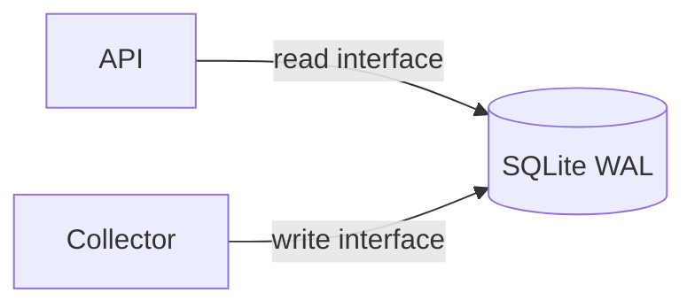

# Durable SQLite Snapshot Cache

This Component owns the durable schema and its two deliberately distinct public
capabilities: read-only snapshot access for the API and single-writer publication for
the collector. It has no upstream client and contains no product vocabulary.

## Application contract

| Concern | Decision |
| --- | --- |
| Application ID | `durable-snapshot-cache` |
| Store | SQLite using WAL and a 5000 ms busy timeout |
| Readers | URI `mode=ro` plus `PRAGMA query_only=ON` |
| Writers | One lease owner, `BEGIN IMMEDIATE` guarded |
| Migration | Explicit and idempotent |

The `cache` entrypoint accepts one object. Action `migrate` requires `database`, creates
the exact schema below idempotently, enables WAL, and returns `{"status":"migrated"}`.
Actions `describe` and `capabilities` require no path and return the supplied action as
`request`, role `cache`, engine `sqlite`, and the read/write capability names. Standard
`--litai-test` and `--litai-smoke` modes must not write beneath the admitted source tree;
smoke mode uses request `describe`.

### Requirement: Exact durable schema

The explicit migration SHALL create tables for `snapshot`, `snapshot_metric`,
`current_snapshot`, and `collection_window` using the literal names, SQLite type
affinities, nullability, primary keys, and foreign keys declared by the public write
interface. These are exact semantic contracts, not logical aliases:
`snapshot.window` is not `window_utc`; `snapshot_metric.metric` is not `name`;
`snapshot_metric.value` is a SQLite numeric value, not encoded JSON text; and
`current_snapshot.id` is the singleton integer `0`, not another pointer or singleton
column. `snapshot.snapshot_id` is an SQLite-assigned integer primary key;
`snapshot_metric` is keyed by that integer and metric. `collection_window` is keyed by
its non-null text `window` and uses the exact scheduling/lease columns in the
interfaces. Foreign keys SHALL be enabled. Generated native migration tests SHALL
compare `PRAGMA table_info` and `PRAGMA foreign_key_list` with the complete public
contract. Migration begins with no current pointer; publication may create only the
`current_snapshot` row whose `id = 0`.

#### Scenario: Repeated migration is safe

- **WHEN** migration runs twice against the same database
- **THEN** both invocations succeed and the schema contains one copy of every table

### Requirement: Separate public read and write authority

The read contract is `interfaces/snapshot-read.md`; the write contract is
`interfaces/snapshot-write.md`. The API SHALL receive only the read interface and the
collector SHALL receive only the write interface. Neither consumer receives this
Component's private prose or generated source.

#### Scenario: Capability projection is least privilege

- **WHEN** both portfolio roots lock
- **THEN** the API edge carries only the read-interface identity and the collector edge
  carries only the write-interface identity
