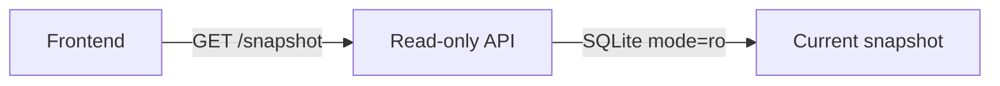

# Durable Snapshot Read API

This Component is the read-only HTTP boundary of the durable split-service portfolio.
It receives only the cache's public read interface. It has no upstream client or
credential and owns no write path.

## Application contract

| Concern | Decision |
| --- | --- |
| Application ID | `durable-split-api` |
| Role | Read-only HTTP API |
| Entrypoint | `api` |
| Upstream access | Forbidden |
| Cache writes | Forbidden |

### Requirement: Serve only the current complete snapshot

The `api` entrypoint SHALL support Standard `--litai-test`, `--litai-smoke`, and
`--litai-serve PORT DATABASE` modes. Serve mode SHALL bind loopback, answer
`GET /health`, and answer `GET /snapshot` with one canonical JSON object containing
the current published snapshot and shared freshness/progress state. The database
connection SHALL use SQLite URI `mode=ro` and `PRAGMA query_only=ON`. Absence of a
published snapshot SHALL return an explicit empty/stale result and SHALL NOT trigger
collection.

#### Scenario: API reads a complete snapshot

- **WHEN** the current pointer names a published snapshot
- **THEN** `GET /snapshot` returns exactly that snapshot's ordered metrics and metadata

### Requirement: API cannot collect or write

Generated API source SHALL contain no upstream request client, upstream URL input,
credential input, migration DDL, or cache mutation statement. Its process receives only
the database path. Restarting the process SHALL reopen the same file read-only and serve
the prior snapshot without coordinating with a collector.

#### Scenario: API restart while upstream is unavailable

- **WHEN** a new API process opens the durable database after collection has stopped
- **THEN** it serves the same current snapshot and makes no upstream request

### Requirement: Deterministic boundary description

Outside serve mode, the entrypoint SHALL accept either `[{"action":"describe"}]` or
`[{"action":"capabilities"}]` and return exactly
`{"cache_mode":"read-only","request":ACTION,"role":"api",
"upstream_access":false}`, where `ACTION` is the supplied action. Standard smoke mode
SHALL use request `describe` and return the same shape without opening a database.

#### Scenario: API identifies its least-privilege role

- **WHEN** the entrypoint receives either self-description request
- **THEN** it reports read-only cache access and no upstream access
