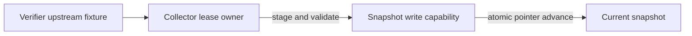

# Durable Snapshot Collector

This Component is the portfolio's only upstream caller and only cache writer. It owns
one scheduled collection window at a time through a durable SQLite lease. The API and
frontend neither start it nor receive its upstream URL.

## Application contract

| Concern | Decision |
| --- | --- |
| Application ID | `durable-split-collector` |
| Role | Only upstream caller and only writer |
| Entrypoint | `collect` |
| Time | Explicit timezone-aware UTC strings |
| Retry bound | Supplied non-negative integer, never an unbounded loop |

### Public invocation

Normal execution accepts one object with `database`, `upstream_url`, `window`, `owner`,
`now`, `lease_seconds`, and `retry_limit`; optional `fail_after` forces a failure after
that many staged metrics for verifier failure injection. It returns one canonical JSON
object with `status`, `window`, `owner`, `metric_count`, and `retry_count`. Status is
one of `published`, `already-complete`, `lease-held`, or `failed`. It SHALL make at most
one HTTP GET to `upstream_url` per invocation, validate a JSON object of finite numeric
metrics, and never print the URL, credentials, or payload. The result `owner` SHALL
equal the invocation's `owner` for every status, including `lease-held`; it SHALL NOT
change meaning to identify the worker that currently holds another live lease.

The cache provider owns migration. The collector SHALL consume the exact already-
migrated schema in the projected write interface and SHALL NOT create, alter, drop, or
infer tables. When staging an attempt, it omits `snapshot.snapshot_id` so SQLite assigns
the integer primary key, then uses that connection's `lastrowid` for every metric,
status, and current-pointer operation in the attempt.

### Requirement: Single-winner durable collection

The collector SHALL acquire or reclaim the window lease in `BEGIN IMMEDIATE` before
contacting upstream. A live lease held by another owner returns `lease-held` without an
upstream request. A completed window returns `already-complete` without another request.
An expired lease is reclaimable. Each window has one persisted schedule row and bounded
retry state; a retry SHALL update that row rather than create another daily run.
Once `retry_count` is greater than or equal to `retry_limit`, another invocation SHALL
return `failed` without contacting upstream or changing the current snapshot.

#### Scenario: Concurrent collectors have one winner

- **WHEN** two owners concurrently request the same incomplete window
- **THEN** exactly one publishes and the other skips without a second upstream request

### Requirement: Publish only a validated complete snapshot

The collector SHALL write a new snapshot as `collecting`, stage every metric, validate
that every upstream metric is present and finite, and advance `current_snapshot` in one
transaction only after validation. Any fetch, validation, injected partial-write, or
publication failure SHALL mark the attempt failed, increment bounded retry state,
release its lease safely, and leave the prior current pointer unchanged.

#### Scenario: Partial failure preserves the prior snapshot

- **WHEN** a new window fails after staging only part of its metrics
- **THEN** readers continue to observe the prior complete snapshot and progress reports
  the failed window and retry count

### Requirement: Deterministic boundary description

A request `[{"action":"describe"}]` or `[{"action":"capabilities"}]` and Standard
smoke mode SHALL return exactly
`{"cache_write":true,"request":ACTION,"role":"collector","upstream_access":true}`,
where `ACTION` is the supplied action and smoke mode uses `describe`, without opening a
database or contacting upstream.

#### Scenario: Collector identifies its exclusive authority

- **WHEN** the entrypoint receives either self-description request
- **THEN** it reports that it alone has cache-write and upstream authority
