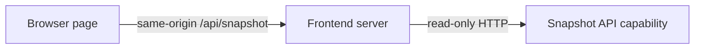

# Durable Snapshot Dashboard

This Component is the browser boundary of the durable split-service portfolio. It is
generated, built, restarted, and accepted independently from the read-only API, the
collector, and the SQLite cache authority. It requires only the API's public interface;
it has no cache handle, upstream URL, or credential.

## Application contract

| Concern | Decision |
| --- | --- |
| Application ID | `durable-split-service` |
| Role | Browser frontend only |
| Language | Dependency-free JavaScript on Node.js |
| Entrypoint | `page` |
| Upstream access | Forbidden |
| Cache access | Forbidden |

The public browser surface is defined by `interfaces/frontend.md`. The API contract is
received only through capability `literate-ai.durable-snapshot-api`; generated source
SHALL NOT inspect the API Component's private specification or source layout.

### Requirement: Same-origin read-only dashboard

The `page` entrypoint SHALL support the Standard `--litai-test`, `--litai-smoke`, and
`--litai-serve PORT API_BASE_URL` modes. Serve mode SHALL bind only loopback, answer
`GET /health`, serve a semantic HTML page at `GET /`, and proxy the page's
`GET /api/snapshot` request to `API_BASE_URL/snapshot`. The browser code SHALL request
only the same-origin `/api/snapshot` path and render the returned snapshot window,
metrics, freshness, and collector progress. It SHALL render distinct loading, empty,
stale, and error states without inventing numeric zeroes.

#### Scenario: Browser reads a persisted snapshot

- **WHEN** the API serves a complete persisted snapshot and the page is loaded
- **THEN** the page exposes a `main` landmark, a `Snapshot metrics` region, the exact
  snapshot window, and its freshness without contacting an upstream source

### Requirement: Reader restart is collection-independent

Stopping and starting the frontend SHALL neither launch nor invoke the collector. A
new frontend process pointed at a restarted API SHALL immediately serve the previously
persisted snapshot even when the upstream fixture is unavailable.

#### Scenario: Frontend restarts after upstream removal

- **WHEN** a snapshot has been published, both reader processes stop, the upstream
  fixture becomes unavailable, and the API and frontend start again
- **THEN** `/api/snapshot` still returns the prior complete snapshot and no upstream
  request occurs

### Requirement: Deterministic boundary description

Outside serve mode, the entrypoint SHALL accept either `[{"action":"describe"}]` or
`[{"action":"capabilities"}]` and return exactly
`{"cache_access":false,"request":ACTION,"role":"frontend","transport":"http",
"upstream_access":false}`, where `ACTION` is the supplied action. Standard smoke mode
SHALL use request `describe` and return the same shape without opening a listener or
contacting another process.

#### Scenario: Frontend identifies its least-privilege role

- **WHEN** the entrypoint receives either self-description request
- **THEN** it reports no cache or upstream access
