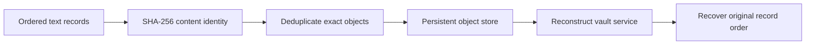

# Content-Addressed Record Vault

The vault stores arbitrary text records under SHA-256 identities, deduplicates repeated
content, and proves that the same records survive service reconstruction. It is a small
but useful kernel for artifact stores, immutable audit attachments, build caches, and
offline synchronization queues.

## Application contract

| Concern | Decision |
| --- | --- |
| Application ID | `empty-cache-restart` |
| Kind | `content-cache` |
| Entrypoint | `run` |
| Content digest | SHA-256 (`sha256`) |
| Text encoding | UTF-8 |
| Storage | A host temporary directory (`host-temporary-directory`) |

The `run` entrypoint SHALL accept exactly one argument object containing exactly one
required field, `records`, whose value is an array of UTF-8 strings. The result SHALL
contain exactly `identities`, `object_count`, `recovered`, and `restart_verified`.
`identities` SHALL preserve input order and contain one lowercase 64-character SHA-256
hex digest per input record; `object_count` SHALL count distinct digests; `recovered`
SHALL equal the input records in their original order; and `restart_verified` SHALL be
the boolean `true` only after reconstruction over the same temporary storage succeeds.

### Requirement: Lazy exact cache recovery

The vault SHALL begin with an empty cache, fault an exact object into it, and recover it
after restart.

#### Scenario: Process restart

- **WHEN** the CAS and workspace services are reconstructed over their existing roots
- **THEN** the exact object and committed workspace reference remain available

### Requirement: Executable host outcome

The generated cache application SHALL write each string in the argument object's
`records` array as a content-addressed object using portable temporary storage and
recover every record through a reconstructed cache.
Each returned identity SHALL be the 64 lowercase hexadecimal SHA-256 characters with
no algorithm prefix.

#### Scenario: Compiled entrypoint runs

- **WHEN** the compiled `run` entrypoint stores alpha, beta, and duplicate alpha records
- **THEN** it persists two exact objects and recovers all three records in order after restart
