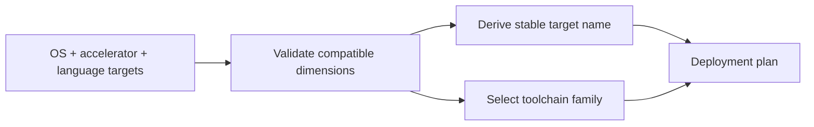

# Portable Deployment Matrix

The planner converts a product's target matrix into stable artifact names and toolchain
choices. It is directly adaptable to CI matrix expansion, release packaging, build-farm
dispatch, and compatibility dashboards; the sample also makes mutually independent OS,
accelerator, and language decisions visible.

## Application contract

| Concern | Decision |
| --- | --- |
| Application ID | `flavor-matrix` |
| Kind | `build-matrix` |
| Entrypoint | `run` |
| Accelerators | Exact lowercase tokens `cpu`, `cuda` |
| Language toolchains | Exact lowercase `python` → `cpython`; `rust` → `cargo` |
| Artifact suffixes | Exact lowercase `linux` → empty; `macos` → `.app`; `windows` → `.exe` |

The `run` entrypoint SHALL accept exactly one argument object containing exactly one
required field, `targets`, whose value is an array of target objects. Every target SHALL
contain exactly the string fields `os`, `accelerator`, and `language`. The result SHALL
contain exactly `plan_count` and `plans`; each plan SHALL contain exactly `artifact`,
`target`, and `toolchain`, in the same order as the input targets.

All enumerated input values and all values copied into `target` SHALL preserve the exact
lowercase spelling shown in the table. Implementations SHALL NOT title-case or otherwise
normalize these protocol tokens.

### Requirement: Exact isolated Flavor sets

Operating-system, accelerator, and language Flavors SHALL resolve independently and
produce isolated effective identities.

#### Scenario: Portable target matrix

- **WHEN** Windows/Linux, CPU/CUDA, and Python/Rust target profiles are resolved
- **THEN** compatible sets are exact, conflicts fail explicitly, and each effective cache identity is distinct

### Requirement: Flavor publication

A Flavor descriptor SHALL publish and import independently without changing bytes.

#### Scenario: Linux Flavor roundtrip

- **WHEN** the Linux Flavor descriptor is published and imported into an empty cache
- **THEN** its verified descriptor bytes remain identical

### Requirement: Executable host outcome

The generated build-planning application SHALL translate the argument object's portable
OS, accelerator, and language `targets` into deterministic artifact and toolchain plans.
Each target string
SHALL join the input `os`, `accelerator`, and `language` values in that order with
hyphens. Each artifact SHALL be the literal basename `sample` followed only by the
configured platform suffix: empty for Linux, `.app` for macOS, or `.exe` for Windows.

#### Scenario: Compiled entrypoint runs

- **WHEN** the compiled `run` entrypoint receives Linux CPU Python, macOS CPU Rust, and Windows CUDA Rust targets
- **THEN** it returns three plans using portable platform artifact suffixes and the matching CPython or Cargo toolchain
