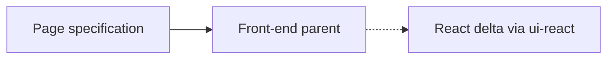

# Front-end base

JavaScript page UI peer. Pass `+lang-javascript` explicitly; add `+ui-react` (or the
`lang-javascript-react` alias) when the run should contribute the React delta. Add
`+package-npm` when the page needs a lockfile-pinned npm closure. Do not pin
`react-application` on this Component: the `ui-react` Flavor already contributes
that skill. The language slot requires `application.web-frontend`, so an unpinned
Python default cannot fill it.

## Application contract

| Concern | Decision |
| --- | --- |
| Kind | `web-application` |
| Language | JavaScript |
| UI | Optional React via `ui-react` |
| Packages | Optional lockfile-pinned npm via `package-npm` |

### Requirement: JavaScript Flavor is required

The Component SHALL select `lang-javascript`. A Python-only selection SHALL fail closed.

#### Scenario: Conflicting language is rejected

- **WHEN** only a non-JavaScript language Flavor is selected
- **THEN** the Component cannot lock
