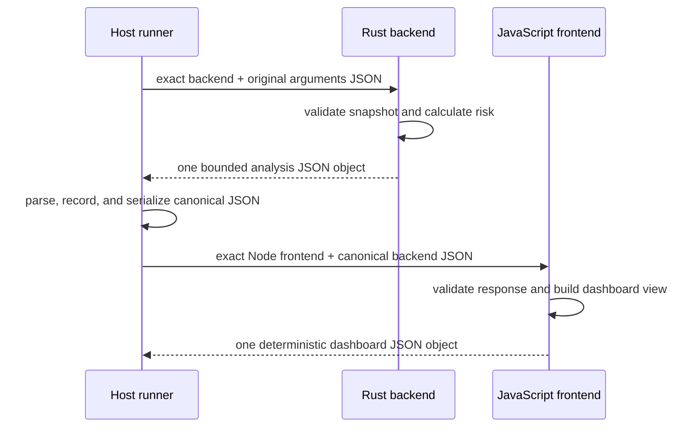

# Full-Stack Rust and JavaScript Release Dashboard

This is one application with two generated roles, not two loosely related samples. The
compiled Rust backend owns validation and risk analysis, the JavaScript frontend owns
presentation, and the trusted authorized host runner owns process orchestration. The
runner observes both stages and carries one bounded canonical JSON value across their
boundary; neither generated role launches or controls the other. The pattern is
directly adaptable to release governance, operational health, compliance review, and
other products that combine a compiled analysis service with a web-facing view model.

## Application contract

| Concern | Decision |
| --- | --- |
| Application ID | `full-stack-rust-js` |
| Kind | `release-risk-dashboard` |
| Entrypoint | `run` |
| Backend | Rust standard library (`rust-standard-library`) |
| Frontend | Node.js built-ins only (`node-built-ins-only`) |
| Process protocol | Host-observed, two-stage canonical JSON (`host-observed-two-stage-canonical-json`) |
| Risk arithmetic | Bounded integers (`bounded-integers`) |
| Service ordering | Risk descending, then ASCII name ascending (`risk-descending-then-ascii-name`) |

The prose below is the normative protocol. The diagram makes the ownership and trust
boundary visible without introducing a network service, a frontend-owned child
process, or a hidden runtime component.

### Requirement: Generate two explicit application roles

The backend role SHALL live beneath `source/backend/` with `main.rs` as its entrypoint.
The frontend role SHALL live beneath `source/frontend/` with `main.js` as its entrypoint.
Rust sources or assets consumed by the compiler MAY live beneath the backend role, and
checked `.js` support files MAY live beneath the frontend role. Every generated file
SHALL be consumed by the compiler or checked and published by the frontend builder;
other files SHALL be rejected.

#### Scenario: Both role Flavors are selected

- **WHEN** the `backend-language` slot selects Rust and the `frontend-language` slot selects JavaScript
- **THEN** one exact generation recipe contains both Flavor specifications and both pinned implementation skills

### Requirement: Generated tests and build surfaces stay inside the two roles

Backend language-native tests SHALL be embedded in the backend entrypoint module, and
frontend language-native tests SHALL live at `source/frontend/main.test.js`. Every
generated frontend test SHALL exercise the exact two-stage object handoff declared
above — parsing the backend analysis object as the frontend's sole application
argument — and SHALL NOT test a wrapper-array API that the trusted runner never
invokes. The generated source tree SHALL contain no Makefile, Cargo manifest, npm
package manifest, Bazel file, shell script, README, or other build or configuration
file: this topology is composed by the trusted composite host builder alone.

#### Scenario: Generated tree contains only role sources and mandatory evidence

- **WHEN** generation completes for this Component
- **THEN** apart from the mandatory generated test suite manifest and CycloneDX source SBOM, the source tree contains only `source/backend/main.rs`, `source/frontend/main.js`, and `source/frontend/main.test.js`, with language-native tests embedded in the backend module and in the frontend test file

### Requirement: Use a host-observed two-stage JSON protocol

The trusted authorized host runner SHALL invoke the exact compiled Rust backend first,
passing the original UTF-8 JSON `arguments` array as the backend's sole command-line
argument in `argv[1]`. The runner SHALL bound the backend deadline and output, require a
successful exit, parse exactly one JSON analysis object, record that stage result, and
serialize it as canonical JSON. The backend object SHALL contain exactly these
top-level fields: `release`, `release_status`, `services`, `passed_checks`,
`failed_checks`, `total_checks`, `blocked_services`, `review_services`,
`total_risk_points`, `pass_rate_basis_points`, and `top_risk_service`. Each item in
`services` SHALL contain exactly `name`, `risk_points`, and `status`.

Only after the backend stage succeeds SHALL the same trusted runner invoke the exact
Node.js command and checked frontend, passing the canonical backend JSON as the
frontend's sole application argument in `process.argv[2]`. The frontend SHALL validate
the complete backend object and write exactly one final JSON dashboard result. It SHALL
NOT receive a backend executable path, launch a child process, or recompute release risk
from the original application arguments. Neither role SHALL use standard input, a
network service, package-manager dependency, or repository-local runtime support.

#### Scenario: Trusted runner composes the exact stages

- **WHEN** a declared release invocation is authorized for the exact backend and frontend artifacts
- **THEN** the runner records the backend analysis before passing its canonical JSON to the frontend, with no shell, generated-role process launch, or network hop

### Requirement: Validate a release snapshot

The application SHALL accept one object containing a non-empty ASCII `release_id` and
between one and 128 services. Each service SHALL have a unique non-empty ASCII `name`
and non-negative safe integers for `passed_checks`, `failed_checks`,
`critical_incidents`, `warning_incidents`, and `changed_lines`. The total number of
checks SHALL be positive. Invalid input or an invalid backend response SHALL fail with a
non-zero status and no JSON result on standard output.

#### Scenario: Release snapshot is well formed

- **WHEN** all service identities and counters satisfy their bounds
- **THEN** the backend processes every service exactly once using integer arithmetic

### Requirement: Calculate service and release risk

For each service, the Rust backend SHALL calculate `risk_points` as
`failed_checks * 25 + critical_incidents * 60 + warning_incidents * 15 +
ceil(changed_lines / 100)`. It SHALL classify a service as `blocked` when it has a
failed check or critical incident, otherwise as `review` when risk points are at least
20, otherwise as `ready`. The release status SHALL be `blocked` when any service is
blocked, otherwise `review` when any service needs review, otherwise `ready`.

The backend's `release` SHALL equal the input `release_id`. It SHALL report
`release_status`; passed, failed, and total checks; blocked and review service counts;
total risk points; and the pass rate in basis points using floor division. It SHALL
choose the greatest-risk service as `top_risk_service`, resolving ties by ASCII service
name ascending. Service results SHALL be ordered by risk descending and then ASCII name
ascending.

#### Scenario: Mixed release health is analyzed

- **WHEN** a release contains ready, review, and blocked services
- **THEN** the aggregate counts, risk, pass rate, top-risk identity, and ordered service rows follow the declared formulas

### Requirement: Present a deterministic frontend view model

The JavaScript frontend SHALL preserve the backend's ordered service rows and produce a
`summary` with blocked services, review services, failed checks, pass-rate basis points,
and total risk points. Its `headline` SHALL be `BLOCKED: <release> (<N> service)` for a
blocked release, `REVIEW: <release> (<N> service)` for a review release, or
`READY: <release>` otherwise. For a blocked release, `N` SHALL be the number of blocked
services; for a review release, `N` SHALL be the number of review services. `service`
SHALL be pluralized when `N` is not one. The final result SHALL also include `release`,
`release_status`, `services`, and `top_risk_service`.

#### Scenario: Frontend formats aggregate status

- **WHEN** the backend returns a validated analysis
- **THEN** the frontend emits the deterministic dashboard result and no extra standard-output text

### Requirement: Executable host outcome

The generated Rust backend and JavaScript frontend SHALL jointly perform the complete
analysis and presentation workflow as two real compiled or checked host artifacts.

#### Scenario: Full stack runs end to end

- **WHEN** the Rust backend is compiled, every frontend script is checked, and the trusted runner executes a valid invocation through both authorized stages
- **THEN** it records the exact backend result, gives its canonical JSON to the exact frontend, and observes the complete expected dashboard JSON
