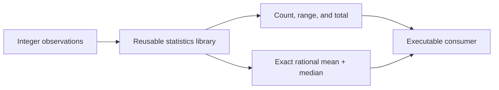

# Exact Statistics Library

This Component separates a reusable integer-statistics module from its executable
consumer. Exact rational mean and median values make it suitable as a starting point
for telemetry summaries, benchmark reports, grading systems, and data-quality tools
that must not lose information to floating-point formatting.

## Application contract

| Concern | Decision |
| --- | --- |
| Application ID | `generated-library` |
| Kind | `integer-statistics` |
| Entrypoint | `run` |
| Numeric input | Integers |
| Metrics | Count, total, minimum, maximum, exact mean, and exact median |

The `run` entrypoint SHALL accept exactly one argument object with a required `values`
array. Every `values` item SHALL be an integer; the array SHALL contain at least one
item. The complete result SHALL contain exactly `count`, `total`, `minimum`, `maximum`,
`mean`, and `median`. Both `mean` and `median` SHALL be objects containing exactly the
integer fields `numerator` and `denominator`; their denominator SHALL be positive and
the fraction SHALL be reduced to lowest terms.

### Requirement: Exact generated reuse

The consumer SHALL reuse the exact required generated library source bundle.

#### Scenario: Empty cache and restart

- **WHEN** the consumer resolves from an empty cache and the cache is reopened
- **THEN** the dependency-first closure remains exact and available

### Requirement: Executable host outcome

The generated application SHALL pass the `values` array from its sole argument object
to a separately generated statistics module and calculate count, total, minimum,
maximum, mean, and median for those integer observations. Mean and median SHALL use the
exact rational object shape declared above rather than strings, decimals, or rounded
floating-point values.

#### Scenario: Compiled entrypoint runs

- **WHEN** the compiled `run` entrypoint receives `{ "values": [2, 5, 9, 14] }`
- **THEN** it returns count 4, total 30, range 2 through 14, mean `{ "numerator": 15, "denominator": 2 }`, and median `{ "numerator": 7, "denominator": 1 }`
